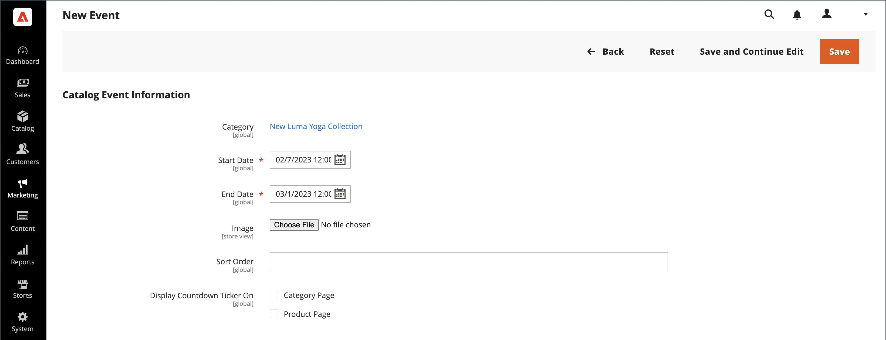

# Créer et mettre à jour des événements

{{ee-feature}}

Chaque événement est associé à une catégorie de votre catalogue et un seul événement peut être associé à une catégorie donnée à la fois. Pour afficher la liste des événements à venir dans votre boutique, vous devez également configurer un widget [Carrousel d’événements de catalogue](../content-design/widget-event-carousel.md).

{width="700" zoomable="yes"}

## Création d’un événement

1. Dans la barre latérale _Admin_, accédez à **[!UICONTROL Marketing]** > _[!UICONTROL Private Sales]_>**[!UICONTROL Events]**.

1. Dans le coin supérieur droit, cliquez sur **[!UICONTROL Add Catalog Event]**.

1. Dans l’arborescence des catégories, choisissez la catégorie que vous souhaitez associer à l’événement.

   Comme chaque catégorie ne peut avoir qu’un seul événement à la fois, toutes les catégories qui ont déjà un événement sont désactivées.

   {width="500" zoomable="yes"}

1. Définissez la **[!UICONTROL Catalog Event Information]** :

   {width="700" zoomable="yes"}

   - Pour la **[!UICONTROL Start Date]** de l’événement, utilisez le calendrier () pour choisir la date. Utilisez les curseurs **[!UICONTROL Hour]** et **[!UICONTROL Minute]** pour définir l’heure de début de l’événement.

   - Pour la **[!UICONTROL End Date]** de l’événement, utilisez le calendrier () pour choisir la date. Utilisez les curseurs **[!UICONTROL Hour]** et **[!UICONTROL Minute]** pour définir l’heure de fin de l’événement.

   - Pour charger un **[!UICONTROL Image]** pour le widget d’événement, cliquez sur **[!UICONTROL Choose File]** et sélectionnez le fichier image dans votre répertoire.

   - Dans le champ **[!UICONTROL Sort Order]** , saisissez un nombre pour indiquer la séquence dans laquelle cet événement apparaît lorsqu&#39;il est répertorié avec d&#39;autres événements.

   - Cochez la case de chaque type de page sur lequel vous souhaitez afficher le compte à rebours.

1. Cliquez ensuite sur **[!UICONTROL Save]**.

## Mise à jour des événements

Les événements peuvent être modifiés à partir de la page Événements ou de la catégorie associée à l’événement. Lorsqu’une catégorie est associée à un événement, un bouton Modifier l’événement s’affiche dans le coin supérieur droit.

### Méthode 1 : modifier un événement à partir de la page Événements

1. Dans la barre latérale _Admin_, accédez à **[!UICONTROL Marketing]** > _[!UICONTROL Private Sales]_>**[!UICONTROL Events]**.

1. Recherchez l’événement dans la liste et ouvrez-le en mode d’édition.

1. Apportez les modifications nécessaires à l’événement .

1. Cliquez ensuite sur **[!UICONTROL Save]**.

### Méthode 2 : modification d’un événement d’une catégorie

1. Dans la barre latérale _Admin_, accédez à **[!UICONTROL Catalog]** > **[!UICONTROL Categories]**.

1. Dans l’arborescence de catégorie à gauche, sélectionnez la catégorie associée à l’événement.

1. Dans le coin supérieur droit, cliquez sur **[!UICONTROL Edit Even]t**.

1. Apportez les modifications nécessaires à l’événement .

1. Cliquez ensuite sur **[!UICONTROL Save]**.

## Suppression d’un événement

1. Dans la barre latérale _Admin_, accédez à **[!UICONTROL Marketing]** > _[!UICONTROL Private Sales]_>**[!UICONTROL Events]**.

1. Recherchez l’événement dans la liste et ouvrez-le en mode d’édition.

1. Dans le coin supérieur droit, cliquez sur **[!UICONTROL Delete]**.

1. Pour confirmer l’action, cliquez sur **[!UICONTROL OK]**.

## Descriptions des champs

| Champ | [Portée](../getting-started/websites-stores-views.md#scope-settings) | Description |
|--- |--- |--- |
| [!UICONTROL Category] | Global | Lors de la création d’un événement, ce champ renvoie à l’arborescence des catégories. Lors de la modification d’un événement, un lien est établi vers la page de catégorie associée à l’événement. |
| [!UICONTROL Start Date] | Global | Date et heure de début de l’événement au format `MMDDYYYY HH;MM`. Cliquez sur l’icône de calendrier pour sélectionner la date. |
| [!DNL End Date] | Global | Date et heure de fin de l’événement au format `MMDDYYYY HH;MM`. Cliquez sur l’icône de calendrier pour sélectionner la date. |
| [!UICONTROL Image] | Affichage de la boutique | Charge une image qui apparaît dans le [widget de carrousel des événements de catalogue](../content-design/widget-event-carousel.md). |
| [!UICONTROL Sort Order] | Global | Détermine la séquence dans laquelle cet événement apparaît lorsqu&#39;il est répertorié avec d&#39;autres événements. |
| [!UICONTROL Display Countdown Ticker On] | Global | Affiche le compteur à rebours dans l’en-tête de chaque page spécifiée. Options : `Category Page` / `Product Page` |
| [!UICONTROL Status] | Global | Indique le statut de l’événement en fonction de la période de début et de fin. Status est une valeur en lecture seule. Valeurs : `Open` / `Closed` / `Upcoming` |

{style="table-layout:auto"}

## Barre de boutons

| Bouton | Description |
|--- |--- |
| **[!UICONTROL Back]** | Retourne à la page Événements sans enregistrer le nouvel événement ou les modifications d’un événement existant. |
| **[!UICONTROL Delete]** | Supprime l’événement. |
| **[!UICONTROL Reset]** | Efface le formulaire des modifications non enregistrées et restaure les informations d’événement d’origine. |
| **[!UICONTROL Save and Continue Edit]** | Enregistre toutes les modifications et garde le formulaire ouvert en mode d’édition. |
| **[!UICONTROL Save]** | Enregistre les modifications, ferme le formulaire et revient à la page Événements. |

{style="table-layout:auto"}
