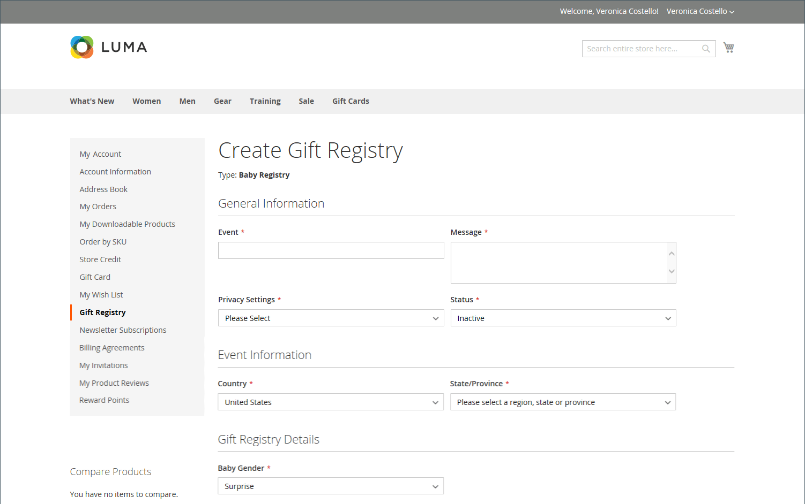

# Registres des cadeaux

{{ee-feature}}

Adobe Commerce permet à vos clients de créer des registres de cadeaux pour des occasions spéciales et d’inviter leurs proches à acheter leurs cadeaux dans le registre des cadeaux. Adobe Commerce effectue le suivi des articles achetés et des quantités restantes.

{width="700" zoomable="yes"}

Le propriétaire du registre des cadeaux peut ajouter des produits au registre à partir de son [tableau de bord client](gift-registry-storefront.md#gift-registry-information). En outre, les produits peuvent être transférés de la liste de souhaits ou du panier. En tant qu&#39;administrateur de magasin, vous pouvez afficher et partager les registres de cadeaux des clients. Vous pouvez également effectuer des opérations de maintenance, comme ajouter des articles depuis le panier du client, mettre à jour des quantités ou supprimer un registre des cadeaux.

Pour accéder à un registre des cadeaux, les destinataires peuvent cliquer sur le lien contenu dans l&#39;e-mail qu&#39;ils reçoivent ou effectuer une recherche par nom, adresse e-mail ou ID de registre des cadeaux. Dans la plupart des magasins, le pied de page de chaque page comporte un lien vers le registre des cadeaux, bien que l&#39;emplacement puisse varier selon le thème. En outre, l&#39;outil [Widget](../content-design/widgets.md) peut être utilisé pour placer [Gift Registry Search](gift-registry-search.md) n&#39;importe où dans votre boutique.

Les visiteurs du Registre qui souhaitent effectuer un achat peuvent ajouter l&#39;article à leur panier directement à partir du registre des cadeaux. Lorsque la commande est passée, le registre des cadeaux est mis à jour pour refléter l&#39;achat.

## Workflow du registre des cadeaux

1. **Configurer le registre des cadeaux pour la boutique**. L&#39;administrateur du magasin [active le registre des cadeaux](gift-registry-configure.md) et [configure le type et les attributs du registre](gift-registry-create.md).

1. **Le client crée son propre registre**. Un [client crée un registre des cadeaux](gift-registry-storefront.md#create-a-new-gift-registry) à partir de son compte de boutique pour une occasion à venir, et remplit les champs requis dans chaque section du registre des cadeaux. Après avoir ajouté des éléments au registre, il peut être partagé avec les amis et la famille.

1. **Le client partage son registre**. Chaque [invitation](gift-registry-storefront.md#share-a-gift-registry) contient un lien vers le registre des cadeaux. Si la fonction [Recherche du registre des cadeaux](gift-registry-search.md) est disponible dans la boutique, les clients peuvent rechercher des registres des cadeaux spécifiques par nom, adresse e-mail ou ID de registre des cadeaux.

1. **Les destinataires de l&#39;invitation passent des commandes**. Ceux qui reçoivent une invitation ou des informations sur le registre peuvent passer une commande pour n&#39;importe quel article directement à partir du registre des cadeaux. Au fur et à mesure que des articles sont vendus, Adobe Commerce met à jour le nombre d’articles du registre des cadeaux et en informe le propriétaire.
