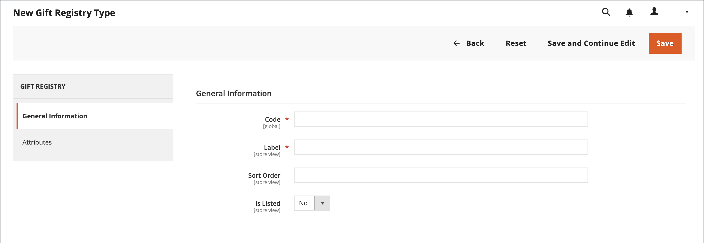

# Configuration du registre des cadeaux

{{ee-feature}}

Un registre des cadeaux peut être créé pour tout type d’événement, tel qu’un mariage, un anniversaire, un nouveau bébé ou toute autre occasion spéciale. Par défaut, Adobe Commerce comprend les événements spéciaux suivants :

- Bébé
- Anniversaire
- Mariage

Lorsque vous créez un registre, il devient une option dans la liste des types de registre de cadeaux dans le compte du client.

Vous pouvez utiliser l&#39;un des trois registres de cadeaux préparés ou créer votre propre registre personnalisé. Chaque type de registre des cadeaux comprend plusieurs attributs, qui sont les champs de saisie de données qu’un client remplit pour créer un registre des cadeaux. Les attributs fournissent des informations supplémentaires sur l’événement, l’heure et le lieu, ou toute autre information nécessaire. Selon le type d’entrée, certains attributs ont plusieurs options. Par exemple, le type de registre des cadeaux `Wedding` comporte l’attribut `Role`, avec les options `Bride`, `Groom` et `Partner`. Pour en savoir plus sur les attributs et les types d’entrée, voir [Attributs](../customers/attribute-properties.md).

{width="700" zoomable="yes"}

## Utiliser un registre des cadeaux préparé

1. Dans la barre latérale _Admin_, accédez à **[!UICONTROL Stores]** > _[!UICONTROL Other Settings]_>**[!UICONTROL Gift Registry]**.

   Les registres des anniversaires, des mariages et des bébés sont prêts à être utilisés par les clients à partir de leurs comptes.

1. Veillez à effectuer la [configuration du modèle d’e-mail](../systems/email-templates.md#configure-email-templates) afin qu’ils reflètent votre marque.

## Créer un registre des cadeaux personnalisé

1. Dans la barre latérale d’administration, accédez à **[!UICONTROL Stores]** > _[!UICONTROL Other Settings]_>**[!UICONTROL Gift Registry]**.

1. Dans le coin supérieur droit, cliquez sur **[!UICONTROL Add Gift Registry Type]**.

1. Sous **[!UICONTROL General Information]**, effectuez les opérations suivantes :

   - Saisissez un **[!UICONTROL Code]** unique pour identifier le registre des cadeaux en interne.

     Le code doit commencer par une lettre minuscule. Le reste du code peut être une combinaison de lettres minuscules (a-z), de chiffres (0-9) et de traits de soulignement (`_`).

   - Par **[!UICONTROL Label]**, entrez le nom du registre des cadeaux tel que vous souhaitez qu&#39;il apparaisse dans le magasin.

     Cette étiquette est une option de la liste des types de registre des cadeaux disponibles pour le client.

   - Par **[!UICONTROL Sort Order]**, entrez un nombre pour déterminer l&#39;ordre dans lequel ce registre des cadeaux apparaît lorsqu&#39;il est répertorié avec d&#39;autres types.

   - Pour activer le registre des cadeaux, **[!UICONTROL Is Listed]** sur `Yes`.

     {width="600" zoomable="yes"}

1. Examinez chaque section du Registre des cadeaux pour déterminer le type d&#39;information que vous voulez inclure.

1. Dans le panneau de gauche, choisissez **[!UICONTROL Attributes]** et cliquez sur **[!UICONTROL Add Attribute]**.

   {width="600" zoomable="yes"}

1. Pour chaque attribut, procédez comme suit :

   - Attribuez un **[!UICONTROL Code]** unique pour identifier l’attribut en interne. Le code peut comporter jusqu’à 15 caractères et doit commencer par une lettre minuscule. Le reste du code peut inclure des lettres minuscules (`a`-`z`), des chiffres (`0`-`9`) et le caractère de soulignement (`_`) pour séparer les mots.

   - Choisissez le **[!UICONTROL Input Type]** à utiliser pour la saisie de données. Vous pouvez utiliser l’un des types personnalisés ou statiques.

   - Si le type d’entrée comporte plusieurs options, cliquez sur **[!UICONTROL Add New Option]** et renseignez les informations de chaque option.

     Certains types d’entrée possèdent des propriétés supplémentaires. Par exemple, l’emplacement de l’événement dispose de propriétés supplémentaires pour rendre l’événement consultable et inclus dans la liste publique des registres de cadeaux de votre boutique.

      - Définissez **[!UICONTROL Attribute Group]** sur la section du registre des cadeaux dans laquelle vous souhaitez que l&#39;attribut apparaisse.

      - Par **[!UICONTROL Label]**, saisissez un nom pour identifier le champ de saisie de données dans le registre.

      - Si le client doit effectuer une sélection ou saisir une valeur dans le champ, définissez **[!UICONTROL Is Required]** sur `Yes`.

      - Par **[!UICONTROL Sort Order]**, entrez un nombre pour déterminer l&#39;ordre dans lequel ce registre des cadeaux apparaît lorsqu&#39;il est mis en vente avec d&#39;autres registres des cadeaux qui pourraient être disponibles dans le magasin.

1. Pour ajouter une autre option, cliquez sur **Ajouter une nouvelle option**.

   Chaque nouvelle option ajoutée apparaît dans une nouvelle section en haut. Répétez ce processus pour le nouvel attribut.

1. Cliquez ensuite sur **[!UICONTROL Save]**.

## Descriptions des champs

### [!UICONTROL General Information]

| Champ | Description |
|--- |--- |
| [!UICONTROL Code] | Nom unique permettant d’identifier le type de registre des cadeaux en interne. Le premier caractère du code doit être une lettre minuscule. Le reste du code peut être n’importe quelle combinaison de lettres minuscules (a-z), de chiffres (0-9) et du caractère de soulignement (`_`). |
| [!UICONTROL Label] | Nom du type de registre des cadeaux qui apparaît dans le magasin. |
| [!UICONTROL Sort Order] | Détermine l&#39;ordre dans lequel ce type de registre des cadeaux apparaît lorsqu&#39;il est répertorié avec d&#39;autres types. |
| [!UICONTROL Is Listed] | Détermine si le type de registre des cadeaux est disponible pour les clients du magasin. Options : `Yes` / `No`. |

{style="table-layout:auto"}

### [!UICONTROL Attributes]

| Champ | Description |
|--- |--- |
| [!UICONTROL Code] | Nom unique pour identifier l’attribut en interne. Le code peut inclure n’importe quelle combinaison de lettres minuscules (a-z), de chiffres (0-9) et de traits de soulignement (`_`). |
| [!UICONTROL Input Type] | Détermine le type de données et de contrôle d’entrée associé à l’attribut, en fonction du type. |
| [!UICONTROL Attribute Group] | Sélectionnez le groupe dans lequel l&#39;attribut est répertorié dans le registre des cadeaux. |
| [!UICONTROL Label] | Nom qui identifie l’attribut dans le tableau de bord du compte du client. |
| [!UICONTROL Is Required] | Indique si l’attribut est une entrée obligatoire. Le registre des cadeaux ne peut pas être enregistré tant que tous les attributs requis ne sont pas renseignés. Options : `Yes` / `No`. |
| [!UICONTROL Sort Order] | Détermine l&#39;ordre dans lequel l&#39;attribut apparaît lorsqu&#39;il est répertorié avec d&#39;autres attributs. |

{style="table-layout:auto"}

#### [!UICONTROL Input Type Options]

Sélectionnez le type de données et de contrôle de saisie associé à l’attribut.

**_[!UICONTROL Custom Types]_**

| Champ | Description |
|--- |--- |
| [!UICONTROL Text] | Affiche l’attribut sous forme de champ de texte. |
| [!UICONTROL Select] | Affiche l’attribut sous forme de liste déroulante. Cliquez sur **[!UICONTROL Add New Option]** pour ajouter d’autres conditions à la liste déroulante : **[!UICONTROL Code]**- Nom unique pour identifier l’attribut en interne. **[!UICONTROL Label]** - Nom qui identifie l’attribut dans le tableau de bord du compte du client. **[!UICONTROL Is Default]**- Définissez ce commutateur pour sélectionner la condition par défaut. **[!UICONTROL Delete Option]** - Cliquez sur pour supprimer l’option. |
| [!UICONTROL Date] | Affiche l’attribut sous la forme d’un champ de date. Options : `Short (3/23/2014)` / `Medium (Mar 23, 1914)` / `Long (March 23, 1914)` / `Full (Sunday, March 23, 2014)` |
| [!UICONTROL Country] | Affiche l’attribut sous la forme d’une liste déroulante de pays. Définissez **[!UICONTROL Show Region]** sur : `Yes` / `No`. |

{style="table-layout:auto"}

**_[!UICONTROL Static Types]_**

| Champ | Description |
|--- |--- |
| [!UICONTROL Event Date] | Détermine la manière dont l’attribut de date est utilisé dans le magasin. Options :  **[!UICONTROL Searchable]**- Détermine si l’attribut est disponible pour la recherche avancée. Options : `Yes` / `No`. **[!UICONTROL Is Listed]** - Détermine si l’événement est inclus dans la liste d’événements disponible dans le magasin. Options : `Yes` / `No`.  **[!UICONTROL Date Format]**- Détermine le format de la date de l’événement. Options : `Short (3/23/2014)` / `Medium (Mar 23, 1914)` / `Long (March 23, 1914)` / `Full (Sunday, March 23, 2014)` |
| [!UICONTROL Event Country] | Affiche l’attribut sous la forme d’une liste de pays. Options :  **[!UICONTROL Searchable]**- Détermine si l’attribut est disponible pour la recherche avancée. Options : `Yes` / `No`. **[!UICONTROL Is Listed]** - Détermine si l’événement est inclus dans la liste d’événements disponible dans le magasin. Options : `Yes` / `No`.  **[!UICONTROL Show Region]**- Détermine la région de l’événement. |
| [!UICONTROL Event Location] | Lieu de l’événement associé au registre des cadeaux.  Définir **[!UICONTROL Is Searcheable]** sur : `Yes` / `No`  Définir **[!UICONTROL Is Listed]** sur : `Yes` / `No` |
| [!UICONTROL Role] | Rôle qui identifie le destinataire du cadeau. Par exemple, `Bride`, `Groom` ou `Partner`. **[!UICONTROL Is Searcheable]**- Définissez sur `Yes`/ `No` **&#x200B; Est répertorié&#x200B;**- Définissez sur `Yes` / `No` **[!UICONTROL Add New Option]** - Cliquez pour ajouter d’autres conditions au menu déroulant : **Code** - Nom unique pour identifier l’attribut en interne. **[!UICONTROL Label]**- Nom qui identifie l’attribut dans le tableau de bord du compte du client. **[!UICONTROL Is Default]** - Définissez ce commutateur pour sélectionner la condition par défaut. **[!UICONTROL Delete Option]**- Cliquez sur pour supprimer l’option. |

{style="table-layout:auto"}

#### [!UICONTROL Attribute Group Options]

Sélectionnez le groupe dans lequel l&#39;attribut est répertorié dans le registre des cadeaux.

| Champ | Description |
|--- |--- |
| [!UICONTROL Event Information] | Regroupe tous les attributs du registre des cadeaux qui ajoutent les informations sur l&#39;événement de registre des cadeaux, son heure, son lieu, etc. |
| [!UICONTROL Gift Registry Properties] | Combine tous les attributs qui ajoutent des informations directement sur le registre des cadeaux. |
| [!UICONTROL Privacy Settings] | Répertorie les attributs qui ajoutent des informations sur la confidentialité de l&#39;événement du registre des cadeaux. |
| [!UICONTROL Recipients Information] | Regroupe les attributs qui fournissent des informations sur la personne qui crée un registre des cadeaux. |
| [!UICONTROL Shipping Address] | Combine les attributs qui ajoutent des informations sur l&#39;adresse d&#39;expédition de l&#39;événement de registre des cadeaux. |

{style="table-layout:auto"}
