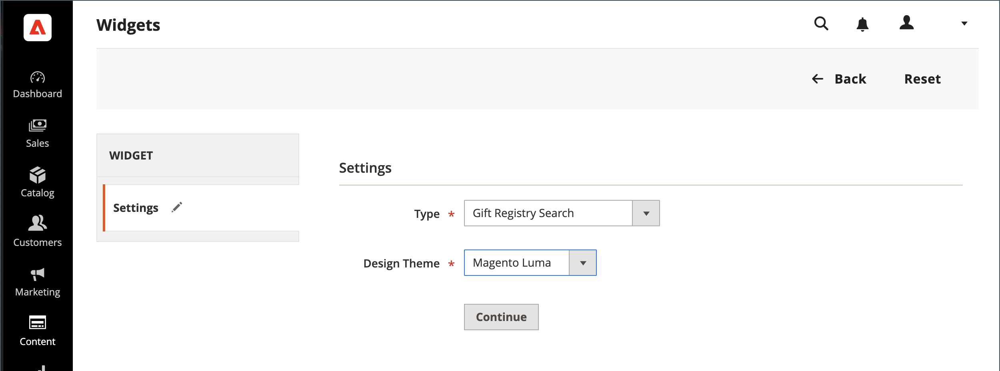

# Ajouter une recherche de registre des cadeaux

{{ee-feature}}

La variable [Widget](../content-design/widgets.md) peut être utilisé pour placer une zone de recherche dans le registre des cadeaux presque partout dans votre boutique. Vous pouvez spécifier les options de recherche qui seront disponibles pour les clients, telles que le nom, l’adresse électronique et l’identifiant du registre des cadeaux. Lorsque le client clique sur le bouton de recherche, les résultats s’affichent sur la page de recherche du registre des cadeaux. Si la recherche ne renvoie aucun résultat, le client peut réessayer avec d’autres paramètres.

{width="700" zoomable="yes"}

## Configuration de la recherche dans le registre des cadeaux

1. Sur le _Administration_ barre latérale, accédez à **[!UICONTROL Content]** > _[!UICONTROL Elements]_>**[!UICONTROL Widgets]**.

1. Dans le coin supérieur droit, cliquez sur **[!UICONTROL Add Widget]**.

1. Choisissez la **[!UICONTROL Settings]** et procédez comme suit :

   - Définir **[!UICONTROL Type]** to `Gift Registry Search`.

   - Définir **[!UICONTROL Design Theme]** au thème utilisé par le magasin.

   - Cliquez sur **[!UICONTROL Continue]**.

   {width="700" zoomable="yes"}

1. Dans le _[!UICONTROL Storefront Properties]_, procédez comme suit :

   - Saisissez un **[!UICONTROL Widget Title]** pour référence interne.

   - Définir **[!UICONTROL Assign to Store Views]** dans les vues du magasin où la recherche du registre des cadeaux doit être disponible.

   - Définir **[!UICONTROL Sort Order]** pour déterminer l’ordre d’affichage du bloc de recherche du registre des cadeaux lorsque d’autres blocs sont affectés au même emplacement sur la page.

   {width="700" zoomable="yes"}

1. Dans le **[!UICONTROL Layout Updates]** , cliquez sur **[!UICONTROL Add Layout Update]**.

1. Pour déterminer où la recherche du registre des cadeaux apparaît dans le magasin, procédez comme suit :

   - Définir **[!UICONTROL Display On]** sur les pages de votre magasin où vous souhaitez que le bloc de recherche du registre des cadeaux s’affiche.

   - Le cas échéant, choisissez la variable **[!UICONTROL Categories]** où vous souhaitez qu’il apparaisse.

   - Définir **[!UICONTROL Container]** à l’emplacement sur la page où placer le bloc de recherche du registre des cadeaux.

   {width="500" zoomable="yes"}

1. Dans le panneau de gauche, choisissez **[!UICONTROL Widget Options]**.

1. Pour déterminer comment les visiteurs de votre site peuvent rechercher des registres de cadeaux, sélectionnez autant de ceux qui s’appliquent :

   - [!UICONTROL All Forms]
   - [!UICONTROL Registrant Name Search]
   - [!UICONTROL Registrant Email Search]
   - [!UICONTROL Gift Registry ID Search]

   {width="700" zoomable="yes"}

1. Lorsque vous avez terminé, cliquez sur **[!UICONTROL Save]**.

1. Lorsque vous êtes invité à actualiser le cache de la page, cliquez sur le lien contenu dans le message situé en haut de l’espace de travail, puis suivez les instructions.

## Descriptions des champs

### [!UICONTROL Settings]

| Champ | Description |
|--- |--- |
| [!UICONTROL Type] | Identifiants `Gift Registry Search` comme type de Widget. |
| [!UICONTROL Design Theme] | Thème utilisé par le magasin où doit apparaître la recherche du registre des cadeaux. |

{style="table-layout:auto"}

### [!UICONTROL Storefront Properties]

| Champ | Description |
|--- |--- |
| [!UICONTROL Widget Title] | Nom de référence interne. |
| [!UICONTROL Assign to Store Views] | Identifie les vues du magasin où la recherche du registre des cadeaux doit être disponible. |
| [!UICONTROL Sort Order] | Indique l’ordre dans lequel le bloc de recherche du registre des cadeaux s’affiche si d’autres blocs sont affectés pour apparaître au même emplacement. |

{style="table-layout:auto"}

### [!UICONTROL Layout Updates]

| Champ | Description |
|--- |--- |
| [!UICONTROL Display On] | Indiquez les pages ou les types de pages spécifiques dans lesquels le bloc de recherche du registre des cadeaux s’affiche. |
| [!UICONTROL Categories] | Le cas échéant, identifie les pages de catégorie dans lesquelles la recherche du registre des cadeaux s’affiche. |
| [!UICONTROL Container] | Indique le bloc de mise en page dans lequel la recherche du registre des cadeaux est placée. Les options varient selon le modèle et le thème. |

{style="table-layout:auto"}

### [!UICONTROL Widget Options]

| Champ | Description |
|--- |--- |
| [!UICONTROL Quick Search Form Types] | Détermine les types de recherches pouvant être effectués avec la recherche du registre des cadeaux. Options : `All Forms` / `Registrant Name Search` /` Registrant Email Search` / `Gift Registry ID Search` |

{style="table-layout:auto"}
