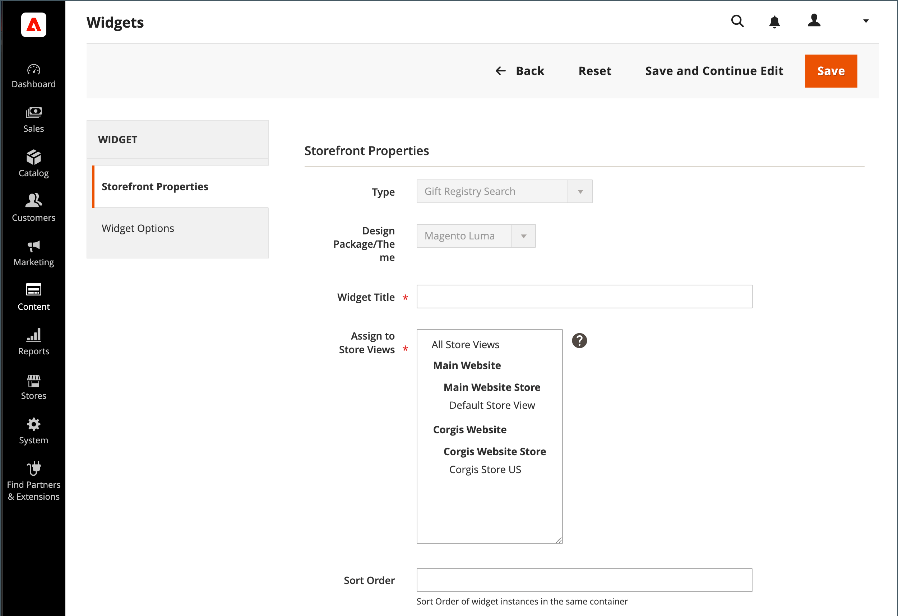
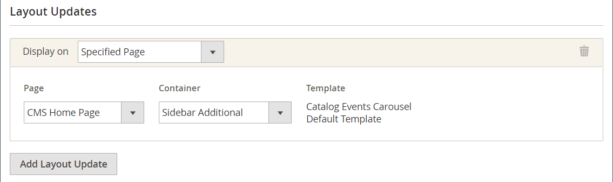

# Ajouter une recherche dans le registre des cadeaux

{{ee-feature}}

L&#39;outil [Widget](../content-design/widgets.md) peut être utilisé pour placer une boîte de recherche de registre des cadeaux n&#39;importe où dans votre boutique. Vous pouvez spécifier les options de recherche qui seront disponibles pour les clients, telles que le nom, l’adresse e-mail et l’ID de registre des cadeaux. Lorsque le client clique sur le bouton Rechercher, les résultats apparaissent sur la page de recherche du registre des cadeaux. Si la recherche ne renvoie aucun résultat, le client peut réessayer avec d’autres paramètres.

{width="700" zoomable="yes"}

## Configurer la recherche dans le registre des cadeaux

1. Dans la barre latérale _Admin_, accédez à **[!UICONTROL Content]** > _[!UICONTROL Elements]_>**[!UICONTROL Widgets]**.

1. Dans le coin supérieur droit, cliquez sur **[!UICONTROL Add Widget]**.

1. Sélectionnez l’onglet **[!UICONTROL Settings]** et procédez comme suit :

   - Définissez **[!UICONTROL Type]** sur `Gift Registry Search`.

   - Définissez **[!UICONTROL Design Theme]** sur le thème utilisé par le magasin.

   - Cliquez sur **[!UICONTROL Continue]**.

   {width="700" zoomable="yes"}

1. Dans la section _[!UICONTROL Storefront Properties]_, procédez comme suit :

   - Saisissez un **[!UICONTROL Widget Title]** pour référence interne.

   - Définissez **[!UICONTROL Assign to Store Views]** sur les vues du magasin où la recherche de registre des cadeaux doit être disponible.

   - Définissez **[!UICONTROL Sort Order]** pour déterminer l&#39;ordre dans lequel le bloc de recherche du registre des cadeaux apparaît lorsque d&#39;autres blocs sont affectés au même emplacement sur la page.

   {width="700" zoomable="yes"}

1. Dans la section **[!UICONTROL Layout Updates]**, cliquez sur **[!UICONTROL Add Layout Update]**.

1. Pour déterminer l&#39;emplacement de la recherche dans le registre des cadeaux dans le magasin, procédez comme suit :

   - Définissez **[!UICONTROL Display On]** sur les pages de votre boutique où vous souhaitez que le bloc de recherche du registre des cadeaux apparaisse.

   - Le cas échéant, choisissez le **[!UICONTROL Categories]** où vous souhaitez qu’il apparaisse.

   - Définissez **[!UICONTROL Container]** sur l&#39;emplacement sur la page pour placer le bloc de recherche du registre des cadeaux.

   {width="500" zoomable="yes"}

1. Dans le panneau de gauche, choisissez **[!UICONTROL Widget Options]**.

1. Pour déterminer comment les visiteurs de votre site peuvent rechercher des registres de cadeaux, sélectionnez autant de ce qui suit :

   - [!UICONTROL All Forms]
   - [!UICONTROL Registrant Name Search]
   - [!UICONTROL Registrant Email Search]
   - [!UICONTROL Gift Registry ID Search]

   {width="700" zoomable="yes"}

1. Cliquez ensuite sur **[!UICONTROL Save]**.

1. Lorsque vous êtes invité à actualiser le cache de page, cliquez sur le lien du message en haut de l’espace de travail et suivez les instructions.

## Descriptions des champs

### [!UICONTROL Settings]

| Champ | Description |
|--- |--- |
| [!UICONTROL Type] | Identifie `Gift Registry Search` comme type de widget. |
| [!UICONTROL Design Theme] | Thème utilisé par le magasin dans lequel la recherche de registre des cadeaux doit apparaître. |

{style="table-layout:auto"}

### [!UICONTROL Storefront Properties]

| Champ | Description |
|--- |--- |
| [!UICONTROL Widget Title] | Un nom pour référence interne. |
| [!UICONTROL Assign to Store Views] | Identifie les vues du magasin où la recherche de registre des cadeaux doit être disponible. |
| [!UICONTROL Sort Order] | Indique l&#39;ordre dans lequel le bloc de recherche du registre des cadeaux apparaît si d&#39;autres blocs sont affectés pour apparaître au même emplacement. |

{style="table-layout:auto"}

### [!UICONTROL Layout Updates]

| Champ | Description |
|--- |--- |
| [!UICONTROL Display On] | Indiquez les pages spécifiques ou les types de pages sur lesquelles le bloc de recherche du registre des cadeaux s&#39;affiche. |
| [!UICONTROL Categories] | Le cas échéant, identifie les pages de catégorie dans lesquelles la recherche de registre des cadeaux s&#39;affiche. |
| [!UICONTROL Container] | Indique le bloc de mise en page dans lequel la recherche de registre des cadeaux est placée. Les options varient selon le modèle et le thème. |

{style="table-layout:auto"}

### [!UICONTROL Widget Options]

| Champ | Description |
|--- |--- |
| [!UICONTROL Quick Search Form Types] | Détermine les types de recherches qui peuvent être effectuées avec la recherche dans le registre des cadeaux. Options : `All Forms` / `Registrant Name Search` /` Registrant Email Search` / `Gift Registry ID Search` |

{style="table-layout:auto"}
