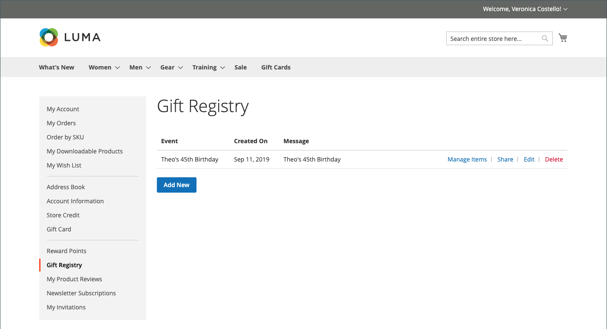

# Expérience de storefront du registre des cadeaux

{{ee-feature}}

La section [Registre des cadeaux](gift-registries.md) du compte client répertorie les registres des cadeaux actuels du client et l’événement associé. Les clients peuvent gérer les registres actuels et en ajouter de nouveaux.

{width="700" zoomable="yes"}

## Informations sur le registre des cadeaux

Les clients peuvent créer et gérer des registres de cadeaux à partir de leurs comptes. Toutes les informations associées à chaque type de registre sont disponibles à partir du compte du client.

{width="700" zoomable="yes"}

| Section | Description |
|--- |--- |
| [!UICONTROL General Information] | Cette section inclut généralement le nom de l’événement, un message ou une description de l’événement, les paramètres de confidentialité et le statut de l’événement. |
| [!UICONTROL Event Information] | Cette section indique le lieu et la date de l’événement. Pour un mariage, il peut également inclure le nombre d&#39;invités que chaque personne peut apporter. |
| [!UICONTROL Gift Registry Details] | Il peut s’agir d’informations supplémentaires spécifiques à l’occasion. |
| [!UICONTROL Registrant Information] | Cette section comprend le nom et les coordonnées de chaque personne qui doit recevoir une notification du registre. Pour un registre des mariages, le champ Rôle peut être inclus pour associer l&#39;inscrit en tant qu&#39;ami de la mariée ou du marié. |
| [!UICONTROL Shipping Address] | Cette section indique où les cadeaux doivent être envoyés et inclut les informations dont un transporteur a besoin pour livrer le colis. |

{style="table-layout:auto"}

>[!NOTE]
>
>Lorsqu’un registre des cadeaux est inactif, la recherche et le lien ne fonctionnent pas pour le registre. Si le registre est réactivé ultérieurement, les liens restent rompus.

## Créer un registre des cadeaux

1. Le client sélectionne **[!UICONTROL Gift Registry]** dans le tableau de bord de son compte.

1. Sur la page _Registre des cadeaux_, cliquez sur **[!UICONTROL Add New]**.

1. Choisit un **[!UICONTROL Gift Registry Type]**, tel que :

   - Anniversaire

   - Registre De L&#39;Enfant

   - Mariage

1. Effectue un clic sur **[!UICONTROL Next]**.

1. Saisissez les informations requises, puis cliquez sur **[!UICONTROL Save]**.

## Ajout d’un produit à un registre

1. Le client ouvre le produit qu’il souhaite ajouter à l’événement de registre des cadeaux.

1. Effectue un clic sur **[!UICONTROL Add to Cart]**.

1. Clics **[!UICONTROL View and Edit Cart]** sur le mini panier.

1. Sur la page Panier, sélectionne l’événement souhaité et clique/appuie sur **[!UICONTROL Add All To Gift Registry]**.

   Les objets sont ajoutés au registre des cadeaux de l&#39;événement sélectionné.

## Partager un registre des cadeaux

1. Dans le tableau de bord de son compte, le client accède à **[!UICONTROL Gift Registry]**.

1. Recherche l’événement de registre à gérer et clique sur **[!UICONTROL Share]**.

1. Entre les informations requises et clique sur **[!UICONTROL Share Gift Registry]**.

## Modifier un registre de cadeaux

1. Dans le tableau de bord de son compte, le client accède à **[!UICONTROL Gift Registry]**.

1. Recherche l’événement de registre à gérer et clique sur **[!UICONTROL Edit]**.

1. Modifiez les options selon les besoins.

1. Modifie les options requises et clique **[!UICONTROL Save]**.

## Gérer les articles du registre des cadeaux

1. Dans le tableau de bord de son compte, le client accède à **[!UICONTROL Gift Registry]**.

   {width="700" zoomable="yes"}

1. Recherche l’événement de registre, sélectionne les éléments à gérer et clique sur **[!DNL Manage Items]**.

1. Modifie les options requises, telles que **[!UICONTROL Note]** et **[!UICONTROL Qty]**.

1. Si nécessaire, supprimez un article du registre des cadeaux en cochant la case et en cliquant sur **[!UICONTROL Delete]**.

1. Clique sur **[!UICONTROL Update Gift Registry]** pour enregistrer les modifications.

## Supprimer un registre des cadeaux

1. Dans le tableau de bord de son compte, le client accède à **[!UICONTROL Gift Registry]**.

1. Recherche l’événement de registre à gérer et clique sur **[!UICONTROL Delete]**.

1. Clics **[!UICONTROL OK]** pour confirmer.
