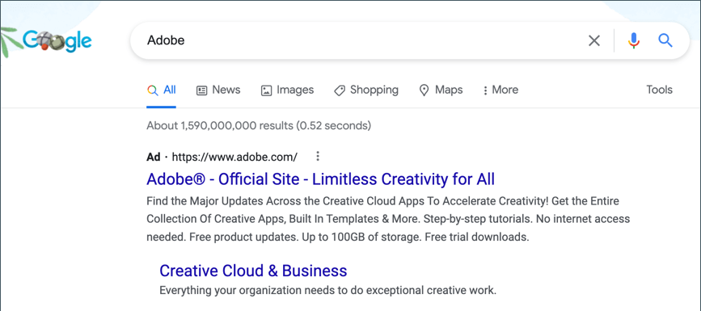

# Google AdWords

[Google AdWords][1] est un service que vous pouvez utiliser pour placer des publicités dans les résultats de recherche Google et sur les pages des entreprises du réseau d’affichage Google. Le tableau de bord AdWords contient des outils permettant de gérer vos campagnes, de suivre les réponses et de mesurer les résultats.

Le suivi des conversions indique le nombre de clics publicitaires qui conduisent à une vente ou à une autre action de valeur. La page _Succès_ qui s’affiche pour votre client après l’envoi d’une commande est utilisée pour effectuer le suivi des conversions, car elle n’apparaît qu’après une vente. Après avoir terminé la configuration Google AdWords pour votre magasin, il n’est pas nécessaire de copier le script de suivi de conversion sur la page de succès, car Commerce dispose déjà des informations nécessaires. Pour en savoir plus, consultez l’ [aide de Google AdWords][2].

{width="500"}

## Étape 1. Création d’une campagne AdWords Google

1. Visitez [Google AdWords][3] et inscrivez-vous à un compte.

1. Suivez les instructions pour créer une campagne.

1. Pour configurer le suivi des conversions pour votre campagne, procédez comme suit :

   - Dans l’onglet **[!UICONTROL Tools]** de votre tableau de bord AdWords, sélectionnez **[!UICONTROL Conversions]** et cliquez sur **[!UICONTROL Conversion]**.

   - Lorsque vous y êtes invité, choisissez **[!UICONTROL Website]**.

   - Saisissez le nom de l’action de conversion dont vous souhaitez effectuer le suivi, puis cliquez sur **[!UICONTROL Done]**.

   - Cliquez sur **[!UICONTROL Value]** et, le cas échéant, affectez une valeur à la conversion. Par exemple :

      - Si vous gagnez 5 $ à chaque vente, choisissez `Each time it happens` et affectez une valeur `$5`.
      - Si la valeur de chaque vente varie, laissez la valeur vide.

     Pour terminer, cliquez sur **[!UICONTROL Done]**.

   - Cliquez sur **[!UICONTROL Conversion windows]** et renseignez les paramètres pour déterminer la durée du suivi des conversions, la catégorie de création de rapports et le modèle d’attribution.

1. Une fois l’opération terminée, cliquez sur **[!UICONTROL Save and Continue]**.

## Étape 2. Obtention de la balise de conversion

1. Sous **[!UICONTROL Install your tag]**, choisissez de compter les conversions sur **[!UICONTROL Page load]**.

1. Vous pouvez, au choix, ajouter la notification **[!UICONTROL Google Site Stats]** à la page de conversion.

   La notification s’affiche dans le coin inférieur avec un lien vers les normes de sécurité Google et l’utilisation des cookies.

1. Pour choisir comment gérer votre balise AdWords, effectuez l’une des opérations suivantes :

   - Si vous prévoyez d’ajouter vous-même le script à votre magasin, choisissez **[!UICONTROL Save instructions and tag]**.
   - Si vous prévoyez qu’une autre personne ajoute le script à votre magasin, choisissez **[!UICONTROL Email instructions and tag]**.

1. Une fois l’opération terminée, cliquez sur **[!UICONTROL Done]**.

## Étape 3. Configuration de votre boutique

{{gtag-api-note}}

1. Sur la barre latérale _Admin_, accédez à **[!UICONTROL Stores]** > _[!UICONTROL Settings]_>**[!UICONTROL Configuration]**.

1. Si vous configurez Google AdWords pour une vue de magasin spécifique, procédez comme suit :

   - Dans le coin supérieur gauche, sélectionnez le **[!UICONTROL Store View]** à configurer.

   - Lorsque vous êtes invité à confirmer le changement de portée, cliquez sur **[!UICONTROL OK]**.

1. Dans le panneau de gauche, développez **[!UICONTROL Sales]** et choisissez **[!UICONTROL Google API]**.

1. Développez la section  de **[!UICONTROL Google AdWords]** et procédez comme suit :

   - Définissez **[!UICONTROL Enable]** sur `Yes`.

   - Saisissez le **[!UICONTROL Conversion ID]** de votre script Google AdWords.

   {width="600" zoomable="yes"}

1. Pour formater la notification d’état de Google Sites, procédez comme suit :

   - Définissez **[!UICONTROL Conversion Language]** sur la langue identifiée dans votre script Google AdWords.

   - Saisissez le **[!UICONTROL Conversion Format]** à utiliser pour la notification d’état de Google Sites sur la page de conversion.

      - `1` - Affiche une notification d’une ligne avec un lien vers plus d’informations sur le suivi Google.
      - `2` - Affiche une notification sur deux lignes avec un lien vers plus d’informations sur le suivi Google.
      - `3` - N’affiche aucune notification client.

   - Saisissez le [code hexadécimal][4]{:target=&quot;_blank&quot;} pour le **[!UICONTROL Conversion Color]** que vous souhaitez utiliser pour le libellé de notification de statistiques de site Google.

   - Saisissez le texte chiffré pour le **[!UICONTROL Conversion Label]** qui apparaît sur la notification d’état de Google Sites.

     Par exemple : `MlEYCOKBnGoQz6CZoAM`

     **Exemple de code de balise Google AdWords**

     ```html
     <!-- Google Code for Back to School Sale Conversion Page -->
     <script type="text/javascript">
     /* <![CDATA[ */
     var google_conversion_id = 999999999;
     var google_conversion_language = "en";
     var google_conversion_format = "3";
     var google_conversion_color = "ffffff";
     var google_conversion_label = "MlEYCOKBnGoQz6CZoAM";
     var google_remarketing_only = false;
     /* ]]> */
     </script>
     
     <script type="text/javascript" src="//www.googleadservices.com/pagead/conversion.js">
     </script>
     <noscript>
     <div style="display:inline;">
     
     
     </noscript>
     ```

1. Définissez **[!UICONTROL Conversion Value Type]** sur l’une des options suivantes :

   - `Dynamic` - Détermine qu’une conversion s’est produite en fonction de la valeur de montant de commande dynamique.
   - `Constant` - Détermine qu’une conversion a eu lieu en fonction d’une valeur spécifique saisie.

   Pour un type de valeur de conversion _Constante_ , saisissez un **[!UICONTROL Value]** spécifique pour que _[!UICONTROL Order Amount]_puisse être considéré comme une conversion.

1. Une fois l’opération terminée, cliquez sur **[!UICONTROL Save Config]**.

## Étape 4. Vérification de la configuration

En quelques heures, l’état du suivi dans votre tableau de bord Google AdWords passe de `Unverified` à `No recent conversions` ou `Recording conversions`. Lorsqu’un utilisateur clique sur votre publicité et effectue un achat, la conversion s’affiche sur la page Actions de conversion du tableau de bord et du rapport Campagne.

[1]: https://www.google.com/adwords/
[2]: https://support.google.com/adwords/answer/6095821
[3]: https://ads.google.com/
[4]: https://www.w3schools.com/colors/colors_picker.asp
