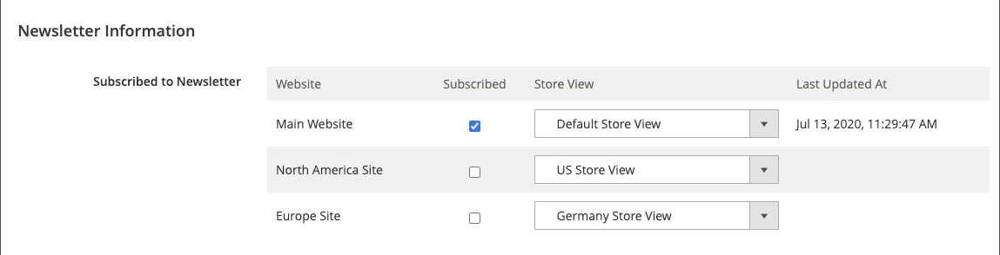

# Gestion des abonnés aux newsletters

Il est recommandé de gérer régulièrement votre liste d’abonnements et de traiter toutes les demandes de désabonnement. Dans certaines juridictions, la loi exige que les demandes de désabonnement soient traitées dans un délai donné.

Vous pouvez facilement gérer vos abonnés à l’aide d’une simple liste d’abonnements actifs. Lorsqu’un client envoie une demande de désabonnement, vous pouvez simplement appliquer une action _Unsubscribe_ à un ou plusieurs abonnements sélectionnés.

Dans les configurations à site unique avec plusieurs vues de magasin, un abonnement au compte client peut être associé à une vue de magasin spécifique.

Dans les configurations multi-magasin et multi-site avec une [portée de compte client](../customers/customer-account-scope.md) globale, un compte client peut être abonné à des newsletters pour plusieurs sites/magasins. Dans ce cas, vous pouvez modifier le compte client pour gérer un groupe d’abonnements ou annuler un abonnement pour un site/magasin spécifique afin d’honorer une demande.

Si vous souhaitez utiliser un service tiers pour envoyer des newsletters, vous pouvez exporter votre liste d’abonnements au format CSV ou XML.

## Gestion des abonnements d’un client

1. Sur la barre latérale _Admin_, accédez à **[!UICONTROL Customers]** > **[!UICONTROL All Customers]**.

1. Recherchez le client dans la grille et cliquez sur **[!UICONTROL Edit]** dans la colonne _[!UICONTROL Action]_.

1. Cliquez sur **[!UICONTROL Newsletter]** dans le panneau de gauche.

1. Modifiez les abonnements du client en fonction de la configuration de votre site/magasin.

   Pour une configuration de site/magasin unique, vous pouvez simplement cocher ou décocher la case **[!UICONTROL Subscribed to Newsletter]** .

   {width="500" zoomable="yes"}

   Pour une configuration de site unique/multi-magasin, vous pouvez cocher ou décocher la case **[!UICONTROL Subscribed to Newsletter]** et définir **[!UICONTROL Subscribed on Store View]** sur la vue de magasin correcte pour l’abonnement.

   {width="500" zoomable="yes"}

   Pour une configuration multi-site/multi-magasin avec une portée globale de compte client, la page affiche l’état d’abonnement pour tous les sites. Vous pouvez cocher ou décocher la case **[!UICONTROL Subscribed]** et/ou modifier le **[!UICONTROL Store View]** de l&#39;abonnement.

   {width="500" zoomable="yes"}

1. Cliquez sur **[!UICONTROL Save Customer]**.

## Annulation d’un abonnement à partir de la liste des abonnés

1. Sur la barre latérale _Admin_, accédez à **[!UICONTROL Marketing]** > _[!UICONTROL Communications]_>**[!UICONTROL Newsletter Subscribers]**.

   Dans le cas d’une configuration multi-site où certains clients ont des abonnements pour plusieurs sites, chaque abonnement s’affiche sous la forme d’un élément de ligne dans la grille.

1. Recherchez l&#39;abonné dans la grille et cochez la case dans la première colonne.

   >[!NOTE]
   >
   >Pour un désabonnement en masse, cochez la case de chaque abonné que vous souhaitez annuler.

1. Définissez la commande _[!UICONTROL Action]_&#x200B;sur **[!UICONTROL Unsubscribe]**&#x200B;et cliquez sur **[!UICONTROL Submit]**.

   {width="600" zoomable="yes"}

   L’état de l’enregistrement passe à `Unsubscribed`.

## Exporter la liste des abonnés

1. Dans la liste _[!UICONTROL Newsletter Subscribers]_, utilisez les contrôles de filtre pour inclure uniquement les enregistrements avec un_ Statut _de `Subscribed` et pour la vue de site web, de magasin ou de magasin appropriée.

1. Définissez la commande **[!UICONTROL Export to]** sur l’une des options suivantes :

   - `CSV`
   - `XML`

1. Cliquez sur **[!UICONTROL Export]** et recherchez l’invite en bas de l’écran et enregistrez le fichier.

   {width="600" zoomable="yes"}

## Supprimer un abonné de la liste des abonnés

1. Sur la barre latérale _Admin_, accédez à **[!UICONTROL Marketing]** > _[!UICONTROL Communications]_>**[!UICONTROL Newsletter Subscribers]**.

1. Recherchez l&#39;abonné dans la grille et cochez la case dans la première colonne.

1. Définissez la commande _[!UICONTROL Action]_&#x200B;sur **[!UICONTROL Delete]**&#x200B;et cliquez sur **[!UICONTROL Submit]**.

1. Lorsque vous êtes invité à confirmer l’opération, cliquez sur **[!UICONTROL OK]**.
