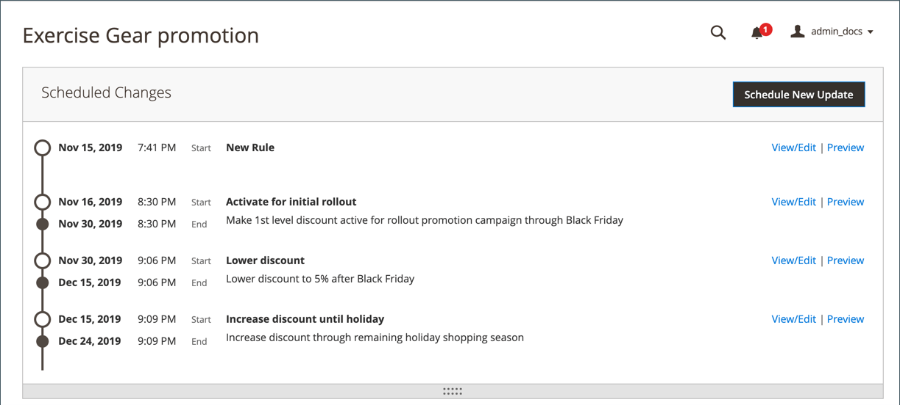

# Modifications planifiées pour les règles de prix de catalogue

{{ee-feature}}

La zone Modifications planifiées s&#39;affiche en haut de la page lorsqu&#39;une nouvelle règle de prix est enregistrée ou mise à jour. Les règles de prix de catalogue peuvent être appliquées selon le calendrier dans le cadre d’une campagne et regroupées avec d’autres modifications de contenu. Vous pouvez créer une campagne basée sur les modifications planifiées apportées à une règle de prix ou appliquer les modifications à une campagne existante.

{width="600" zoomable="yes"}

## Fonctionnement des mises à jour de règles de prix planifiées

- Toutes les mises à jour planifiées sont appliquées de manière consécutive. Cela signifie que toute entité ne peut avoir qu’une seule mise à jour planifiée à la fois.

- Toute mise à jour planifiée est appliquée à toutes les vues de magasin au cours de sa période. Par conséquent, une entité ne peut pas avoir différentes mises à jour planifiées pour différentes vues de magasin en même temps. Toutes les valeurs d’attribut d’entité dans toutes les vues de magasin, qui ne sont pas affectées par la mise à jour planifiée actuelle, sont extraites des valeurs par défaut, et non de la mise à jour planifiée précédente.

- Si plusieurs règles de prix sont exécutées dans la même campagne, le paramètre Priorité de la règle de prix détermine quelle règle est prioritaire. Pour en savoir plus, voir [Évaluation du contenu](../content-design/content-staging.md).

## Mettre fin à une vente de règle de prix à un moment spécifique

Si une règle de prix active a été créée sans date de fin et que vous devez y mettre fin à une heure spécifique, vous ne pouvez pas modifier la mise à jour planifiée existante pour ajouter une date de fin. Au lieu de cela, vous devez créer une mise à jour planifiée qui modifie le statut de la règle en `Inactive`. Définissez la date de début de cette nouvelle mise à jour sur la date et l&#39;heure auxquelles vous souhaitez que la vente se termine.

## Planifier une mise à jour d’une règle de prix de catalogue

1. Dans la barre latérale _Admin_, accédez à **[!UICONTROL Marketing]** > _[!UICONTROL Promotions]_>**Règle de prix de catalogue**.

1. Ouvrez la règle en mode d’édition.

1. Dans la zone **[!UICONTROL Scheduled Changes]** en haut de la page, cliquez sur **[!UICONTROL Schedule New Update]**.

1. Lorsque l’option **[!UICONTROL Save as a New Update]** est sélectionnée, procédez comme suit :

   - Par **[!UICONTROL Update Name]**, saisissez le nom de la mise à jour de la règle.

   - Saisissez un bref **[!UICONTROL Description]** de la mise à jour, y compris le mode ou la raison de son application.

   - Utilisez l’icône _Calendrier_ () pour choisir les **[!DNL Start Date]** et **[!UICONTROL End Date]** d’application de la modification planifiée. Pour créer une modification non limitée, laissez la date de fin vide.

   {width="600" zoomable="yes"}

   >[!NOTE]
   >
   >La date/l’heure de début et de fin sont déterminées par la date/l’heure et le fuseau horaire par défaut du panneau d’administration, et non par le fuseau horaire d’un site web particulier. Tenez compte du fuseau horaire du site web pour déterminer correctement les heures de début et de fin. Créez des règles distinctes pour les sites web situés dans différents fuseaux horaires qui doivent démarrer et/ou s’arrêter à des heures locales spécifiques.

1. Faites défiler l’écran jusqu’à la section **[!UICONTROL Rule Information]** et modifiez la règle selon vos besoins.

   Vous pouvez planifier des modifications pour n’importe quel paramètre de règle, y compris les sites web (portée)/groupes de clients pour la règle, les conditions de la règle et les actions appliquées par la règle. Pour plus d&#39;informations, voir [Créer une règle de prix de catalogue](price-rules-catalog-create.md).

   >[!NOTE]
   >
   >Chaque fois que vous mettez à jour des paramètres d’informations de règle, assurez-vous que le _[!UICONTROL Status]_est correctement défini. Si vous souhaitez que la modification entraîne l’application active d’une règle, définissez le statut sur `Active`.

1. Cliquez ensuite sur **[!UICONTROL Save]**.

   La modification planifiée s’affiche en haut de la page, avec les dates de début et de fin de la campagne.

## Modifier une modification de règle planifiée

>[!NOTE]
>
>Si une campagne est liée à plusieurs règles de prix de catalogue, vous ne pouvez la modifier que depuis le [Tableau de bord d’évaluation de contenu](../content-design/content-staging-dashboard.md).

1. Dans la zone **[!UICONTROL Scheduled Changes]** en haut de la page, cliquez sur **[!UICONTROL View/Edit]**.

1. Apportez les modifications nécessaires à la mise à jour planifiée.

1. Cliquez sur **[!UICONTROL Save]**.

## Prévisualiser la modification de règle planifiée

1. Dans la zone **[!UICONTROL Scheduled Changes]** en haut de la page, cliquez sur **[!UICONTROL Preview]**.

   L’aperçu ouvre un nouvel onglet du navigateur qui charge votre storefront avec la modification planifiée appliquée. Accédez à un produit affecté par la modification.

   {width="600" zoomable="yes"}

1. Dans le coin supérieur gauche de la fenêtre Aperçu, cliquez sur **[!UICONTROL Calendar]**.

   Le détail Calendrier affiche les autres campagnes planifiées pour le même jour. Chaque enregistrement de la liste est une mise à jour de règle distincte.

   {width="600" zoomable="yes"}

1. Pour prévisualiser un autre jour ou une autre heure, cliquez sur le calendrier **[!UICONTROL Date & Time]**  et procédez comme suit :

   - Choisissez une autre date et/ou heure.

   - Cliquez sur **[!UICONTROL Preview]**.

1. Pour revenir au calendrier, cliquez sur **[!UICONTROL Calendar]** dans l’en-tête de la page Aperçu .

   À partir de là, vous pouvez effectuer les opérations suivantes :

   **Partager un lien vers l’aperçu**

   Pour partager un lien vers l’aperçu de la boutique avec d’autres utilisateurs administrateurs, cliquez sur **[!UICONTROL Share]**. Copiez le lien dans le presse-papiers et collez-le dans le corps d’un e-mail.

   >[!NOTE]
   >
   >Si votre [rôle dispose d’un accès](../systems/permissions-user-roles.md) pour gérer les comptes utilisateur d’administration, vous pouvez créer ou mettre à jour un compte utilisateur existant disposant d’autorisations d’administrateur afin de partager le lien d’aperçu.

   **Modifier la portée de l’aperçu**

   Pour afficher les modifications planifiées pour différentes vues de magasin, cliquez sur **[!UICONTROL Scope]** dans l’en-tête de la page Aperçu . Choisissez le site web, le magasin ou l’affichage du magasin à prévisualiser.

1. Si nécessaire, revenez au calendrier et cliquez sur **[!UICONTROL View/Edit]** dans la colonne _[!UICONTROL Action]_pour ouvrir une autre mise à jour planifiée.
