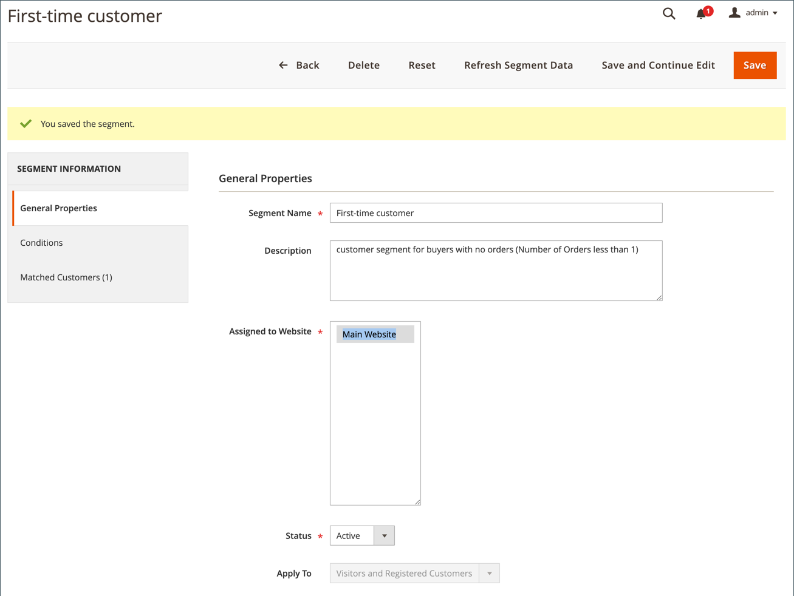
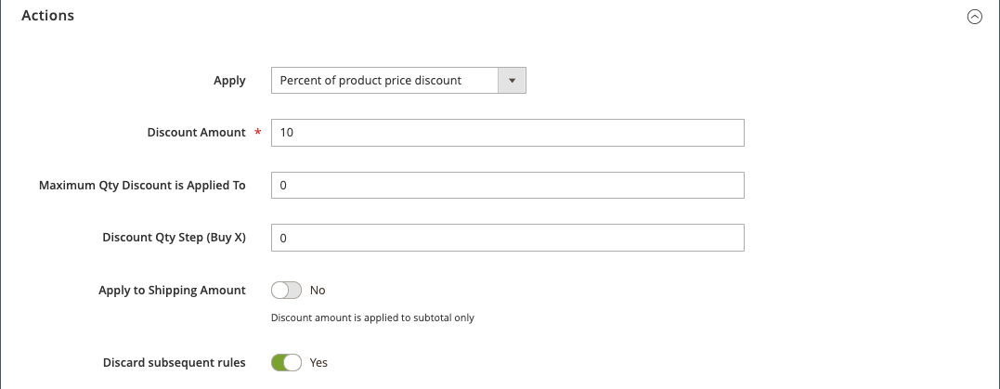

# Exemple de règle de prix de panier - Remise avec le premier achat

{{ee-feature}}

Les règles de prix de panier peuvent être utilisées pour offrir automatiquement une remise aux clients lors de leur premier achat, sans coupon nécessaire.

Pour offrir une remise destinée aux nouveaux clients, vous pouvez :

- Créez un segment client défini comme _acheteurs sans commande_, puis
- Créez une règle de prix de panier qui cible le nouveau segment client.

>[!NOTE]
>
>Assurez-vous que la fonction Segments client est activée. Pour plus d&#39;informations, consultez la section [Créer un segment client](../customers/customer-segment-create.md).

## Étape 1. Créer un segment client

1. Dans la barre latérale _Admin_, accédez à **[!UICONTROL Customers]** > **[!UICONTROL Segments]**.

1. Dans le coin supérieur droit, cliquez sur **[!UICONTROL Add Segment]**.

1. Définissez la **[!UICONTROL General Properties]**.

   - Saisissez un **[!UICONTROL Segment Name]** pour identifier le segment client (exemple : _Premier client_).

   - Par **[!UICONTROL Assigned to Website]**, sélectionnez le site web sur lequel le segment client peut être utilisé.

   - Par **[!UICONTROL Status]**, sélectionnez `Active`.

   - Par **[!UICONTROL Apply to]**, sélectionnez `Visitors and Registered Customers`.

   - Cliquez ensuite sur **[!UICONTROL Save and Continue Edit]**.

     D’autres options sont disponibles dans le panneau de gauche.

   {width="600" zoomable="yes"}

1. Définissez la **[!UICONTROL Conditions]**.

   Pour cet exemple, la condition cible les clients pour lesquels _Nombre total de commandes est inférieur à 1_ a la valeur True.

   - Dans le panneau de gauche, choisissez **[!UICONTROL Conditions]**.

     La condition par défaut commence par « Si TOUTES ces conditions sont VRAIES : ».

   - Cliquez sur _Ajouter_ () et sélectionnez `Number of Orders`.

   - Cliquez sur **[!UICONTROL is]** et sélectionnez `less than`.

   - Cliquez sur **...** et saisissez `1` dans le champ.

   - Cliquez sur la coche verte (  ) pour enregistrer le paramètre de condition.

   {width="600" zoomable="yes"}

1. Cliquez sur **[!UICONTROL Save]**.

Le segment client est créé et affiché dans la grille de _[!UICONTROL Customer Segments]_.

>[!TIP]
>
>Notez l’identifiant de segment. Utilisez ce numéro d’ID pour créer la règle de prix de panier.

## Étape 2. Créer la règle de prix de panier

1. Dans la barre latérale _Admin_, accédez à **[!UICONTROL Marketing]** > _[!UICONTROL Promotions]_>**[!UICONTROL Cart Price Rule]**.

1. Dans le coin supérieur droit, cliquez sur **[!UICONTROL Add New Rule]**.

   La section **[!UICONTROL Rule Information]** s’affiche par défaut, avec des sections extensibles pour les **[!UICONTROL Conditions]** et les **[!UICONTROL Conditions]**.

1. Définissez la **[!UICONTROL Rule Information]**.

   - Renseignez les champs **[!UICONTROL Rule Name]** et **[!UICONTROL Description]** . Ces champs sont fournis uniquement à titre de référence interne.

   - Par **[!UICONTROL Websites]**, sélectionnez le site web sur lequel la règle doit être disponible.

   - Par **[!UICONTROL Customer Groups]**, sélectionnez le groupe de clients auquel cette règle s’applique.

     Pour sélectionner plusieurs groupes, maintenez la touche Ctrl (PC) ou Commande (Mac) enfoncée et cliquez sur chaque option.

     >[!NOTE]
     >
     >Les options de cette liste dépendent des groupes de clients et clientes créés et gérés dans **[!UICONTROL Customers]** > **[!UICONTROL Customer Groups]**.

   - Par **[!UICONTROL Coupon]**, sélectionnez `No Coupon`.

   - Par **[!UICONTROL Uses per Customer]**, saisissez `1`.

   - Par **[!UICONTROL Priority]**, saisissez un nombre pour établir la priorité de cette règle par rapport aux autres règles.

     >[!NOTE]
     >
     >Le paramètre Priorité est important lorsque le même produit du catalogue remplit les conditions définies pour plusieurs règles de prix. La règle avec le paramètre de priorité le plus élevé devient active pour le client. La priorité la plus élevée est 1. Pour cet exemple, la saisie de `1` signifie que cette règle est appliquée avant toute autre règle de prix. Cette valeur est utilisée par le paramètre **[!UICONTROL Discard Subsequent Rules]** de la section **[!UICONTROL Action]** .

   - Cliquez ensuite sur **[!UICONTROL Save and Continue Edit]**.

     D’autres options sont disponibles dans le panneau de gauche.

   {width="600" zoomable="yes"}

1. Définissez la **[!UICONTROL Conditions]**.

   - Faites défiler vers le bas et développez  la section **[!UICONTROL Conditions]** .

     La règle par défaut commence par « Si TOUTES ces conditions sont VRAIES : ».

   - Cliquez sur _Ajouter_ () et sélectionnez `Customer Segment`.

     Le champ du qualificateur est défini par défaut sur `matches`.

   - Cliquez sur **...** et saisissez l’identifiant du segment client que vous souhaitez cibler.

     Pour cet exemple, l’identifiant de segment pour le nouveau segment créé à l’étape 1 est `2`.

     >[!NOTE]
     >
     >Si vous ne connaissez pas l’identifiant du segment, cliquez sur l’icône du sélecteur (  ) pour afficher la liste Segments client . Vous pouvez saisir manuellement l’identifiant dans le champ ou cocher la case du segment souhaité pour renseigner automatiquement le champ.

   - Cliquez sur la coche verte (  ) pour enregistrer le paramètre de condition.

   - Cliquez ensuite sur **[!UICONTROL Save and Continue Edit]**.

     Cette ligne de la règle s’applique à tous les clients qui correspondent à l’ID de segment client 2.

   {width="400"}

1. Faites défiler vers le bas et développez  la section **[!UICONTROL Conditions]** et définissez les actions de la règle.

   Dans cette section, vous définissez le type de remise et la valeur/le montant de la remise que vous souhaitez appliquer aux nouveaux clients. Cet exemple définit une remise de 10 % pour tous les clients qui remplissent la condition définie. Pour plus d’informations sur les autres options disponibles, voir [Création d’une règle de prix de panier](price-rules-cart-create.md).

   - Par **[!UICONTROL Apply]**, sélectionnez Pourcentage de remise sur le prix du produit.

   - Par **[!UICONTROL Discount Amount]**, saisissez `10`.

   - Pour appliquer cette règle de prix uniquement aux montants de produit, définissez **[!UICONTROL Apply to Shipping Amount]** sur `No`.

   - Pour empêcher le système d’appliquer plusieurs règles de prix au même produit, définissez **[!UICONTROL Discard Subsequent Rules]** sur `Yes`.

   - Cliquez ensuite sur **[!UICONTROL Save]**.

   {width="600" zoomable="yes"}

La nouvelle règle est normalement disponible dans l’heure. Testez la règle pour vous assurer qu’elle fonctionne comme vous l’avez définie.

## Étape 3 : enregistrer et tester la règle

{{new-price-rule}}

1. Une fois la règle terminée, cliquez sur **[!UICONTROL Save Rule]**.

1. Testez la règle pour vous assurer qu’elle fonctionne correctement.
