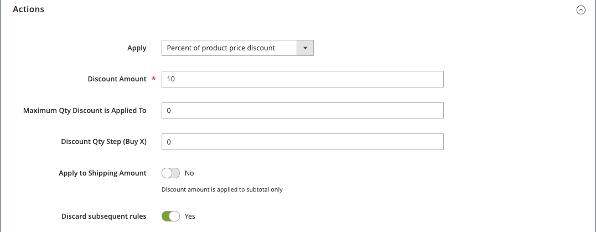

# Exemple de règle de prix du panier - remise avec premier achat

{{ee-feature}}

Les règles de prix du panier peuvent être utilisées pour offrir automatiquement une remise aux clients lors de leur premier achat, sans coupon nécessaire.

Pour offrir une remise ciblée sur les nouveaux clients, vous pouvez :

- Créez un segment de client défini comme _acheteurs sans commandes_, puis
- Créez une règle de prix de panier qui cible le nouveau segment de client.

>[!NOTE]
>
>Assurez-vous que la fonction Segments de client est activée. Reportez-vous à la section [Création d’un segment client](../customers/customer-segment-create.md).

## Étape 1. Création d’un segment client

1. Sur la barre latérale _Admin_, accédez à **[!UICONTROL Customers]** > **[!UICONTROL Segments]**.

1. Dans le coin supérieur droit, cliquez sur **[!UICONTROL Add Segment]**.

1. Définissez le **[!UICONTROL General Properties]**.

   - Saisissez un **[!UICONTROL Segment Name]** pour identifier le segment client (par exemple : _Premier client_).

   - Pour **[!UICONTROL Assigned to Website]**, sélectionnez le site web sur lequel le segment client peut être utilisé.

   - Pour **[!UICONTROL Status]**, sélectionnez `Active`.

   - Pour **[!UICONTROL Apply to]**, sélectionnez `Visitors and Registered Customers`.

   - Une fois l’opération terminée, cliquez sur **[!UICONTROL Save and Continue Edit]**.

     D’autres options deviennent disponibles dans le panneau de gauche.

   {width="600" zoomable="yes"}

1. Définissez le **[!UICONTROL Conditions]**.

   Pour cet exemple, la condition cible les clients pour lesquels _Nombre total de commandes est inférieur à 1_ a la valeur True.

   - Dans le panneau de gauche, choisissez **[!UICONTROL Conditions]**.

     La condition par défaut commence par &quot;Si TOUTES ces conditions sont TRUE :&quot;

   - Cliquez sur _Ajouter_ () et sélectionnez `Number of Orders`.

   - Cliquez sur **[!UICONTROL is]** et sélectionnez `less than`.

   - Cliquez sur **...** et saisissez `1` dans le champ .

   - Cliquez sur la coche verte (  ) pour enregistrer le paramètre de condition.

   {width="600" zoomable="yes"}

1. Cliquez sur **[!UICONTROL Save]**.

Le segment client est créé et affiché dans la grille _[!UICONTROL Customer Segments]_.

>[!TIP]
>
>Notez l’identifiant du segment. Vous utilisez ce numéro d’identifiant pour créer la règle de prix du panier.

## Étape 2. Création de la règle de prix du panier

1. Sur la barre latérale _Admin_, accédez à **[!UICONTROL Marketing]** > _[!UICONTROL Promotions]_>**[!UICONTROL Cart Price Rule]**.

1. Dans le coin supérieur droit, cliquez sur **[!UICONTROL Add New Rule]**.

   La section **[!UICONTROL Rule Information]** s’affiche par défaut, avec des sections extensibles pour **[!UICONTROL Conditions]** et **[!UICONTROL Conditions]**.

1. Définissez le **[!UICONTROL Rule Information]**.

   - Renseignez les champs **[!UICONTROL Rule Name]** et **[!UICONTROL Description]** . Ces champs sont réservés à votre référence interne.

   - Pour **[!UICONTROL Websites]**, sélectionnez le site web sur lequel la règle doit être disponible.

   - Pour **[!UICONTROL Customer Groups]**, sélectionnez le groupe de clients auquel s’applique cette règle.

     Pour sélectionner plusieurs groupes, maintenez la touche Ctrl (PC) ou la touche Commande (Mac) enfoncée, puis cliquez sur chaque option.

     >[!NOTE]
     >
     >Les options de cette liste dépendent des groupes de clients créés et gérés dans **[!UICONTROL Customers]** > **[!UICONTROL Customer Groups]**.

   - Pour **[!UICONTROL Coupon]**, sélectionnez `No Coupon`.

   - Pour **[!UICONTROL Uses per Customer]**, saisissez `1`.

   - Pour **[!UICONTROL Priority]**, saisissez un nombre afin d’établir la priorité de cette règle par rapport aux autres règles.

     >[!NOTE]
     >
     >Le paramètre Priorité est important lorsque le même produit catalogue répond aux conditions définies pour plusieurs règles de prix. La règle avec le paramètre de priorité le plus élevé devient active pour le client. La priorité la plus élevée est 1. Pour cet exemple, la saisie de `1` signifie que cette règle est appliquée avant toute autre règle de prix. Cette valeur est utilisée par le paramètre **[!UICONTROL Discard Subsequent Rules]** de la section **[!UICONTROL Action]**.

   - Une fois l’opération terminée, cliquez sur **[!UICONTROL Save and Continue Edit]**.

     D’autres options deviennent disponibles dans le panneau de gauche.

   {width="600" zoomable="yes"}

1. Définissez le **[!UICONTROL Conditions]**.

   - Faites défiler l’écran vers le bas et développez la section  sur **[!UICONTROL Conditions]** .

     La règle par défaut commence par &quot;Si TOUTES ces conditions sont TRUE:&quot;.

   - Cliquez sur _Ajouter_ () et sélectionnez `Customer Segment`.

     Par défaut, le champ de qualificateur est `matches`.

   - Cliquez sur **...** et saisissez l’identifiant du segment du client que vous souhaitez cibler.

     Pour cet exemple, l’identifiant du segment pour le nouveau segment créé à l’étape 1 est `2`.

     >[!NOTE]
     >
     >Si vous ne connaissez pas l’identifiant du segment, cliquez sur l’icône de sélection (  ) pour afficher la liste Segment de client. Vous pouvez saisir manuellement l’identifiant dans le champ ou cocher la case correspondant au segment souhaité pour remplir automatiquement le champ.

   - Cliquez sur la coche verte (  ) pour enregistrer le paramètre de condition.

   - Une fois l’opération terminée, cliquez sur **[!UICONTROL Save and Continue Edit]**.

     Cette ligne de règle s’applique à tous les clients qui correspondent à l’ID de segment client 2.

   {width="400"}

1. Faites défiler l’écran vers le bas et développez la section  et définissez les actions de la règle.**[!UICONTROL Conditions]**

   Dans cette section, vous définissez le type de remise et la valeur/le montant de la remise que vous souhaitez appliquer aux nouveaux clients. Cet exemple définit une remise de 10 % pour tous les clients qui respectent la condition définie. Pour plus d’informations sur les autres options disponibles, voir [Création d’une règle de prix du panier](price-rules-cart-create.md).

   - Pour **[!UICONTROL Apply]**, sélectionnez Pourcentage de remise sur le prix du produit.

   - Pour **[!UICONTROL Discount Amount]**, saisissez `10`.

   - Pour appliquer cette règle de prix uniquement aux quantités de produits, définissez **[!UICONTROL Apply to Shipping Amount]** sur `No`.

   - Pour empêcher le système d&#39;appliquer plusieurs règles de prix au même produit, définissez **[!UICONTROL Discard Subsequent Rules]** sur `Yes`.

   - Une fois l’opération terminée, cliquez sur **[!UICONTROL Save]**.

   {width="600" zoomable="yes"}

La nouvelle règle est normalement disponible dans l’heure. Testez la règle pour vous assurer qu’elle fonctionne comme vous l’avez définie.

## Étape 3 : enregistrer et tester la règle

{{new-price-rule}}

1. Une fois la règle terminée, cliquez sur **[!UICONTROL Save Rule]**.

1. Testez la règle pour vous assurer qu’elle fonctionne correctement.
