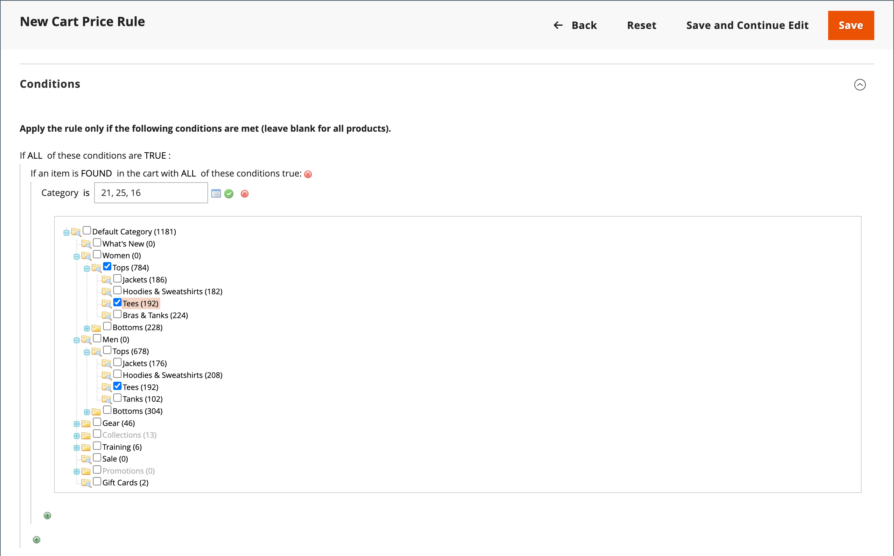
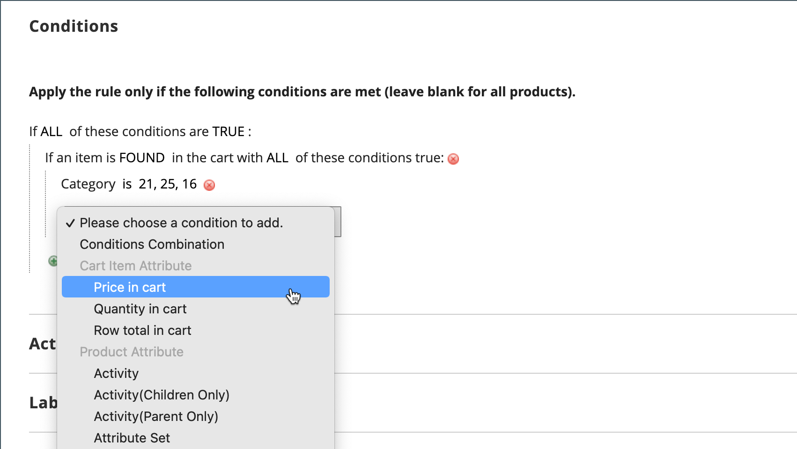
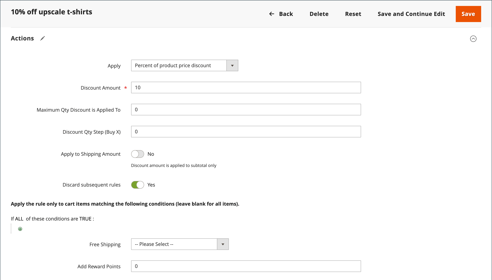

# Exemple de règle de prix de panier - Remise avec prix minimum du produit

Les règles de prix de panier peuvent être utilisées pour offrir un pourcentage de remise en fonction d’un prix de produit minimum dans le panier. Dans l’exemple suivant, une remise de 10 % est appliquée à tous les produits du panier lorsqu’au moins un produit d’un prix supérieur à 30 $ provenant d’une catégorie spécifiée est ajouté au panier. Le format de la remise est le suivant :

X % de réduction sur le panier entier lorsqu’au moins 1 produit est issu de la catégorie Y et que son prix est supérieur à Z dollars.

## Étape 1. Création d’une règle de panier

Suivez les [instructions](price-rules-cart.md) de base pour créer une règle de panier.

## Étape 2. Définition des conditions

1. Faites défiler vers le bas et développez  la section **[!UICONTROL Conditions]** .

1. Cliquez sur _Ajouter_ () et choisissez **[!UICONTROL Product Attribute Combination]**.

   {width="500" zoomable="yes"}

1. Cliquez sur _Ajouter_ () au début de la ligne suivante et dans la liste sous **[!UICONTROL Product Attribute]**, choisissez **[!UICONTROL Category]**.

   - Cliquez sur le lien (**...**) _plus_ pour afficher des options supplémentaires.

     {width="600" zoomable="yes"}

   - Cliquez sur l’icône _Sélecteur_ () pour afficher les catégories disponibles. Dans l’arborescence des catégories, cochez la case de chaque catégorie à inclure. Cliquez sur l’icône de vérification pour accepter les sélections de catégorie.

     {width="600" zoomable="yes"}

1. Cliquez sur _Ajouter_ () au début de la ligne suivante et procédez comme suit :

   - Dans la liste sous **[!UICONTROL Cart Item Attribute]**, choisissez **[!UICONTROL Price in cart]**.

     {width="500"}

   - Cliquez sur **is** et choisissez `equals or greater than`.

   - Cliquez sur **...** et saisissez le montant que le Prix au panier doit atteindre pour remplir la condition. Par exemple, saisissez `30`.

     {width="500"}

1. Cliquez sur **[!UICONTROL Save and Continue Edit]**.

## Étape 3. Définition des actions

1. Développez  la section **[!UICONTROL Actions]** et procédez comme suit :

   {width="600" zoomable="yes"}

   - Définissez **[!UICONTROL Apply]** sur `Percent of product price discount`.

   - Saisissez le **[!UICONTROL Discount Amount]**. Par exemple, saisissez `10` pour une remise de 10 %.

   - Pour empêcher l&#39;application de promotions supplémentaires à l&#39;achat, définissez **[!UICONTROL Discard subsequent rules]** sur `Yes`.

1. Cliquez sur **[!UICONTROL Save and Continue Edit]** et renseignez la règle selon vos besoins.

## Étape 4. Compléter les libellés

Suivez les instructions [étape 4](price-rules-cart.md) de la règle de prix du panier pour saisir les étiquettes qui apparaissent lors du passage en caisse.

## Étape 5 : enregistrer et tester la règle

{{new-price-rule}}

1. Une fois la règle terminée, cliquez sur **[!UICONTROL Save Rule]**.
1. Testez la règle pour vous assurer qu’elle fonctionne correctement.
