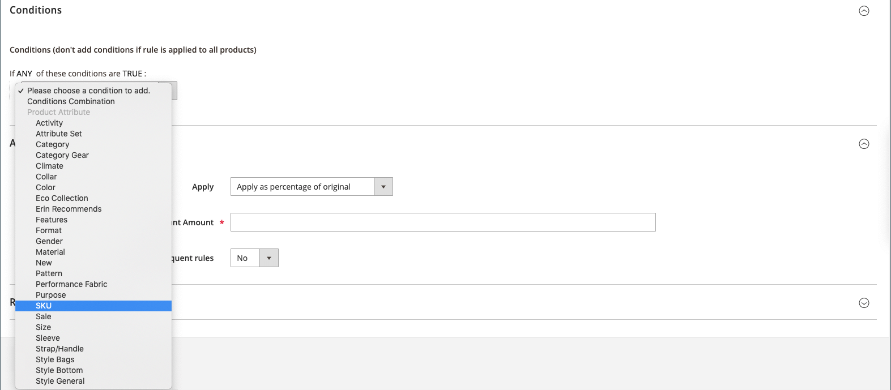
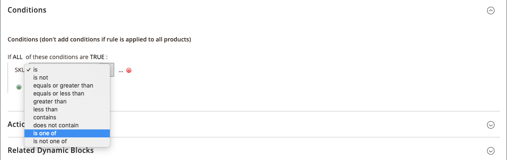

# Règle de prix de catalogue avec plusieurs SKU

Une seule règle de prix de catalogue peut être appliquée à plusieurs SKU, ce qui permet de créer différentes promotions basées sur un produit, une marque ou une catégorie. Lors de la création de cette règle, vous devez définir des conditions correspondant aux SKU sélectionnés. Lors de la création de la règle, vous pouvez facilement parcourir et sélectionner des SKU à partir de la grille.

## Étape 1. Vérifier les propriétés storefront de l’attribut de produit

Avant de commencer, assurez-vous que les [Propriétés du storefront](../catalog/attribute-product-create.md#step-4-describe-the-storefront-properties) de l’attribut `sku` sont définies sur `Use in Promo Rules`.

1. Dans la barre latérale _Admin_, accédez à **[!UICONTROL Stores]** > _[!UICONTROL Attributes]_>**[!UICONTROL Product]**.

1. Dans le filtre de recherche en haut de la colonne _[!UICONTROL Attribute Code]_, saisissez `sku` et cliquez sur **[!UICONTROL Search]**.

1. Cliquez pour ouvrir l’attribut `sku` en mode d’édition.

1. Dans le panneau de gauche, cliquez sur **[!UICONTROL Storefront Properties]** et assurez-vous que **[!UICONTROL Use for Promo Rule Conditions]** est défini sur `Yes`.

1. Si vous avez modifié la valeur de la propriété, cliquez sur **[!UICONTROL Save Attribute]**.

## Étape 2. Appliquer une règle de prix à plusieurs SKU

1. Dans la barre latérale _Admin_, accédez à **[!UICONTROL Marketing]** > _[!UICONTROL Promotions]_>**[!UICONTROL Catalog Price Rules]**.

1. Effectuez l’une des opérations suivantes :

   - Suivez les instructions pour créer une [&#x200B; règle de prix de catalogue &#x200B;](price-rules-catalog.md).
   - Ouvrez une règle de prix de catalogue existante.

1. Développez  la section **[!UICONTROL Conditions]**, puis procédez comme suit :

   - Dans la première ligne, définissez le premier paramètre sur `ANY`.

     {width="600" zoomable="yes"}

   - Cliquez sur _Ajouter_ () au début de la ligne suivante et dans la liste sous **[!UICONTROL Product Attribute]**, cliquez sur `SKU`.

     {width="600" zoomable="yes"}

   - Pour la comparaison, vous disposez d’options. Si vous souhaitez en localiser au moins un à partir d’une liste de SKU, `select is one of`. Si vous souhaitez localiser un groupe de SKU qui doivent tous être appliqués, sélectionnez `is`. Nous vous recommandons de sélectionner `is one of`.

     {width="600" zoomable="yes"}

   - Pour remplir la condition, cliquez sur le lien Plus (**...**) et cliquez sur l’icône _Sélecteur_ () pour afficher la liste des produits disponibles.

     {width="600" zoomable="yes"}

   - Parcourez, filtrez ou recherchez les SKU à ajouter. Dans la liste, cochez la case de chaque produit à inclure.

   - Cliquez sur **[!UICONTROL Save and Apply]** pour ajouter les SKU à la condition.

     {width="600" zoomable="yes"}

1. Renseignez la règle, y compris les [actions](price-rules-catalog.md) à entreprendre une fois les conditions remplies.

1. Une fois la règle terminée, cliquez sur **[!UICONTROL Save]**.

{{new-price-rule}}
