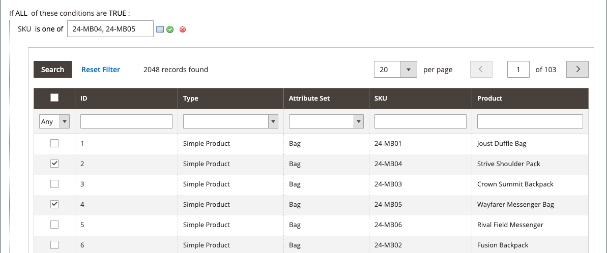

# Règle de prix du catalogue avec plusieurs SKU

Une règle de prix de catalogue unique peut être appliquée à plusieurs SKU, ce qui permet de créer diverses promotions en fonction d’un produit, d’une marque ou d’une catégorie. Lors de la création de cette règle, vous souhaitez définir des conditions qui correspondent aux SKU sélectionnés. Lors de la création de la règle, vous pouvez facilement parcourir et sélectionner des SKU dans la grille.

## Étape 1. Vérification des propriétés storefront de l’attribut de produit

Avant de commencer, assurez-vous que la variable [Propriétés Storefront](../catalog/attribute-product-create.md#step-4-describe-the-storefront-properties) de `sku` sont définis sur `Use in Promo Rules`.

1. Sur le _Administration_ barre latérale, accédez à **[!UICONTROL Stores]** > _[!UICONTROL Attributes]_>**[!UICONTROL Product]**.

1. Dans le filtre de recherche situé en haut de la page _[!UICONTROL Attribute Code]_colonne, saisissez `sku` et cliquez sur **[!UICONTROL Search]**.

1. Cliquez pour ouvrir la `sku` en mode d’édition.

1. Dans le panneau de gauche, cliquez sur **[!UICONTROL Storefront Properties]** et assurez-vous que la variable **[!UICONTROL Use for Promo Rule Conditions]** est défini sur `Yes`.

1. Si vous avez modifié la valeur de la propriété, cliquez sur **[!UICONTROL Save Attribute]**.

## Étape 2. Appliquer une règle de prix à plusieurs SKU

1. Sur le _Administration_ barre latérale, accédez à **[!UICONTROL Marketing]** > _[!UICONTROL Promotions]_>**[!UICONTROL Catalog Price Rules]**.

1. Effectuez l’une des opérations suivantes :

   - Suivez les instructions pour créer une [règle de prix du catalogue](price-rules-catalog.md).
   - Ouvrez une règle de prix de catalogue existante.

1. Développer  la valeur **[!UICONTROL Conditions]** et procédez comme suit :

   - Dans la première ligne, définissez le premier paramètre sur `ANY`.

     {width="600" zoomable="yes"}

   - Cliquez sur _Ajouter_ () au début de la ligne suivante et dans la liste sous **[!UICONTROL Product Attribute]**, cliquez sur `SKU`.

     {width="600" zoomable="yes"}

   - Pour la comparaison, vous disposez d’options. Si vous souhaitez trouver au moins un SKU dans une liste, `select is one of`. Si vous souhaitez localiser un groupe de SKU qui doivent tous être trouvés pour application, sélectionnez `is`. Nous vous recommandons de sélectionner `is one of`.

     {width="600" zoomable="yes"}

   - Pour remplir la condition, cliquez sur le bouton plus (**..**), puis cliquez sur le lien _Sélecteur_ () pour la liste des produits disponibles.

     {width="600" zoomable="yes"}

   - Parcourez, filtrez ou recherchez les SKU à ajouter. Dans la liste, cochez la case de chaque produit à inclure.

   - Cliquez sur **[!UICONTROL Save and Apply]** pour ajouter les SKU à la condition.

     {width="600" zoomable="yes"}

1. Renseignez la règle, y compris toute [Actions](price-rules-catalog.md) à prendre lorsque les conditions sont remplies.

1. Une fois la règle terminée, cliquez sur **[!UICONTROL Save]**.

{{new-price-rule}}
