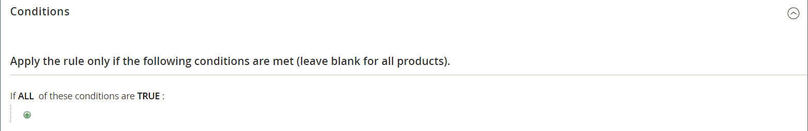

# Exemple de règle de prix de panier - achetez ceci pour obtenir cela

Cet exemple montre comment configurer une [règle de prix de panier](price-rules-cart.md) pour une promotion _Achetez ceci_ gratuite. Le format de la remise est le suivant :

_Acheter X quantité de produit, obtenir Y quantité gratuitement_

## Étape 1. Créer une règle de prix de panier

Complétez [Étape 1](price-rules-cart.md) des instructions de règle de prix de panier pour compléter les informations de règle.

## Étape 2. Définition des conditions

Suivez [étape 2](price-rules-cart.md) des instructions du panier pour définir les conditions de la règle de prix. Il s’agit de la première des deux conditions qui peuvent être ajoutées à la règle et qui déterminent à quel moment la règle est déclenchée. Elle peut être basée sur une combinaison des éléments suivants :

- Attributs de produit
- Produits
- Attributs de panier
-  (Adobe Commerce uniquement) Segments clients

Si rien n’est indiqué, la règle est déclenchée pour chaque panier.

{width="600" zoomable="yes"}

## Étape 3. Définition des actions

1. Développez  la section **[!UICONTROL Actions]** et procédez comme suit :

   - Définissez **[!UICONTROL Apply]** sur `Buy X get Y free (_[!UICONTROL _[!UICONTROL Discount Amount]_]_ is Y)`.

   - Définissez **[!UICONTROL Discount Amount]** sur `1`. Il s&#39;agit de la quantité que le client reçoit gratuitement.

   - Pour limiter le nombre de remises qui peuvent être appliquées lorsque la condition est remplie, saisissez le nombre dans le champ **[!UICONTROL Maximum Qty Discount is Applied To]**. Il est calculé à l’aide de cette [formule](#maximum-quantity-discount).

   - Par **[!UICONTROL Discount Qty Step (Buy X)]**, saisissez la quantité que le client doit acheter pour bénéficier de la remise. Dans cet exemple, le client doit en acheter trois.

   - Si vous souhaitez empêcher l&#39;application d&#39;autres remises à l&#39;achat, définissez **[!UICONTROL Discard subsequent rules]** sur `Yes`.

   {width="600" zoomable="yes"}

1. Pour appliquer la règle uniquement à des articles spécifiques du panier, remplissez la condition pour décrire les articles du panier et/ou les attributs de produit requis pour la promotion.

   L’exemple suivant utilise le SKU pour appliquer la règle à toutes les variations associées d’un produit configurable.

   {width="600" zoomable="yes"}

1. Pour inclure **[!UICONTROL Free Shipping]**, choisissez `For matching items only`.

1. Cliquez sur **[!UICONTROL Save and Continue Edit]** et effectuez le reste de la règle selon vos besoins.

## Étape 4. Compléter le libellé

Suivez [étape 4](price-rules-cart.md) des instructions de la règle de prix du panier pour saisir le libellé qui s’affiche lors du passage en caisse.

## Étape 5 : enregistrer et tester la règle

{{new-price-rule}}

1. Une fois la règle terminée, cliquez sur **[!UICONTROL Save Rule]**.

1. Testez la règle pour vous assurer qu’elle fonctionne correctement.

## Variations

Buy X Get Y Free est traité comme une seule action, avec une dépendance _total de ligne_. Tous les éléments doivent provenir du même SKU pour pouvoir bénéficier de la promotion. Par exemple :

Acheter X quantité de produit de catégorie A, obtenir Y quantité du même produit gratuitement.

Pour limiter le produit libre aux catégories A, B et C, définissez l’action comme suit :

Si TOUTES ces conditions sont VRAIES :
Catégorie : A, B, C

Pour limiter les articles gratuits de n’importe quelle catégorie (A, B ou C) et recevoir Y des SKU (D123, E123 ou F123), définissez l’action comme suit :

Si TOUTES ces conditions sont VRAIES :
SKU est l’un des D123, E123, F123.

## Remise sur quantité maximale

Utilisez la formule suivante pour déterminer la valeur correcte de la remise Qté maximale :

Formule = `(X+Y) * (M/Y)`
Où
`X` = nombre d’articles achetés
`Y` = nombre d’articles gratuits
`M` = Nombre maximal d’articles gratuits autorisé

Par exemple :

Achetez cinq et obtenez deux articles gratuits avec un maximum de quatre articles gratuits autorisés.

    Où
    X = 5
    Y = 2
    M = 4
    Remise Qté Maximale = (5+2)*(4/2)=(7)*(2)=14

Achetez cinq et obtenez trois articles gratuits avec un maximum de neuf articles gratuits autorisés.

    Où
    X = 5
    Y = 3
    M = 9
    Remise Qté Maximale = (5+3)*(9/3)=24

Achetez 20 et obtenez deux articles gratuits avec un maximum de 20 articles gratuits autorisés.

    Où
    X = 20
    Y = 2
    M = 20
    Remise Qté Maximale = (20+2)*(20/2)=(22)*(10)=220
