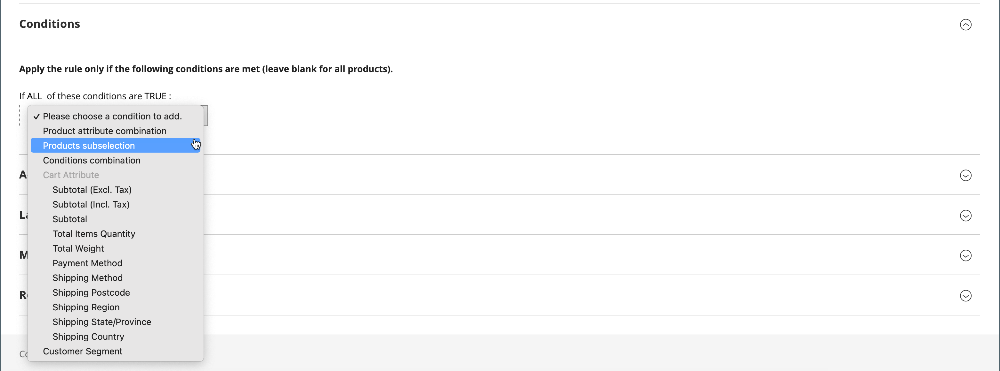
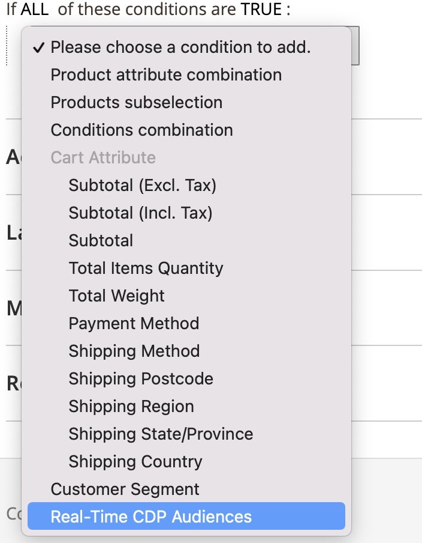
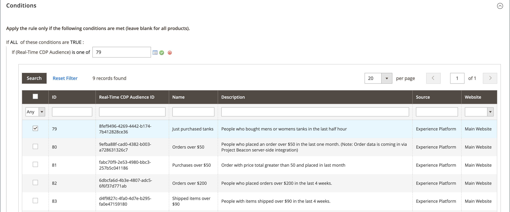

# Créer une règle de prix de panier

Pour ajouter une règle, décrire les conditions et définir les actions, procédez comme suit. Complétez également les libellés et testez la règle. Les conditions des règles de prix peuvent être basées sur les attributs de panier ou de produit [attributs de produit](../catalog/product-attributes.md) ou les [audiences Real-Time CDP](#use-real-time-cdp-audiences-to-set-a-condition), mais pas sur les [options personnalisables](../catalog/settings-advanced-custom-options.md).

## Étape 1 : ajouter une règle

1. Dans la barre latérale _Admin_, accédez à **[!UICONTROL Marketing]** > _[!UICONTROL Promotions]_>**[!UICONTROL Cart Price Rules]**.

1. Cliquez sur **[!UICONTROL Add New Rule]** et procédez comme suit :

   - Sous _[!UICONTROL Rule Information]_, complétez les **[!UICONTROL Rule Name]**&#x200B;et les **[!UICONTROL Description]**.

   - Si vous ne souhaitez pas que la règle entre en vigueur immédiatement, définissez **[!UICONTROL Active]** sur `No`.

   {width="600" zoomable="yes"}

1. Pour établir la [portée](../getting-started/websites-stores-views.md#scope-settings) de la règle, procédez comme suit :

   - Sélectionnez le **[!UICONTROL Websites]** où la promotion doit être disponible.

   - Sélectionnez le **[!UICONTROL Customer Groups]** auquel la promotion s’applique.

     Si vous souhaitez que la promotion ne soit disponible que pour les clients enregistrés, **_ne le faites pas_** sélectionnez l’option `NOT LOGGED IN`.

1. Définissez la règle à appliquer avec ou sans [coupon](price-rules-cart-coupon.md) comme suit :

   - Pour appliquer la règle de panier sans utiliser de code de coupon, définissez **[!UICONTROL Coupon]** sur `No Coupon` et passez à l’étape 5.

   - Pour associer un coupon à une règle de prix, définissez **[!UICONTROL Coupon]** sur `Specific Coupon` et procédez comme suit :

      - Saisissez un **[!UICONTROL Coupon Code]** de texte libre que le client doit saisir pour recevoir la remise.

      - Pour limiter le nombre de fois où le coupon peut être utilisé, effectuez les options suivantes :

     | Option | Description |
     |------|-----------|
     | `Uses per Coupon` | Détermine le nombre de fois où le code coupon peut être utilisé. S’il n’y a pas de limite, laissez le champ vide. |
     | `Uses per Customer` | Détermine le nombre de fois où la règle de prix du panier peut être utilisée par le même client enregistré qui appartient à l’un des groupes de clients sélectionnés. Le paramètre ne s’applique pas aux clients invités qui sont membres du groupe de clients NON CONNECTÉS ni aux clients qui effectuent des achats sans se connecter à leur compte. S’il n’y a pas de limite, laissez le champ vide. |

     {style="table-layout:auto"}

     Pour en savoir plus, voir [Codes promotionnels](price-rules-cart-coupon.md).

     {width="600" zoomable="yes"}

   -  (Magento Open Source uniquement) Utilisez l’icône _Calendrier_ () pour choisir la période **[!UICONTROL From]** et **[!UICONTROL To]** de la promotion.

1. Entrez un nombre pour définir la **[!UICONTROL Priority]** de cette règle de prix par rapport aux paramètres Action des autres règles de prix actives en même temps.

   Lorsque plusieurs règles de panier ou coupons s’appliquent au même produit, la règle ayant la priorité la plus élevée (nombre le plus faible) est appliquée en premier. Les règles de même priorité ne se combinent pas ; elles s’appliquent séparément en fonction de l’identifiant de la règle. Pour contrôler l&#39;ordre dans lequel les remises sont appliquées, affectez des priorités uniques et envisagez d&#39;utiliser la [Règles de prix de remises suivantes](#step-3-define-the-actions) dans l&#39;étape Actions pour empêcher le cumul des remises.

1. Pour appliquer la règle aux [flux RSS](social-rss.md#rss-feeds) publiés, définissez **Public dans le flux RSS** sur `Yes`.

1. Cliquez sur **[!UICONTROL Save and Continue Edit]**.

   -  (Magento Open Source uniquement) Une fois la règle enregistrée, le nom de la règle de prix de panier s’affiche en haut de la page.

   -  (Adobe Commerce uniquement) Une fois la règle enregistrée, le nom de la règle de prix du panier et la zone [Modifications planifiées](price-rule-cart-scheduled-changes.md) s’affichent en haut de la page.

     {width="600" zoomable="yes"}

## Étape 2 : Décrire les conditions

>[!NOTE]
>
>Si vous utilisez des audiences de Real-Time CDP, passez à [cette section](#use-real-time-cdp-audiences-to-set-a-condition).

Au cours de cette étape, les conditions qui doivent être remplies pour qu’une commande soit admissible à la promotion sont décrites. Les conditions affectent les règles de prix de panier de la manière suivante :

- La règle de prix du panier est appliquée à **_chaque_** produit du panier chaque fois que l’ensemble des conditions de l’onglet _[!UICONTROL Conditions]_&#x200B;est rempli. Pour limiter le nombre de produits affectés par la règle de prix de panier, ajoutez des conditions dans l’onglet&#x200B;_[!UICONTROL Actions]_ pour limiter le nombre de produits affectés par la règle de prix de panier.

- Si au moins un attribut de produit conditionnel possède une valeur vide, la règle de prix de panier n’est pas appliquée au produit.

1. Dans le panneau de gauche, sélectionnez **[!UICONTROL Conditions]**.

   {width="600" zoomable="yes"}

   La première condition apparaît par défaut et stipule :

   `If **ALL** of these conditions are **TRUE**:`

   L&#39;instruction comporte deux liens en gras sur lesquels vous pouvez cliquer pour afficher la sélection d&#39;options pour cette partie de l&#39;instruction. Vous pouvez créer différentes conditions en modifiant la combinaison de ces valeurs. Effectuez l’une des opérations suivantes :

   - Cliquez sur **[!UICONTROL ALL]** et sélectionnez `ALL` ou `ANY`.
   - Cliquez sur **[!UICONTROL TRUE]** et sélectionnez `TRUE` ou `FALSE`.
   - Laissez la condition inchangée pour appliquer la règle à tous les produits.

1. Cliquez sur _Ajouter_ () au début de la ligne suivante et sélectionnez une option pour la condition, telle que l’attribut du panier, la sous-sélection de produits ou une combinaison.

   Pour cet exemple, renseignez la partie suivante de la condition comme suit :

   - Lorsque vous êtes invité à **[!UICONTROL Choose the condition to add]**, choisissez `Products Subselection`.

     {width="600" zoomable="yes"}

   - Dans l’instruction de condition, cliquez sur **[!UICONTROL total quantity]** et sélectionnez `total quantity` ou `total amount`.

   >[!IMPORTANT]
   >
   >[!UICONTROL Total amount] est un total de ligne. Les taxes ne sont donc pas incluses dans le `total amount` pour la condition de règle de prix de panier [!UICONTROL Products Subselection]. Utilisez la condition [!UICONTROL Subtotal (Incl. Tax)] pour inclure les taxes.

   - Dans l’instruction de condition, cliquez sur **[!UICONTROL is]** et sélectionnez `greater than`.

1. Lorsque la partie suivante de la condition apparaît, cliquez sur les éléments de l&#39;instruction pour voir où se trouve chaque lien avec des valeurs de variable.

1. Cliquez sur le lien « plus » (...), puis saisissez `100`.

   Cette condition nécessite que la quantité totale du panier soit `101` ou supérieure.

   {width="600" zoomable="yes"}

1. Cliquez sur **Ajouter** () au début de la ligne suivante, puis ajoutez une condition basée sur **Catégorie**.

   {width="600" zoomable="yes"}

1. Dans la partie suivante de la condition, cliquez sur le lien _plus_ (**...**) pour afficher le champ de saisie, puis ouvrez le _Sélecteur_ () pour afficher l’arborescence des catégories.

1. Cochez la case de la catégorie que vous souhaitez utiliser comme condition pour la règle de prix et cliquez sur l’icône  pour accepter les sélections de catégorie.

   La condition peut être basée sur n’importe quelle catégorie enfant de la [catégorie racine](../catalog/category-root.md) du magasin.

   {width="600" zoomable="yes"}

1. Pour ajouter d’autres conditions, cliquez sur _Ajouter_ () et définissez une autre condition.

   Vous pouvez répéter le processus autant de fois que nécessaire pour décrire les conditions qui doivent être remplies pour la règle de prix. Voici quelques exemples :

   **Exemple 1 : Règle de prix régionale**

   Pour créer une règle de prix régionale, utilisez l’un des attributs de panier suivants :

   - `Shipping Postcode`
   - `Shipping Region`
   - `Shipping State/Province`
   - `Shipping Country`

   **Exemple 2 : Totaux** Panier

   Pour baser la condition sur les totaux des paniers, utilisez l’un des attributs de panier suivants :

   - `Subtotal`
   - `Total Items Quantity`
   - `Total Weight`

>[!NOTE]
>
>Dans le cas de plusieurs promotions parallèles, la condition _Sous-total_ est appliquée au sous-total _base_ du panier **_avant_** toutes les remises.

>[!IMPORTANT]
>
>**Pour les commandes fournisseur uniquement** : lorsqu&#39;une règle de prix de panier est définie en fonction d&#39;un ou de plusieurs modes de paiement spécifiques, la remise est appliquée au total lors de la création d&#39;une commande fournisseur. Une fois la commande fournisseur créée, la remise reste appliquée au total si le mode de paiement est remplacé par un mode qui n&#39;est pas couvert par la règle de prix du panier.

### Ajout d’un attribut de produit aux règles de prix de panier

1. Accédez à **[!UICONTROL Stores]** > _[!UICONTROL Attributes]_>**[!UICONTROL Product]**&#x200B;et ouvrez l’attribut de produit.

1. Dans le panneau de gauche, sélectionnez **[!UICONTROL Storefront Properties]**.

1. Définissez **[!UICONTROL Use for Promo Rule Conditions]** sur `Yes`.

1. Cliquez sur **[!UICONTROL Save Attribute]**.

1. Accédez à **[!UICONTROL Marketing]** > **[!UICONTROL Cart Price Rules]** et ouvrez la règle de prix de panier requise.

1. Développez  la section **[!UICONTROL Condition]** et sélectionnez **[!UICONTROL Product attribute combination]**.

1. Définissez cette condition sur l’une des valeurs suivantes :

   - Cliquez sur **[!UICONTROL FOUND]** et sélectionnez `FOUND` ou `NOT FOUND`.

   - Cliquez sur **[!UICONTROL ALL]** et sélectionnez `ALL` ou `ANY`.

1. Cliquez sur l’icône _Ajouter_ () et sélectionnez l’**[!UICONTROL Product Attribute]** que vous avez configuré pour les conditions des règles promotionnelles.

1. Cliquez sur **[!UICONTROL Save]**.

>[!NOTE]
>
>Lors de l’utilisation de la condition de `is not one of` avec un attribut de produit _SKU_ et un produit configurable, les SKU du produit parent et enfant doivent être sélectionnés. Pour éviter de répertorier tous les SKU enfants dans la règle, vous pouvez utiliser la condition de `does not contain` avec les composants SKU communs d’un produit configurable et de ses produits enfants.

### Utilisation des audiences Real-Time CDP pour définir une condition

Vous pouvez définir une condition pour une règle de prix de panier basée sur une Real-Time CDP [audience](../customers/audience-activation.md).

1. Développez **[!UICONTROL Conditions]**, cliquez sur l’icône « + », puis sélectionnez **[!UICONTROL Real-Time CDP Audience]** dans la liste.

   {width="300"}

1. Sélectionnez l’icône _Plus_ (**...**), cliquez sur **[!UICONTROL Open Chooser]**, puis affichez toutes les audiences Real-Time CDP disponibles.

   {width="600" zoomable="yes"}

1. Sélectionnez l’audience Real-Time CDP à utiliser pour la règle de prix de panier.

   | Option | Description |
   |------|-----------|
   | `ID` | Identifiant interne de l’audience utilisé par l’administrateur |
   | `Real-Time CDP Audience ID` | Identifiant unique de l’audience lors de sa création dans Experience Platform |
   | `Name` | Nom de l’audience, par exemple `Orders over $50` |
   | `Description` | Description de l’audience, par exemple `People who placed an order over $50 in the last month.`. |
   | `Source` | Indique l’origine de l’audience, par exemple `Experience Platform`. |
   | `Website` | Indique le site web que vous avez lié au flux de données contenant les audiences. Vous créez ce lien lorsque vous connectez votre instance Commerce à Experience Platform par le biais de l’extension [[!DNL Data Connection]](https://experienceleague.adobe.com/docs/commerce/data-connection/fundamentals/connect-data.html?lang=fr). |

   {style="table-layout:auto"}

À l’étape suivante, vous définissez l’action à effectuer lorsque la condition est remplie.

## Étape 3 : définir les actions

Les actions de règle de prix de panier décrivent la manière dont les prix sont mis à jour lorsque les conditions sont remplies.

1. Faites défiler jusqu’à **[!UICONTROL Actions]**, puis développez  la section.

   {width="600" zoomable="yes"}

1. Définissez **[!UICONTROL Apply]** sur l’une des options de remise suivantes :

   | Option | Description |
   |------|-----------|
   | `Percent of product price discount` | Remise l&#39;article en soustrayant un pourcentage du prix initial. La remise s’applique à chaque article admissible du panier. Par exemple : saisissez `10` en [!UICONTROL Discount Amount] pour un prix mis à jour qui est 10 % inférieur au prix d’origine. |
   | `Fixed amount discount` | Escompte un article en soustrayant un montant fixe du prix d&#39;origine de chaque article admissible dans le panier. Par exemple : saisissez `10` en [!UICONTROL Discount Amount] pour un prix mis à jour inférieur de 10 $ au prix d’origine. |
   | Remise fixe pour l’ensemble du panier | Réduit l’ensemble du panier en soustrayant un montant fixe du total du panier. Par exemple : saisissez 10 dans [!UICONTROL Discount Amount] pour soustraire 10 $ du total du panier. Par défaut, la remise s’applique uniquement au sous-total du panier. Pour appliquer la remise au sous-total et à l&#39;expédition séparément, utilisez l&#39;option _[!UICONTROL Apply to Shipping Amount]_. |
   | `Buy X get Y free` | Définit une quantité X que le client doit acheter pour recevoir gratuitement une quantité Y **du même produit/**. (La [!UICONTROL Discount Amount] est Y.) Une quantité totale de X+Y du même article doit être présente dans/ajoutée au panier pour que la remise soit appliquée. |

   {style="table-layout:auto"}

   - Pour appliquer des remises à montant fixe de manière cohérente sur tous les sites Web avec différentes devises (sans effectuer de conversion à partir de la devise de base globale), définissez l&#39;option **[!UICONTROL Catalog Price Scope]** sur `Website` et définissez une devise de base pour chaque site.

   - Saisissez le **[!UICONTROL Discount Amount]** sous la forme d’un nombre, sans symboles. Par exemple, en fonction de l&#39;option de remise sélectionnée, le nombre 10 peut indiquer un pourcentage, un montant fixe ou une quantité d&#39;articles.

   - Pour une remise _Acheter X obtenir Y Gratuit_, saisissez la quantité dans le champ **[!UICONTROL Discount Qty Step (Buy X)]** d&#39;un seul produit/SKU/article de ligne que le client doit acheter pour recevoir la remise sur la quantité Y. X et Y font tous deux référence à des quantités du même SKU, et cette quantité spécifique (les variations d’un produit configurable sont comptabilisées séparément) de l’article doit être ajoutée manuellement au panier.

   - Dans le champ **[!UICONTROL Maximum Qty Discount is Applied To]** , saisissez la quantité maximale du même produit pouvant bénéficier de la remise pour le même achat.

   - Définissez **[!UICONTROL Apply to Shipping Amount]** () comme suit :

     | Option | Description |
     |------|-----------|
     | `Yes` | Applique le montant de la remise séparément au sous-total et aux montants d&#39;expédition. |
     | `No` | Applique le montant de la remise uniquement au sous-total. |

     {style="table-layout:auto"}

   - Pour arrêter le traitement d’autres règles après l’application de cette règle, définissez **[!UICONTROL Discard Subsequent Rules]** () sur `Yes`. Ce paramètre empêche l’application de plusieurs remises au même produit.

     | Option | Description |
     |------|-----------|
     | `Yes` | Empêche l’application de toute autre règle de tarification pouvant s’appliquer à un produit. Lorsque plusieurs règles de tarification s’appliquent au même produit, seule la règle de tarification ayant la priorité définie la plus élevée (dans un champ de [!UICONTROL Priority] de règle) est appliquée au produit éligible. Cela empêche l’empilement de plusieurs règles de tarification et l’octroi involontaire de remises supplémentaires. |
     | `No` | Permet d’appliquer plusieurs règles de tarification au même produit. Cela peut entraîner un cumul et l&#39;octroi de plusieurs remises appliquées au prix de votre annonce. |

     {style="table-layout:auto"}

     >[!IMPORTANT]
     >
     >Pour ignorer les règles suivantes, une règle de tarification doit utiliser les priorités définies dans le champ Priorité de chaque règle et plusieurs règles ne doivent pas avoir la même priorité définie . Voir **[!UICONTROL Priority]** à l’étape _Ajouter une nouvelle règle_.

1. Pour définir les produits **_exacts_** du panier qui sont affectés par la règle de prix de panier, ajoutez les conditions **_supplémentaires_** nécessaires à l’action.

   Pour déterminer si la livraison gratuite est appliquée aux commandes qui remplissent les conditions, définissez **[!UICONTROL Free Shipping]** sur l’une des options suivantes :

   | Option | Description |
   |------|-----------|
   | `No` | La livraison gratuite n&#39;est pas disponible. |
   | `For matching items only` | La livraison gratuite est disponible uniquement pour les articles qui correspondent aux conditions de la règle. |
   | `For shipment with matching items` | La livraison gratuite est disponible pour toute expédition qui inclut des objets correspondants. La méthode de livraison [Livraison gratuite](../stores-purchase/shipping-free.md) doit être activée pour utiliser cette option. |

   {style="table-layout:auto"}

1.  (Adobe Commerce uniquement) Par **[!UICONTROL Add Rewards Points]**, saisissez le nombre fixe de points que le client gagne **_une fois_** par commande chaque fois que la règle de prix du panier est appliquée.

   Si les points de récompense ne sont pas activés, laissez ce champ vide.

1. Cliquez ensuite sur **[!UICONTROL Save and Continue Edit]**.

## Étape 4 : remplir les étiquettes

Le libellé apparaît dans la section Totaux de la commande pour identifier la remise. Le texte du libellé est placé entre parenthèses, après le mot `Discount`. Vous pouvez saisir un libellé par défaut pour toutes les vues de magasin ou saisir un libellé différent pour chaque vue.

{width="600"}

1. Faites défiler jusqu’à **[!UICONTROL Labels]**, puis développez  la section.

1. Saisissez le texte à utiliser comme **[!UICONTROL Default Rule Label for All Store Views]**.

   {width="600" zoomable="yes"}

1. Si votre boutique comporte plusieurs vues ou plusieurs sites web avec plusieurs vues, saisissez le texte d’étiquette approprié pour chacune d’elles.

   Par exemple, si chaque vue du magasin est dans une langue différente, saisissez la traduction du libellé de chaque vue.

   {width="600" zoomable="yes"}

## Étape 5 : ajouter des blocs dynamiques associés (facultatif)

{{ee-feature}}

Les [blocs dynamiques](../content-design/dynamic-blocks.md) associés à la règle apparaissent dans le storefront chaque fois que les conditions sont remplies.

1. Développez  la section **[!UICONTROL Related Dynamic Blocks]** .

1. Utilisez les [filtres de recherche](../getting-started/admin-workspace.md) pour localiser les blocs que vous souhaitez associer à la règle.

1. Cochez la case de la première colonne pour associer le bloc à la règle.

   Pour en savoir plus, voir [Blocs dynamiques dans les règles de prix](../content-design/dynamic-blocks-price-rules.md).

## Étape 6 : enregistrer et tester la règle

1. Cliquez ensuite sur **[!UICONTROL Save Rule]**.

1. Testez la règle pour vous assurer qu’elle fonctionne correctement.

   Les règles de prix sont automatiquement traitées avec d&#39;autres règles système chaque nuit. Lorsque vous créez une règle de prix, laissez suffisamment de temps pour qu’elle entre dans le système. Testez également la règle pour vous assurer qu’elle fonctionne correctement. À mesure que de nouvelles règles sont ajoutées, Commerce recalcule les prix et les priorités en conséquence.

## Démonstration des règles de prix du panier

Regardez cette vidéo pour en savoir plus sur la création de règles de prix de panier :

>[!VIDEO](https://video.tv.adobe.com/v/3410804?quality=12&learn=on&captions=fre_fr)

## Descriptions des champs

### [!UICONTROL Rule Information]

| Champ | Description |
|--- |--- |
| [!UICONTROL Rule Name] | (Obligatoire) Le nom de la règle est utilisé à des fins de référence interne. |
| [!UICONTROL Description] | Une description de la règle doit inclure l’objectif de la règle et expliquer comment elle est utilisée. |
| [!UICONTROL Active] | (Obligatoire) Détermine si la règle est active dans le magasin. Options : `Yes` / `No` |
| [!UICONTROL Websites] | (Obligatoire) Identifie les sites Web où la règle peut être utilisée. |
| [!UICONTROL Customer Groups] | (Obligatoire) Identifie les groupes de clients auxquels la règle s’applique. |
| [!UICONTROL Coupon] | (Obligatoire) Indique si un coupon est associé à la règle. Options :  **[!UICONTROL No Coupon]**- Aucun coupon n’est associé à la règle. **[!UICONTROL Specific Coupon]** - Un coupon spécifique est associé à la règle.  **[!UICONTROL Coupon Code]**- Lorsque vous y êtes invité, saisissez le code promotionnel que le client doit entrer pour bénéficier de la promotion. **[!UICONTROL Use Auto Generation]** - Cochez la case pour générer automatiquement plusieurs codes de coupon qui peuvent être utilisés avec la promotion.  **[!UICONTROL Auto]**- Affiche la section _[!UICONTROL Manage Coupon Codes]_&#x200B;pour définir le format des codes coupon à générer. |
| [!UICONTROL Uses per Coupon] | Détermine le nombre de fois où le code coupon peut être utilisé. S’il n’y a pas de limite, laissez le champ vide. |
| [!UICONTROL Uses per Customer] | Détermine le nombre de fois où la règle de prix du panier peut être utilisée par le même client enregistré qui appartient à un groupe de clients sélectionné. Ne s’applique pas aux acheteurs invités qui sont membres du groupe de clients NON CONNECTÉS ni aux clients qui achètent sans se connecter à leurs comptes. Pour aucune limite, laissez vide. |
| [!UICONTROL Priority] | Nombre qui indique la priorité de cette règle par rapport aux autres. Les priorités du plus haut au plus bas sont `0,1,2,3...` |
| [!UICONTROL Public in RSS Feed] | Détermine si la promotion est incluse dans le flux RSS public de votre boutique. Options :  `Yes` / `No` |
| [!UICONTROL From] |  (Magento Open Source uniquement) Première date à laquelle le coupon peut être utilisé. |
| [!UICONTROL To] |  (Magento Open Source uniquement) Dernière date à laquelle le coupon peut être utilisé. |

{style="table-layout:auto"}

### [!UICONTROL Conditions]

Spécifie les conditions qui doivent être remplies avant que la règle de prix de panier ne soit activée. Si rien n’est indiqué, la règle s’applique à tous les produits du panier. Les conditions peuvent être basées sur n’importe quelle combinaison d’attributs de panier et de produit. Toutefois, les [options personnalisables](../catalog/settings-advanced-custom-options.md) ne peuvent pas être référencées dans les conditions des règles de prix de panier.

| Champ | Description |
|--- |--- |
| [!UICONTROL **Attribut d’élément de panier**] |  |
| [!UICONTROL Price in cart] | Prix du produit. La règle s’applique si le prix du produit dans la condition de panier est rempli. |
| [!UICONTROL Quantity in cart] | Quantité de produit. La règle s’applique si la quantité de produit dans la condition de panier est remplie. |
| [!UICONTROL Row total in cart] | Total de la ligne de produits. La règle s’applique si le total de la ligne de produit dans la condition de panier est satisfait. |
| [!UICONTROL **Attribut du produit**] |  |
| [!UICONTROL Attribute Set] | Attribut de produit défini. La règle s’applique si le produit répond à la condition d’attribut de produit. |
| [!UICONTROL Category/Other attribute] | Catégorie de produits/autre attribut. La règle s’applique si le produit lui-même ou les enfants remplissent la condition de catégorie/autre attribut. L’attribut doit avoir [!UICONTROL Use for Promo Rule Conditions] défini sur `Yes`. |
| [!UICONTROL Category/Other attribute (Children Only)] | Catégorie de produits enfant/autre attribut. La règle s’applique si seuls les enfants du produit remplissent la condition de catégorie/autre attribut (le produit lui-même n’est pas coché ici). L’attribut doit avoir [!UICONTROL Use for Promo Rule Conditions] à `Yes`. |
| [!UICONTROL Category/Other attribute (Parent Only)] | Catégorie de produit parent/autre attribut. La règle s’applique si seul le produit lui-même répond à la condition de catégorie/autre attribut (les produits enfants ne sont pas cochés ici). L’attribut doit avoir [!UICONTROL Use for Promo Rule Conditions] défini sur `Yes`. |
| [!UICONTROL **Attribut de panier**] |  |
| [!UICONTROL Subtotal (Excl. Tax)] | Sous-total du panier (hors taxes). La règle s&#39;applique si le panier remplit la condition de sous-total (hors taxe). |
| [!UICONTROL Subtotal (Incl. Tax)] | Sous-total du panier (taxes comprises). La règle s&#39;applique si le panier remplit la condition de sous-total (taxes comprises). |
| [!UICONTROL Subtotal] | Sous-total du panier. La règle s&#39;applique si le panier remplit une condition de sous-total. Vérifiez que la taxe inclut ou exclut la taxe en fonction des paramètres de taxe actuels. |
| [!UICONTROL Total Items Quantity] | Quantité totale de tous les produits du panier. La règle s&#39;applique si le panier remplit une condition de quantité totale d&#39;articles. |
| [!UICONTROL Total Weight] | Poids total de tous les produits du panier. La règle s’applique si le panier remplit la condition de poids total. |
| [!UICONTROL Payment Method] | Mode de paiement sélectionné lors du passage en caisse. La règle s&#39;applique si la condition du mode de paiement est remplie. |
| [!UICONTROL Shipping Method] | Mode d’expédition sélectionné lors du passage en caisse. La règle s’applique si la condition du mode d’expédition est remplie. |
| [!UICONTROL Shipping Postcode] | Code postal de l’adresse d’expédition. La règle s’applique si l’adresse d’expédition remplit la condition de code postal. |
| [!UICONTROL Shipping Region] | Région de l’adresse d’expédition. La règle s’applique si l’adresse d’expédition remplit la condition de région. |
| [!UICONTROL Shipping State/Province] | Adresse d’expédition État/province. La règle s’applique si l’adresse de livraison répond à la condition État/Province. |
| [!UICONTROL Shipping Country] | Pays de l’adresse d’expédition. La règle s’applique si l’adresse d’expédition répond à la condition du pays. |
| [!UICONTROL Customer Segment] | La règle s’applique si un client enregistré ou invité remplit la condition de segment client. |

### [!UICONTROL Actions]

| Champ | Description |
|--- |--- |
| [!UICONTROL Apply] | Détermine le type de calcul appliqué à l&#39;achat. Options :  **[!UICONTROL Percent of product price discount]**- Article avec remises en soustrayant un pourcentage du prix d&#39;origine. Par exemple : saisissez `10` en _[!UICONTROL Discount Amount]_&#x200B;pour un prix mis à jour qui est 10 % inférieur au prix d’origine. **[!UICONTROL Fixed amount discount]**- Escompte un article en soustrayant un montant fixe du prix d&#39;origine de chaque article admissible dans le panier. Par exemple : saisissez `10` en&#x200B;_[!UICONTROL Discount Amount]_ pour un prix mis à jour inférieur de 10 $ au prix d’origine.  **[!UICONTROL Fixed amount discount for whole cart]**- Réduit l’ensemble du panier en soustrayant un montant fixe du sous-total du panier. Par exemple : saisissez `10` dans _[!UICONTROL Discount Amount]_&#x200B;pour soustraire 10 $ du sous-total du panier. Par défaut, la remise s’applique uniquement au sous-total du panier. Pour appliquer la remise au sous-total et à l&#39;expédition séparément, voir_Appliquer au montant de l&#39;expédition _. **[!UICONTROL Buy X Get Y Free (discount amount is Y)]**- Définit une quantité que le client doit acheter pour recevoir une quantité gratuitement. (La&#x200B;_[!UICONTROL Discount Amount]_ est Y.) |
| [!UICONTROL Discount Amount] | (Obligatoire) Montant de la remise proposée. |
| [!UICONTROL Maximum Qty Discount is Applied To] | Définit le nombre maximal de produits auxquels la remise peut être appliquée au cours du même achat. |
| [!UICONTROL Discount Qty Step (Buy X)] | Définit le nombre de produits représentés par des `X` dans une promotion `Buy X Get Y Free`. Définit également le nombre de produits qui doivent être ajoutés au panier par lots pour appliquer des promotions `Fixed amount discount` et `Percent of product price discount`. |
| [!UICONTROL Apply to Shipping Amount] | Détermine si la remise est appliquée séparément au sous-total et aux montants d&#39;expédition. Sinon, elle est appliquée uniquement au sous-total. Options : `Yes` / `No` |
| [!UICONTROL Discard Subsequent Rules] | Détermine si des règles de priorité inférieure (1 est la priorité la plus élevée) peuvent être appliquées au produit lorsque cette règle de prix de panier correspond. Activez cette option pour empêcher l’application de plusieurs remises au même produit. Options : `Yes` / `No` |
| [!UICONTROL Free Shipping] | Détermine si la livraison gratuite est incluse dans la promotion et, le cas échéant, pour quels articles. Options :  **[!UICONTROL No]**- La livraison gratuite n&#39;est pas disponible pour la règle actuelle. **[!UICONTROL For matching items only]** - La livraison gratuite est disponible uniquement pour des articles spécifiques du panier qui correspondent à la règle.  **[!UICONTROL For shipment with matching items]**- La livraison gratuite est disponible pour tous les articles du panier. La méthode de livraison [Livraison gratuite](../stores-purchase/shipping-free.md) doit être activée pour utiliser cette option. |
| [!UICONTROL Add Reward Points] |  (Adobe Commerce uniquement) Indique le nombre de [points de récompense](rewards-loyalty.md) gagnés par le client à chaque application de la règle de prix. |

{style="table-layout:auto"}

### [!UICONTROL Labels]

| Champ | Description |
|--- |--- |
| [!UICONTROL Default Rule Label for All Store Views] | Libellé par défaut qui identifie la remise et peut être utilisé pour toutes les vues de magasin. |
| [!UICONTROL Store View Specific Labels] | Le cas échéant, spécifie un libellé différent pour identifier la remise pour chaque vue de magasin. |

{style="table-layout:auto"}

### [!UICONTROL Related Dynamic Blocks]

{{ee-feature}}

Identifie tout [bloc dynamique](../content-design/dynamic-blocks.md) associé à la règle.
