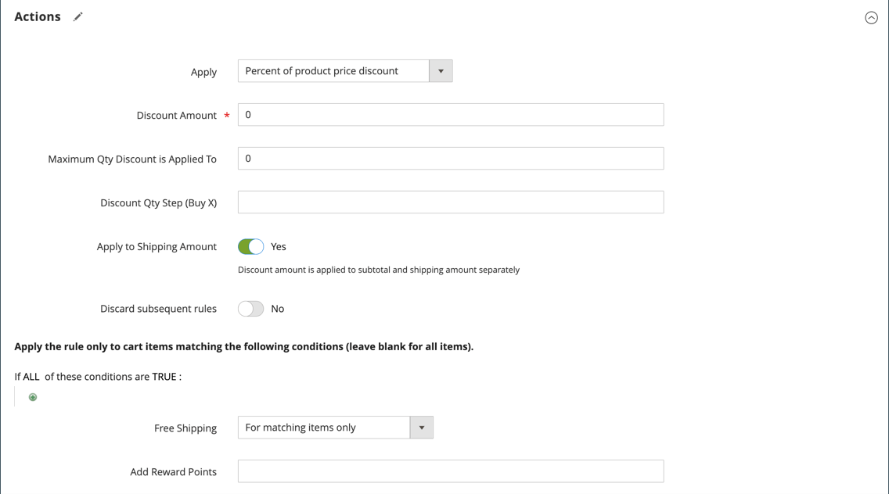

# Exemple de règle de prix de panier - promotion de livraison gratuite

La livraison gratuite peut être proposée sous forme de promotion, avec ou sans [coupon](price-rules-cart-coupon.md). Un bon de livraison gratuit, ou bon, peut également être appliqué aux commandes de retrait du client, de sorte que la commande puisse être facturée et expédiée pour terminer le [workflow](../stores-purchase/order-processing.md#order-workflow-and-processing).

Certaines configurations de transporteur vous donnent la possibilité d&#39;offrir la livraison gratuite en fonction d&#39;une commande minimale. Pour développer cette fonctionnalité de base, vous pouvez utiliser les règles de prix de panier afin de créer des conditions complexes basées sur plusieurs attributs de produit, contenus de panier et groupes de clients.

## Étape 1. Activer la livraison gratuite

1. Activez la [livraison gratuite](../stores-purchase/shipping-free.md) dans la configuration de votre boutique.

1. Complétez les paramètres d&#39;expédition gratuite pour tout [service de transporteur](../stores-purchase/carriers.md) que vous souhaitez utiliser pour l&#39;expédition gratuite.

## Étape 2. Créer une règle de prix de panier

Dans la barre latérale _Admin_, accédez à **[!UICONTROL Marketing]** > _[!UICONTROL Promotions]_>**[!UICONTROL Cart Price Rules]**.

Suivez les étapes ci-dessous pour configurer le type de promotion d’expédition gratuite que vous souhaitez offrir.

### Exemple 1 : Livraison gratuite pour toute commande

1. Effectuez la **[!UICONTROL Rule Information]** comme suit :

   - Saisissez un **[!UICONTROL Rule Name]** pour référence interne.
   - Saisissez un bref **[!UICONTROL Description]** pour décrire la règle.
   - Définissez **[!UICONTROL Active]** sur `Yes`.
   - Dans la boîte de **[!UICONTROL Websites]**, sélectionnez chaque site où le bon de livraison gratuit sera disponible.
   - Sélectionnez le **[!UICONTROL Customer Groups]** auquel la règle s’applique.
   - Définissez **[!UICONTROL Coupon]** sur l’une des options suivantes :
      - Pour proposer une promotion d’expédition gratuite sans coupon, acceptez le paramètre par défaut (`No Coupon`).
      - Pour utiliser un coupon avec la règle de prix, sélectionnez `Specific Coupon`. Si nécessaire, suivez les instructions pour configurer un [coupon](price-rules-cart-coupon.md).

1. Faites défiler vers le bas et développez  la section **[!UICONTROL Actions]**, puis procédez comme suit :

   - Définissez **[!UICONTROL Apply]** sur `Percent of product price discount`.
   - Définissez **[!UICONTROL Apply to Shipping Amount]** sur `Yes`.
   - Définissez **[!UICONTROL Free Shipping]** sur `For matching items only`.

   {width="600" zoomable="yes"}

### Exemple 2 : Livraison gratuite pour les commandes supérieures à $

1. Renseignez les paramètres de **[!UICONTROL General Information]** comme décrit dans l’exemple précédent.

1. Faites défiler vers le bas et développez  la section **[!UICONTROL Conditions]** .

1. Cliquez sur _Ajouter_ () pour insérer une condition et procédez comme suit :

   - Dans la liste sous **[!UICONTROL Cart Attribute]**, choisissez `Subtotal`.
   - Cliquez sur **[!UICONTROL is]** et choisissez `equals or greater than`.
   - Cliquez sur **...** et saisissez une valeur de seuil pour le sous-total, tel que `100`, afin de remplir la condition.

   {width="600" zoomable="yes"}

1. Si nécessaire, développez  dans la section **[!UICONTROL Actions]** et procédez comme suit :

   - Définissez **[!UICONTROL Apply]** sur `Percent of product price discount`.
   - Définissez **[!UICONTROL Apply to Shipping Amount]** sur `Yes`.
   - Définissez **[!UICONTROL Free Shipping]** sur `For matching items only`.

## Étape 3. Compléter les libellés

Suivez les instructions [étape 4](price-rules-cart.md) de la règle de prix du panier pour saisir les étiquettes qui apparaissent lors du passage en caisse.

## Étape 4. Enregistrer et tester la règle

{{new-price-rule}}

1. Une fois la règle terminée, cliquez sur **[!UICONTROL Save Rule]**.

1. Testez la règle pour vous assurer qu’elle fonctionne correctement.
