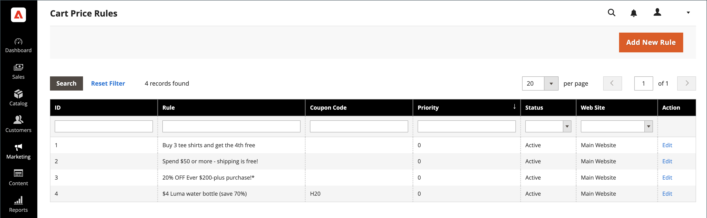

# Règles de prix du panier

Les règles de prix de panier appliquent des remises aux articles du panier, en fonction d’un ensemble de conditions. La remise peut être appliquée automatiquement lorsque les conditions sont remplies ou lorsque le client saisit un code de coupon valide. Lorsqu’elle est appliquée, la remise apparaît dans le panier sous le sous-total . Une règle de prix de panier peut être utilisée selon les besoins pour une saison ou une promotion en modifiant son statut et sa période.

>[!NOTE]
>
>Si la règle de panier de coupons comporte des conditions qui spécifient des options de passage en caisse, telles que certains modes d’expédition ou de paiement, les conditions ne sont remplies que lors du passage en caisse une fois les modes d’expédition/de paiement spécifiques sélectionnés. Dans ce cas, le coupon peut être appliqué lors du passage en caisse à la dernière étape.

{width="600" zoomable="yes"}

## Accéder aux règles de prix de panier

1. Dans la barre latérale _Admin_, accédez à **[!UICONTROL Marketing]** > _[!UICONTROL Promotions]_>**[!UICONTROL Cart Price Rules]**.

   {width="700" zoomable="yes"}

1. Si vous disposez de nombreuses règles, utilisez les options de filtre en haut de chaque colonne pour rationaliser la liste, puis cliquez sur **[!UICONTROL Search]** pour appliquer les filtres.

1. Pour effacer toutes les options de filtrage et afficher la liste complète, cliquez sur **[!UICONTROL Reset Filter]**.

1. Mettez à jour les propriétés d’une règle :

   -  (Adobe Commerce uniquement) Cliquez sur **[!UICONTROL Edit]** pour afficher la page Informations sur la règle.

   -  (Magento Open Source uniquement) Cliquez sur la règle dans la liste pour afficher la page Informations sur la règle.

   Vous pouvez y modifier les paramètres de la règle (comme pour la création d’une règle).

## Filtrer les options par colonne

| Colonne | Description |
|--- |--- |
| [!UICONTROL ID] | Saisissez du texte pour filtrer la liste pour un numéro d’ID de règle spécifique. |
| [!UICONTROL Rule] | Saisissez du texte pour filtrer la liste en fonction du nom de règle défini lors de la création de la règle. |
| [!UICONTROL Coupon Code] | Saisissez du texte pour filtrer la liste en fonction du nom de code défini lors de la création de la règle. |
| [!UICONTROL Priority] | Champ de texte libre qui filtre la liste en fonction de la priorité définie pour une règle. |
| [!UICONTROL Status] | Utilisez cette option pour filtrer la liste en fonction du statut de la règle (`Active` ou `Inactive`). |
| [!UICONTROL Web Site] | Utilisez cette option pour filtrer la liste en fonction des sites web définis pour une règle. |
| [!UICONTROL Action] |  (Adobe Commerce uniquement) Cliquez sur **[!UICONTROL Edit]** pour afficher la page _[!UICONTROL Rule Information]_et mettre à jour les paramètres des règles (comme pour la création d’une règle). |
| [!UICONTROL Start] |  (Magento Open Source uniquement) Utilisez les champs de calendrier dynamique (_[!UICONTROL To:]_et_[!UICONTROL From:]_) pour filtrer la liste en fonction de la date de début de la règle telle que définie lors de la création de la règle. |
| [!UICONTROL End] |  (Magento Open Source uniquement) Utilisez les champs de calendrier dynamique (_[!UICONTROL To:]_et_[!UICONTROL From:]_) pour filtrer la liste en fonction de la date de fin de la règle telle que définie lors de la création de la règle. |

{style="table-layout:auto"}

## Utilisation des audiences Real-Time CDP pour informer les règles de prix de panier

Découvrez comment [activer](../customers/audience-activation.md) les audiences Real-Time CDP dans votre instance Adobe Commerce pour informer les règles de prix de panier.
