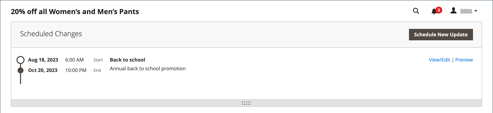

# Créer une règle de prix de catalogue

Suivez ces instructions pour appliquer une remise à des produits spécifiques chaque fois qu’un ensemble de conditions est satisfait. Les remises des règles de prix du catalogue entrent en vigueur avant que le produit ne soit placé dans le panier.

## Étape 1 : Ajouter une règle

1. Sur la barre latérale _Admin_, accédez à **[!UICONTROL Marketing]** > _[!UICONTROL Promotions]_>**[!UICONTROL Catalog Price Rule]**.

1. Dans le coin supérieur droit, cliquez sur **[!UICONTROL Add New Rule]**.

   La section _[!UICONTROL Rule Information]_comprend des sections extensibles pour **[!UICONTROL Conditions]**et **[!UICONTROL Actions]**.

   {width="700" zoomable="yes"}

1. Renseignez les champs **[!UICONTROL Rule Name]** et **[!UICONTROL Description]** .

   Ces champs sont réservés à votre référence interne.

1. Définissez la **[!UICONTROL Status]** de la règle de prix selon vos besoins.

   Par défaut, l’état est `Inactive`.

   >[!NOTE]
   >
   >Une fois la règle créée, son état peut être mis à jour en définissant l’état sur `Active` ou `Inactive` si nécessaire.

1. Sélectionnez l’ **[!UICONTROL Websites]** où la règle doit être disponible.

1. Sélectionnez le **[!UICONTROL Customer Groups]** auquel s&#39;applique cette règle.

   Pour sélectionner plusieurs groupes, maintenez la touche Ctrl (PC) ou la touche Commande (Mac) enfoncée, puis cliquez sur chaque option.

   >[!NOTE]
   >
   >Les options de cette liste dépendent des groupes de clients créés et gérés dans _Customers_ > _Customer Groups_.

1.  (Magento Open Source uniquement) Saisissez les dates **[!UICONTROL From]** et **[!UICONTROL To]** pour déterminer le moment où la règle de prix est en vigueur.

   Vous pouvez saisir les dates ou utiliser l’**[!UICONTROL Calendar]** () pour choisir les dates. Si vous laissez les dates vides, la règle est activée lors de l’enregistrement de la règle de prix.

1. Saisissez un nombre afin d’établir la **[!UICONTROL Priority]** de cette règle par rapport aux autres règles.

   >[!NOTE]
   >
   >Le paramètre _[!UICONTROL Priority]_est important lorsque le même produit de catalogue répond aux conditions définies pour plusieurs règles de prix. La règle avec le paramètre de priorité le plus élevé (1 étant le plus élevé) devient active pour le produit.

## Etape 2 : définir les conditions

La plupart des conditions disponibles sont basées sur des valeurs d’attribut existantes. Pour appliquer la règle à tous les produits, laissez les conditions vides.

>[!NOTE]
>
>Si au moins un attribut de produit conditionnel a une valeur vide, la règle de prix du catalogue n’est pas appliquée au produit.

>[!NOTE]
>
>Pour appliquer une condition d’attribut de produit `Category` à un [bundle](../catalog/product-create-bundle.md) ou [groupé](../catalog/product-create-grouped.md), tous les produits enfants doivent être affectés à la même catégorie pour que la règle s’applique correctement. Dans le cas contraire, vous pouvez utiliser une promotion [Règle de prix du panier](price-rules-cart-create.md) à la place.

1. Faites défiler l’écran vers le bas et développez la section  sur **[!UICONTROL Conditions]** .

   La première condition s’affiche par défaut et indique :

   `If **ALL** of these conditions are **TRUE**:`

   {width="400"}

   L’instruction comporte deux liens en gras sur lesquels vous pouvez cliquer pour afficher la sélection des options de cette partie de l’instruction. Vous pouvez créer différentes conditions en modifiant la combinaison de ces valeurs.

1. Modifiez l’instruction de l’une des manières suivantes :

   - Cliquez sur **[!UICONTROL ALL]** et sélectionnez `ALL` ou `ANY`.
   - Cliquez sur **[!UICONTROL TRUE]** et sélectionnez `TRUE` ou `FALSE`.
   - Ne modifiez pas la condition pour appliquer la règle à tous les produits.

   Vous pouvez créer différentes conditions en modifiant la combinaison de ces valeurs. Dans cet exemple, la condition par défaut est utilisée.

1. Cliquez sur l’icône _Ajouter_ () au début de la ligne suivante et sélectionnez une option pour la condition, telle qu’un attribut de produit ou une combinaison.

1. Dans la liste sous **[!UICONTROL Product Attribute]**, sélectionnez l’attribut que vous souhaitez utiliser comme base de la condition.

   Pour cet exemple, la condition est `Attribute Set`.

   {width="400"}

   >[!NOTE]
   >
   >Pour qu’un attribut apparaisse dans la liste, il doit être configuré pour être utilisé dans les conditions des règles promotionnelles. Pour en savoir plus, voir [Attributs de produit](../catalog/product-attributes.md).

   >[!NOTE]
   >
   >Lors de l’utilisation de la condition `is not one of` avec un attribut de produit _SKU_ et un produit configurable, les SKU du produit parent et enfant doivent être sélectionnés. Pour éviter de répertorier tous les SKU enfants dans la règle, vous pouvez utiliser la condition `does not contain` avec les parties SKU communes d’un produit configurable et de ses produits enfants.

   La condition sélectionnée s’affiche dans l’instruction, suivie de deux autres liens en gras. Les options diffèrent selon l’attribut de condition que vous sélectionnez. La déclaration dit maintenant :

   `If **ALL** of these conditions are **TRUE**:  Attribute Set **is** …`

1. Cliquez sur **[!UICONTROL is]** et sélectionnez l’opérateur de comparaison qui décrit la condition à remplir.

   Ces options peuvent inclure une option pour différentes comparaisons. Dans cet exemple, les options sont `is` et `is not`.

1. Sélectionnez ou saisissez des valeurs pour la condition.

   Selon la condition, vous pouvez sélectionner des produits dans une grille ou une liste, saisir une valeur numérique, etc.

   {width="400"}

   L’élément sélectionné apparaît dans l’instruction pour remplir la condition.

   `If **ALL** of these conditions are **TRUE**:   Attribute Set **is Default**`

1. Pour ajouter une autre ligne de condition à l’instruction, cliquez sur l’icône _Ajouter_ () et sélectionnez l’une des options suivantes :

   - `Conditions Combination`
   - `Product Attribute`

   Répétez le processus jusqu’à ce que toutes les conditions souhaitées soient remplies.

   Si vous souhaitez supprimer une partie de l’instruction de condition, cliquez sur l’icône **[!UICONTROL Delete]** ( à la fin de la ligne.

## Etape 3 : définir les actions

1. Développez la section  de **[!UICONTROL Actions]** et procédez comme suit :

   {width="600" zoomable="yes"}

1. Sous **[!UICONTROL Pricing Structure Rules]**, définissez **[!UICONTROL Apply]** sur l’une des options suivantes :

   - `Apply as percentage of original` - Article de réduction en soustrayant un pourcentage du prix normal. Par exemple : saisissez 10 dans Montant de remise pour un prix final qui est marqué à 10 % par rapport au prix normal.
   - `Apply as fixed amount` - Article de réduction en soustrayant un montant fixe du prix normal. Par exemple : saisissez 10 dans Montant de remise pour un prix final qui est 10 $ de moins que le prix normal.
   - `Adjust final price to this percentage` - Ajuste le prix final d’un pourcentage du prix normal. Par exemple : saisissez 25 dans Montant de remise pour un prix final qui est marqué à 75 % par rapport au prix normal.
   - `Adjust final price to discount value` - Définit le prix final sur un montant fixe et actualisé. Par exemple : saisissez 20 dans Montant de remise pour un prix final de 20,00 $.

   >[!NOTE]
   >
   >_Prix régulier_ fait référence au prix de base du produit sans tarif avancé (prix spécial/niveau/groupe) ni remises promotionnelles. _Prix final_ fait référence au prix réduit qui apparaît dans le panier d’achat.  Le prix du produit **_final_** est calculé comme le prix **_minimum_** approprié, à l&#39;aide de la formule suivante :  `Final Price=Min(Regular(Base) Price, Group(Tier) Price, Special Price, Catalog Price Rule) + Sum(Min Price per each required custom option)`

   >[!NOTE]
   >
   >Les options personnalisables du produit **_Prix fixe_** sont _non_ affectées par les règles de prix de groupe, de niveau, de prix spécial ou de catalogue.

1. Saisissez le **[!UICONTROL Discount Amount]**.

1. Pour arrêter le traitement d’autres règles après l’application de cette règle, définissez **[!UICONTROL Discard Subsequent Rules]** sur `Yes`.

   >[!NOTE]
   >
   >La définition de cette valeur sur `Yes` est une protection qui empêche le système d’appliquer plusieurs remises (règles) au même produit.

## Étape 4 : Ajout de blocs dynamiques associés

{{ee-feature}}

[Les blocs dynamiques](../content-design/dynamic-blocks.md) associés à une règle de prix de catalogue apparaissent dans le storefront chaque fois que les conditions sont remplies. Il s’agit d’une étape facultative.

1. Développez la section sur **[!UICONTROL Related Dynamic Blocks]** .

1. Utilisez les [filtres de recherche](../getting-started/admin-workspace.md) pour localiser les blocs dynamiques que vous souhaitez associer à la règle.

1. Cochez la case dans la première colonne pour associer le bloc dynamique à la règle.

   {width="600" zoomable="yes"}

1. Cliquez sur **[!UICONTROL Save and Continue Edit]**.

## Étape 5 : Planification de la règle

{{ee-feature}}

>[!NOTE]
>
>La définition de la règle sur active doit être ajoutée en tant que mise à jour planifiée. Pour en savoir plus, voir [Modifications planifiées](price-rule-catalog-scheduled-changes.md).

1. Dans la zone _Modifications planifiées_, cliquez sur **[!UICONTROL Schedule New Update]** en haut de la zone).

   Si la règle comporte une mise à jour planifiée existante, vous pouvez cliquer sur **[!UICONTROL View/Edit]** à droite de la modification répertoriée.

   Vous pouvez soit modifier la mise à jour existante, soit attribuer la règle de prix du catalogue à une autre campagne. L’option **Modifier la mise à jour existante** est sélectionnée par défaut.

1. Pour planifier la règle, saisissez les **[!UICONTROL Start Date]** et **[!UICONTROL End Date]** que la règle de prix doit être active.

   Vous pouvez saisir les dates ou choisir les dates dans le _calendrier_ ().

   {width="600" zoomable="yes"}

1. Cliquez sur **[!UICONTROL Save]**.

1. Dans la section _Informations sur la règle_, définissez **[!UICONTROL Status]** sur `active`.

## Étape 6 : enregistrer et tester la règle

1. Une fois la règle terminée, enregistrez-la.

   -  (Magento Open Source uniquement) Cliquez sur **[!UICONTROL Save and Apply]**.

   -  (Adobe Commerce uniquement) Cliquez sur **[!UICONTROL Save]**.

     La page Informations sur les règles affiche une chronologie mise à jour dans les Modifications planifiées de la règle.

     {width="600" zoomable="yes"}

1. Mettez à jour les propriétés d’une règle :

   -  (Adobe Commerce uniquement) Cliquez sur **[!UICONTROL Edit]** pour afficher la page _[!UICONTROL Rule Information]_.

   -  (Magento Open Source uniquement) Cliquez sur la règle dans la liste pour afficher la page _[!UICONTROL Rule Information]_.

1. Testez la règle pour vous assurer qu’elle fonctionne correctement.

   Les règles de prix sont automatiquement traitées avec d’autres règles système chaque nuit. Lorsque vous créez une règle de prix, laissez suffisamment de temps pour qu’elle entre dans le système avant de la tester pour s’assurer qu’elle fonctionne correctement. A mesure que de nouvelles règles sont ajoutées, Commerce recalcule les prix et les priorités en conséquence.

## Démonstration de la règle de prix du catalogue

Regardez cette vidéo pour en savoir plus sur la création de règles de prix de catalogue :

>[!VIDEO](https://video.tv.adobe.com/v/343834?quality=12)

## Descriptions des champs

### [!UICONTROL Rule Information]

| Champ | Description |
|-----|-----------|
| [!UICONTROL Rule name] | (Obligatoire) Le nom de la règle est à titre de référence interne. |
| [!UICONTROL Description] | Une description de la règle doit inclure l’objet de la règle et expliquer comment elle est utilisée. |
| [!UICONTROL Websites] | (Obligatoire) Identifie les sites web sur lesquels la règle peut être utilisée. |
| [!UICONTROL Customer Groups] | (Obligatoire) Identifie les groupes de clients auxquels s’applique la règle. |
| [!UICONTROL Priority] | Un nombre qui indique la priorité de cette règle par rapport aux autres. La priorité la plus élevée est le numéro 1. |
| [!UICONTROL Status] |  (Magento Open Source uniquement) Détermine si la règle est active dans le magasin. Options : `Yes` / `No` |
| [!UICONTROL From] |  (Magento Open Source uniquement) Indique le premier jour où la règle de prix est en vigueur. Si rien n’est indiqué, la règle de prix entre en vigueur lorsqu’elle est enregistrée. |
| [!UICONTROL To] |  (Magento Open Source uniquement) Indique le dernier jour où la règle de prix est en vigueur. Si rien n’est indiqué, la règle de prix continue indéfiniment. |

{style="table-layout:auto"}

### [!UICONTROL Conditions]

Indique les conditions qui doivent être remplies avant que la règle de prix du catalogue ne prenne effet. Si rien n’est indiqué, la règle s’applique à tous les produits.

### [!UICONTROL Actions]

| Champ | Description |
|-----|-----------|
| [!UICONTROL Apply] | Détermine le type de calcul appliqué à l’achat. Options :  **[!UICONTROL Apply as percentage of original]**- article de remise en soustrayant un pourcentage du prix normal. **[!UICONTROL Apply as fixed amount]** - Article de réduction en soustrayant un montant fixe du prix normal.  **[!UICONTROL Adjust final price to this percentage]**- Ajuste le prix final d’un pourcentage du prix normal. **[!UICONTROL Adjust final price to discount value]** - Définit le prix final sur un montant fixe et actualisé.   **_Remarque :_**Le prix régulier fait référence au prix de base du produit sans aucune remise promotionnelle (prix spécial/niveau/groupe) ou promotionnelle. Le prix final fait référence au prix réduit qui apparaît dans le panier.  Le prix du produit**_final _**est calculé comme le prix**_minimum _**approprié, à l&#39;aide de la formule suivante :  `Final Price=Min(Regular(Base) Price, Group(Tier) Price, Special Price, Catalog Price Rule) + Sum(Min Price per each required custom option)` |
| [!UICONTROL Discount Amount] | (Obligatoire) Montant de la remise proposée. |
| [!UICONTROL Discard Subsequent Rules] | Détermine si des règles supplémentaires peuvent être appliquées à cet achat. Pour empêcher que plusieurs remises ne soient appliquées au même achat, sélectionnez `Yes`. Options : `Yes` / `No` |

{style="table-layout:auto"}

### [!UICONTROL Related Dynamic Blocks]

{{ee-feature}}

Identifie tous les [blocs dynamiques](../content-design/dynamic-blocks.md) associés à la règle.
