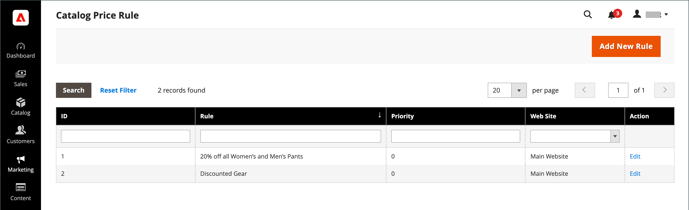

# Règles de prix de catalogue

Les règles de prix de catalogue peuvent être utilisées pour proposer des produits aux acheteurs à un prix réduit, en fonction d’un ensemble de conditions définies. Les règles de prix de catalogue n’utilisent pas de [codes coupon](price-rules-cart-coupon.md), car elles sont déclenchées avant le placement d’un produit dans le panier.

Par exemple, vous pouvez définir et définir les conditions d&#39;une règle de prix qui, lorsqu&#39;elle est remplie, affiche automatiquement les produits avec un prix spécial ou promotionnel. Les propriétés de règle définies peuvent inclure des groupes de clients, des catégories de produits, un montant ou un pourcentage de remise, la couleur du produit, la taille du produit ou n’importe quel attribut de produit configuré dans votre boutique. Vous pouvez définir des dates de début et de fin pour une règle de prix qui démarrent et arrêtent automatiquement une promotion aux dates que vous définissez dans la règle. Les propriétés d’une règle enregistrée peuvent être mises à jour ou modifiées selon les besoins.

-  (Adobe Commerce uniquement) Vous pouvez également lier une règle définie à un [bloc dynamique](../content-design/dynamic-blocks.md) afin de promouvoir l’événement ou le produit dans votre boutique.

-  (Magento Open Source uniquement) Pour les promotions récurrentes, vous pouvez définir manuellement une règle enregistrée sur le statut _Actif_ ou _Inactif_ chaque fois que vous souhaitez exécuter la promotion.

## Accéder aux règles de prix de catalogue

1. Dans la barre latérale _Admin_, accédez à **[!UICONTROL Marketing]** > _[!UICONTROL Promotions]_>**[!UICONTROL Catalog Price Rules]**.

   {width="700" zoomable="yes"}

1. Mettez à jour les propriétés d’une règle :

   -  (Adobe Commerce uniquement) Cliquez sur **[!UICONTROL Edit]** pour afficher la page _Informations sur les règles_.

   -  (Magento Open Source uniquement) Cliquez sur la règle dans la liste pour afficher la page Informations sur la règle.

   Vous pouvez y modifier les paramètres de la règle (comme pour la [création d’une règle](price-rules-catalog-create.md)).

## Options de filtre

| Champ | Description |
|--- |--- |
| [!UICONTROL ID] | Saisissez du texte pour filtrer la liste pour un numéro d’ID de règle spécifique. |
| [!UICONTROL Rule] | Saisissez du texte pour filtrer la liste en fonction du nom de règle défini lors de la création de la règle. |
| [!UICONTROL Priority] |  (Adobe Commerce uniquement) Saisissez du texte dans ce champ pour filtrer la liste selon la priorité définie pour une règle. |
| [!UICONTROL Web Site] |  (Adobe Commerce uniquement) Utilisez cette option pour filtrer la liste en fonction des sites web définis pour une règle. |
| [!UICONTROL Action] |  (Adobe Commerce uniquement) Cliquez sur **[!UICONTROL Edit]** pour afficher les informations de la règle et mettre à jour les paramètres de la règle (comme pour la création d’une règle). |
| [!UICONTROL Start] |  (Magento Open Source uniquement) Utilisez les champs de calendrier dynamique (Vers : et De :) pour filtrer la liste en fonction de la date de début de la règle telle que définie lors de la création de la règle. |
| [!UICONTROL End] |  (Magento Open Source uniquement) Utilisez les champs de calendrier dynamique (Vers : et De :) pour filtrer la liste en fonction de la date de fin de la règle telle que définie lors de la création de la règle. |
| [!UICONTROL Status] |  (Magento Open Source uniquement) Utilisez cette option pour filtrer la liste en fonction du statut de la règle (`Active` ou `Inactive`). |

{style="table-layout:auto"}
