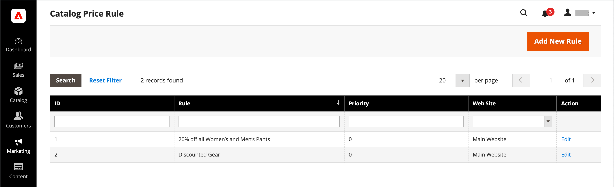

# Règles de prix du catalogue

Les règles de prix du catalogue peuvent être utilisées pour offrir des produits à des acheteurs à un prix réduit, en fonction d’un ensemble de conditions définies. Les règles de prix du catalogue n’utilisent pas [codes de coupon](price-rules-cart-coupon.md), car elles sont déclenchées avant qu’un produit ne soit placé dans le panier.

Par exemple, vous pouvez définir et définir les conditions d’une règle de prix qui, lorsqu’elle est respectée, affiche automatiquement les produits avec un prix spécial ou promotionnel. Les propriétés de règle définies peuvent inclure des groupes de clients, des catégories de produits, un pourcentage ou un montant de remise, la couleur du produit, la taille du produit ou à peu près n’importe quel attribut de produit configuré dans votre boutique. Vous pouvez définir des dates de début et de fin pour une règle de prix qui démarre et arrête automatiquement une promotion aux dates que vous définissez dans la règle. Les propriétés d’une règle enregistrée peuvent être mises à jour ou modifiées si nécessaire.

-  (Adobe Commerce uniquement) Vous pouvez également lier une règle définie à une [bloc dynamique](../content-design/dynamic-blocks.md) pour promouvoir l’événement ou le produit dans votre boutique.

-  (Magento Open Source uniquement) Pour les promotions récurrentes, vous pouvez définir manuellement une règle enregistrée sur _Actif_ ou _Inactif_ à chaque fois que vous souhaitez exécuter la promotion.

## Accès aux règles de prix du catalogue

1. Sur le _Administration_ barre latérale, accédez à **[!UICONTROL Marketing]** > _[!UICONTROL Promotions]_>**[!UICONTROL Catalog Price Rules]**.

   {width="700" zoomable="yes"}

1. Mettez à jour les propriétés d’une règle :

   -  (Adobe Commerce uniquement) Cliquez sur **[!UICONTROL Edit]** pour afficher la variable _Informations sur la règle_ page.

   -  (Magento Open Source uniquement) Cliquez sur la règle dans la liste pour afficher la page Informations sur la règle .

   Vous pouvez y modifier les paramètres de la règle (comme [création d’une règle](price-rules-catalog-create.md)).

## Options de filtre

| Champ | Description |
|--- |--- |
| [!UICONTROL ID] | Entrez du texte pour filtrer la liste en fonction d’un numéro d’ID de règle spécifique. |
| [!UICONTROL Rule] | Saisissez le texte pour filtrer la liste en fonction du nom de la règle défini lors de sa création. |
| [!UICONTROL Priority] |  (Adobe Commerce uniquement) Saisissez du texte dans ce champ pour filtrer la liste selon la priorité définie pour une règle. |
| [!UICONTROL Web Site] |  (Adobe Commerce uniquement) Utilisez cette option pour filtrer la liste en fonction des sites web définis pour une règle. |
| [!UICONTROL Action] |  (Adobe Commerce uniquement) Cliquez sur **[!UICONTROL Edit]** pour afficher les informations sur la règle et mettre à jour les paramètres de la règle (comme pour créer une règle). |
| [!UICONTROL Start] |  (Magento Open Source uniquement) Utilisez les champs du calendrier dynamique (A : et De :) pour filtrer la liste en fonction de la date de début de la règle, telle que définie lors de la création de la règle. |
| [!UICONTROL End] |  (Magento Open Source uniquement) Utilisez les champs du calendrier dynamique (A : et De :) pour filtrer la liste en fonction de la date de fin de la règle, telle que définie lors de la création de la règle. |
| [!UICONTROL Status] |  (Magento Open Source uniquement) Utilisez cette option pour filtrer la liste en fonction de l’état de la règle (`Active` ou `Inactive`). |

{style="table-layout:auto"}

## Ressources de dépannage

Pour obtenir de l’aide sur la résolution des problèmes liés aux règles de prix du catalogue, reportez-vous aux articles suivants de la base de connaissances de l’assistance clientèle de Commerce :

- [404 Erreur au niveau du magasin une fois que la mise à jour des plannings de règles de prix du catalogue est effectuée](https://experienceleague.adobe.com/docs/commerce-knowledge-base/kb/troubleshooting/known-issues-patches-attached/404-error-on-store-front-once-catalog-price-rule-schedules-update-is-performed.html)
- [Amélioration des performances de la page de produits avec les produits associés et les règles cibles.](https://experienceleague.adobe.com/docs/commerce-knowledge-base/kb/support-tools/patches/v1-0-9/mdva-31791-magento-patch-improvement-for-product-page-with-related-products-and-target-rules.html)
- [Les règles de prix du catalogue ne fonctionnent pas](https://experienceleague.adobe.com/docs/commerce-knowledge-base/kb/support-tools/patches/v1-0-14/mdva-24201-magento-patch-catalog-price-rules-don-t-work.html)
- [Calculs des prix GraphQL](https://experienceleague.adobe.com/docs/commerce-knowledge-base/kb/support-tools/patches/v1-0-14/mdva-33975-magento-patch-graphql-price-calculations.html)
