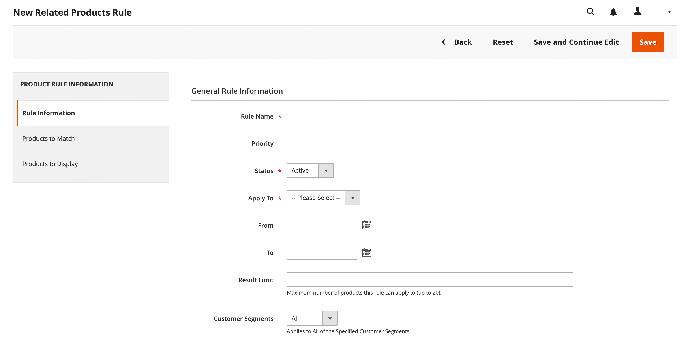
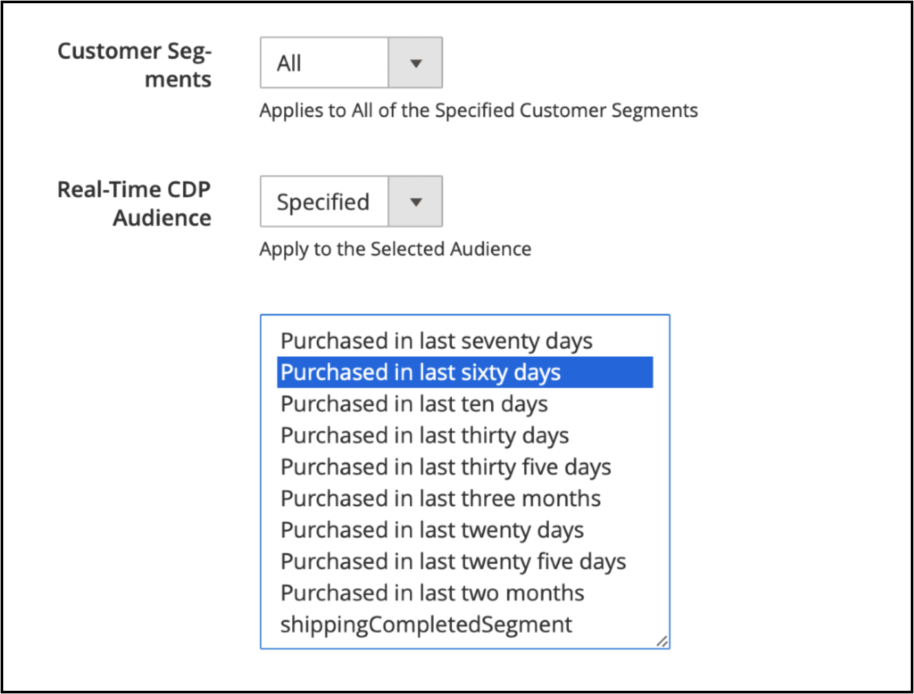
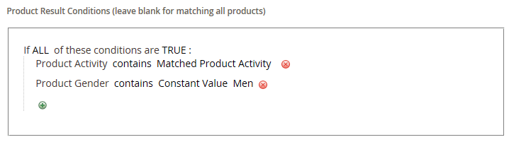

# Créer une règle de produit associée

{{ee-feature}}

Le processus de création d&#39;une règle de produit associée est similaire à la configuration d&#39;une règle de prix. Tout d’abord, définissez les conditions à faire correspondre, puis choisissez les produits à afficher. À tout moment, plusieurs règles actives peuvent être déclenchées pour afficher des produits associés, des ventes incitatives et des ventes croisées. La priorité de chaque règle détermine l’ordre dans lequel le bloc de produits apparaît sur la page.

>[!NOTE]
>
>Pour qu’un attribut soit utilisé dans une règle ciblée, la propriété [_[!UICONTROL Use for Promo Rule Conditions]_](../catalog/product-attributes.md) doit être définie sur `Yes`.

>[!NOTE]
>
>La valeur de portée `All Store Views` est toujours utilisée pour les conditions [!UICONTROL Products to Match] et [!UICONTROL Products to Display] de tous les attributs de produit. Cela s’applique également lorsque les attributs de produit ont des valeurs différentes pour différentes vues de magasin et différents sites web.

## Créer une règle de produit associée

1. Dans la barre latérale _Admin_, accédez à **[!UICONTROL Marketing]** > _[!UICONTROL Promotions]_>**[!UICONTROL Related Product Rules]**.

1. Dans le coin supérieur droit, cliquez sur **[!UICONTROL Add Rule]**.

   {width="600" zoomable="yes"}

1. Effectuez la **[!UICONTROL Rule Information]** comme suit :

   - Saisissez un **[!UICONTROL Rule Name]** pour identifier la règle lorsque vous travaillez dans l’administration.

   - Par **[!UICONTROL Priority]**, saisissez un nombre qui détermine l’ordre dans lequel les résultats apparaissent sur la page lorsque les résultats d’autres règles ciblent le même emplacement. Le numéro `1` est la priorité absolue.

   - Pour activer la règle, définissez **[!UICONTROL Status]** sur `Active`.

   - Définissez **[!UICONTROL Apply To]** sur l’une des options suivantes :

      - `Related Products`
      - `Up-sells`
      - `Cross-sells`

   - Si la règle doit être active pendant une période spécifique, saisissez les dates **[!UICONTROL From]** et **[!UICONTROL To]**.

   - Par **[!UICONTROL Result Limit]**, saisissez le nombre d’enregistrements à afficher dans la liste des résultats. Le nombre maximal est de 20.

   - Si la règle s’applique à un [segment client](../customers/customer-segments.md) spécifique, définissez **[!UICONTROL Customer Segments]** sur `Specified` et choisissez le segment client dans la liste.

   - Si la règle s’applique à une audience [Real-Time CDP spécifique](../customers/audience-activation.md), définissez **[!UICONTROL Real-Time CDP Audience]** sur `Specified` et choisissez l’audience Real-Time CDP dans la liste.

     {width="500"}

1. Dans le panneau de gauche, choisissez **[!UICONTROL Products to Match]** et créez les conditions comme vous le feriez pour une [règle de prix de catalogue](price-rules-catalog.md).

   {width="500"}

1. Dans le panneau de gauche, choisissez **[!UICONTROL Products to Display]** et créez les conditions de résultats comme vous le feriez pour une [règle de prix de catalogue](price-rules-catalog.md).

   {width="500"}

   Renseignez la condition pour décrire les produits que vous souhaitez inclure dans les résultats affichés.

1. Cliquez ensuite sur **[!UICONTROL Save]**.

## Supprimer une règle de produit associée

1. Dans la barre latérale _Admin_, accédez à **[!UICONTROL Marketing]** > _[!UICONTROL Promotions]_>**[!UICONTROL Related Product Rules]**.

1. Recherchez la règle de produit associée à supprimer.

1. Cliquez sur la règle pour ouvrir la page de détails.

1. Dans le coin supérieur droit, cliquez sur **[!UICONTROL Delete]**.

1. Pour confirmer l’action, cliquez sur **[!UICONTROL OK]**.

## Démonstration des règles de produit associé

Regardez cette vidéo pour en savoir plus sur la création de règles de produit associées :

>[!VIDEO](https://video.tv.adobe.com/v/3411062?captions=fre_fr&quality=12&learn=on)

## Descriptions des champs

| Champ | Description |
|--- |--- |
| [!UICONTROL Rule Name] | Nom qui identifie la règle pour une utilisation interne. |
| [!UICONTROL Priority] | Détermine la séquence dans laquelle les résultats de la règle apparaissent lorsqu&#39;ils sont affichés avec d&#39;autres ensembles de résultats qui ciblent le même emplacement sur la page. La valeur peut être définie sur n’importe quel nombre entier, avec la priorité la plus élevée de 1. Par exemple, si plusieurs règles de montée en gamme s’appliquent, celle qui a la priorité la plus élevée apparaît avant les autres. L’ordre de tri des produits dans chaque ensemble de résultats est aléatoire. Les produits de niveau supérieur, les ventes croisées et les produits associés configurés manuellement apparaissent toujours sur la page avant toute promotion de produit basée sur des règles. |
| [!UICONTROL Status] | Contrôle le statut actif de la règle. Options : `Active` / `Inactive` |
| [!UICONTROL Apply To] | Identifie le type de relation de produit associé à la règle. Options : `Related Products` / `Up-sells` / `Cross-sells` |
| [!UICONTROL From Date] | Si la règle est active pendant une période, ce paramètre détermine la première date à laquelle elle est active. |
| [!UICONTROL To Date] | Si la règle est active pendant une période, ce paramètre détermine la dernière date à laquelle elle est active. |
| [!UICONTROL Result Limit] | Détermine le nombre de produits qui apparaissent simultanément dans les résultats. Le nombre maximal est de 20. Si d’autres résultats correspondants sont trouvés, les produits pivotent dans le bloc à chaque actualisation de la page. |
| [!UICONTROL Customer Segments] | Identifie les segments de clients auxquels la règle s’applique. Options : `All` / `Specified` |

{style="table-layout:auto"}
