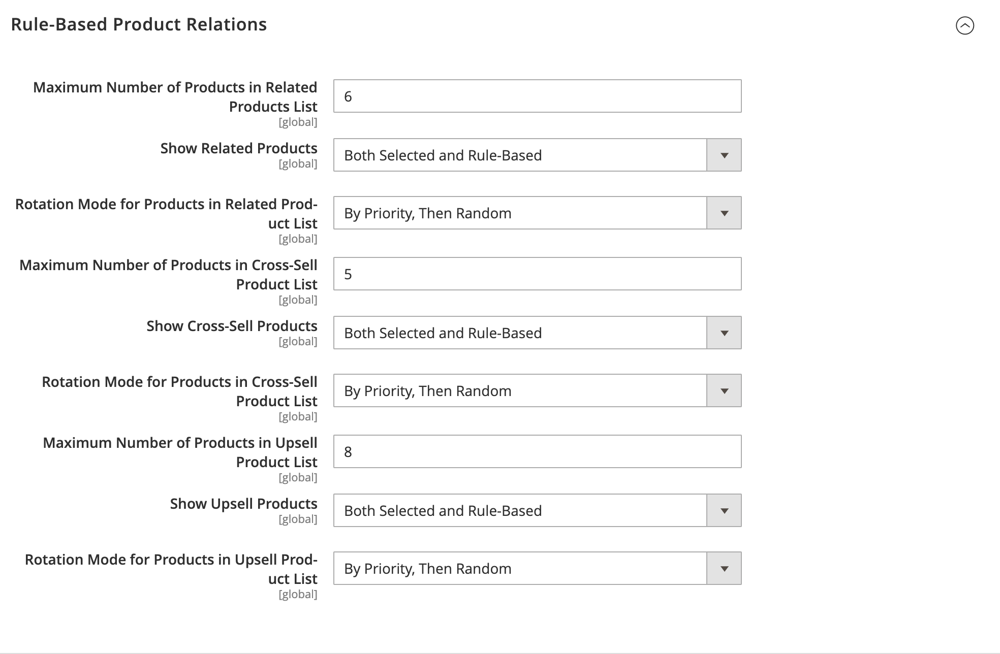

# Règles de produits associés (règles de cible)

{{ee-feature}}

Les règles de produits associés vous permettent de cibler la sélection de produits présentés aux clients sous la forme de produits associés, de ventes incitatives et de ventes croisées. Chaque règle de produit peut être associée à un [segment client](../customers/customer-segments.md) pour produire un affichage dynamique du marchandisage ciblé.

Plusieurs règles actives pouvant être déclenchées en même temps, vous pouvez définir une priorité pour chaque règle. Il définit l’ordre dans lequel les règles sont appliquées et les produits affichés sur la page.

Pour accéder aux règles de produit associées, accédez à **[!UICONTROL Marketing]** > _[!UICONTROL Promotions]_>**[!UICONTROL Related Product Rules]**.

{width="700" zoomable="yes"}

## Descriptions des colonnes

| Colonne | Description |
|--- |--- |
| [!UICONTROL ID] | Identifiant numérique unique attribué à chaque règle de produit associée |
| [!UICONTROL Rule] | Nom de la règle de produit associée |
| [!UICONTROL Start] | Utilisez les champs de calendrier dynamique (_[!UICONTROL To:]_&#x200B;et&#x200B;_[!UICONTROL From:]_) pour filtrer la liste en fonction de la date de début de la règle telle que définie lors de la création de la règle. |
| [!UICONTROL End] | Utilisez les champs de calendrier dynamique (_[!UICONTROL To:]_&#x200B;et&#x200B;_[!UICONTROL From:]_) pour filtrer la liste en fonction de la date de fin de la règle telle que définie lors de la création de la règle. |
| [!UICONTROL Priority] | Saisissez du texte dans ce champ pour filtrer la liste selon la priorité définie pour une règle. |
| [!UICONTROL Applies To] | Cette option filtre la liste des règles qui s’appliquent à `Related Products`, `Up-sells` et `Cross-sells`. |
| [!UICONTROL Status] | Utilisez cette option pour filtrer la liste en fonction du statut de la règle (`Active` ou `Inactive`). |

{style="table-layout:auto"}

## Priorité de la règle

À tout moment, plusieurs règles actives peuvent être déclenchées pour afficher des produits associés, des ventes incitatives et des ventes croisées. La priorité de chaque règle détermine l’ordre dans lequel les produits apparaissent sur la page. La valeur peut être définie sur n’importe quel nombre entier, les `1` ayant la priorité la plus élevée.

Le nombre d’identifiants de produit pouvant être inclus dans une règle de relations de produit est déterminé par la valeur `Result Limit`, qui est limitée à 20. La valeur `Result Limit`, combinée avec la `Configurable Maximum` pour la promotion de produit spécifique basée sur des règles, devient la `Real Limit` et détermine le nombre réel de produits correspondants qui peuvent apparaître dans la liste.

[Limite de résultat] + [Maximum configurable] = [Limite réelle]

Supposons, par exemple, que vous ayez trois règles avec une priorité de `1`, `2` et `3`.

- Deux produits correspondants sont renvoyés pour _règle 1_, six produits correspondants pour _règle 2_ et 20 produits correspondants pour _règle 3_.
- Dans la configuration d’, le _[!UICONTROL Maximum Number of Products for Related Products List]_&#x200B;est défini sur `6`.

  | Règles | Priorité | Produits correspondants |
  |---|---|-----|
  | Règle 1 | `1` | `2` |
  | Règle 2 | `2` | `6` |
  | Règle 3 | `3` | `20` |

Si la première règle renvoie plus de produits correspondants que ce qui est autorisé par la _limite maximale configurable_, mais moins que la _limite réelle_, les produits correspondants des autres règles sont utilisés (par ordre de priorité) jusqu’à ce que la _limite réelle_ soit atteinte.

Par priorité, les produits correspondants renvoyés par _règle 1_ peuvent être utilisés en premier pour remplir les 26 emplacements disponibles. Étant donné que la règle 1 n’a renvoyé que deux produits correspondants, il reste encore de la place pour 24 produits supplémentaires. _Règle 2_ a la priorité la plus élevée suivante et renvoie six autres produits correspondants. Il y a maintenant 18 créneaux disponibles à remplir. _Règle 3_ a le niveau de priorité suivant, avec suffisamment de produits correspondants pour remplir les 18 emplacements restants. Lorsque tous les emplacements disponibles sont remplis, et en fonction du mode de rotation défini, les produits peuvent être mélangés ou triés par identifiant à l’intérieur de chaque priorité, puis réduits à la limite maximale configurable. Dans ce cas, les six produits restants apparaissent dans le magasin.

>[!NOTE]
>
>Les produits sélectionnés sont toujours affichés avant les produits basés sur des règles, quel que soit le mode de rotation.

## Configurer des relations de produit basées sur des règles

Le comportement des règles de relation de produit et l’affichage des produits correspondants sont déterminés par les paramètres de configuration. Ces paramètres déterminent le nombre de produits qui correspondent à la règle pouvant être affichés et l’ordre dans lequel ils apparaissent.

1. Dans la barre latérale _Admin_, accédez à **[!UICONTROL Stores]** > _[!UICONTROL Settings]_>**[!UICONTROL Configuration]**.

1. Dans le panneau de gauche, développez **[!UICONTROL Catalog]** et choisissez **[!UICONTROL Catalog]** en dessous.

1. Développez  la section **[!UICONTROL Rules-Based Product Relations]** .

   {width="600" zoomable="yes"}

1. Saisissez le **[!UICONTROL Maximum Number of Products in the Related Products List]**.

1. Définissez **[!UICONTROL Show Related Products]** sur l’une des options suivantes :

   - `Both Selected and Rule Based`
   - `Selected Only`
   - `Rule-Based Only`

1. Définissez **[!UICONTROL Rotation Mode for Products in Related Product List]** sur l’une des options suivantes :

   - `By Priority, Then by ID`
   - `By Priority, Then Random`
   - `Weighted Random`

1. Pour définir les paramètres des produits de ventes croisées, procédez comme suit :

   - Saisissez le **[!UICONTROL Maximum Number of Products in the Cross-Sell Product List]**.

   - Définissez **[!UICONTROL Show Cross-Sell Products]** sur l’une des options suivantes :

      - `Both Selected and Rule Based`
      - `Selected Only`
      - `Rule-Based Only`

   - Définissez **[!UICONTROL Rotation Mode for Products in Cross-Sell Product List]** sur l’une des options suivantes :

      - `By Priority, Then by ID`
      - `By Priority, Then Random`
      - `Weighted Random`

1. Pour définir les paramètres du produit de montée en gamme, procédez comme suit :

   - Saisissez le **[!UICONTROL Maximum Number of Products in the Upsell Product List]**.

   - Définissez **[!UICONTROL Show Upsell Products]** sur l’une des options suivantes :

      - `Both Selected and Rule Based`
      - `Selected Only`
      - `Rule-Based Only`

   - Définissez **[!UICONTROL Rotation Mode for Products in Upsell Product List]** sur l’une des options suivantes :

      - `By Priority, Then by ID`
      - `By Priority, Then Random`
      - `Weighted Random`

1. Cliquez ensuite sur **[!UICONTROL Save Config]**.

### Modes de rotation

| Mode | Description |
|---|---|
| [!UICONTROL By Priority, Then by ID] | Les produits sont triés par priorité, puis réorganisés par identifiant dans chaque priorité. Les produits de la règle de priorité inférieure apparaissent uniquement lorsqu’il n’y a plus aucun produit de la règle de priorité supérieure pour remplir les emplacements disponibles. |
| [!UICONTROL By Priority, Then Random] | Les produits sont triés par priorité, puis randomisés dans chaque priorité. Les produits de la règle de priorité inférieure apparaissent uniquement lorsqu’il n’y a plus aucun produit de la règle de priorité supérieure pour remplir les emplacements disponibles. |
| [!UICONTROL Weighted Random] | Les produits sont randomisés de sorte que les produits appartenant à une règle de priorité supérieure aient une probabilité d’apparition plus élevée que ceux appartenant à une règle de priorité inférieure. Les produits sont ensuite réduits à la limite maximale configurable et regroupés par priorité. Ce mode permet aux produits de priorité inférieure d’apparaître parfois même si les emplacements restants peuvent être remplis de produits de règle de priorité supérieure |

{style="table-layout:auto"}

## Utilisation des audiences Real-Time CDP pour informer les règles de produit associées

Découvrez comment [activer](../customers/audience-activation.md) les audiences Real-Time CDP dans votre instance Adobe Commerce pour informer les règles de produit associées.
