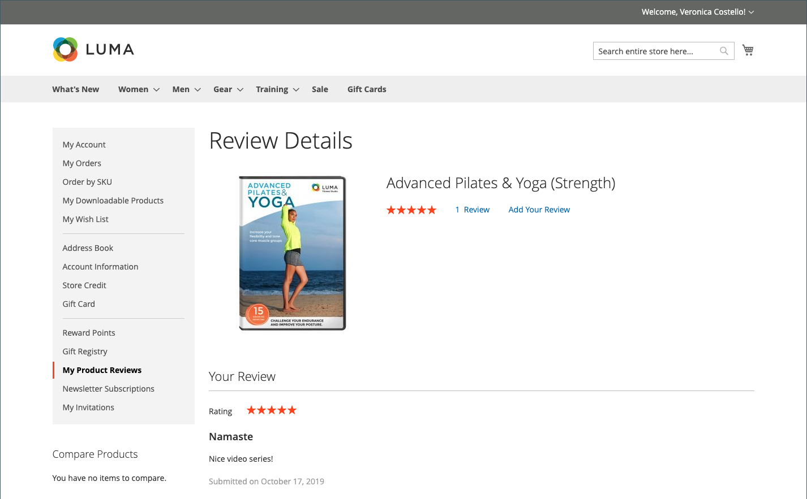

# Examens de produits

Les évaluations de produits aident à créer un sentiment de communauté et sont considérées comme plus crédibles que tout ce que l&#39;argent de la publicité peut acheter. En fait, certains moteurs de recherche donnent aux sites qui ont publié des avis sur des produits un rang supérieur à ceux qui n&#39;en ont pas publié. Pour ceux qui trouvent votre site en recherchant un produit spécifique, une revue de produit est essentiellement la page de destination de votre boutique. Les évaluations de produits aident les gens à trouver votre magasin, à maintenir leur engagement et mènent souvent à des ventes.

Commerce comprend une fonctionnalité native de révision des produits que vous pouvez gérer à partir de l’administration. Vous pouvez également utiliser une extension de [Commerce Marketplace](../getting-started/commerce-marketplace.md) pour utiliser un système de gestion des révisions hébergé.

>[!NOTE]
>
>Les versions 2.4.0 à 2.4.3 d’Adobe Commerce et de Magento Open Source incluaient l’extension Yotpo développée par le fournisseur. À compter de la version 2.4.4, cette extension n’est plus fournie avec la version de base et doit être installée et mise à jour à partir de Commerce Marketplace. La Marketplace permet également d’accéder à la documentation actuelle fournie par le développeur d’extensions.
>&#x200B;>  
>&#x200B;>Si l’extension groupée est activée et configurée, vous devez mettre à jour votre fichier composer.json dans le cadre du processus de mise à niveau vers la version 2.4.4 et pour gérer les mises à jour d’extension à l’avenir. Voir [Mise à niveau des modules](https://experienceleague.adobe.com/docs/commerce-operations/upgrade-guide/modules/upgrade.html) dans le _Guide de mise à niveau_ pour plus d’informations.

## Évaluations de produits sur le storefront

Lorsque la fonction native Product Reviews est activée, les clients peuvent rédiger des avis sur n’importe quel produit de votre catalogue. Vous pouvez rédiger des avis depuis la page produit en cliquant sur :

- **Ajouter votre évaluation** pour les produits ayant déjà été évalués.

- **Soyez le premier à évaluer ce produit** pour les produits sans évaluation existante.

L’onglet [!UICONTROL Reviews] répertorie toutes les révisions en cours et le formulaire utilisé pour envoyer une révision.

Votre configuration détermine si les clients doivent ouvrir un compte dans votre boutique avant d’écrire des avis sur les produits ou s’ils peuvent envoyer des avis en tant qu’invités. Le fait d’obliger les réviseurs à ouvrir un compte empêche les envois anonymes et améliore la qualité des révisions.

{width="700" zoomable="yes"}

Le nombre d’étoiles indique la note de satisfaction du produit. Les visiteurs peuvent cliquer sur le lien pour lire les avis et écrire les leurs. À titre d’incitation, les clients peuvent recevoir des points de récompense pour avoir envoyé une révision. Lorsqu’une révision est soumise, elle est envoyée à l’administrateur pour modération. Une fois approuvée, la révision est publiée dans votre boutique.

{width="700" zoomable="yes"}

### [!UICONTROL My Product Reviews]

La section _[!UICONTROL My Product Reviews]_&#x200B;du tableau de bord du compte client répertorie tous les avis soumis par le client et dont la publication a été approuvée. Chaque résumé de révision comprend la date à laquelle la révision a été soumise, des liens vers la page du produit et des détails de révision.

{width="700" zoomable="yes"}

1. Dans la barre latérale de son compte, le client choisit **[!UICONTROL My Product Reviews]**.

1. Pour afficher la révision complète, cliquez sur **[!UICONTROL See Details]**.

   {width="700" zoomable="yes"}

## Activer les fonctionnalités de révision de produit

La fonction Révisions des produits Commerce est activée par défaut.

>[!NOTE]
>
>Pour définir ces champs sur `No` et désactiver les révisions de produit Commerce, vous devez décocher les cases **Utiliser la valeur système**.

1. Dans la barre latérale _Admin_, accédez à **[!UICONTROL Stores]** > _[!UICONTROL Settings]_>**[!UICONTROL Configuration]**.

1. Dans le panneau de gauche, développez **[!UICONTROL Catalog]** et sélectionnez **[!UICONTROL Catalog]** en dessous.

1. Développez  la section **[!UICONTROL Product Reviews]** .

   {width="600" zoomable="yes"}

1. Définissez **[!UICONTROL Enabled]** sur `Yes`.

   Il s’agit du paramètre par défaut qui permet la révision des produits.

1. Définissez **[!UICONTROL Allow Guests to Write Reviews]** sur `Yes`.

   Il s’agit du paramètre par défaut qui détermine si les clients doivent ouvrir un compte dans votre boutique pour pouvoir rédiger des avis sur des produits.

1. Cliquez ensuite sur **[!UICONTROL Save Config]**.

## Créer des évaluations personnalisées

Grâce aux révisions de produit Commerce, les clients peuvent attribuer des évaluations lorsqu’ils soumettent une révision de produit. Les évaluations par défaut sont la qualité, le prix et la valeur. En outre, vous pouvez ajouter vos propres évaluations personnalisées. La moyenne des notes 5 étoiles qui apparaissent sur les pages du catalogue est calculée pour chaque produit.

{width="700" zoomable="yes"}

1. Dans la barre latérale _Admin_, accédez à **[!UICONTROL Stores]** > _[!UICONTROL Attributes]_>**[!UICONTROL Rating]**.

1. Dans le coin supérieur droit, cliquez sur **[!UICONTROL Add New Rating]**.

   {width="700" zoomable="yes"}

1. Dans la section _[!UICONTROL Rating Title]_, saisissez le **[!UICONTROL Default Value]**&#x200B;de la nouvelle évaluation.

   Le cas échéant, saisissez également la traduction pour chaque vue de magasin.

   {width="600" zoomable="yes"}

1. Dans la section _Visibilité de l’évaluation_, définissez l’**[!UICONTROL Visibility In]** sur la vue du magasin dans laquelle l’évaluation doit être utilisée.

   Pour sélectionner plusieurs vues de magasin, maintenez la touche Ctrl (PC) ou Commande (Mac) enfoncée et cliquez sur chaque élément.

   >[!NOTE]
   >
   >Les évaluations ne sont pas visibles, sauf si elles sont affectées à une vue de magasin.

1. Par **[!UICONTROL Sort Order]**, saisissez un nombre pour déterminer l’ordre de cette évaluation lorsqu’elle est répertoriée avec d’autres.

1. Si vous souhaitez afficher votre évaluation sur le storefront, cochez la case **[!UICONTROL Is Active]**.

   {width="600" zoomable="yes"}

1. Cliquez ensuite sur **[!UICONTROL Save Rating]**.

   L’évaluation moyenne de toutes les évaluations s’affiche pour chaque produit sur la page de la grille de produits du catalogue.

   {width="700" zoomable="yes"}
