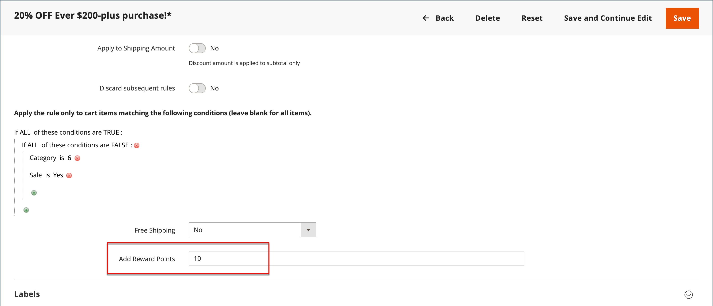

# Points de récompense dans les règles de prix

{{ee-feature}}

Des points de récompense peuvent être attribués à des clients selon une [règle de prix du panier](price-rules-cart.md). L’attribution de points peut être la seule action de la règle de prix ou peut être utilisée avec une remise.

>[!NOTE]
>
>[Taux de change de récompense](reward-exchange-rates.md) La configuration est requise pour le rachat des points de récompense par les clients et les utilisateurs administrateurs lors du passage en caisse.

## Ajouter des points de récompense à une règle de prix

1. Sur le _Administration_ barre latérale, accédez à **[!UICONTROL Marketing]** > _[!UICONTROL Promotions]_>**[!UICONTROL Cart Price Rules]**.

1. Cliquez sur **[!UICONTROL Add New Rule]** pour créer une règle de prix de panier ou cliquez sur une règle de prix de panier existante pour l’ouvrir.

1. Faire défiler vers le bas, développer  la valeur **[!UICONTROL Actions]** , définissez les conditions, puis saisissez le nombre de points dans la variable **[!UICONTROL Add Reward Points]** champ .

   {width="600" zoomable="yes"}

1. Suivez les instructions standard pour effectuer la [règle de prix du panier](price-rules-cart-create.md).

   Lorsque la règle de prix est activée, un message s’affiche dans le panier pour informer les clients du nombre de points qu’ils peuvent gagner en passant la commande. Cela s’applique uniquement aux utilisateurs enregistrés et peut varier lorsqu’un utilisateur est connecté.
