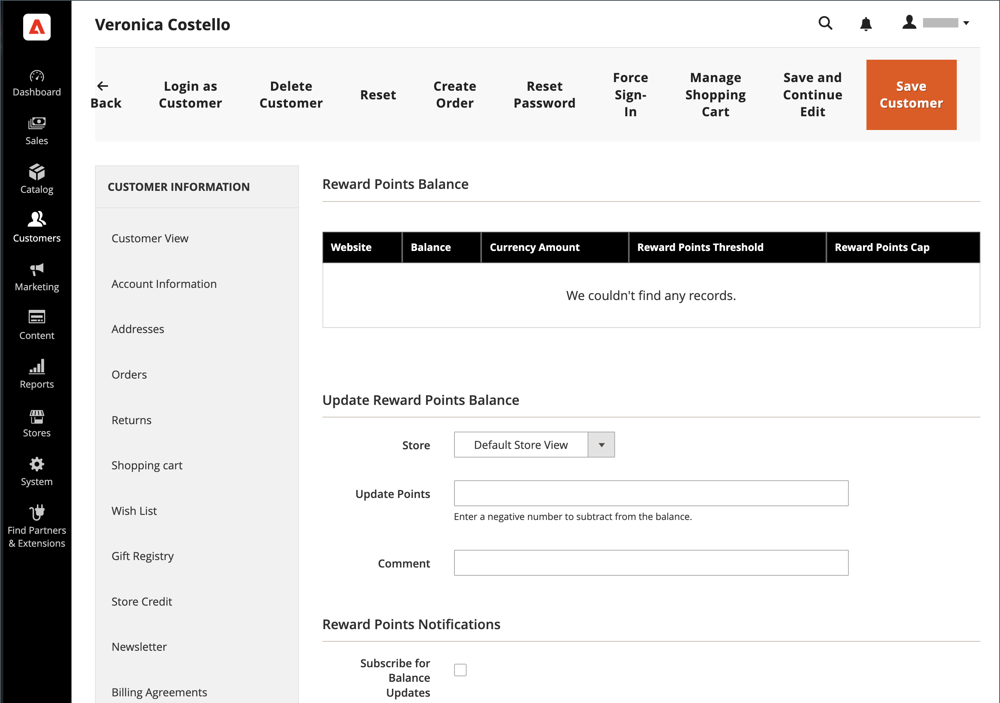

# Programmes de récompense et de fidélité

{{ee-feature}}

La variable _points de récompense_ Le système d’Adobe Commerce vous permet de mettre en oeuvre des programmes uniques qui favorisent l’engagement des clients et la fidélisation des clients. Les points peuvent être octroyés pour un large éventail de transactions et d’activités clients, et la configuration peut être définie pour contrôler l’attribution, l’équilibre et l’expiration des points. Les clients peuvent échanger des points contre des achats, en fonction du taux de conversion que vous établissez entre les points de récompense et la devise.

## Règles de prix du panier

Les points peuvent être récompensés par une [règle du panier](price-rules-cart.md). Ils peuvent être récompensés comme la seule action de la règle de prix, ou avec une remise.

## Solde client

Les soldes des points de récompense peuvent être gérés par les utilisateurs administrateurs par client. S’ils sont activés dans le storefront, les clients peuvent également afficher les détails de leur solde de points.

## Remboursement des points

>[!NOTE]
>
>[Taux de change de récompense](reward-exchange-rates.md) La configuration est requise pour le rachat des points de récompense par les clients et les utilisateurs administrateurs lors du passage en caisse.

Les points peuvent être échangés par les utilisateurs administrateurs et les clients (s’ils sont activés) pendant le passage en caisse. Dans la section Mode de paiement , une case à cocher Utiliser mes points de récompense s’affiche au-dessus des méthodes de paiement activées. Les points disponibles et le taux de change monétaire sont inclus. Si le solde disponible est supérieur au total général de la commande, aucun mode de paiement supplémentaire n’est requis. Le nombre de points de récompense appliqués à la commande apparaît avec les totaux de la commande, soustraits du total général, comme un crédit de boutique ou des cartes-cadeaux. Si des points de récompense sont utilisés avec un crédit de boutique ou une carte-cadeau, les points de récompense sont d’abord déduits. Le crédit de la boutique ou la carte-cadeau est alors déduit si le total de la commande est supérieur au nombre de points de récompense remboursables.

>[!NOTE]
>
>Les points de récompense ne sont pas recommandés pour une utilisation avec les achats de la DCO, car la réception du paiement ne peut être confirmée qu’après la facturation de la commande.

## Rembourser les points de récompense

Les commandes passées avec points de récompense peuvent être remboursées au solde des points de récompense jusqu&#39;au montant consommé dans la commande. Sur le [_Nouvelle note de crédit_ page](../stores-purchase/credit-memo-create.md), le nombre de points à appliquer au solde du client peut être renseigné. Par défaut, le champ contient le nombre total de points utilisés dans la commande.

## Activation des opérations de point de récompense pour votre magasin

La configuration Points de récompense détermine la présentation des points de récompense dans le magasin et définit les paramètres de fonctionnement de base.

{width="600" zoomable="yes"}

### Étape 1. Configuration des points de récompense

1. Sur le _Administration_ barre latérale, accédez à **[!UICONTROL Stores]** > _[!UICONTROL Settings]_>**[!UICONTROL Configuration]**.

1. Dans le panneau de gauche, développez **[!UICONTROL Customers]** et choisissez **[!UICONTROL Reward Points]**.

1. Développer  la valeur **[!UICONTROL Reward Points]** et procédez comme suit :

   - Pour activer les points de récompense, définissez **[!UICONTROL Enable Reward Points Functionality]** to `Yes`.

   - Pour permettre aux clients d’obtenir leurs propres points de récompense, définissez **[!UICONTROL Enable Reward Points Functionality on Storefront]** to `Yes`.

   - Pour permettre aux clients d’afficher un historique détaillé de leurs récompenses, définissez **[!UICONTROL Customers May See Reward Point History]** to `Yes`.

1. Pour **[!UICONTROL Reward Points Balance Redemption Threshold]**, indiquez le nombre de points à accumuler avant qu’ils ne puissent être consommés (vide, sans minimum).

1. Pour **[!UICONTROL Cap Reward Points Balance At]**, saisissez le nombre maximal de points qu’un client peut accumuler (vide, sans limite).

1. Pour **[!UICONTROL Reward Points Expire in (days)]**, saisissez le nombre de jours avant l’expiration des points de récompense (vide sans expiration).

1. Définir **[!UICONTROL Reward Points Expiry Calculation]** à l’une des options suivantes :

   - `Static` - Détermine la durée de vie restante des points de récompense en fonction du nombre de jours définis dans la configuration. Si la limite d’expiration dans la configuration change, la date d’expiration des points existants ne change pas.

   - `Dynamic` - Calcule le nombre de jours restant chaque fois que le solde du point de récompense augmente. Si la limite d’expiration dans la configuration change, l’expiration de tous les points existants est mise à jour en conséquence.

1. Si vous souhaitez rembourser automatiquement les points de récompense disponibles, définissez **[!UICONTROL Refund Reward Points Automatically]** to `Yes`.

1. Pour éviter que les points de récompense gagnés par les achats lorsque la commande qui a gagné les points est entièrement ou partiellement remboursée, définissez **[!UICONTROL Deduct Reward Points from Refund Amount Automatically]** to `Yes`.

   >[!NOTE]
   >
   >Seuls les points gagnés avec la commande remboursée sont concernés.

1. Définir **[!UICONTROL Landing Page]** à la page de contenu qui explique votre programme de points de récompense.

   Veillez à mettre à jour la page Points de récompense par défaut avec vos propres informations.

1. Lorsque vous avez terminé, cliquez sur **[!UICONTROL Save Config]**.

### Étape 2. Configuration des points gagnés pour les activités des clients

Au cours de cette étape, le nombre de points de récompense pouvant être gagnés pour diverses activités client est spécifié. Lorsque les clients effectuent une action pour laquelle des points sont attribués, un message s’affiche à l’intention du client, indiquant le nombre de points gagnés.

1. Développer  la valeur **[!UICONTROL Actions for Acquiring Reward Points by Customer]** .

   {width="600" zoomable="yes"}

1. Pour afficher dans le panier un message qui comprend les points de récompense gagnés pour l’achat et le solde actuel du point de récompense du client, définissez **[!UICONTROL Purchase]** to `Yes`.

   >[!NOTE]
   >
   >Pour gagner des points de récompense pour leurs _first_ commande, le client doit être enregistré _before_ la transaction est capturée par le mode de paiement. La plupart des méthodes de paiement peuvent être configurées pour capturer les transactions. _automatiquement_ lorsque la commande est passée, mais _before_ l’enregistrement du compte client est terminé.

1. Pour **[!UICONTROL Registration]**, saisissez le nombre de points gagnés pour l’ouverture d’un compte client.

1. Pour **[!UICONTROL Newsletter Signup]**, indiquez le nombre de points gagnés par les clients enregistrés qui s’abonnent à une newsletter.

1. Pour **[!UICONTROL Converting Invitation to Customer]**, indiquez le nombre de points gagnés par un client qui envoie une invitation et le destinataire ouvre alors un compte client.

   Vous pouvez limiter le nombre de conversions d’invitation qui peuvent être utilisées pour gagner des points pour le client qui envoie l’invitation (vide, sans limite). Pour ce faire, saisissez un nombre dans le champ **[!UICONTROL Invitation to Customer Conversions Quantity Limit]** champ .

1. Pour **[!UICONTROL Converting Invitation to Order]**, indiquez le nombre de points gagnés par un client qui envoie une invitation au destinataire qui commande puis effectue les opérations suivantes :

   - Pour **Limite de quantité d’invitation à commander des conversions**, indiquez le nombre de points gagnés par le client qui envoie l’invitation lorsque le destinataire passe une commande initiale (vide, sans limite).

   - Pour **[!UICONTROL Invitation Conversion to Order Reward]**, sélectionnez la variable `Each` pour gagner des points pour chaque commande du destinataire, ou sélectionnez l’option `First` pour gagner des points uniquement pour la première commande passée par le destinataire.

1. Pour **[!UICONTROL Review Submission]**, indiquez le nombre de points gagnés par un client qui envoie une révision approuvée pour publication.

1. Ensuite, pour limiter le nombre de révisions qui peuvent être utilisées pour gagner des points par client, saisissez le nombre dans la variable **[!UICONTROL Rewarded Reviews Submission Quantity Limit]** champ (vide, sans limite).

1. Lorsque vous avez terminé, cliquez sur **[!UICONTROL Save Config]**.

### Étape 3. Définition des paramètres de notification électronique

1. Développer  la valeur **[!UICONTROL Email Notification Settings]** .

   {width="600" zoomable="yes"}

1. Définir **[!UICONTROL Email Sender]** au contact du magasin qui apparaît comme l’expéditeur des mises à jour de balance et des notifications d’expiration.

1. Si vous souhaitez abonner des clients par défaut afin d’être averti des mises à jour du solde et des dates d’expiration à venir, définissez **[!UICONTROL Subscribe Customers by Default]** to `Yes`.

1. Définir **[!UICONTROL Balance Update Email]** au modèle utilisé pour la notification envoyée aux clients lors de la mise à jour de leur solde de points.

1. Définir **[!UICONTROL Reward Points Expiry Warning Email]** au modèle utilisé pour la notification envoyée aux clients lorsque la limite d’expiration d’un lot de points est atteinte.

1. Pour **[!UICONTROL Expiry Warning Before (days)]**, saisissez le nombre de jours avant l’expiration du point de l’envoi de la notification.

1. Lorsque vous avez terminé, cliquez sur **[!UICONTROL Save Config]**.

## Mettre à jour le solde des points de récompense

Le solde des points de récompense peut être mis à jour à partir de l’administrateur.

1. Sur le _Administration_ barre latérale, accédez à **[!UICONTROL Customers]** > **[!UICONTROL All Customers]**.

1. Recherchez le client dans la grille, puis cliquez sur **[!UICONTROL Edit]** dans le _[!UICONTROL Action]_colonne .

1. Sous _Informations sur le client_, choisissez la variable **[!UICONTROL Reward Points]** .

1. Saisissez le nombre de **[!UICONTROL Update Points]**:

   - Pour mettre à jour le montant des points de récompense, indiquez le nombre afin d’augmenter le solde total des points.
   - Pour soustraire le montant des points de récompense, saisissez le nombre négatif à réduire au total du solde des points.

1. Entrée **[!UICONTROL Comments]** en fonction de l&#39;ajustement des points de récompense, le cas échéant.

   {width="700" zoomable="yes"}

1. Si vous le souhaitez, abonnez le client à _Notifications de points de récompense_:

   - **[!UICONTROL Subscribe for Balance Updates]**
   - **[!UICONTROL Subscribe for Points Expiration Notifications]**

1. Cliquez sur **[!UICONTROL Save Customer]**.

Toutes les actions liées aux points de récompense s’affichent dans le rapport _[!UICONTROL Reward Points History]_bloquez dans leur compte sur le storefront.

## Descriptions des champs

| Champ | Description |
|--- |--- |
| [!UICONTROL Balance] | Équilibre actuel des points de récompense pour le client |
| [!UICONTROL Amount Balance] | Montant du solde de trésorerie actuel |
| [!UICONTROL Points] | Nombre de points ajoutés ou soustraits |
| [!UICONTROL Amount] | Montant de l&#39;argent ajouté ou soustrait |
| [!UICONTROL Rate] | La variable [taux de change de récompense](reward-exchange-rates.md) |
| [!UICONTROL Website] | Site auquel est affecté l’historique des points de récompense |
| [!UICONTROL Reason] | Motifs de l&#39;attribution des points : **[!UICONTROL Making purchases]**— Chaque fois que le client effectue un achat, il peut gagner des points. **[!UICONTROL Registering on the site]** - Accordée lors de l’enregistrement (une fois). **[!UICONTROL Subscribing to a newsletter]**- Accumulé pour le premier abonnement (une fois). **[!UICONTROL Sending Invitations]** — Gagnez des points en invitant leurs amis à se joindre au site. **[!UICONTROL Converting Invitations to Customer]**— Gagnez des points pour chaque invitation qu&#39;ils envoient, des amis majeurs qui s&#39;enregistrent sur le site. **[!UICONTROL Converting Invitations to Order]** — Gagnez des points pour chaque vente résultant d’une invitation envoyée. **[!UICONTROL Review Submission]**— Gagnez des points pour soumettre des avis sur les produits. |
| [!UICONTROL Created] | Mise à jour de la date et de l’heure des points de récompense |
| [!UICONTROL Expired] | Nombre de points de récompense expirés |
| [!UICONTROL Comment] | Commentaires lors de l’ajout ou de la soustraction de points |

{style="table-layout:auto"}

## Ressources de dépannage

Pour obtenir de l’aide sur la résolution des problèmes liés aux points de récompense, reportez-vous aux articles suivants de la base de connaissances de l’assistance clientèle de Commerce :

- [Points de fidélité sur les commandes partielles](https://experienceleague.adobe.com/docs/commerce-knowledge-base/kb/support-tools/patches/v1-0-8/mdva-31295-magento-patch-loyalty-points-on-partial-orders.html)
- [Erreur 404 - suppression des points de récompense lors du passage en caisse multi-shipping](https://experienceleague.adobe.com/docs/commerce-knowledge-base/kb/troubleshooting/storefront/magento-2.4.0-404-error-removing-rewards-points-on-multi-shipping-checkout.html)
