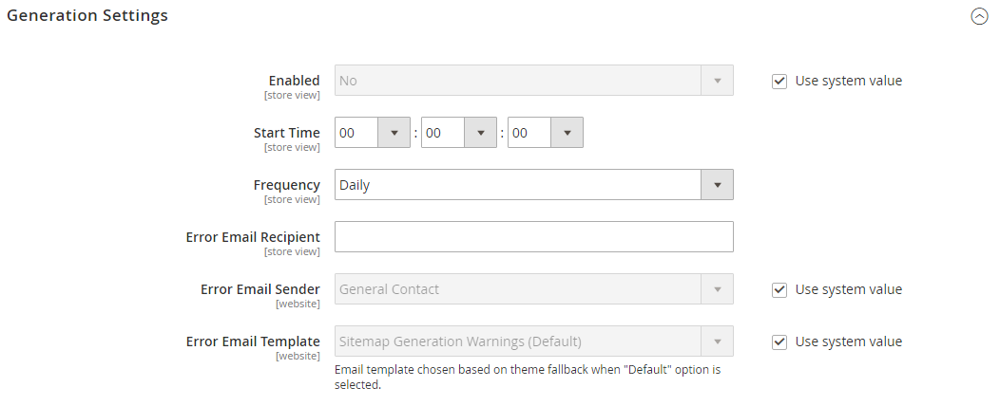

# Cartes du site

>[!TIP]
>
>Pour Adobe Commerce as a Cloud Service, consultez les [directives SEO](https://experienceleague.adobe.com/developer/commerce/storefront/setup/seo/indexing/?lang=fr) de la documentation du Storefront Commerce

Un plan de site améliore la façon dont votre boutique est indexée par les moteurs de recherche et est conçu pour trouver les pages qui pourraient être ignorées par les robots d’exploration. Un plan de site peut être configuré pour indexer toutes les pages et images.

Lorsqu’il est activé, Commerce crée un fichier appelé `sitemap.xml` qui est enregistré dans votre installation à l’emplacement spécifié. La configuration vous permet de définir la fréquence des mises à jour et la priorité de chaque type de contenu. Votre carte de site doit être mise à jour aussi souvent que le contenu de votre site change, ce qui peut être quotidien, hebdomadaire ou mensuel.

Pendant le développement de votre site, vous pouvez inclure des instructions dans le fichier `robots.txt` pour les robots d’exploration web afin d’éviter d’indexer le site. Ensuite, avant le lancement, vous pouvez modifier les instructions pour permettre l’indexation du site.

Pour obtenir des informations techniques, voir [Ajouter un plan de site et robots.txt][1] dans le guide _Commerce sur les infrastructures cloud_.

{width="700" zoomable="yes"}

## Étape 1. Configurer le plan de site

Effectuez la [configuration du plan de site XML](#site-map-configuration) pour déterminer ce qui est inclus et la fréquence de mise à jour du plan de site.

## Étape 2. Générer le plan du site

1. Dans le menu _Admin_, accédez à **[!UICONTROL Marketing]** > _[!UICONTROL SEO & Search]_>**[!UICONTROL Site Map]**.

1. Cliquez sur **[!UICONTROL Add Site Map]**.

   {width="700" zoomable="yes"}

1. Saisissez le **[!UICONTROL Filename]** du plan du site. Par exemple : `sitemap.xml`

1. Saisissez le **[!UICONTROL Path]** permettant de déterminer l&#39;emplacement du fichier de plan de site sur le serveur. Assurez-vous que le chemin d’accès est accessible en écriture.

   - `/sitemap/` - Place le fichier de plan de site dans un répertoire appelé _sitemap_.

   - `/` - Place le fichier de plan de site à la racine ou au chemin d’accès de base de votre installation Commerce.

   {width="600" zoomable="yes"}

1. Cliquez ensuite sur **[!UICONTROL Save & Generate]**.

   Il peut s&#39;écouler quelques minutes avant que la carte du site apparaisse dans la grille.

## Étape 3. Configuration et activation de robots.txt (facultatif)

Effectuez la configuration [robots de moteurs de recherche](seo-overview.md#search-engine-robots) avec des instructions qui demandent aux moteurs de recherche d’analyser les parties de votre site que vous souhaitez indexer.

## Étape 4. Envoyer votre plan du site aux moteurs de recherche

Vous pouvez envoyer votre plan de site à différents moteurs de recherche en leur fournissant le lien vers le fichier `sitemap.xml` de votre installation Commerce. Pour copier le lien, procédez comme suit :

1. Dans la liste _Plan du site_, cliquez avec le bouton droit sur l&#39;URL dans la colonne **[!UICONTROL Link for Google]**.

1. Au menu, choisissez **[!UICONTROL Copy Link Address]**.

Pour plus d’informations, consultez les instructions relatives au moteur de recherche spécifique. Voici des liens vers des instructions pour deux moteurs de recherche principaux :

- [Google][2]
- [Microsoft® Bing][3]

## Étape 5 : Restaurer les instructions précédentes du robot (facultatif)

Vous pouvez désormais restaurer l’une des restrictions d’origine (par défaut).

## Gestion des plans de site et du fichier robots.txt pour plusieurs sites web

Si vous disposez de plusieurs sites web, vous pouvez simplifier le processus de création et d’envoi de plans de site. Il vous suffit de [créer](#site-map-configuration) un ou plusieurs plans de site qui incluent des URL pour tous vos magasins vérifiés et d’enregistrer les plans de site à un seul emplacement. Tous les sites doivent être vérifiés dans [Google Search Console](https://support.google.com/webmasters/answer/7451001).

Pour créer des plans de site pour une instance multimagasin, procédez comme suit :

1. Créez un dossier appelé `sitemaps` à la racine de votre site web, puis créez des sous-dossiers pour chaque domaine :

       /sitemaps/domain_1/
       /sitemaps/domain_2/
   
1. Dans la barre latérale _Admin_, accédez à **[!UICONTROL Marketing]** > _[!UICONTROL SEO & Search]_>**[!UICONTROL Site Map]**.

1. Créez ou modifiez les listes de plan de site pour chaque magasin et définissez la **[!UICONTROL Path]** sur celle que vous avez créée pour le magasin :

   `/sitemaps/domain_1/`
   `/sitemaps/domain_2/`

1. Si nécessaire, mettez à jour votre fichier robots.txt.

   Pour vous assurer que les araignées du moteur de recherche sont correctement redirigées vers les nouveaux plans de site, vous pouvez mettre à jour ou créer le fichier robots.txt . Ajoutez les lignes suivantes en haut.

       Plan du site Web
       Plan du site : https://www.domain_1.com/sitemaps/domain_1/sitemap.xml
       Plan du site : https://www.domain_2.com/sitemaps/domain_2/sitemap.xml
   
>[!NOTE]
>
>Si votre site utilise le moteur de serveur web [Apache](https://experienceleague.adobe.com/docs/commerce-operations/installation-guide/prerequisites/web-server/apache.html?lang=fr), vous devez mettre à jour le fichier [`.htaccess`](https://httpd.apache.org/docs/current/howto/htaccess.html) dans la racine de votre site web pour diriger toute autre requête de plan de site vers l’emplacement approprié.

## Descriptions des colonnes

| Colonne | Description |
|------|-----------|
| [!UICONTROL ID] | Numéro d&#39;enregistrement séquentiel du plan de site actuel. |
| [!UICONTROL Filename] | Nom de fichier du plan de site. |
| [!UICONTROL Path] | Emplacement où réside le plan de site sur le serveur. Par exemple :  `/sitemap/` - Place le fichier de plan de site dans un répertoire appelé _sitemap_, un niveau sous la racine de l’installation Commerce.  `/` - Place le fichier de plan de site à la racine ou au chemin d’accès de base de l’installation Commerce. |
| [!UICONTROL Link for Google] | URL du plan de site à envoyer à Google et à d’autres moteurs de recherche. |
| [!UICONTROL Last Generated] | Indique la date et l&#39;heure de la dernière génération du plan de site. |
| [!UICONTROL Store View] | Vue de magasin à laquelle s’applique le plan de site. |
| [!UICONTROL Generate] | Régénère le plan du site. |

{style="table-layout:auto"}

## Configuration du plan de site

La carte de votre site doit être mise à jour aussi souvent que le contenu de votre site change, ce qui peut être tous les jours, toutes les semaines ou tous les mois. La configuration permet de définir la fréquence et la priorité de chaque type de contenu.

### Étape 1. Définir la fréquence et la priorité des mises à jour de contenu

1. Dans la barre latérale _Admin_, accédez à **[!UICONTROL Stores]** > _[!UICONTROL Settings]_>**[!UICONTROL Configuration]**.

1. Dans le panneau de gauche, développez **[!UICONTROL Catalog]** et choisissez **[!UICONTROL XML Sitemap]**.

1. Développez  la section **[!UICONTROL Categories Options]** et procédez comme suit :

   >[!NOTE]
   >
   >Si nécessaire, décochez la case **[!UICONTROL Use system value]** pour modifier ces paramètres.

   - Définissez **[!UICONTROL Frequency]** sur l’une des options suivantes :

      - `Always`
      - `Hourly`
      - `Daily`
      - `Weekly`
      - `Monthly`
      - `Yearly`
      - `Never`

   - Par **[!UICONTROL Priority]**, entrez une valeur comprise entre `0.0` et `1.0`. Zéro a la priorité la plus faible.

   {width="600" zoomable="yes"}

   Pour obtenir la liste détaillée de ces options, voir [Options des catégories](../configuration-reference/catalog/xml-sitemap.md#categories-options) dans le _Guide de référence de configuration_.

1. Développez  la section **[!UICONTROL Products Options]** et renseignez les paramètres **[!UICONTROL Frequency]** et **[!UICONTROL Priority]** selon vos besoins.

   Pour obtenir la liste détaillée de ces options, voir [Options du produit](../configuration-reference/catalog/xml-sitemap.md#products-options) dans le _Guide de référence de configuration_.

1. Pour déterminer la mesure dans laquelle les images sont incluses dans le plan du site, définissez **[!UICONTROL Add Images into Sitemap]** sur l’une des options suivantes :

   - `None`
   - `Base Only`
   - `All`

   {width="600" zoomable="yes"}

1. Développez  la section **[!UICONTROL CMS Pages Options]** et renseignez les paramètres **[!UICONTROL Frequency]** et **[!UICONTROL Priority]** selon vos besoins.

   {width="600" zoomable="yes"}

   Pour obtenir une liste détaillée de ces options, voir [Options de pages CMS](../configuration-reference/catalog/xml-sitemap.md#cms-pages-options) dans la _Référence de configuration_.

1. Développez  la section **[!UICONTROL Store Url Options]** et renseignez les paramètres **[!UICONTROL Frequency]** et **[!UICONTROL Priority]** selon vos besoins.

   {width="600" zoomable="yes"}

   Pour obtenir la liste détaillée de ces options, voir [Options d’URL de magasin](../configuration-reference/catalog/xml-sitemap.md#store-url-options) dans le _Guide de référence de configuration_.

1. Cliquez ensuite sur **[!UICONTROL Save Config]**.

### Étape 2. Compléter les paramètres de génération

1. Développez  la section **[!UICONTROL Generation Settings]** .

   Si nécessaire, décochez la case **Utiliser la valeur du système** pour modifier ces paramètres.

   {width="600" zoomable="yes"}

   Pour obtenir la liste détaillée de ces options, voir [Paramètres de génération](../configuration-reference/catalog/xml-sitemap.md#generation-settings) dans le _Référence de configuration_.

1. Pour générer un plan de site, définissez **[!UICONTROL Enabled]** sur `Yes` et procédez comme suit :

   - Définissez **[!UICONTROL Start Time]** sur l’heure, la minute et la seconde auxquelles vous souhaitez que le plan du site soit mis à jour.

   - Définissez **[!UICONTROL Frequency]** sur l’une des options suivantes :

      - `Daily`
      - `Weekly`
      - `Monthly`

   - Par **[!UICONTROL Error Email Recipient]**, saisissez l’adresse e-mail de la personne qui doit recevoir une notification si une erreur se produit lors de la mise à jour du plan du site.

   - Définissez **[!UICONTROL Error Email Sender]** sur le contact du magasin qui apparaît comme l’expéditeur de la notification d’erreur.

   - Définissez **[!UICONTROL Error Email Template]** sur le modèle utilisé pour la notification d’erreur.

### Étape 3. Définir les limites du fichier de plan de site

1. Développez  la section **[!UICONTROL Sitemap File Limits]** .

   {width="600" zoomable="yes"}

   Pour obtenir la liste détaillée de ces options, voir [Limites des fichiers de plan de site](../configuration-reference/catalog/xml-sitemap.md#sitemap-file-limits) dans le _Guide de référence de configuration_.

1. Par **[!UICONTROL Maximum No of URLs per File]**, saisissez le nombre maximal d’URL qui peuvent être incluses dans le plan du site.

   Par défaut, la limite est de 50 000.

1. Par **[!UICONTROL Maximum File Size]**, saisissez la plus grande taille en octets allouée au plan du site.

   La taille par défaut est de 10 485 760 octets.

### Étape 4. Définition des paramètres d’envoi du moteur de recherche

1. Développez  la section **[!UICONTROL Search Engine Submission Settings]** .

   {width="600" zoomable="yes"}

1. Si vous utilisez un fichier `robots.txt` pour fournir des instructions aux moteurs de recherche qui explorent votre site, définissez **[!UICONTROL Enable Submission to Robots.txt]** sur `Yes`.

1. Cliquez ensuite sur **[!UICONTROL Save Config]**.

[1]: https://experienceleague.adobe.com/docs/commerce-cloud-service/user-guide/configure-store/robots-sitemap.html?lang=fr
[2]: https://support.google.com/webmasters/answer/183669?hl=en
[3]: https://www.bing.com/webmasters/help/Sitemaps-3b5cf6ed
