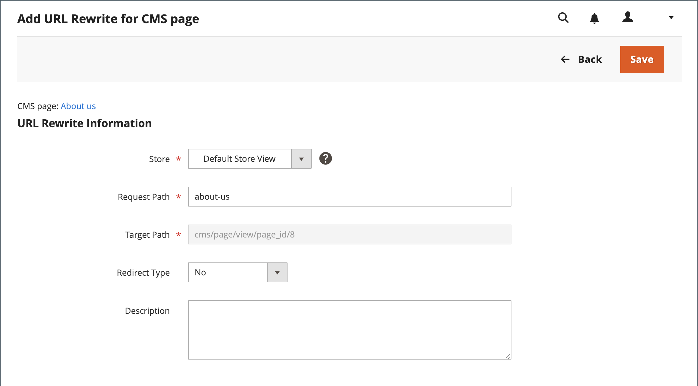

# L’URL de la page de contenu réécrit

Avant de commencer, veillez à comprendre exactement ce que la redirection est à accomplir. Pensez en termes de _cible_ / _source_ ou de _redirection vers_ / _redirection depuis_. Bien que les visiteurs puissent toujours accéder à l’ancienne page à partir de moteurs de recherche ou de liens obsolètes, la redirection entraîne le passage de votre magasin vers la nouvelle cible.

{width="700" zoomable="yes"}

## Étape 1. Planification de la réécriture

Pour éviter des erreurs, écrivez la clé URL de la page _redirect vers_ et la page _redirect depuis_.

Si vous n’en êtes pas sûr, ouvrez chaque page de votre magasin, puis copiez le chemin d’accès depuis la barre d’adresse de votre navigateur.

### Chemin de page CMS

Redirection vers : `new-page`

Redirection depuis : `old-page`

## Étape 2. Créer la réécriture

{{url-rewrite-params}}

1. Sur la barre latérale _Admin_, accédez à **[!UICONTROL Marketing]** > _[!UICONTROL SEO & Search]_>**[!UICONTROL URL Rewrites]**.

1. Avant de poursuivre, procédez comme suit pour vérifier que le chemin de requête est disponible.

   - Dans le filtre de recherche situé en haut de la colonne **[!UICONTROL Request Path]**, saisissez la clé URL de la page à rediriger et cliquez sur **[!UICONTROL Search]**.

   - S’il existe plusieurs enregistrements de redirection pour la page, recherchez celui qui correspond à la vue de magasin applicable et ouvrez-le en mode d’édition.

   - Dans le coin supérieur droit, cliquez sur **[!UICONTROL Delete]**. Lorsque vous y êtes invité, cliquez sur **[!UICONTROL OK]** pour confirmer.

1. Lorsque vous revenez à la page URL de réécriture, cliquez sur **[!UICONTROL Add URL Rewrite]**.

1. Définissez **[!UICONTROL Create URL Rewrite]** sur `for CMS page`.

1. Recherchez la nouvelle page cible dans la grille et ouvrez-la en mode d’édition.

   {width="700" zoomable="yes"}

1. Sous Informations de réécriture d’URL, procédez comme suit :

   - Si vous avez plusieurs vues de magasin, sélectionnez l’ **[!UICONTROL Store]** où s’applique la réécriture.

   - Pour **[!UICONTROL Request Path]**, saisissez la clé URL de la page d’origine que le client demande. Il s’agit de la page de _redirection à partir de_.

     >[!NOTE]
     >
     >Le chemin d’accès à la requête doit être unique pour le magasin spécifié. Si une redirection utilise déjà le même chemin d’accès à la requête, une erreur s’affiche lorsque vous essayez d’enregistrer la redirection. La redirection précédente doit être supprimée avant de pouvoir en créer une.

   - Définissez **[!UICONTROL Redirect]** sur l’une des options suivantes :

      - `Temporary (302)`
      - `Permanent (301)`

   - À titre de référence, saisissez une brève description de la réécriture.

   {width="600" zoomable="yes"}

1. Avant d’enregistrer la redirection, vérifiez les éléments suivants :

   - Le lien situé dans le coin supérieur gauche affiche le nom de la page cible.
   - Le chemin d’accès à la requête contient le chemin d’accès de la page _redirection à partir de_ d’origine.

1. Une fois l’opération terminée, cliquez sur **[!UICONTROL Save]**.

   La nouvelle réécriture apparaît dans la grille en haut de la liste.

## Étape 3. Tester le résultat

1. Accédez à la page d’accueil de votre magasin.

1. Effectuez l’une des opérations suivantes :

   - Accédez à la page _redirection à partir de_ d&#39;origine.
   - Dans la barre d’adresse du navigateur, saisissez le nom de la page _redirection à partir de_ d’origine immédiatement après l’URL du magasin et appuyez sur **Entrée**.

   La nouvelle page cible apparaît à la place de la requête de page d’origine.

## Descriptions des champs

| Champ | Description |
|--- |--- |
| [!UICONTROL Create URL Rewrite] | Indique le type de réécriture. Une fois la réécriture créée, le type ne peut plus être modifié. Options : `Custom` / `For category` / `For product` / `For CMS page` |
| [!UICONTROL Request Path] | La page CMS à rediriger. Le chemin de la requête doit être unique et ne peut pas être utilisé par une autre redirection. Si vous recevez un message d’erreur indiquant que le chemin de requête existe, supprimez la redirection existante, puis réessayez. |
| [!UICONTROL Target Path] | Chemin d’accès interne utilisé par le système pour pointer vers la destination. Le chemin cible est grisé et ne peut pas être modifié. |
| [!UICONTROL Redirect] | Détermine le type de redirection. Options :  **[!UICONTROL No]**- Aucune redirection n’est spécifiée. **[!UICONTROL Temporary (302)]** - Indique aux moteurs de recherche que la réécriture est limitée dans le temps. En règle générale, les moteurs de recherche ne conservent pas les informations de classement de page pour les réécritures temporaires.  **[!UICONTROL Permanent (301)]**- Indique aux moteurs de recherche que la réécriture est permanente. Les moteurs de recherche conservent généralement les informations de classement de page pour les réécritures permanentes. |
| [!UICONTROL Description] | Décrit l’objectif de la réécriture à des fins de référence interne. |

{style="table-layout:auto"}
