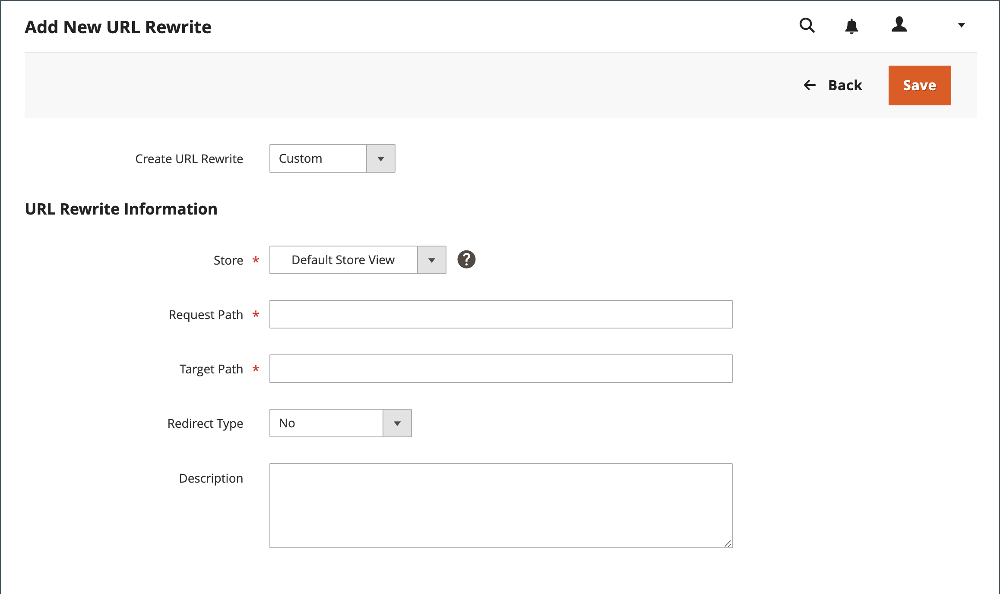

# Réécritures d’URL personnalisées

Une réécriture personnalisée peut être utilisée pour gérer diverses redirections, telles que la redirection d’une page de votre boutique vers un site web externe. Par exemple, vous pouvez avoir deux sites web Commerce, chacun disposant de son propre domaine. Vous pouvez utiliser une redirection personnalisée pour réacheminer les requêtes d’un produit, d’une catégorie ou d’une page vers l’autre site web. Contrairement aux autres types de redirection, la cible d’une redirection personnalisée n’est pas choisie dans une liste de pages existantes de votre magasin.

Avant de commencer, assurez-vous de comprendre exactement ce que la redirection doit accomplir. Pensez en termes de _cible_ / _source_ ou _rediriger vers_ / _rediriger depuis_. Bien que des personnes puissent toujours accéder à l’ancienne page à partir de moteurs de recherche ou de liens obsolètes, la redirection entraîne le passage de votre magasin vers la nouvelle cible.

## Étape 1. Planifier la réécriture

Pour éviter les erreurs, notez l’URL de la page _rediriger vers_ et la clé URL de la page _rediriger depuis_.

En cas de doute, ouvrez chaque page, puis copiez l’URL à partir de la barre d’adresse de votre navigateur.

**Exemple**

Rediriger vers :

    

Rediriger depuis :

    cms-page
    category.html
    category/subcategory.html
    product.html
    category/product.html

## Étape 2. Créer la réécriture

{{url-rewrite-params}}

1. Dans la barre latérale _Admin_, accédez à **[!UICONTROL Marketing]** > _[!UICONTROL SEO & Search]_>**[!UICONTROL URL Rewrites]**.

1. Avant de poursuivre, procédez comme suit pour vérifier que le chemin d’accès de la requête est disponible :

   - Dans le filtre de recherche en haut de la colonne **[!UICONTROL Request Path]**, saisissez la clé URL de la page à rediriger et cliquez sur **[!UICONTROL Search]**.

   - S’il existe plusieurs enregistrements de redirection pour la page, recherchez celui qui correspond à la vue de magasin applicable et ouvrez-le en mode d’édition.

   - Dans le coin supérieur droit, cliquez sur **[!UICONTROL Delete]**. Lorsque vous y êtes invité, cliquez sur **[!UICONTROL OK]** pour confirmer.

1. Lorsque vous revenez à la page Réécritures d’URL, cliquez sur **[!UICONTROL Add URL Rewrite]**.

1. Définissez **[!UICONTROL Create URL Rewrite]** sur `Custom`.

   {width="600" zoomable="yes"}

1. Sous Informations sur la réécriture d’URL, procédez comme suit :

   - Si vous disposez de plusieurs vues de magasin, sélectionnez la **[!UICONTROL Store]** à laquelle la réécriture s’applique.

   - Par **[!UICONTROL Request Path]**, saisissez la clé URL et le chemin, le cas échéant, du produit, de la catégorie ou de la page CMS à rediriger.

     >[!NOTE]
     >
     >Le chemin d’accès de la requête doit être unique pour le magasin spécifié. S’il existe déjà une redirection qui utilise le même chemin de requête, vous recevez une erreur lorsque vous essayez d’enregistrer la redirection. La redirection précédente doit être supprimée avant de pouvoir en créer une.

   - Par **[!UICONTROL Target Path]**, saisissez l’URL de la destination. Si la cible se trouve sur un autre site web, saisissez l’URL complète.

   - Définissez **Rediriger** sur l’une des options suivantes :

      - `Temporary (302)`
      - `Permanent (301)`

   - À titre de référence, saisissez une brève description de la réécriture.

1. Avant d’enregistrer la redirection, vérifiez les points suivants :

   - La [!UICONTROL Request Path] contient la clé URL ou le chemin d’accès de la page _redirection à partir de_ d’origine.
   - La [!UICONTROL Target Path] contient l’URL de la page _rediriger vers_.

1. Cliquez ensuite sur **[!UICONTROL Save]**.

   La nouvelle réécriture apparaît dans la grille en haut de la liste.

## Étape 3. Tester le résultat

1. Accédez à la page d’accueil de votre boutique.

1. Effectuez l’une des opérations suivantes :

   - Accédez à la page d’origine _rediriger depuis_.
   - Dans la barre d’adresse du navigateur, saisissez le nom de la page d’origine _rediriger depuis_ immédiatement après l’URL du magasin et appuyez sur **Entrée**.

   La nouvelle page cible s’affiche à la place de la requête de page d’origine.

## Descriptions des champs

| Champ | Description |
|--- |--- |
| [!UICONTROL Create URL Rewrite] | Indique le type de réécriture. Le type ne peut pas être modifié une fois la réécriture créée. Options : `Custom` / `For category` / `For product` / `For CMS page` |
| [!UICONTROL Request Path] | Page à rediriger. Le chemin d’accès de la requête doit être unique et ne peut pas être utilisé par une autre redirection. Si vous recevez un message d’erreur indiquant que le chemin de requête existe, supprimez la redirection existante et réessayez. |
| [!UICONTROL Target Path] | Chemin d’accès interne utilisé par le système pour pointer vers la destination. Le chemin cible est grisé et ne peut pas être modifié. |
| [!UICONTROL Redirect] | Détermine le type de redirection. Options :  **Non** - Aucune redirection n’est spécifiée.  **[!UICONTROL Temporary (302)]**- Indique aux moteurs de recherche que la réécriture est limitée dans le temps. Les moteurs de recherche ne conservent généralement pas les informations de classement de page pour les réécritures temporaires. **[!UICONTROL Permanent (301)]** - Indique aux moteurs de recherche que la réécriture est permanente. Les moteurs de recherche conservent généralement les informations de classement de page pour les réécritures permanentes. |
| [!UICONTROL Description] | Décrit l’objectif de la réécriture à des fins de référence interne. |

{style="table-layout:auto"}
