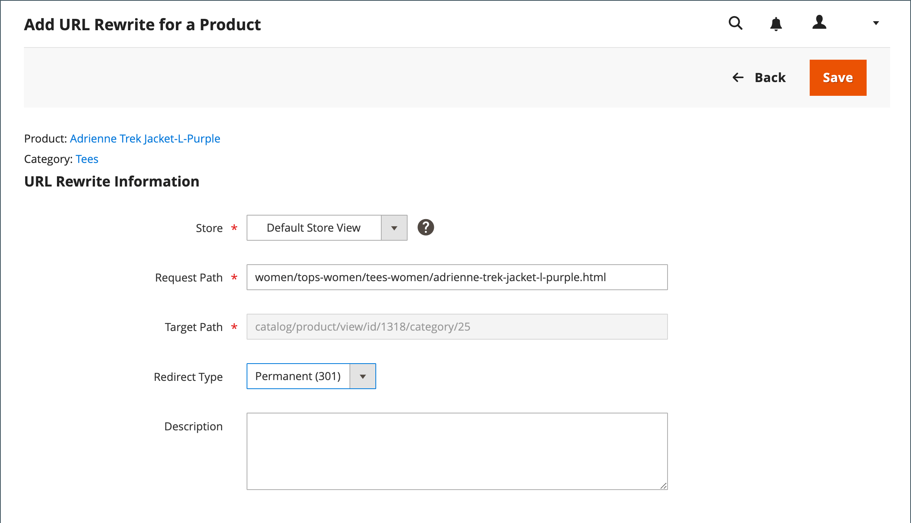

# Réécritures d’URL de produit

Avant de commencer, assurez-vous de comprendre exactement ce que la redirection doit accomplir. Pensez en termes de _cible_ / _requête originale_ ou _rediriger vers_ / _rediriger depuis_. Bien que des personnes puissent toujours accéder à l’ancienne page à partir de moteurs de recherche ou de liens obsolètes, la redirection entraîne le passage de votre magasin vers la nouvelle cible.

Si les [redirections automatiques](url-redirect-product-automatic.md) sont activées pour votre boutique, il n’est pas nécessaire de créer une réécriture lorsqu’un produit [clé d’URL](../catalog/catalog-urls.md) est modifié.

{{url-rewrite-skip}}

## Étape 1. Planifier la réécriture

Pour éviter les erreurs, notez le chemin _redirection vers_ et le chemin _redirection depuis_ et incluez la clé d’URL et le suffixe (le cas échéant).

En cas de doute, ouvrez chaque page de produit de votre boutique et copiez le chemin d’accès à partir de la barre d’adresse de votre navigateur. Lors de la création d’une redirection de produit, vous pouvez inclure ou exclure le [chemin de catégorie](../catalog/catalog-urls.md). Pour cet exemple, nous créons une redirection de produit sans chemin de catégorie.

### Produit avec chemin d’accès de catégorie

Rediriger vers : `gear/bags/impulse-duffle.html`

Rediriger depuis : `gear/bags/overnight-duffle.html`

### Produit sans chemin d’accès de catégorie

Rediriger vers : `impulse-duffle.html`

Rediriger depuis : `overnight-duffle.html`

## Étape 2. Créer la réécriture

{{url-rewrite-params}}

1. Dans la barre latérale _Admin_, accédez à **[!UICONTROL Marketing]** > _[!UICONTROL SEO & Search]_>**[!UICONTROL URL Rewrites]**.

1. Avant de poursuivre, procédez comme suit pour vérifier que le chemin d’accès de la requête est disponible.

   - Dans le filtre de recherche en haut de la colonne **[!UICONTROL Request Path]**, saisissez la clé URL de la page à rediriger et cliquez sur **[!UICONTROL Search]**.

   - S’il existe plusieurs enregistrements de redirection pour la page, recherchez celui qui correspond à la vue de magasin applicable et ouvrez-le en mode d’édition.

   - Dans le coin supérieur droit, cliquez sur **[!UICONTROL Delete]**. Lorsque vous y êtes invité, cliquez sur **[!UICONTROL OK]** pour confirmer.

1. Dans le coin supérieur droit de la page Réécritures d’URL, cliquez sur **Ajouter une réécriture d’URL**.

1. Définissez **[!UICONTROL Create URL Rewrite]** sur `For product`.

1. Dans la grille, recherchez le produit qui est la cible (destination) de la redirection et cliquez sur la ligne.

   {width="700" zoomable="yes"}

1. Sous l’arborescence des catégories, cliquez sur **[!UICONTROL Skip Category Selection]**.

   Pour cet exemple, la redirection n’inclut pas de catégorie.

   {width="600" zoomable="yes"}

   La page Ajouter une réécriture d’URL pour un produit affiche un lien vers la cible dans le coin supérieur gauche, et le champ Chemin cible affiche la version système du chemin, qui ne peut pas être modifiée. Au départ, le champ Chemin de redirection affiche également le chemin cible.

   - Si vous disposez de plusieurs vues de magasin, définissez **[!UICONTROL Store]** sur la vue à laquelle la réécriture s’applique. Dans le cas contraire, une réécriture est créée pour chaque vue.

   - Par **[!UICONTROL Request Path]**, remplacez la valeur par défaut en saisissant la clé URL et le suffixe (le cas échéant) de la demande de produit d’origine. Il s’agit du produit _redirection depuis_ que vous avez identifié à l’étape de planification.

     >[!NOTE]
     >
     >Le chemin d’accès de la requête doit être unique pour le magasin spécifié. S’il existe déjà une redirection qui utilise le même chemin de requête, vous recevez une erreur lorsque vous essayez d’enregistrer la redirection. La redirection précédente doit être supprimée avant de pouvoir en créer une.

   - Définissez **[!UICONTROL Redirect Type]** sur l’une des options suivantes :

      - `Temporary (302)`
      - `Permanent (301)`

   - À titre de référence, saisissez un bref **[!UICONTROL Description]** de la réécriture.

   {width="600" zoomable="yes"}

1. Avant d’enregistrer la redirection, vérifiez les points suivants :

   - Le lien situé dans le coin supérieur gauche affiche le nom du produit cible.
   - Le chemin de la requête contient le chemin d’accès au produit d’origine _redirection depuis_.

1. Cliquez ensuite sur **[!UICONTROL Save]**.

   La nouvelle réécriture du produit s’affiche désormais en haut de la grille Réécritures d’URL.

## Étape 3. Tester le résultat

1. Accédez à la page d’accueil de votre boutique.

1. Effectuez l’une des opérations suivantes :

   - Accédez à la page de demande de produit d’origine _redirection depuis_.
   - Dans la barre d’adresse du navigateur, saisissez le chemin d’accès au produit d’origine _rediriger depuis_ immédiatement après l’URL du magasin et appuyez sur **Entrée**.

   Le nouveau produit cible s’affiche à la place de la demande de produit d’origine.

## Descriptions des champs

| Champ | Description |
|--- |--- |
| [!UICONTROL Create URL Rewrite] | Indique le type de réécriture. Le type ne peut pas être modifié une fois la réécriture créée. Options : `Custom` / `For category` / `For product` / `For CMS page` |
| [!UICONTROL Request Path] | Produit à rediriger. Selon votre configuration, le chemin d’accès de la requête peut inclure le suffixe `.html` ou `.htm`, ainsi que la catégorie. Le chemin d’accès de la requête doit être unique et ne peut pas être utilisé par une autre redirection. Si vous recevez une erreur indiquant que le chemin de requête existe, supprimez la redirection existante, puis réessayez. |
| [!UICONTROL Target Path] | Chemin d’accès interne utilisé par le système pour pointer vers la destination de la redirection. Le chemin cible est grisé et ne peut pas être modifié. |
| [!UICONTROL Redirect] | Détermine le type de redirection. Options :  **[!UICONTROL No]**- Aucune redirection n’est spécifiée. De nombreuses opérations créent des demandes de redirection de ce type. Par exemple, chaque fois que vous ajoutez des produits à une catégorie, une redirection de type `No` est créée dans chaque vue de magasin. **[!UICONTROL Temporary (302)]** - Indique aux moteurs de recherche que la réécriture est limitée dans le temps. Les moteurs de recherche ne conservent généralement pas les informations de classement de page pour les réécritures temporaires.  **[!UICONTROL Permanent (301)]**- Indique aux moteurs de recherche que la réécriture est permanente. Les moteurs de recherche conservent généralement les informations de classement de page pour les réécritures permanentes. |
| [!UICONTROL Description] | Décrit l’objectif de la réécriture à des fins de référence interne. |

{style="table-layout:auto"}

## Plusieurs réécritures d’URL

Vous pouvez rapidement mettre à jour les réécritures d’URL pour plusieurs ou tous les produits simultanément en procédant comme suit.

1. Dans la barre latérale _Admin_, accédez à **[!UICONTROL Catalog]** > **[!UICONTROL Products]**.

1. Sélectionnez tous les produits pour lesquels vous souhaitez mettre à jour les réécritures d’URL.

1. Sous _[!UICONTROL Actions]_, choisissez **[!UICONTROL Update attributes]**pour mettre à jour plusieurs réécritures ou toutes les réécritures.

1. Sous _[!UICONTROL PRODUCTS INFORMATION]_, cliquez sur l’onglet **[!UICONTROL Websites]**.

1. Dans la section _[!UICONTROL Add Product To Websites]_, sélectionnez tous les sites web pour lesquels vous souhaitez restaurer les réécritures d’URL.

1. Une fois prêt à mettre à jour, cliquez sur **[!UICONTROL Save]**.

>[!NOTE]
>
>Tous les produits sélectionnés sont rajoutés aux sites web sélectionnés et les réécritures d’URL sont régénérées.

{width="600" zoomable="yes"}
