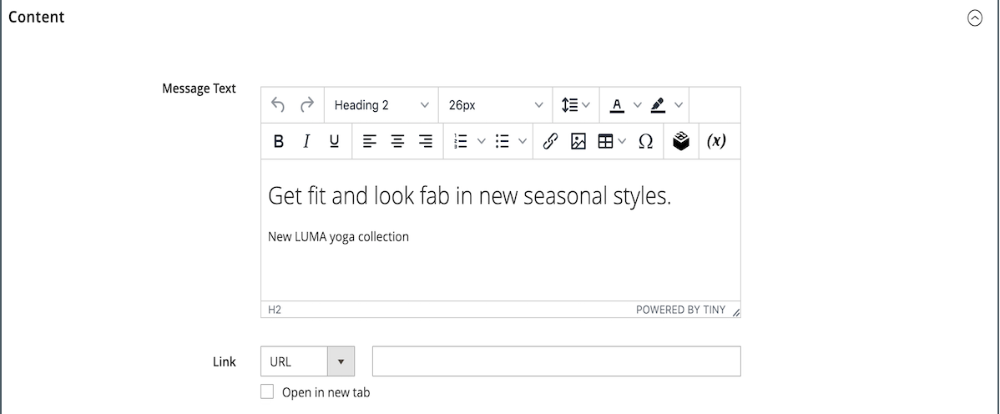
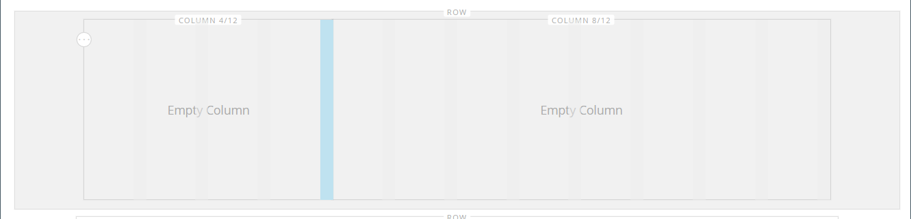
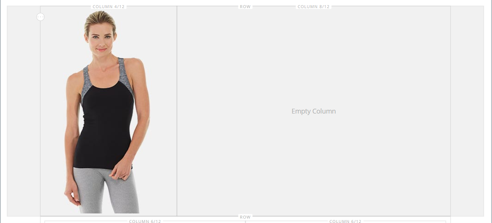
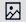
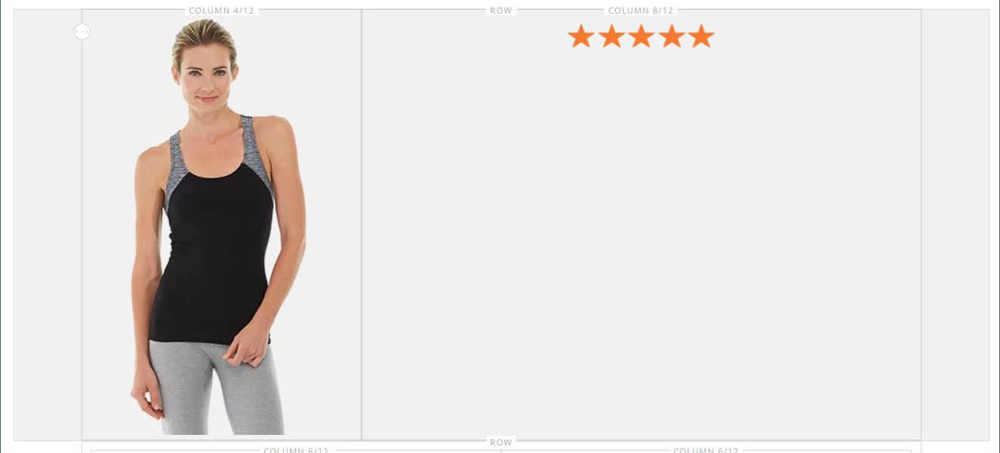
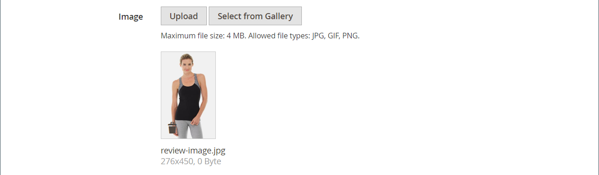
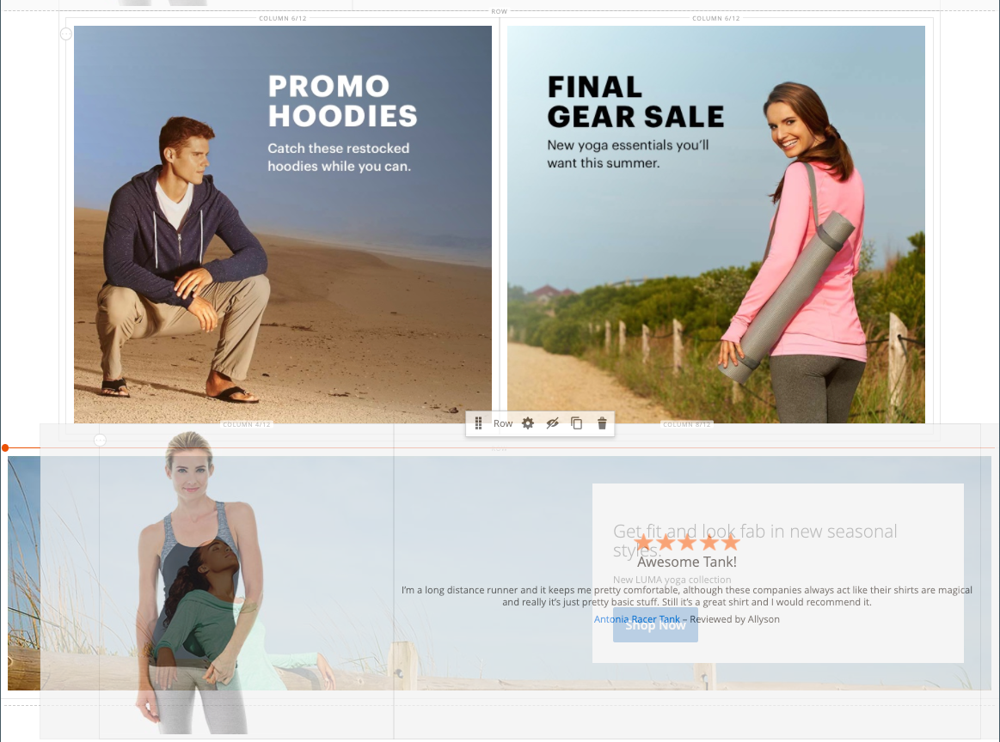

# [!DNL Page Builder] Présentation de la partie 1 : page simple

Suivez cet exercice en trois parties pour vous familiariser avec la méthode [!DNL Page Builder] espace de travail en créant une page simple qui illustre la facilité de créer des pages riches en contenu de votre propre conception.

{width="700" zoomable="yes"}

>[!NOTE]
>
>Ces exercices pratiques sont mis à jour pour prendre en compte les modifications récentes apportées à la variable [!DNL Page Builder] dans la version 2.4.1. Si vous utilisez une version antérieure d’Adobe Commerce, utilisez la variable [!DNL Page Builder] exercices de présentation présentés dans la section [[!DNL Commerce] 2.3 Guide de l’utilisateur](https://docs.magento.com/user-guide/v2.3/cms/page-builder-learn.html).

## Avant de commencer

Avant de commencer cet exercice, il est recommandé d’augmenter le [Durée de vie de la session d’administration](../systems/security-admin.md) pour empêcher l’expiration de la session pendant que vous travaillez.

Vérifiez les paramètres de configuration requis pour la gestion de contenu :

- L’éditeur WYSIWYG est activé dans [Options WYSIWYG](../content-design/editor.md#configure-the-editor) configuration.

- [!DNL Page Builder] est activé dans la variable [Outils de contenu avancé](setup.md) configuration.

### Téléchargement des ressources d’image de présentation

1. Téléchargez la [`simple-page-assets`](./assets/simple-page-assets.zip) et enregistrez le fichier sur votre système local.

1. Accédez au fichier téléchargé et extrayez les fichiers compressés.

   Sur un système Windows, cliquez avec le bouton droit de la souris et choisissez **[!UICONTROL Extract All]** fichiers . Sélectionnez ensuite le dossier de destination, puis cliquez sur **[!UICONTROL Extract]**.

   Sur un système Mac, vous pouvez simplement double-cliquer sur le fichier zip et déplacer les fichiers extraits vers le dossier de destination.

   Le dossier contient les fichiers image suivants :

   ![[!DNL Page Builder] fichiers de présentation - ressources de page simples](./assets/pb-tutorial-simple-page-assets.png){width="500"}

Suivez les trois parties de cette présentation dans l’ordre.

## Partie 1 : rangée entière avec bannière

Dans cette partie de l’exercice Page simple, vous créez une page qui comporte une rangée de fond perdu et une bannière. La ligne comporte différentes images d’arrière-plan pour les ordinateurs de bureau et les appareils mobiles.

![[!DNL Page Builder] ligne de fond perdu avec bannière](./assets/pb-tutorial1-full-bleed-with-banner.png){width="700" zoomable="yes"}

### Étape 1 : création d’une page

1. Sur le _Administration_ barre latérale, accédez à **[!UICONTROL Content]** > _[!UICONTROL Elements]_>**[!UICONTROL Pages]**.

1. Dans le coin supérieur droit, cliquez sur **[!UICONTROL Add New Page]** et procédez comme suit :

   - Pour empêcher la publication de cette page dans votre boutique, définissez **[!UICONTROL Enable Page]** to `No`.

   - Pour **[!UICONTROL Page Title]**, saisissez `Simple Page`.

   {width="600" zoomable="yes"}

1. Développer  la valeur **[!UICONTROL Design]** .

   Notez que **[!UICONTROL Layout]** est défini sur `Page -- Full Width` par défaut. En plus des cinq standards [layout](../content-design/page-layout.md) options, [!DNL Page Builder] ajoute des mises en page pleine largeur pour les pages, les catégories et les produits.

1. Si les exemples de données sont disponibles, définissez **[!UICONTROL New Theme]** to `Magento Luma`. Sinon, vous pouvez choisir un autre thème disponible ou le laisser vide pour utiliser le thème par défaut.

   La variable _[!UICONTROL New Theme]_peut être utilisé pour remplacer le thème par défaut et pour appliquer un autre thème à la page.

   >[!NOTE]
   >
   >La disposition Largeur complète ne peut être utilisée qu’avec un paramètre compatible [thème](../content-design/themes.md).

   {width="600" zoomable="yes"}

1. Dans le coin supérieur droit, cliquez sur **[!UICONTROL Save]**.

   Lorsque la page est enregistrée, le nom _Page simple_ s’affiche dans le coin supérieur gauche de la page.

### Étape 2 : mise en forme de la ligne

1. Développer  la valeur **[!UICONTROL Content]** .

   Cette action affiche la variable [!DNL Page Builder] prévisualisez avec une ligne vide.

   >[!NOTE]
   >
   >La variable [En-tête du contenu](workspace.md) est facultatif. Par défaut, il est formaté en tant qu’en-tête de niveau 1 (H1) en fonction du thème. Pour cet exercice, la variable _En-tête du contenu_ n’est pas renseignée.

   {width="600" zoomable="yes"}

1. Cliquez sur **[!UICONTROL Edit with Page Builder]** ou dans la zone d’aperçu du contenu.

   Dans le [!DNL Page Builder] [workspace](workspace.md), le panneau de gauche fournit les outils de contenu que vous pouvez utiliser pour créer votre contenu dans l’étape.

1. Passez la souris sur la ligne vide pour afficher la boîte à outils.

   Chaque conteneur de contenu comporte une boîte à outils avec un ensemble d’options similaire.

   ![[!DNL Page Builder] boîte à outils row](./assets/pb-layout-page-add-content-row-tools.png){width="600" zoomable="yes"}

1. Dans la boîte à outils Rangée, sélectionnez l’option _Paramètres_ ({width="20"} Icône

1. Sous _[!UICONTROL Appearance]_, choisissez **Fond perdu**.

   Le paramètre d’aspect Plein lit étend les bordures gauche et droite de la zone de contenu de la ligne et de l’arrière-plan sur toute la largeur de la page.

   {width="600" zoomable="yes"}

1. Faites défiler l’écran vers le bas jusqu’à _[!UICONTROL Advanced]_et définissez tous les **[!UICONTROL Margins and Padding]**à `0`.

   Ce paramètre garantit que la bannière étend la largeur complète de la ligne.

   {width="600" zoomable="yes"}

1. Pour enregistrer les paramètres et revenir au [!DNL Page Builder] espace de travail, faites défiler la page vers le haut, puis cliquez sur **[!UICONTROL Save]** dans le coin supérieur droit.

### Étape 3 : Ajout d’une bannière

>[!NOTE]
>
>[!DNL Page Builder] possède un nouveau type de contenu appelé _Bannière_, qui est présenté dans cette étape. Qu’était-ce qui était auparavant le _Bannière_ dans le menu Contenu , est désormais une _Bloc dynamique_.

1. Dans le [!DNL Page Builder] panneau, développer **[!UICONTROL Media]** et faites glisser un **Bannière** espace réservé sur la scène.

   {width="600" zoomable="yes"}
1. Passez la souris sur le conteneur de bannière pour afficher la boîte à outils.

   >[!NOTE]
   >
   >L’étape comporte désormais deux conteneurs de contenu, chacun avec une boîte à outils distincte. Comme la bannière est imbriquée dans la ligne, assurez-vous que vous travaillez dans la boîte à outils appropriée.

   Outre la boîte à outils, la variable _Télécharger l’image_ et _Sélectionner dans la galerie_ sont inclus afin que vous puissiez apporter rapidement des modifications à la bannière directement depuis l’étape.

   {width="600" zoomable="yes"}

1. Dans la boîte à outils de la bannière, choisissez la variable _Paramètres_ ( {width="20"} ).

1. Sous _[!UICONTROL Appearance]_, choisissez **[!UICONTROL Collage Right]**.

   Le paramètre Collage à droite positionne le contenu sur le côté droit de la bannière.

   {width="600" zoomable="yes"}

1. Faites défiler l’écran vers le bas jusqu’à _[!UICONTROL Background]_et définissez l’image d’arrière-plan de la bannière :

   - Pour **[!UICONTROL Background Image]**, cliquez sur **Télécharger**.

     {width="600" zoomable="yes"}

     Accédez au répertoire dans lequel vous avez enregistré les ressources de page simples extraites et sélectionnez l’option `wide-banner-background.jpg` fichier .

     L’image est téléchargée et une miniature de l’image téléchargée s’affiche. Le nom du fichier, les dimensions de l’image et la taille du fichier sont indiqués ci-dessous.

     {width="600" zoomable="yes"}

   - Pour **[!UICONTROL Background Mobile Image]**, cliquez sur **Télécharger**.

     Dans le même répertoire de fichiers, choisissez la variable `wide-banner-background-mobile.jpg` fichier .

     L’image d’arrière-plan mobile est utilisée pour les appareils mobiles, ainsi que chaque fois qu’une fenêtre du navigateur de bureau est redimensionnée à la largeur d’un appareil mobile.

     {width="600" zoomable="yes"}

   - Faites défiler la page vers le haut et cliquez sur **[!UICONTROL Save]** pour enregistrer les paramètres et revenir au [!DNL Page Builder] workspace.

     L’arrière-plan s’affiche sur la scène et étend la largeur totale de la ligne.

     {width="600" zoomable="yes"}

   Remarquez le texte d’espace réservé qui s’affiche sur le côté droit de la ligne. La position de ce texte reflète la _Collage à droite_ paramètre d’aspect.

1. Cliquez sur le texte de l’espace réservé, puis saisissez le message suivant en deux lignes :

   `Get fit and look fab in new seasonal styles.`

   `New LUMA yoga collection`

   La barre d’outils de l’éditeur s’affiche au-dessus de la zone de texte. Le texte peut être saisi et formaté directement à partir de l’étape ou en choisissant _Paramètres_ dans la boîte à outils de la bannière.

   {width="600" zoomable="yes"}

1. Appliquer la mise en forme au texte :

   - Sélectionnez la première ligne de texte. Ensuite, dans la barre d’outils de l’éditeur, sous **Formats**, choisissez `Heading 2`.

     {width="600" zoomable="yes"}

   - Sélectionnez la deuxième ligne de texte. Ensuite, dans la barre d’outils de l’éditeur, sous **Formats**, choisissez `Paragraph`.

   Les paramètres de format appliquent les styles de la feuille de style associée au thème actif.

   {width="600" zoomable="yes"}
__

1. Pointez sur la boîte à outils de la bannière pour l’afficher. Sélectionnez _Paramètres_ ( {width="20"} ), puis faites défiler l’écran jusqu’à l’icône _[!UICONTROL Content]_.

   Votre texte s’affiche dans la variable _Texte du message_ de la boîte. Le texte peut être saisi et modifié à partir de l’étape ou du _[!UICONTROL Content]_des paramètres de la bannière.

   {width="600" zoomable="yes"}

1. Dans la section _[!UICONTROL Content]_, définissez le lien et le bouton de la bannière :

   - Définir **Lien** to `Category`, puis cliquez sur **[!UICONTROL Select]** pour afficher l’arborescence des catégories.

   - Choisir `What's New` comme catégorie liée.

     {width="600" zoomable="yes"}

   - Définir **[!UICONTROL Show Button]** to `Always`.

   - Pour **[!UICONTROL Button Text]**, saisissez `Shop Now` comme texte qui s’affiche sur le bouton.

   - Pour **[!UICONTROL Button Type]**, acceptez la variable `Primary` par défaut.

     Le style du bouton du thème actif détermine le format du bouton.

1. Définissez la superposition de la bannière :

   Vous pouvez utiliser une superposition pour appliquer une couleur d’arrière-plan à la zone de contenu active définie par le paramètre Apparence . L’image d’arrière-plan de la bannière reste visible pendant toute la largeur de la bannière.

   - Définir **[!UICONTROL Show Overlay]** to `Always`.

   - Pour **[!UICONTROL Overlay Color]**, effectuez l’une des opérations suivantes :

      - Cliquez sur le carré de couleur et choisissez l’échantillon blanc.
      - Cliquez sur dans le _Aucune couleur_ zone de texte et saisissez `White` ou la valeur hexadécimale `#ffffff`.

     Cliquez ensuite sur **[!UICONTROL Apply]**.

     {width="600" zoomable="yes"}

   - Faites défiler la page vers le haut et cliquez sur **[!UICONTROL Save]** pour enregistrer les paramètres et revenir au [!DNL Page Builder] workspace.

     Le bouton s’affiche sous le message de bannière sur la scène.

     {width="600" zoomable="yes"}

1. Dans le coin supérieur droit de l’étape, cliquez sur le bouton _Fermer le plein écran_ ().

   Cliquez sur cette icône pour revenir au _[!UICONTROL Content]_pour la page avec l’aperçu affiché.

   Vous pouvez basculer entre les deux modes de l’espace de travail à tout moment.

1. Dans le coin supérieur droit, cliquez sur le bouton **[!UICONTROL Save]** flèche et choisissez **[!UICONTROL Save & Close]**.

1. Si vous y êtes invité, cliquez sur le bouton [Gestion du cache](../systems/cache-management.md) dans le message en haut de la page et actualisez le cache non valide.

## Partie 2 : ligne contenue avec deux colonnes égales

Dans cette partie de l’exercice, vous ajoutez une ligne à la page et divisez la ligne en deux colonnes égales. Vous ajoutez ensuite une image liée à chaque colonne. Dans les instructions, chaque nouvelle ligne est ajoutée avant la première pour que la variable [!DNL Page Builder] s’aligne sur la scène. À la fin de l’exercice, vous réorganisez les lignes afin qu’elles correspondent à l’exemple Page simple .

{width="600" zoomable="yes"}

### Étape 1 : Ajouter une ligne

1. Dans la grille Pages , recherchez le _Page simple_ que vous avez créé dans la première partie de cet exercice et sélectionnez **[!UICONTROL Edit]** dans le _[!UICONTROL Action]_colonne .

1. Développer  la valeur **[!UICONTROL Content]** .

1. Cliquez sur **[!UICONTROL Edit with Page Builder]** ou dans la zone d’aperçu du contenu.

1. Dans le [!DNL Page Builder] panneau sous _[!UICONTROL Layout]_, faites glisser un **[!UICONTROL Row]**positionnez-le au-dessus de la bannière.

   La ligne directrice rouge marque la limite entre les deux lignes.

   {width="600" zoomable="yes"}

1. Passez la souris sur la nouvelle ligne pour afficher la boîte à outils et sélectionnez l’option _Paramètres_ ( {width="20"} ).

   {width="600" zoomable="yes"}

1. Sous _[!UICONTROL Appearance]_, acceptez la variable **Contenu**paramètre par défaut.

   Ce paramètre limite la zone de contenu de la rangée à la largeur de la page telle que définie par le thème.

   {width="600" zoomable="yes"}

1. Dans le coin supérieur droit, cliquez sur **[!UICONTROL Save]** pour enregistrer les paramètres et revenir au [!DNL Page Builder] workspace.

### Etape 2 : Ajouter une colonne

1. Dans le [!DNL Page Builder] panneau sous _[!UICONTROL Layout]_, faites glisser un **[!UICONTROL Column]**balise d’emplacement de la nouvelle ligne.

   {width="600" zoomable="yes"}

   La ligne est maintenant divisée en deux colonnes de largeur égale. Chaque colonne est un conteneur distinct pour le contenu avec sa propre boîte à outils dédiée d’options.

   {width="600" zoomable="yes"}

1. Dans le coin supérieur gauche de la première colonne, cliquez sur la circulaire _Grille_ control () pour afficher les directives de grille.

   La grille garantit que le contenu est aligné de manière cohérente et qu’il s’affiche correctement sur les ordinateurs de bureau et les appareils mobiles. Pour plus d’informations sur la configuration de la taille de grille, voir la section [Configurer [!DNL Page Builder]](setup.md#configure-page-builder) dans la section [!DNL Page Builder] Rubrique Configuration.

   Les nombres entre parenthèses (6/12) dans la bordure supérieure de chaque conteneur de colonnes indiquent le nombre de divisions de grille dans chaque colonne, ainsi que le nombre total de divisions dans la ligne.

   {width="600" zoomable="yes"}

### Etape 3 : Ajout d&#39;images avec des liens

Au cours de cette étape, vous apprendrez à télécharger une image sur la bannière.

1. Dans le [!DNL Page Builder] , développez l’objet **[!UICONTROL Media]** et faites glisser un **[!UICONTROL Image]** balise d’emplacement de la première colonne.

   {width="600" zoomable="yes"}

1. Insérez l’exemple d’image dans l’espace réservé.

   {width="600" zoomable="yes"}

   Pour l’image am qui se trouve sur votre système, vous pouvez choisir l’une des méthodes suivantes :

   - **Chargement du fichier image**: dans la première colonne, cliquez sur **[!UICONTROL Upload Image]**. Ensuite, accédez au répertoire dans lequel vous avez enregistré les ressources de page simples extraites et choisissez l’option `small-banner-1.jpg` fichier .

     {width="600" zoomable="yes"}

     Répétez cette action pour ajouter le `small-banner-2.jpg` dans la seconde colonne.

   - **Faire glisser le fichier image**: sur votre bureau, ouvrez le dossier de ressources de page simple et positionnez-le à côté de la fenêtre du navigateur d’administration dans laquelle vous travaillez avec [!DNL Page Builder] scène. Faites ensuite glisser le fichier `small-banner-1.jpg` à partir du dossier de ressources de page simple, puis déposez-le dans la première colonne.

     {width="600" zoomable="yes"}

     Répétez cette action pour ajouter le `small-banner-2.jpg` dans la seconde colonne.

1. Déterminez la page de votre catalogue que vous souhaitez lier à chaque image.

1. Passez la souris sur l’image dans la première colonne pour afficher la boîte à outils et sélectionnez l’option _Paramètres_ ( {width="20"} ).

   {width="600" zoomable="yes"}

1. Associez l’image à une catégorie :

   - Faire défiler vers le bas et définir **Lien** to `Category`.

   - Dans l’arborescence des catégories, effectuez une analyse approfondie et sélectionnez la variable `Men's Hoodies & Sweatshirt` catégorie.

   - Dans le coin supérieur droit, **[!UICONTROL Save]** les paramètres et revenez à la [!DNL Page Builder] workspace.

1. Répétez l’étape précédente pour associer l’image de la deuxième colonne au _Gear_ catégorie.

1. Dans le coin supérieur droit de l’étape, cliquez sur le bouton _Fermer le plein écran_ ().

   Cliquez sur cette icône pour revenir au _[!UICONTROL Content]_pour la page avec l’aperçu affiché.

1. Dans le coin supérieur droit, cliquez sur le bouton **[!UICONTROL Save]** flèche et choisissez **[!UICONTROL Save & Close]**.

1. Lorsque vous y êtes invité, cliquez sur l’icône [Gestion du cache](../systems/cache-management.md) dans le message en haut de la page et actualisez le cache non valide.

## Partie 3 : rangée pleine largeur avec des colonnes inégales

La dernière ligne de cette page contient le contenu d’une révision de produit. Vous ajoutez une ligne pleine largeur et la divisez en deux colonnes de largeurs différentes. Une image d’arrière-plan est ajoutée à la première colonne, avec une couleur d’arrière-plan correspondante appliquée à la ligne pour un effet unifié.

{width="500"}

### Étape 1 : Ajouter une ligne

1. Dans la grille Pages , recherchez le _Page simple_ que vous avez créé dans la première partie de cet exercice et sélectionnez **[!UICONTROL Edit]** dans le _[!UICONTROL Action]_colonne .

1. Développer  la valeur **[!UICONTROL Content]** .

1. Cliquez sur **[!UICONTROL Edit with Page Builder]** ou dans la zone d’aperçu du contenu.

1. Dans le [!DNL Page Builder] panneau sous _[!UICONTROL Layout]_, faites glisser un **[!UICONTROL Row]**espace réservé sur l’étape et placez-le au-dessus de la ligne qui a été créée dans la deuxième partie de cet exercice.

   Une ligne guide rouge marque la limite entre les deux lignes.

   {width="600" zoomable="yes"}

1. Passez la souris sur la nouvelle ligne pour afficher la boîte à outils et sélectionnez l’option _Paramètres_ ({width="20"} ).

   {width="600" zoomable="yes"}

1. Sur la page Modifier la ligne sous _[!UICONTROL Appearance]_, choisissez **[!UICONTROL Full Width]**.

   Ce paramètre limite la zone de contenu à la largeur maximale de page définie par le thème. La couleur et/ou l’image d’arrière-plan ne sont pas limitées et s’étendent sur toute la largeur de la ligne.

   {width="600" zoomable="yes"}

1. Dans le _[!UICONTROL Background]_, saisissez `#f1f1f1` comme la propriété&#x200B;**[!UICONTROL Background Color]**.

   {width="600" zoomable="yes"}

1. Faites défiler l’écran vers le bas jusqu’à _[!UICONTROL Advanced]_et définissez tous les **Marges et marge intérieure**valeurs à `0`.

   {width="600" zoomable="yes"}

1. Faites défiler la page vers le haut et cliquez sur **[!UICONTROL Save]** pour enregistrer les paramètres et revenir au [!DNL Page Builder] workspace.

   La couleur d’arrière-plan de la rangée est désormais un beige pâle.

   {width="600" zoomable="yes"}

### Etape 2 : Ajouter des colonnes de largeurs différentes

1. Dans le [!DNL Page Builder] panneau sous _[!UICONTROL Layout]_, faites glisser un **[!UICONTROL Column]**espace réservé sur la rangée supérieure de l’étape.

   {width="600" zoomable="yes"}

1. Faites glisser la bordure droite de la première colonne sur les quatre de 12 (`4/12`) sur la grille.

   La taille de la seconde colonne s’ajuste à huit sur 12 (`8/12`).

   {width="600" zoomable="yes"}

1. Passez la souris sur le conteneur de la première colonne pour afficher la boîte à outils et sélectionnez l’option _Paramètres_ ( {width="20"} ).

1. Faites défiler l’écran vers le bas jusqu’à _[!UICONTROL Advanced]_et définissez tous les **Marges et marge intérieure**valeurs à `0`.

   {width="600" zoomable="yes"}

1. Faites défiler la page vers le haut et cliquez sur **[!UICONTROL Save]** pour enregistrer les paramètres et revenir au [!DNL Page Builder] workspace.

### Etape 3 : Ajouter une image dans la première colonne

1. Dans le [!DNL Page Builder] panneau, développer **[!UICONTROL Media]** et faites glisser un **[!UICONTROL Image]** type de contenu dans la première colonne.

   {width="600" zoomable="yes"}

1. Dans l’espace réservé de l’image, cliquez sur **[!UICONTROL Upload Image]**.

   {width="600" zoomable="yes"}

1. Accédez au répertoire dans lequel vous avez enregistré les ressources de page simples extraites et sélectionnez l’option `review-image.jpg` fichier .

   L’image chargée apparaît dans la première colonne et se fond parfaitement avec la couleur d’arrière-plan de la ligne.

   {width="600" zoomable="yes"}

### Étape 4 : Ajout du contenu de la révision à la deuxième colonne

La deuxième colonne de la ligne doit contenir le contenu d’une révision par le client, y compris l’image d’évaluation cinq étoiles et le message texte formaté.

1. Dans le [!DNL Page Builder] , développez l’objet **[!UICONTROL Elements]** et faites glisser la **[!UICONTROL Text]** type de contenu dans la seconde colonne.

   {width="600" zoomable="yes"}

1. Cliquez sur dans l’élément de texte pour afficher la barre d’outils de l’éditeur.

1. Dans la barre d’outils, cliquez sur l’icône _Insérer une image_ () et procédez comme suit :

   {width="600" zoomable="yes"}

   - Dans le _[!UICONTROL Insert/edit image]_, cliquez sur_ Rechercher _(  ) en regard de l’icône_[!UICONTROL Source]_ champ .

     {width="600" zoomable="yes"}

   - Sur le _[!UICONTROL Select Images]_page, cliquez sur **[!UICONTROL Choose Files]**.

   - Dans le dossier où vous avez enregistré les ressources de page simples, choisissez `rating.png`.

   - De retour sur la page, double-cliquez sur la mosaïque de l’image pour la sélectionner et insérer son URL dans le champ Source .

     {width="600" zoomable="yes"}

   - Pour **[!UICONTROL Image Description]**, saisissez `5-Star Rating` et cliquez sur **[!UICONTROL OK]** pour insérer l’image dans la colonne.

   - Dans la barre d’outils de l’éditeur, cliquez sur **Centrer** () pour centrer l’image dans la colonne.

     {width="600" zoomable="yes"}

1. Placez le point d’insertion juste après l’image cinq étoiles, appuyez sur la touche Entrée/Retour pour commencer une nouvelle ligne, puis saisissez le texte suivant :

   `Awesome Tank!`

   `I'm a long distance runner and it keeps me pretty comfortable, although these companies always act like their shirts are magical and really it's just pretty basic stuff. Still it's a great shirt, and I would recommend it.`

   `Antonia Racer Tank – Reviewed by Allyson`

   Le texte est centré au fur et à mesure que vous tapez.

   {width="600" zoomable="yes"}

1. Mise en forme du texte :

   - Cliquez n’importe où dans la première ligne de texte et dans la barre d’outils de l’éditeur sous **Formats**, choisissez `Heading 2`.

   - Sélectionnez le texte restant, puis dans la barre d’outils de l’éditeur, sous **Formats**, choisissez `Paragraph`.

   Le texte est formaté selon la feuille de style associée au thème.

1. Obtenez les dimensions de l’image afin de centrer le contenu verticalement dans la colonne :

   - Passez la souris sur l’image dans la première colonne pour afficher la boîte à outils et sélectionnez l’option _Paramètres_ ({width="20"} ).

   - Sous la miniature de l’image, notez les dimensions de l’image.

     {width="600" zoomable="yes"}

   - Dans le coin supérieur droit, cliquez sur **Fermer**.

1. Centrer le contenu verticalement dans la seconde colonne :

   - Passez la souris sur la deuxième colonne pour afficher la boîte à outils et sélectionnez l’option _Paramètres_ ({width="20"} ).

   >[!NOTE]
   >
   >Veillez à sélectionner le conteneur de colonnes plutôt que le conteneur de texte pour afficher la boîte à outils appropriée.

   - Pour **[!UICONTROL Minimum Height]**, saisissez `450` comme hauteur en pixels de l’image dans la première colonne.

   - Définir **[!UICONTROL Vertical Alignment]** to `Center`.

   {width="600" zoomable="yes"}

1. Faites défiler l’écran vers le bas jusqu’à _[!UICONTROL Advanced]_et définissez tous les **[!UICONTROL Margins and Padding]**valeurs à zéro ( `0` ).

   {width="600" zoomable="yes"}

1. Faites défiler la page vers le haut et, dans le coin supérieur droit, cliquez sur **[!UICONTROL Save]** pour enregistrer les paramètres et revenir au [!DNL Page Builder] workspace.

   {width="600" zoomable="yes"}

### Étape 5 : insertion d’un lien produit catalogue

1. Sélectionnez la variable `Antonia Racer Tank` et cliquez sur le bouton _Insérer un lien_ () dans la barre d’outils de l’éditeur.

1. Dans le _Lien d’insertion_ , spécifiez le lien vers le produit du catalogue :

   - Saisissez le produit. **[!UICONTROL URL]**.

     Vous pouvez saisir une URL relative ou complète. Le lien relatif suivant est renseigné dans cet exemple :

     `../antonia-racer-tank.html`

   - (Facultatif) Pour **Titre**, saisissez le nom du produit.

     L’attribut de lien Titre est utilisé par certains navigateurs comme info-bulle.

     {width="600" zoomable="yes"}

   - Lorsque vous avez terminé, cliquez sur **[!UICONTROL OK]** pour enregistrer le lien.

     Le texte lié est maintenant mis en surbrillance dans la bannière.

     {width="600" zoomable="yes"}

1. Dans le coin supérieur droit de l’étape, cliquez sur le bouton _Fermer le plein écran_ ().

   Cliquez sur cette icône pour revenir au _[!UICONTROL Content]_pour la page avec l’aperçu affiché.

1. Dans le coin supérieur droit, cliquez sur **[!UICONTROL Save]**.

### Étape 6 : réorganisation des lignes

Une fois les trois lignes terminées, la dernière étape consiste à réorganiser les lignes pour qu’elles correspondent à l’original. _Page simple_ par exemple. Pour correspondre à l’exemple d’origine, la première ligne doit être déplacée vers le bas et la dernière vers le haut.

1. Si nécessaire, développez  la valeur **[!UICONTROL Content]** .

1. Cliquez sur **[!UICONTROL Edit with Page Builder]** ou dans la zone d’aperçu du contenu.

1. Passez la souris sur la première ligne de l’étape pour afficher la boîte à outils et sélectionner l’option _Déplacer_ ( ).

   {width="600" zoomable="yes"}

1. Maintenez le bouton de la souris enfoncé pendant que vous vérifiez que tout le contenu de la ligne est sélectionné et faites glisser la ligne jusqu’à la ligne directrice rouge au bas de la page.

   >[!NOTE]
   >
   >Si vous déplacez accidentellement une partie seulement du contenu, telle que l’image, il vous suffit de déplacer le contenu à l’endroit où il se trouve, puis de réessayer.

   {width="600" zoomable="yes"}

1. Répétez cette procédure pour déplacer la première ligne vers la seconde position.

   L’ordre des lignes sur votre page correspond désormais à l’exemple Page simple .

1. Dans le coin supérieur droit de l’étape, cliquez sur le bouton _Fermer le plein écran_ ().

   Cliquez sur cette icône pour revenir au _[!UICONTROL Content]_pour la page avec l’aperçu affiché.

1. Dans le coin supérieur droit, cliquez sur le bouton **[!UICONTROL Save]** flèche et choisissez **[!UICONTROL Save & Close]**.

1. Si vous y êtes invité, cliquez sur le bouton [Gestion du cache](../systems/cache-management.md) dans le message en haut de la page et actualisez le cache non valide.

Vous avez terminé l’exercice Page simple . Conservez le travail que vous avez créé afin que vous puissiez y faire référence ultérieurement.

Lorsque vous êtes prêt, passez à [Partie 2 : blocs](2-blocks.md).
