# [!DNL Page Builder] Présentation de la partie 1 : page simple

Suivez cet exercice en trois parties pour vous familiariser avec l’espace de travail [!DNL Page Builder] en créant une page simple qui illustre à quel point il est facile de créer des pages riches en contenu de votre propre conception.

{width="700" zoomable="yes"}

>[!NOTE]
>
>Ces exercices de présentation sont mis à jour pour prendre en compte les modifications récentes apportées à l’espace de travail [!DNL Page Builder] dans la version 2.4.1.

## Avant de commencer

Avant de commencer cet exercice, il est recommandé d’augmenter la durée de vie de la session [Admin](../systems/security-admin.md) pour éviter que la session n’expire pendant que vous travaillez.

Vérifiez les paramètres de configuration de gestion de contenu requis :

- L’éditeur de WYSIWYG est activé dans la configuration des [Options de WYSIWYG](../content-design/editor.md#configure-the-editor).

- [!DNL Page Builder] est activé dans la configuration [Outils de contenu avancés](setup.md).

### Téléchargement des ressources d’image de la présentation

1. Téléchargez le fichier [`simple-page-assets`](./assets/simple-page-assets.zip) et enregistrez-le sur votre système local.

1. Accédez au fichier téléchargé et extrayez les fichiers compressés.

   Sur un système Windows, cliquez avec le bouton droit de la souris et choisissez **[!UICONTROL Extract All]** fichiers. Choisissez ensuite le dossier de destination et cliquez sur **[!UICONTROL Extract]**.

   Sur un système Mac, vous pouvez simplement double-cliquer sur le fichier zip et déplacer les fichiers extraits vers le dossier de destination.

   Le dossier contient les fichiers image suivants :

   ![[!DNL Page Builder] fichiers de présentation - ressources de page simples](./assets/pb-tutorial-simple-page-assets.png){width="500"}

Suivez les trois parties de cette présentation dans l’ordre.

## Partie 1 : ligne de fond perdu complet avec bannière

Dans cette partie de l’exercice Page simple , vous allez créer une page qui comporte une ligne et une bannière avec fond perdu. La ligne contient différentes images d’arrière-plan pour les ordinateurs de bureau et les appareils mobiles.

![[!DNL Page Builder] ligne de fond perdu complète avec la bannière &#x200B;](./assets/pb-tutorial1-full-bleed-with-banner.png){width="700" zoomable="yes"}

### Étape 1 : créer une page

1. Dans la barre latérale _Admin_, accédez à **[!UICONTROL Content]** > _[!UICONTROL Elements]_>**[!UICONTROL Pages]**.

1. Dans le coin supérieur droit, cliquez sur **[!UICONTROL Add New Page]** et procédez comme suit :

   - Pour empêcher la publication de cette page dans votre boutique, définissez **[!UICONTROL Enable Page]** sur `No`.

   - Par **[!UICONTROL Page Title]**, saisissez `Simple Page`.

   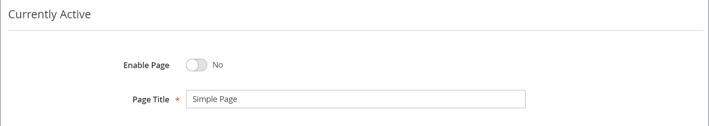{width="600" zoomable="yes"}

1. Développez  la section **[!UICONTROL Design]** .

   Notez que **[!UICONTROL Layout]** est défini sur `Page -- Full Width` par défaut. Outre les cinq options standard [mise en page](../content-design/page-layout.md), [!DNL Page Builder] ajoute des mises en page pleine largeur pour les pages, les catégories et les produits.

1. Si les données d’exemple sont disponibles, définissez **[!UICONTROL New Theme]** sur `Magento Luma`. Sinon, vous pouvez choisir un autre thème disponible ou laisser vide pour utiliser le thème par défaut.

   Le paramètre _[!UICONTROL New Theme]_&#x200B;peut être utilisé pour remplacer le thème par défaut et pour appliquer un autre thème à la page.

   >[!NOTE]
   >
   >La disposition Pleine largeur ne peut être utilisée qu’avec un [thème](../content-design/themes.md) compatible.

   {width="600" zoomable="yes"}

1. Dans le coin supérieur droit, cliquez sur **[!UICONTROL Save]**.

   Lorsque la page est enregistrée, le nom _Page simple_ s’affiche dans le coin supérieur gauche de la page.

### Étape 2 : formater la ligne

1. Développez  la section **[!UICONTROL Content]** .

   Cette action affiche l’aperçu [!DNL Page Builder] avec une ligne vide.

   >[!NOTE]
   >
   >Le champ [En-tête de contenu](workspace.md) est facultatif. Par défaut, il est formaté en tant que niveau de titre 1 (H1) selon le thème. Pour cet exercice, le _Titre du contenu_ n’est pas renseigné.

   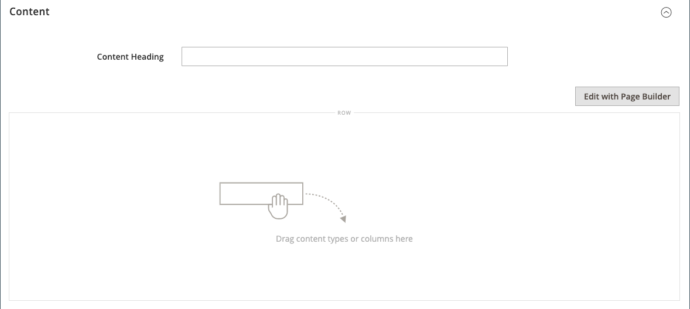{width="600" zoomable="yes"}

1. Cliquez sur **[!UICONTROL Edit with Page Builder]** ou dans la zone de prévisualisation du contenu.

   Dans l’[!DNL Page Builder] développé [espace de travail](workspace.md), le panneau de gauche fournit les outils de contenu que vous pouvez utiliser pour créer votre contenu dans l’étape.

1. Pointez sur la ligne vide pour afficher la palette.

   Chaque conteneur de contenu comporte une boîte à outils avec un ensemble d’options similaire.

   Boîte à outils ![[!DNL Page Builder] ligne](./assets/pb-layout-page-add-content-row-tools.png){width="600" zoomable="yes"}

1. Dans la boîte à outils Ligne, choisissez l’icône _Paramètres_ ({width="20"}.

1. Sous _[!UICONTROL Appearance]_, choisissez **Fond perdu total**.

   Le paramètre d’aspect Fond perdu total étend les bordures gauche et droite de la zone de contenu de la ligne et de l’arrière-plan à toute la largeur de la page.

   {width="600" zoomable="yes"}

1. Faites défiler jusqu’à la section _[!UICONTROL Advanced]_&#x200B;et définissez tous les paramètres **[!UICONTROL Margins and Padding]**&#x200B;sur `0`.

   Ce paramètre garantit que la bannière étend toute la largeur de la ligne.

   {width="600" zoomable="yes"}

1. Pour enregistrer les paramètres et revenir à l’espace de travail [!DNL Page Builder], faites défiler la page vers le haut et cliquez sur **[!UICONTROL Save]** dans le coin supérieur droit.

### Étape 3 : ajouter une bannière

>[!NOTE]
>
>[!DNL Page Builder] dispose d’un nouveau type de contenu appelé _Bannière_, qui est présenté dans cette étape. Ce qui était auparavant l’option _Bannière_ dans le menu Contenu, est désormais un _Bloc dynamique_.

1. Dans le panneau [!DNL Page Builder], développez **[!UICONTROL Media]** et faites glisser un espace réservé **Bannière** vers la scène.

   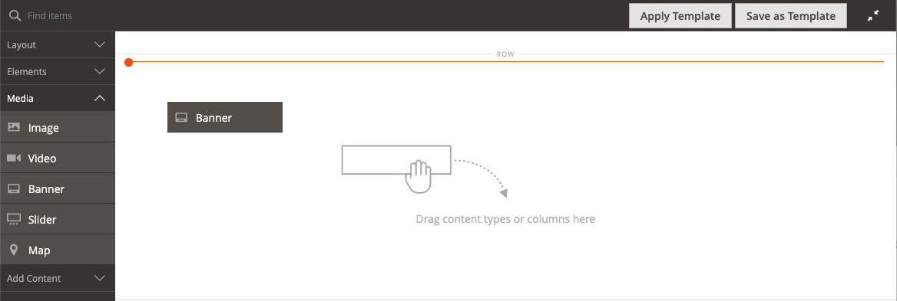{width="600" zoomable="yes"}
1. Survolez le conteneur de bannières pour afficher la palette d’outils.

   >[!NOTE]
   >
   >L’étape comporte désormais deux conteneurs de contenu, chacun disposant d’une boîte à outils distincte. Comme la bannière est imbriquée dans la ligne, assurez-vous de travailler dans la bonne boîte à outils.

   Outre la boîte à outils, les boutons _Charger l’image_ et _Sélectionner dans la galerie_ sont inclus afin que vous puissiez apporter des modifications rapides à la bannière directement depuis la scène.

   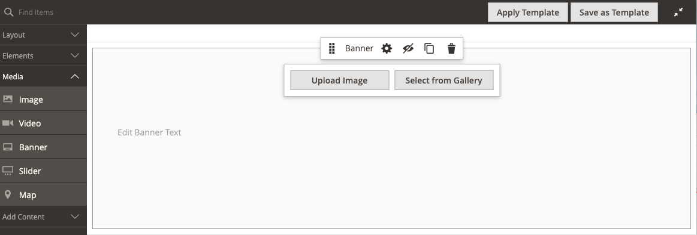{width="600" zoomable="yes"}

1. Dans la boîte à outils Bannière, choisissez l’icône _Paramètres_ ( {width="20"} ).

1. Sous _[!UICONTROL Appearance]_, choisissez **[!UICONTROL Collage Right]**.

   Le paramètre Collage à droite place le contenu sur le côté droit de la bannière.

   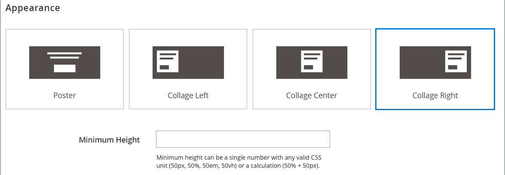{width="600" zoomable="yes"}

1. Faites défiler jusqu’à la section _[!UICONTROL Background]_&#x200B;et définissez l’image d’arrière-plan de la bannière :

   - Par **[!UICONTROL Background Image]**, cliquez sur **Télécharger**.

     {width="600" zoomable="yes"}

     Accédez au répertoire dans lequel vous avez enregistré les ressources de page simple extraites et choisissez le fichier `wide-banner-background.jpg`.

     L’image est chargée et une miniature de l’image chargée s’affiche. Le nom du fichier, les dimensions de l’image et la taille du fichier sont indiqués ci-dessous.

     {width="600" zoomable="yes"}

   - Par **[!UICONTROL Background Mobile Image]**, cliquez sur **Télécharger**.

     Dans le même répertoire de fichiers, choisissez le fichier `wide-banner-background-mobile.jpg`.

     L’image d’arrière-plan mobile est utilisée pour les appareils mobiles, ainsi que chaque fois qu’une fenêtre de navigateur de bureau est redimensionnée à la largeur d’un appareil mobile.

     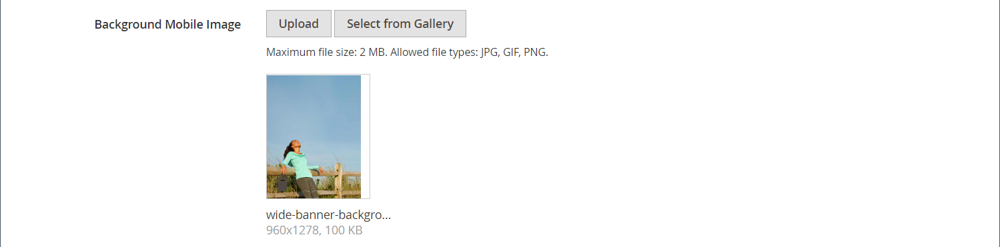{width="600" zoomable="yes"}

   - Faites défiler la page vers le haut et cliquez sur **[!UICONTROL Save]** pour enregistrer les paramètres et revenir à l’espace de travail [!DNL Page Builder].

     L&#39;arrière-plan apparaît sur la scène et étend toute la largeur de la ligne.

     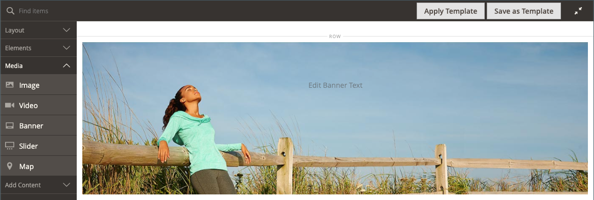{width="600" zoomable="yes"}

   Notez le texte d’espace réservé qui s’affiche sur le côté droit de la ligne. La position de ce texte reflète le paramètre d’aspect _Coller à droite_.

1. Cliquez sur le texte de l’espace réservé, puis saisissez le message suivant sur deux lignes :

   `Get fit and look fab in new seasonal styles.`

   `New LUMA yoga collection`

   La barre d’outils de l’éditeur apparaît au-dessus de la zone de texte. Le texte peut être saisi et mis en forme directement à partir de l’étape ou en choisissant _Paramètres_ dans la boîte à outils Bannière.

   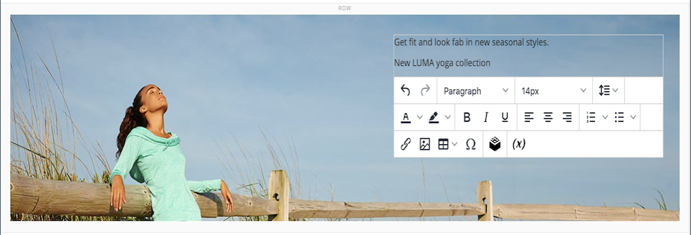{width="600" zoomable="yes"}

1. Appliquez une mise en forme au texte :

   - Sélectionnez la première ligne de texte. Ensuite, dans la barre d’outils de l’éditeur, sous **Formats**, choisissez `Heading 2`.

     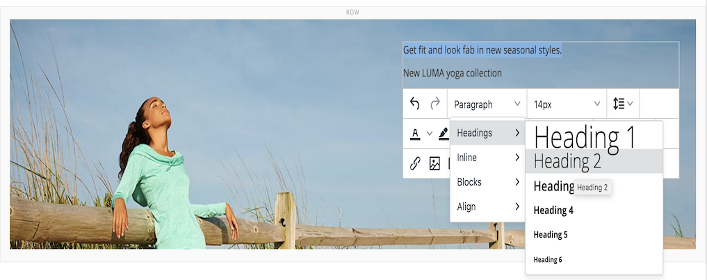{width="600" zoomable="yes"}

   - Sélectionnez la deuxième ligne de texte. Ensuite, dans la barre d’outils de l’éditeur, sous **Formats**, choisissez `Paragraph`.

   Les paramètres de format appliquent les styles de la feuille de style associée au thème actif.

   {width="600" zoomable="yes"}
__

1. Pointez pour afficher la boîte à outils Bannière, sélectionnez à nouveau l’icône _Paramètres_ ( {width="20"} ), puis faites défiler l’écran jusqu’à la section _[!UICONTROL Content]_.

   Notez que votre texte s’affiche dans la zone _Texte du message_. Le texte peut être saisi et modifié à partir de l’étape ou de la section _[!UICONTROL Content]_&#x200B;des paramètres de la bannière.

   {width="600" zoomable="yes"}

1. En poursuivant dans la section _[!UICONTROL Content]_, définissez le lien et le bouton de la bannière :

   - Définissez **Lien** sur `Category`, puis cliquez sur **[!UICONTROL Select]** pour afficher l’arborescence des catégories.

   - Choisissez `What's New` comme catégorie liée.

     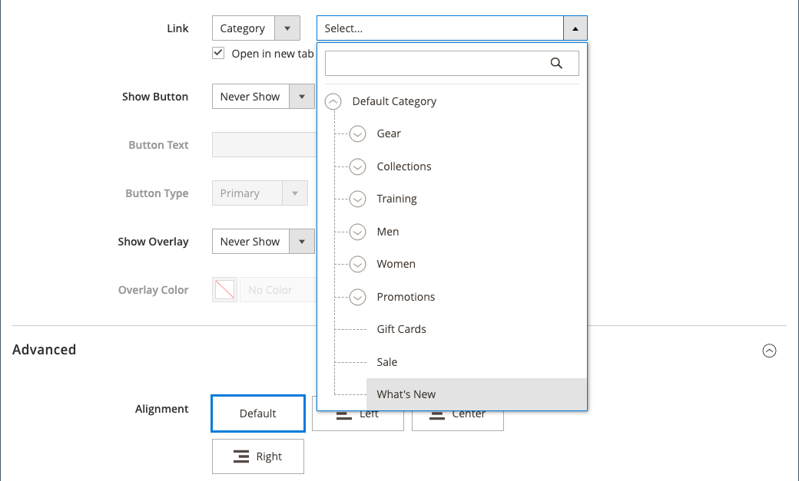{width="600" zoomable="yes"}

   - Définissez **[!UICONTROL Show Button]** sur `Always`.

   - Par **[!UICONTROL Button Text]**, saisissez `Shop Now` comme texte qui s’affiche sur le bouton.

   - Par **[!UICONTROL Button Type]**, acceptez la valeur par défaut `Primary`.

     Le style de bouton du thème actuel détermine le format du bouton.

1. Définissez la superposition de bannière :

   Vous pouvez utiliser une superposition pour appliquer une couleur d’arrière-plan à la zone de contenu active définie par le paramètre Apparence. L’image d’arrière-plan de la bannière reste visible sur toute la largeur de la bannière.

   - Définissez **[!UICONTROL Show Overlay]** sur `Always`.

   - Par **[!UICONTROL Overlay Color]**, effectuez l’une des opérations suivantes :

      - Cliquez sur le carré de couleur et sélectionnez l’échantillon blanc.
      - Cliquez dans la zone de texte _Aucune couleur_ et saisissez `White` ou la valeur hexadécimale `#ffffff`.

     Cliquez ensuite sur **[!UICONTROL Apply]**.

     {width="600" zoomable="yes"}

   - Faites défiler la page vers le haut et cliquez sur **[!UICONTROL Save]** pour enregistrer les paramètres et revenir à l’espace de travail [!DNL Page Builder].

     Le bouton s’affiche sous le message de bannière sur l’étape.

     {width="600" zoomable="yes"}

1. Dans le coin supérieur droit de la scène, cliquez sur l’icône _Fermer le plein écran_ ().

   Cliquer sur cette icône vous renvoie à la section _[!UICONTROL Content]_&#x200B;de la page dont l’aperçu est affiché.

   Vous pouvez basculer entre les deux modes d’espace de travail à tout moment.

1. Dans le coin supérieur droit, cliquez sur la flèche **[!UICONTROL Save]** et choisissez **[!UICONTROL Save & Close]**.

1. Si vous y êtes invité, cliquez sur le lien [Gestion du cache](../systems/cache-management.md) dans le message en haut de la page et actualisez tout cache non valide.

## Partie 2 : ligne contenue avec deux colonnes égales

Dans cette partie de l&#39;exercice, vous ajoutez une ligne à la page et la divisez en deux colonnes égales. Vous ajoutez ensuite une image liée à chaque colonne. Dans les instructions, chaque nouvelle ligne est ajoutée avant la première pour aligner le panneau [!DNL Page Builder] avec la scène. À la fin de l’exercice, vous réorganisez les lignes afin qu’elles correspondent à l’exemple de page simple.

{width="600" zoomable="yes"}

### Étape 1 : ajouter une ligne

1. Dans la grille Pages, recherchez la _Page simple_ que vous avez créée dans la première partie de cet exercice et sélectionnez **[!UICONTROL Edit]** dans la colonne _[!UICONTROL Action]_.

1. Développez  la section **[!UICONTROL Content]** .

1. Cliquez sur **[!UICONTROL Edit with Page Builder]** ou dans la zone de prévisualisation du contenu.

1. Dans le panneau [!DNL Page Builder] sous _[!UICONTROL Layout]_, faites glisser un espace réservé&#x200B;**[!UICONTROL Row]**&#x200B;vers la scène et placez-le au-dessus de la bannière.

   La ligne directrice rouge marque la frontière entre les deux lignes.

   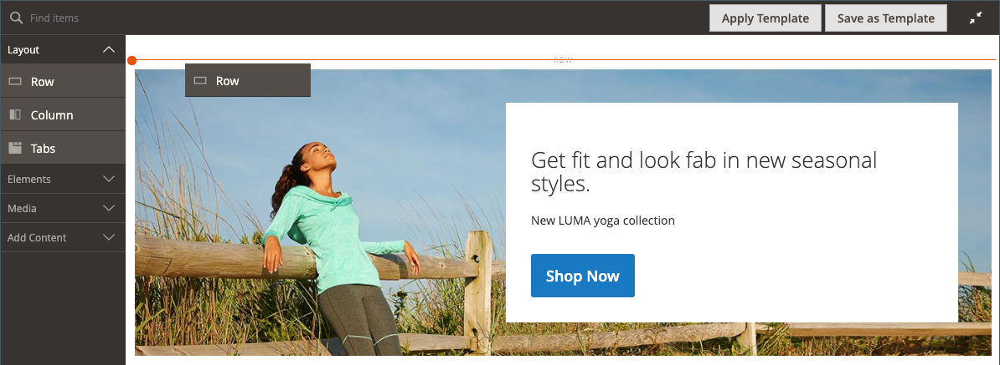{width="600" zoomable="yes"}

1. Pointez sur la nouvelle ligne pour afficher la boîte à outils et sélectionnez l’icône _Paramètres_ ( {width="20"} ).

   {width="600" zoomable="yes"}

1. Sous _[!UICONTROL Appearance]_, acceptez le paramètre par défaut **Contenu**.

   Ce paramètre limite la zone de contenu de la ligne à la largeur de la page telle que définie par le thème.

   {width="600" zoomable="yes"}

1. Dans le coin supérieur droit, cliquez sur **[!UICONTROL Save]** pour enregistrer les paramètres et revenir à l’espace de travail [!DNL Page Builder].

### Étape 2 : ajouter une colonne

1. Dans le panneau [!DNL Page Builder] sous _[!UICONTROL Layout]_, faites glisser un espace réservé&#x200B;**[!UICONTROL Column]**&#x200B;vers la nouvelle ligne.

   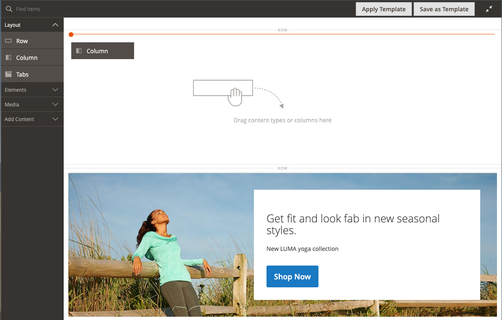{width="600" zoomable="yes"}

   La ligne est maintenant divisée en deux colonnes de largeur égale. Chaque colonne est un conteneur distinct pour le contenu avec sa propre boîte à outils dédiée d’options.

   {width="600" zoomable="yes"}

1. Dans le coin supérieur gauche de la première colonne, cliquez sur le contrôle circulaire _Grid_ () pour afficher les instructions relatives à la grille.

   La grille garantit l’alignement cohérent du contenu et son rendu correct sur les ordinateurs de bureau et les appareils mobiles. Pour plus d&#39;informations sur la configuration de la taille de la grille, consultez la section [Configurer [!DNL Page Builder]](setup.md#configure-page-builder) de la rubrique Configuration de la [!DNL Page Builder].

   Les nombres entre parenthèses (6/12) dans la bordure supérieure de chaque conteneur de colonne indiquent le nombre de divisions de la grille dans chaque colonne et le nombre total de divisions dans la ligne.

   {width="600" zoomable="yes"}

### Étape 3 : ajouter des images avec des liens

Au cours de cette étape, vous apprendrez à charger une image sur la bannière.

1. Dans le panneau [!DNL Page Builder], développez la section **[!UICONTROL Media]** et faites glisser un espace réservé **[!UICONTROL Image]** vers la première colonne.

   {width="600" zoomable="yes"}

1. Insérez l’exemple d’image dans l’espace réservé.

   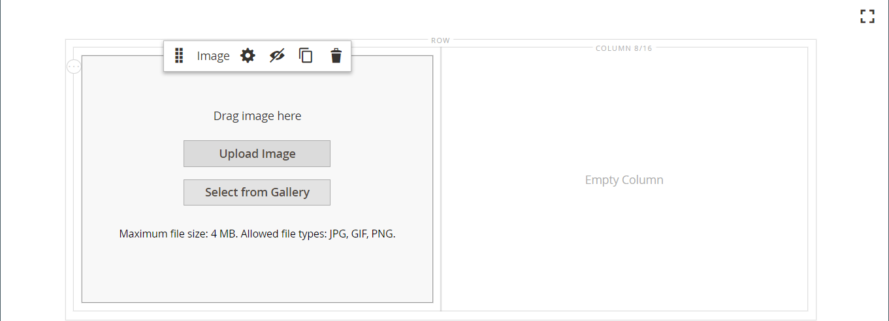{width="600" zoomable="yes"}

   Pour une image située sur votre système, vous pouvez choisir l’une des méthodes suivantes :

   - **Charger le fichier image** : dans la première colonne, cliquez sur **[!UICONTROL Upload Image]**. Ensuite, accédez au répertoire dans lequel vous avez enregistré les ressources de page simple extraites et choisissez le fichier `small-banner-1.jpg`.

     {width="600" zoomable="yes"}

     Répétez cette action pour ajouter le fichier `small-banner-2.jpg` à la deuxième colonne.

   - **Faites glisser le fichier image** : sur votre bureau, ouvrez le dossier de ressources de la page simple et positionnez-le à côté de la fenêtre du navigateur d’administration dans laquelle vous travaillez avec l’étape de [!DNL Page Builder]. Faites ensuite glisser le fichier `small-banner-1.jpg` à partir du dossier de ressources de page simple et déposez-le dans la première colonne.

     {width="600" zoomable="yes"}

     Répétez cette action pour ajouter le fichier `small-banner-2.jpg` à la deuxième colonne.

1. Déterminez la page de votre catalogue que vous souhaitez lier à chaque image.

1. Pointez sur l’image de la première colonne pour afficher la boîte à outils et choisissez l’icône _Paramètres_ ( {width="20"} ).

   {width="600" zoomable="yes"}

1. Associez l’image à une catégorie :

   - Faites défiler vers le bas et définissez **Lien** sur `Category`.

   - Dans l’arborescence des catégories, accédez à la catégorie `Men's Hoodies & Sweatshirt` et sélectionnez-la.

   - Dans le coin supérieur droit, **[!UICONTROL Save]** les paramètres et revenez à l’espace de travail [!DNL Page Builder].

1. Répétez l’étape précédente pour lier l’image de la deuxième colonne à la catégorie _Engrenage_.

1. Dans le coin supérieur droit de la scène, cliquez sur l’icône _Fermer le plein écran_ ().

   Cliquer sur cette icône vous renvoie à la section _[!UICONTROL Content]_&#x200B;de la page dont l’aperçu est affiché.

1. Dans le coin supérieur droit, cliquez sur la flèche **[!UICONTROL Save]** et choisissez **[!UICONTROL Save & Close]**.

1. Lorsque vous y êtes invité, cliquez sur le lien [Gestion du cache](../systems/cache-management.md) dans le message en haut de la page et actualisez tout cache non valide.

## Partie 3 : ligne pleine largeur avec des colonnes inégales

La dernière ligne de cette page présente le contenu d’une révision du produit. Vous ajoutez une ligne pleine largeur et la divisez en deux colonnes de largeurs différentes. Une image d’arrière-plan est ajoutée à la première colonne, avec une couleur d’arrière-plan correspondante appliquée à la ligne pour un effet unifié.

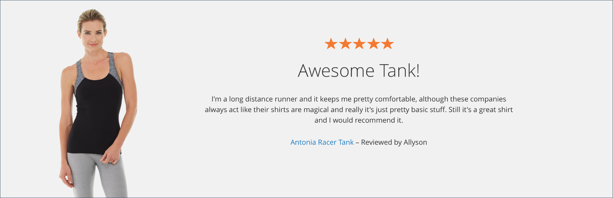{width="500"}

### Étape 1 : ajouter une ligne

1. Dans la grille Pages, recherchez la _Page simple_ que vous avez créée dans la première partie de cet exercice et sélectionnez **[!UICONTROL Edit]** dans la colonne _[!UICONTROL Action]_.

1. Développez  la section **[!UICONTROL Content]** .

1. Cliquez sur **[!UICONTROL Edit with Page Builder]** ou dans la zone de prévisualisation du contenu.

1. Dans le panneau [!DNL Page Builder] sous _[!UICONTROL Layout]_, faites glisser un espace réservé&#x200B;**[!UICONTROL Row]**&#x200B;vers la scène et placez-le au-dessus de la ligne créée dans la deuxième partie de cet exercice.

   Une ligne directrice rouge marque la frontière entre les deux lignes.

   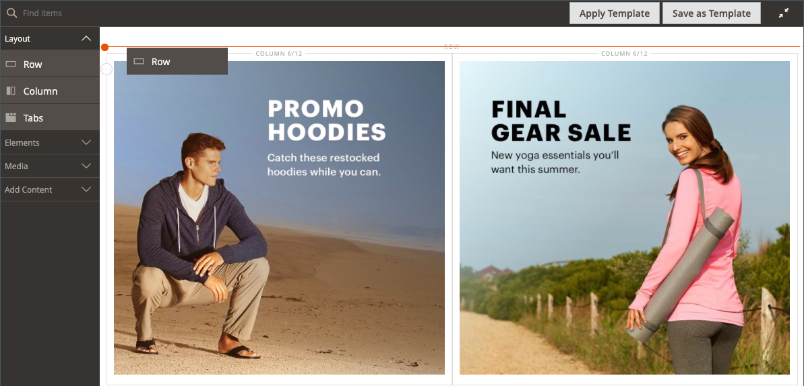{width="600" zoomable="yes"}

1. Pointez sur la nouvelle ligne pour afficher la boîte à outils et sélectionnez l’icône _Paramètres_ ({width="20"} ).

   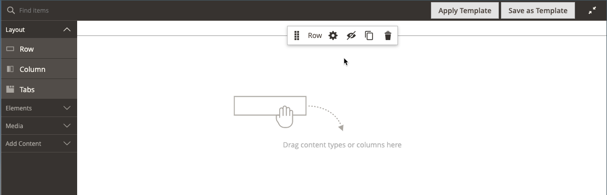{width="600" zoomable="yes"}

1. Sur la page Modifier la ligne Sous _[!UICONTROL Appearance]_, choisissez **[!UICONTROL Full Width]**.

   Ce paramètre limite la zone de contenu à la largeur maximale de page définie par le thème. La couleur et/ou l’image d’arrière-plan ne sont pas limitées et étendent toute la largeur de la ligne.

   {width="600" zoomable="yes"}

1. Dans la section _[!UICONTROL Background]_, saisissez `#f1f1f1` comme **[!UICONTROL Background Color]**.

   {width="600" zoomable="yes"}

1. Faites défiler jusqu’à la section _[!UICONTROL Advanced]_&#x200B;et définissez toutes les valeurs **Marges et marge intérieure**&#x200B;sur `0`.

   {width="600" zoomable="yes"}

1. Faites défiler la page vers le haut et cliquez sur **[!UICONTROL Save]** pour enregistrer les paramètres et revenir à l’espace de travail [!DNL Page Builder].

   La couleur d’arrière-plan de la ligne est désormais beige pâle.

   {width="600" zoomable="yes"}

### Étape 2 : ajouter des colonnes de largeurs différentes

1. Dans le panneau [!DNL Page Builder] sous _[!UICONTROL Layout]_, faites glisser un espace réservé&#x200B;**[!UICONTROL Column]**&#x200B;vers la ligne supérieure de la scène.

   {width="600" zoomable="yes"}

1. Faites glisser la bordure droite de la première colonne vers la position 4 de 12 (`4/12`) sur la grille.

   La taille de la deuxième colonne s’ajuste à huit sur 12 (`8/12`).

   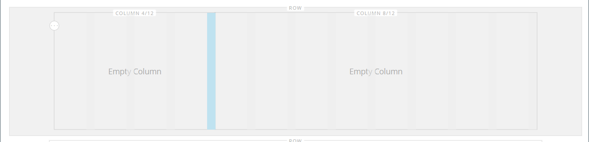{width="600" zoomable="yes"}

1. Pointez sur le conteneur de la première colonne pour afficher la boîte à outils et choisissez l’icône _Paramètres_ ( {width="20"} ).

1. Faites défiler jusqu’à la section _[!UICONTROL Advanced]_&#x200B;et définissez toutes les valeurs **Marges et marge intérieure**&#x200B;sur `0`.

   {width="600" zoomable="yes"}

1. Faites défiler la page vers le haut et cliquez sur **[!UICONTROL Save]** pour enregistrer les paramètres et revenir à l’espace de travail [!DNL Page Builder].

### Étape 3 : ajouter une image à la première colonne

1. Dans le panneau [!DNL Page Builder], développez **[!UICONTROL Media]** et faites glisser un type de contenu **[!UICONTROL Image]** vers la première colonne.

   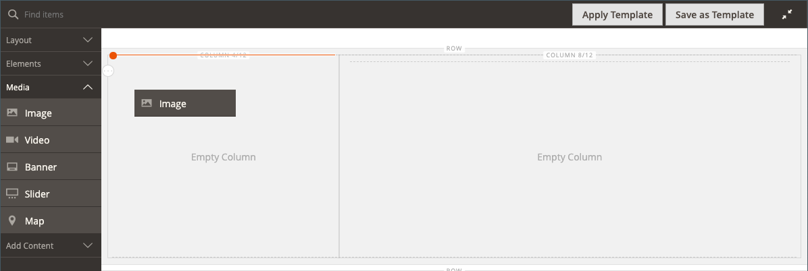{width="600" zoomable="yes"}

1. Dans l’espace réservé à l’image, cliquez sur **[!UICONTROL Upload Image]**.

   {width="600" zoomable="yes"}

1. Accédez au répertoire dans lequel vous avez enregistré les ressources de page simple extraites et choisissez le fichier `review-image.jpg`.

   L’image chargée apparaît dans la première colonne et se fond parfaitement dans la couleur d’arrière-plan de la ligne.

   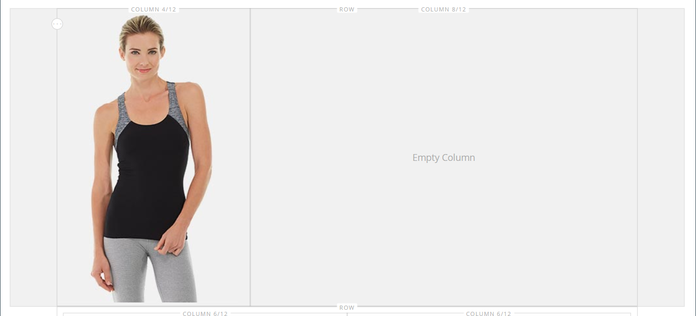{width="600" zoomable="yes"}

### Étape 4 : ajouter le contenu de révision à la deuxième colonne

La deuxième colonne de la ligne doit contenir le contenu d’une révision client, y compris l’image d’évaluation à cinq étoiles et le message texte formaté.

1. Dans le panneau [!DNL Page Builder], développez la section **[!UICONTROL Elements]** et faites glisser le type de contenu **[!UICONTROL Text]** vers la deuxième colonne.

   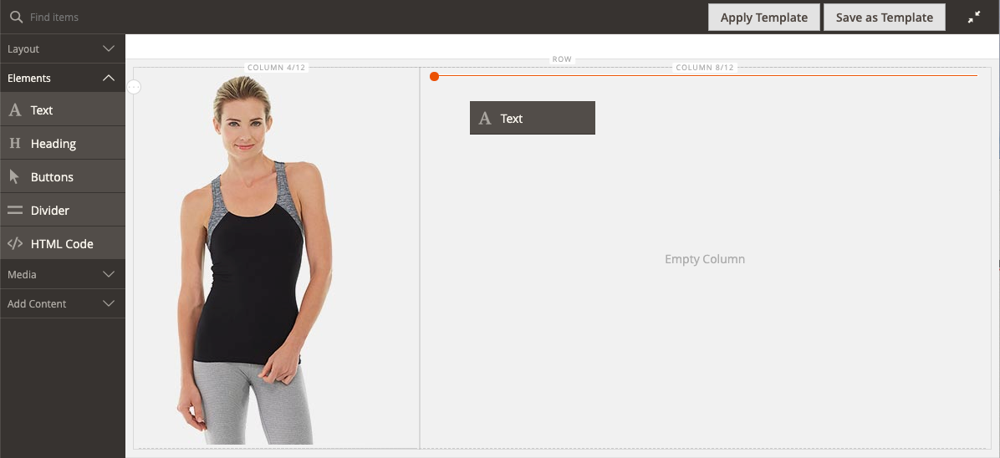{width="600" zoomable="yes"}

1. Cliquez dans l’élément de texte pour afficher la barre d’outils de l’éditeur.

1. Dans la barre d’outils, cliquez sur l’icône _Insérer une image_ () et procédez comme suit :

   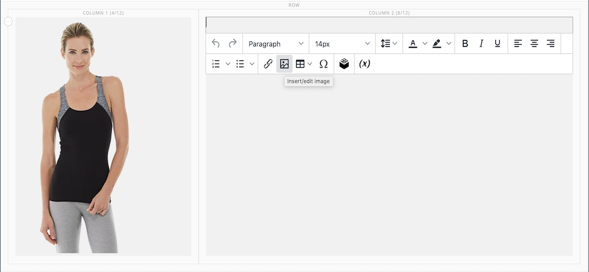{width="600" zoomable="yes"}

   - Dans la boîte de dialogue _[!UICONTROL Insert/edit image]_, cliquez sur l’icône_ Rechercher _( 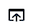 ) en regard du champ&#x200B;_[!UICONTROL Source]_.

     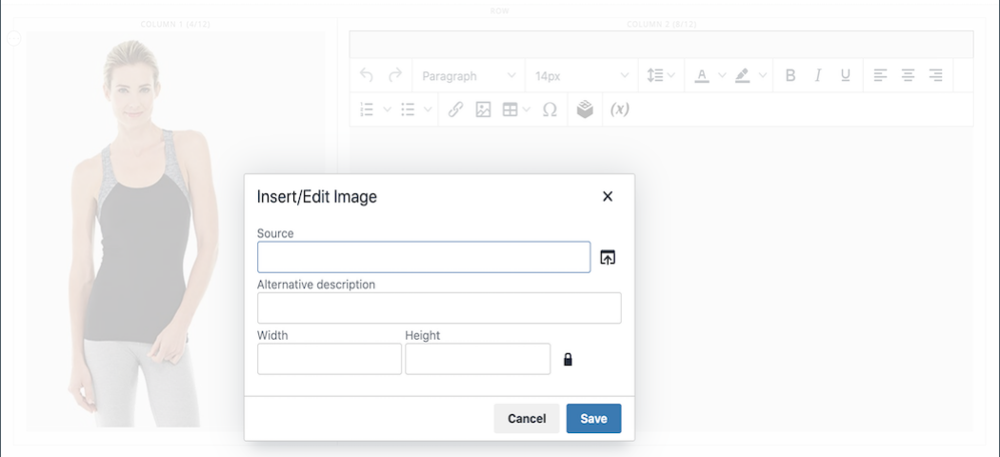{width="600" zoomable="yes"}

   - Sur la page _[!UICONTROL Select Images]_, cliquez sur **[!UICONTROL Choose Files]**.

   - Dans le dossier dans lequel vous avez enregistré les ressources de la page simple, choisissez `rating.png`.

   - De retour sur la page, double-cliquez sur la mosaïque de l’image pour la sélectionner et insérer son URL dans le champ Source .

     {width="600" zoomable="yes"}

   - Par **[!UICONTROL Image Description]**, saisissez `5-Star Rating` et cliquez sur **[!UICONTROL OK]** pour insérer l’image dans la colonne.

   - Dans la barre d’outils de l’éditeur, cliquez sur **Aligner au centre** (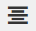) pour centrer l’image dans la colonne.

     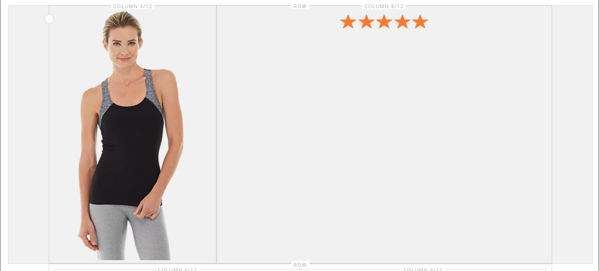{width="600" zoomable="yes"}

1. Placez le point d&#39;insertion juste après l&#39;image cinq étoiles, appuyez sur la touche Entrée/Retour pour commencer une nouvelle ligne, puis saisissez le texte suivant :

   `Awesome Tank!`

   `I'm a long distance runner and it keeps me pretty comfortable, although these companies always act like their shirts are magical and really it's just pretty basic stuff. Still it's a great shirt, and I would recommend it.`

   `Antonia Racer Tank – Reviewed by Allyson`

   Le texte est centré au fur et à mesure que vous le tapez.

   {width="600" zoomable="yes"}

1. Mettre en forme le texte :

   - Cliquez n’importe où dans la première ligne de texte et, dans la barre d’outils de l’éditeur, sous **Formats**, choisissez `Heading 2`.

   - Sélectionnez le texte restant et, dans la barre d’outils de l’éditeur, sous **Formats**, choisissez `Paragraph`.

   Le texte est mis en forme en fonction de la feuille de style associée au thème.

1. Obtenez les dimensions de l’image afin de pouvoir centrer le contenu verticalement dans la colonne :

   - Pointez sur l’image de la première colonne pour afficher la boîte à outils et choisissez l’icône _Paramètres_ ({width="20"} ).

   - Sous la miniature de l’image, prenez note des dimensions de l’image.

     {width="600" zoomable="yes"}

   - Dans le coin supérieur droit, cliquez sur **Fermer**.

1. Centrer le contenu verticalement dans la deuxième colonne :

   - Passez la souris sur la deuxième colonne pour afficher la palette et sélectionnez l’icône _Paramètres_ ({width="20"} ).

   >[!NOTE]
   >
   >Veillez à sélectionner le conteneur de colonnes plutôt que le conteneur de texte pour afficher la boîte à outils appropriée.

   - Par **[!UICONTROL Minimum Height]**, saisissez `450` comme hauteur en pixels de l’image dans la première colonne.

   - Définissez **[!UICONTROL Vertical Alignment]** sur `Center`.

   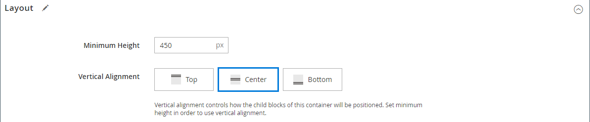{width="600" zoomable="yes"}

1. Faites défiler jusqu’à la section _[!UICONTROL Advanced]_&#x200B;et définissez toutes les valeurs **[!UICONTROL Margins and Padding]**&#x200B;sur zéro ( `0` ).

   {width="600" zoomable="yes"}

1. Faites défiler la page vers le haut et, dans le coin supérieur droit, cliquez sur **[!UICONTROL Save]** pour enregistrer les paramètres et revenir à l’espace de travail [!DNL Page Builder].

   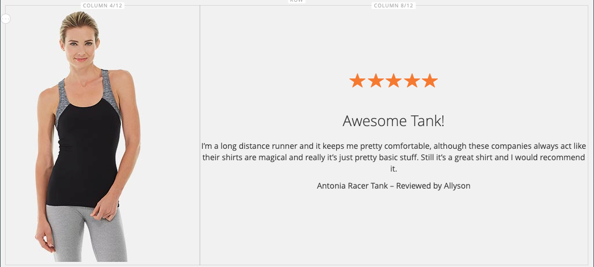{width="600" zoomable="yes"}

### Étape 5 : insérer un lien de produit de catalogue

1. Sélectionnez le texte `Antonia Racer Tank` et cliquez sur l’icône _Insérer un lien_ () dans la barre d’outils de l’éditeur.

1. Dans la boîte de dialogue _Insérer un lien_, spécifiez le lien vers le produit du catalogue :

   - Saisissez le **[!UICONTROL URL]** du produit.

     Vous pouvez saisir une URL relative ou complète. Le lien relatif suivant est saisi pour cet exemple :

     `../antonia-racer-tank.html`

   - (Facultatif) Pour **Titre**, saisissez le nom du produit.

     L’attribut Lien du titre est utilisé par certains navigateurs comme info-bulle.

     {width="600" zoomable="yes"}

   - Une fois l’opération terminée, cliquez sur **[!UICONTROL OK]** pour enregistrer le lien.

     Le texte lié est désormais mis en surbrillance dans la bannière.

     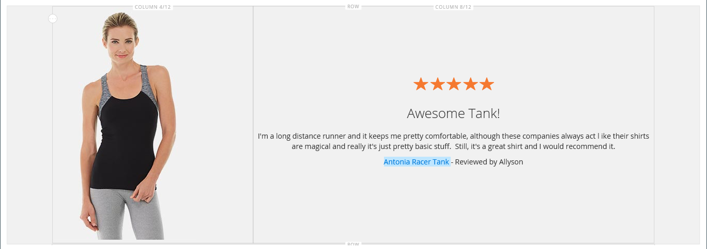{width="600" zoomable="yes"}

1. Dans le coin supérieur droit de la scène, cliquez sur l’icône _Fermer le plein écran_ ().

   Cliquer sur cette icône vous renvoie à la section _[!UICONTROL Content]_&#x200B;de la page dont l’aperçu est affiché.

1. Dans le coin supérieur droit, cliquez sur **[!UICONTROL Save]**.

### Étape 6 : réorganiser les lignes

Une fois les trois lignes terminées, l’étape finale consiste à réorganiser les lignes pour qu’elles correspondent à l’exemple _Page simple_ d’origine. Pour correspondre à l’exemple d’origine, la première ligne doit être déplacée vers le bas et la dernière vers le haut.

1. Si nécessaire, développez  dans la section **[!UICONTROL Content]** .

1. Cliquez sur **[!UICONTROL Edit with Page Builder]** ou dans la zone de prévisualisation du contenu.

1. Pointez sur la première ligne de la scène pour afficher la palette et sélectionnez l’icône _Déplacer_ ().

   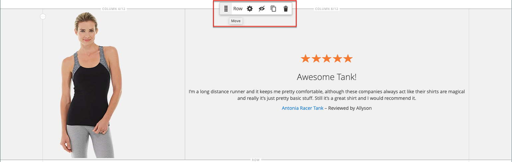{width="600" zoomable="yes"}

1. Maintenez le bouton de la souris enfoncé pendant que vous vérifiez que tout le contenu de la ligne est sélectionné, puis faites glisser la ligne en dessous de la ligne directrice rouge, au bas de la page.

   >[!NOTE]
   >
   >Si vous déplacez accidentellement une partie seulement du contenu (l’image, par exemple), déplacez simplement le contenu à l’endroit approprié, puis réessayez.

   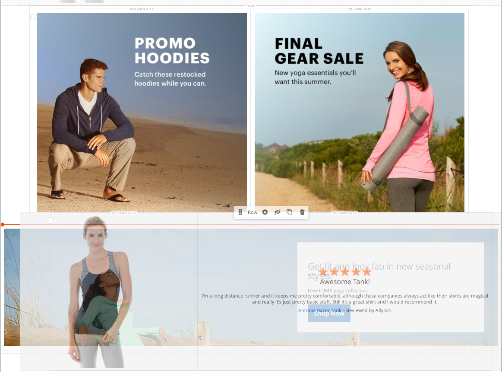{width="600" zoomable="yes"}

1. Répétez cette procédure pour déplacer la première ligne vers la deuxième position.

   L’ordre des lignes sur votre page correspond désormais à l’exemple Page simple .

1. Dans le coin supérieur droit de la scène, cliquez sur l’icône _Fermer le plein écran_ ().

   Cliquer sur cette icône vous renvoie à la section _[!UICONTROL Content]_&#x200B;de la page dont l’aperçu est affiché.

1. Dans le coin supérieur droit, cliquez sur la flèche **[!UICONTROL Save]** et choisissez **[!UICONTROL Save & Close]**.

1. Si vous y êtes invité, cliquez sur le lien [Gestion du cache](../systems/cache-management.md) dans le message en haut de la page et actualisez tout cache non valide.

Vous avez terminé l’exercice Page simple . Conservez le travail que vous avez créé afin de pouvoir y faire référence ultérieurement.

Lorsque vous êtes prêt, passez à la [Partie 2 : Blocs](2-blocks.md).
