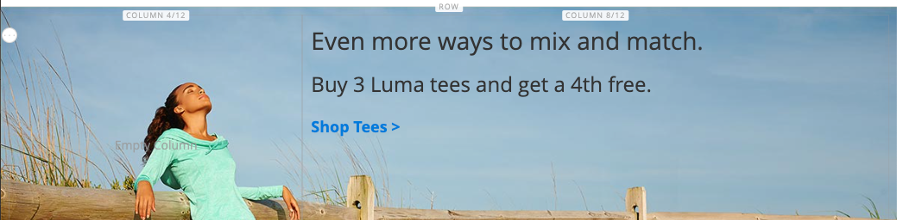

# [!DNL Page Builder] Présentation de la partie 2 : blocs

L’exercice suivant illustre la différence entre [blocs simples](../content-design/blocks.md) et [blocs dynamiques](dynamic-block.md), ainsi que la manière d’utiliser [!DNL Page Builder] pour créer chaque type de bloc.

>[!NOTE]
>
>[!DNL Page Builder] dispose d’un nouveau type de contenu appelé _Bannière_, présenté dans le premier exercice pas à pas et qui n’est pas lié à la fonctionnalité de bannière précédente. Ce qui était auparavant l’option Bannière dans le [menu Contenu](../content-design/content-menu.md), est désormais _Bloc dynamique_.

{width="700" zoomable="yes"}

Cet exercice suppose que vous avez terminé [Partie 1 : Page simple](1-simple-page.md), y compris les conditions préalables et [fichiers d’exemple téléchargés](./assets/simple-page-assets.zip). Suivez les parties de cet exercice pas à pas dans l’ordre.

>[!NOTE]
>
>Ces exercices de présentation sont mis à jour pour prendre en compte les modifications récentes apportées à l’espace de travail [!DNL Page Builder] dans la version 2.4.1.

## Partie 1 : créer un bloc simple

Dans cet exercice pas à pas, vous allez créer un bloc simple avec du contenu provenant de [!DNL Google Maps]. Les blocs simples sont parfois appelés _blocs CMS_ ou _blocs statiques_, car le contenu ne change pas. Un bloc simple est idéal pour le contenu que vous souhaitez peut-être réutiliser.

### Étape 1 : créer un bloc

1. Dans la barre latérale _Admin_, accédez à **[!UICONTROL Content]** > _[!UICONTROL Elements]_>**[!UICONTROL Blocks]**.

1. Dans le coin supérieur droit, cliquez sur **[!UICONTROL Add New Block]**.

1. Par **[!UICONTROL Block Title]**, saisissez `Google Map`.

1. Par **[!UICONTROL Identifier]**, saisissez `google-map`.

1. Choisissez le **[!UICONTROL Store View]** où le bloc doit être disponible.

   {width="600" zoomable="yes"}

1. Dans le coin supérieur droit, cliquez sur **[!UICONTROL Save]**.

### Étape 2 : ajouter un [!DNL Google Map]

1. Faites défiler l’écran jusqu’à l’aperçu du contenu [!DNL Page Builder] (actuellement vide) et cliquez sur **[!UICONTROL Edit with Page Builder]**.

1. Dans le panneau [!DNL Page Builder], développez **[!UICONTROL Media]** et faites glisser un espace réservé **[!UICONTROL Map]** vers la scène.

   {width="600" zoomable="yes"}

   Un mappage vers l’emplacement de votre boutique s’affiche si [!DNL Google Maps] est configuré pour cette dernière.

   {width="600" zoomable="yes"}

   Un espace réservé s’affiche si [!DNL Google Maps] n’est pas encore configuré pour votre boutique.

   ![[!DNL Google Maps] un espace réservé](./assets/pb-tutorial2-media-map-not-configured.png){width="600" zoomable="yes"}

1. Dans le coin supérieur droit de la scène, cliquez sur l’icône _Fermer le plein écran_ ().

   Cliquer sur cette icône vous renvoie à la section _[!UICONTROL Content]_&#x200B;du bloc dont l’aperçu est affiché.

1. Dans le coin supérieur droit, cliquez sur la flèche **[!UICONTROL Save]** et choisissez **[!UICONTROL Save & Close]**.

### Étape 3 : Configurer [!DNL Google Maps]

Si [!DNL Google Maps] est déjà configuré pour votre boutique, vous pouvez ignorer cette étape et passer à l’étape suivante.

1. Accédez à la console [Google Cloud Platform](https://console.cloud.google.com/google/maps-apis/overview).

1. Cliquez sur la liste déroulante du projet et sélectionnez ou créez le projet pour lequel vous souhaitez ajouter une clé API.

1. Pour configurer vos informations d’identification d’API, suivez les [instructions](https://developers.google.com/maps/documentation/javascript/get-api-key) de la documentation [!DNL Google Maps].

1. Copiez votre clé API dans le presse-papiers.

1. Revenez à l’administration [!DNL Commerce] et accédez à **[!UICONTROL Stores]** > _[!UICONTROL Settings]_>**[!UICONTROL Configuration]**.

1. Dans le panneau de gauche sous _[!UICONTROL General]_, choisissez **[!UICONTROL Content Management]**.

1. Développez  **[!UICONTROL Advanced Content Tools]**.

   {width="600" zoomable="yes"}

   Pour plus d’informations sur les options de configuration [!UICONTROL Content Management Advanced Tools], consultez le [_Guide de référence de configuration_](../configuration-reference/general/content-management.md).

1. Par **[!UICONTROL Google Maps API Key]**, collez la clé que vous avez copiée.

1. Cliquez sur **[!UICONTROL Test Key]**.

   En cas de problème avec votre clé, revenez sur le site [!DNL Google Maps] Platform pour résoudre le problème. Réessayez ensuite.

1. Une fois votre clé vérifiée, cliquez sur **[!UICONTROL Save Config]**.

### Étape 4 : ajouter le bloc à une page

1. Dans la barre latérale _Admin_, accédez à **[!UICONTROL Content]** > _[!UICONTROL Elements]_>**[!UICONTROL Pages]**.

1. Dans la grille, recherchez le _[!UICONTROL Simple Page]_&#x200B;que vous avez créé dans le premier tutoriel et sélectionnez **[!UICONTROL Edit]**&#x200B;dans la colonne&#x200B;_[!UICONTROL Action]_ .

1. Développez  la section **[!UICONTROL Content]**, puis cliquez sur **[!UICONTROL Edit with Page Builder]** ou dans la zone de prévisualisation du contenu.

1. Dans le panneau [!DNL Page Builder] sous _[!UICONTROL Layout]_, faites glisser un espace réservé&#x200B;**[!UICONTROL Row]**&#x200B;en haut de la scène.

   {width="600" zoomable="yes"}

1. Dans le panneau [!DNL Page Builder], développez **[!UICONTROL Add Content]** et faites glisser un espace réservé **[!UICONTROL Block]** vers la nouvelle ligne.

1. Pointez sur le conteneur de blocs vide pour afficher la boîte à outils et choisissez l’icône _Paramètres_ ({width="20"} ).

   {width="600" zoomable="yes"}

1. Sur la page Modifier le bloc, cliquez sur **[!UICONTROL Select Block]**.

   {width="600" zoomable="yes"}

1. Dans la zone de recherche, saisissez `map` et appuyez sur la touche Entrée/Retour pour trouver le bloc que vous avez créé.

   {width="600" zoomable="yes"}

1. Dans la grille, cliquez sur **[!UICONTROL Select]** pour choisir le bloc de [!DNL Google Maps].

1. Dans le coin supérieur droit, cliquez sur **[!UICONTROL Save]** pour enregistrer les paramètres et revenir à l’espace de travail [!DNL Page Builder].

1. Dans le coin supérieur droit de la scène, cliquez sur l’icône _Fermer le plein écran_ ().

   Cliquer sur cette icône vous renvoie à la section _[!UICONTROL Content]_&#x200B;de la page dont l’aperçu est affiché.

1. Dans le coin supérieur droit, cliquez sur la flèche **[!UICONTROL Save]** et choisissez **[!UICONTROL Save & Close]**.

**Félicitations !** Vous avez terminé la première partie de l&#39;exercice Bloc. Veillez à conserver votre travail à titre de référence.

## Partie 2 : créer un bloc dynamique

Un bloc dynamique comprend une logique qui détermine où, quand et pour qui il apparaît. Dans cet exercice pas à pas, vous allez créer un bloc dynamique pour une promotion qui est déclenchée lorsque les conditions de règle de prix sont remplies et qui s’affiche uniquement pour un segment client spécifique. Le résultat de cet exemple est similaire à la bannière qui a été créée dans le premier exercice, mais avec une logique qui contrôle quand elle apparaît dans le storefront.

{width="600" zoomable="yes"}

### Étape 1 : créer un bloc dynamique

1. Dans la barre latérale _Admin_, accédez à **[!UICONTROL Content]** > _[!UICONTROL Elements]_>**[!UICONTROL Dynamic Blocks]**.

   {width="700" zoomable="yes"}

1. Dans le coin supérieur droit, cliquez sur **[!UICONTROL Add Dynamic Block]**.

   {width="600" zoomable="yes"}

1. Renseignez les paramètres de base du nouveau bloc dynamique :

   - Définissez **[!UICONTROL Enable Dynamic Block]** sur `Yes`.

   - Par **[!UICONTROL Dynamic Block Name]**, saisissez `Tee Shirt Promo`.

   - Définissez **[!UICONTROL Dynamic Block Type]** sur `Content Area`, puis cliquez sur **[!UICONTROL Done]**.

     Le type de bloc dynamique détermine l’emplacement du bloc dans la [mise en page](../content-design/page-layout.md). Lors de la configuration d’un bloc dynamique pour votre boutique, tenez compte à la fois de la mise en page et du [thème](../content-design/themes.md) afin de pouvoir utiliser au mieux l’espace disponible. Certains magasins ont une zone de contenu actif limitée à une largeur fixe, tandis que d’autres étendent la largeur totale de l’écran.

     {width="600" zoomable="yes"}

   - Par **[!UICONTROL Customer Segment]**, cochez la case de chaque segment à appliquer au bloc dynamique et cliquez sur **Terminé** pour enregistrer la liste des segments.

     Dans l’exemple suivant, deux [segments de clients](../customers/customer-segments.md) identifient les clients enregistrés par genre. Ce bloc dynamique s’affiche uniquement pour les clientes enregistrées qui sont connectées à leurs comptes lorsqu’elles font leurs achats dans votre magasin .

     {width="600" zoomable="yes"}

### Étape 2 : définition des paramètres

Faites défiler jusqu’à la section _[!UICONTROL Content]_, qui affiche un aperçu de contenu [!DNL Page Builder] vide, puis cliquez sur **[!UICONTROL Edit with Page Builder]**. Effectuez ensuite les tâches suivantes :

**Tâche 1 :** Ajouter une image d’arrière-plan

1. Pointez sur le conteneur de lignes pour afficher la boîte à outils et sélectionnez l’icône _Paramètres_ ({width="20"} ).

1. Sous _[!UICONTROL Appearance]_, choisissez **[!UICONTROL Full Bleed]**.

1. Par **[!UICONTROL Minimum Height]**, saisissez `400px`.

1. Faites défiler jusqu’à la section _[!UICONTROL Background]_&#x200B;et définissez les **[!UICONTROL Background Image]**&#x200B;en cliquant sur **[!UICONTROL Select from Gallery]**&#x200B;et en choisissant l’image `wide-banner-background.png` chargée dans le premier tutoriel.

1. Dans le coin supérieur droit, cliquez sur **[!UICONTROL Save]** pour appliquer les paramètres et revenir à l’espace de travail [!DNL Page Builder].

   {width="600" zoomable="yes"}

**Tâche 2 :** Ajouter des colonnes

Dans le panneau [!DNL Page Builder] sous _[!UICONTROL Layout]_, faites glisser un espace réservé&#x200B;**[!UICONTROL Column]**&#x200B;sur la ligne.

{width="600" zoomable="yes"}

La ligne est maintenant divisée en deux colonnes de largeur égale.

**Tâche 3:** Ajouter du texte

1. Dans le panneau [!DNL Page Builder], développez **[!UICONTROL Elements]** et faites glisser un espace réservé **Texte** vers la deuxième colonne.

   {width="600" zoomable="yes"}

1. Saisissez les trois lignes de texte suivantes dans l’éditeur :

   `Even more ways to mix and match.`

   `Buy 3 Luma tees and get a 4th free.`

   `Shop Tees >`

   {width="600" zoomable="yes"}

1. Sélectionnez les trois lignes de texte et utilisez la barre d’outils pour définir la **Hauteur de la ligne** sur `40px`.

   {width="600" zoomable="yes"}

1. Définissez la **[!UICONTROL Font Size]** de chaque ligne comme suit :

   | Ligne | Taille de police |
   |-----| ---------- |
   | Ligne 1 : | `28px` |
   | Ligne 2 : | `24px` |
   | Ligne 3 : | `18px` |

   Étant donné que ce bloc peut être placé n’importe où sur la page, utilisez le style de paragraphe par défaut plutôt que les niveaux d’en-tête. Ne vous inquiétez pas non plus si le texte n’est pas encore correctement renvoyé à la ligne dans la colonne.  

   {width="600" zoomable="yes"}

**Tâche 4 :** Ajouter un lien

Dans le premier exercice, vous avez appris à utiliser le type de contenu [Button](buttons.md) pour créer un lien. Cet exemple montre comment insérer un lien à partir de la barre d&#39;outils de l&#39;éditeur.

1. Dans un autre onglet du navigateur, ouvrez le storefront et accédez à la page qui doit être la destination cible du lien.

   Vous pouvez utiliser l’URL complète ou une URL relative qui omet la référence à votre domaine de boutique.

   URL complète
: `https://mystore.com/women/tops-women/tees-women.html`

   URL relative
: `../women/tops-women/tees-women.html`

1. Revenez à l’onglet de l’espace de travail [!DNL Page Builder] et à l’éditeur de texte, sélectionnez le texte `Shop Tees >` sur la troisième ligne, puis choisissez **Gras** () dans la barre d’outils de l’éditeur.

1. Avec le texte `Shop Tees >` sur la troisième ligne toujours sélectionné, choisissez **Insérer/modifier le lien** () dans la barre d’outils de l’éditeur.

   {width="600" zoomable="yes"}

1. Par **[!UICONTROL URL]**, saisissez le lien relatif que vous avez préparé.

1. Définissez **[!UICONTROL Target]** sur `None`.

   Ce paramètre ouvre la page dans la même fenêtre du navigateur, plutôt que d’ouvrir un nouvel onglet.

1. Par **[!UICONTROL Title]**, saisissez `Shop Tees`.

   L’attribut Lien du titre est utilisé par certains navigateurs comme info-bulle.

1. Pour enregistrer le lien et revenir à l’espace de travail [!DNL Page Builder], cliquez sur **[!UICONTROL OK]**.

   {width="600" zoomable="yes"}

1. Dans le coin supérieur droit de la scène, cliquez sur l’icône _Fermer le plein écran_ ().

   Cliquer sur cette icône vous renvoie à la section _[!UICONTROL Content]_&#x200B;du bloc dynamique avec l’aperçu affiché.

1. Dans le coin supérieur droit, cliquez sur **[!UICONTROL Save]**.

### Étape 3 : Ajouter une règle de prix

1. Ouvrez à nouveau le bloc dynamique _Promo Tee Shirt_ en mode d’édition.

1. Développez  la section **[!UICONTROL Related Promotions]** et cliquez sur **[!UICONTROL Add Cart Price Rules]**.

   {width="600" zoomable="yes"}

1. Sur la page _Ajouter des règles de prix de panier associées_, cochez la case correspondant au _Acheter 3 t-shirts et obtenez la 4e règle de prix gratuite_ puis cliquez sur **[!UICONTROL Add Selected]**.

   {width="600" zoomable="yes"}

   La règle de prix apparaît dans la section _Promotions liées_ sous _Règle de prix de panier liée_. Vous pouvez associer plusieurs règles de prix à un bloc dynamique. Cependant, cet exemple simple n’en utilise qu’un seul.

   {width="600" zoomable="yes"}

1. Dans le coin supérieur droit, cliquez sur **[!UICONTROL Save]**.

### Étape 4 : ajouter le bloc dynamique à une page

1. Dans la barre latérale _Admin_, accédez à **[!UICONTROL Content]** > _[!UICONTROL Elements]_>**[!UICONTROL Pages]**

1. Recherchez la _Page simple_ que vous avez créée dans le [premier exercice de présentation](1-simple-page.md) et ouvrez-la en mode d’édition.

1. Développez  la section **[!UICONTROL Content]** et cliquez sur **[!UICONTROL Edit with Page Builder]**.

1. Pointez sur la ligne supérieure contenant la même image que le bloc dynamique pour afficher la boîte à outils et l’icône _Supprimer_ ( {width="20"} ).

   Pour confirmer la suppression de la ligne de la page, cliquez sur **[!UICONTROL OK]** .

1. Dans le panneau [!DNL Page Builder] sous _[!UICONTROL Layout]_, faites glisser un nouvel espace réservé&#x200B;**[!UICONTROL Row]**&#x200B;en haut de la scène.

1. Dans le panneau [!DNL Page Builder], développez **[!UICONTROL Add Content]** et faites glisser un espace réservé **[!UICONTROL Dynamic Block]** vers la nouvelle ligne.

   {width="600" zoomable="yes"}

1. Pointez sur le conteneur de blocs dynamiques pour afficher la boîte à outils et choisissez l’icône _Paramètres_ ( {width="20"} ).

   {width="600" zoomable="yes"}

1. Sur la page _[!UICONTROL Edit Dynamic Block]_, cliquez sur **[!UICONTROL Select Dynamic Block]**.

   {width="600" zoomable="yes"}

1. Recherchez le bloc dynamique _[!DNL Tee Shirt Promo]_&#x200B;que vous avez créé, puis cliquez sur **[!UICONTROL Select]**.

   Un résumé des informations sur les blocs dynamiques s’affiche ci-dessous.

   {width="600" zoomable="yes"}

1. Acceptez le **[!UICONTROL Template]** par défaut, `Dynamic Block Block Template`.

1. Une fois l’opération terminée, cliquez sur **[!UICONTROL Save]** pour enregistrer les paramètres et revenir à l’espace de travail [!DNL Page Builder].

   {width="600" zoomable="yes"}

1. Dans le coin supérieur droit de la scène, cliquez sur l’icône _Fermer le plein écran_ ().

   Cliquer sur cette icône vous renvoie à la section _[!UICONTROL Content]_&#x200B;de la page dont l’aperçu est affiché.

1. Dans le coin supérieur droit, cliquez sur la flèche **[!UICONTROL Save]** et choisissez **[!UICONTROL Save & Close]**.

Vous avez terminé la deuxième partie de l’exercice Bloc . Veillez à conserver votre travail à titre de référence.

## Partie 3 : mise à jour du bloc dynamique

Dans cette dernière partie de l’exercice, vous allez modifier un bloc dynamique pendant que la page est en ligne dans votre boutique. Ensuite, connectez-vous au magasin en tant que membre du segment client pour que le bloc apparaisse.

{width="600" zoomable="yes"}

### Étape 1 : Modifier le bloc dynamique

1. Dans la barre latérale _Admin_, accédez à **[!UICONTROL Content]** > _[!UICONTROL Elements]_>**[!UICONTROL Dynamic Blocks]**.

1. Recherchez le bloc dynamique _[!DNL Tee Shirt Promo]_&#x200B;dans la grille et ouvrez-le en mode d’édition.

1. Développez  la section **[!UICONTROL Content]** et cliquez sur **[!UICONTROL Edit with Page Builder]**.

1. Modifiez la largeur de la colonne :

   - Survolez la bordure entre les deux colonnes.

   - Maintenez le bouton de la souris enfoncé et faites glisser la bordure des deux divisions vers la gauche.

     {width="600" zoomable="yes"}

     La première colonne a maintenant quatre divisions de grille sur 12 (4/12) et la deuxième colonne a huit divisions sur 12 (8/12).

     {width="600" zoomable="yes"}

1. Modifiez la couleur du texte :

   - Sélectionnez les deux premières lignes de texte.

   - Dans la barre d’outils de l’éditeur, choisissez **[!UICONTROL Text Color]** et cliquez sur l’échantillon **[!UICONTROL White]**.

   {width="600" zoomable="yes"}

1. Dans le coin supérieur droit de la scène, cliquez sur l’icône _Fermer le plein écran_ ().

   Cliquer sur cette icône vous renvoie à la section _[!UICONTROL Content]_&#x200B;du bloc dynamique avec l’aperçu affiché.

1. Dans le coin supérieur droit, cliquez sur **[!UICONTROL Save]**.

### Étape 2 : affichage du bloc dynamique

Comme ce bloc dynamique n’est visible que par les membres d’un segment client spécifique, vous devez vous connecter en tant que client membre du segment client pour voir la promotion. Dans cet exemple, le bloc n’apparaît que pour les clientes.

1. Ouvrez une fenêtre de navigateur sur votre storefront.

1. Pour afficher votre exemple de page, modifiez l’URL dans la barre d’adresse comme suit :

   mystore.com/sample-page

   Si votre magasin est configuré pour inclure le suffixe html, incluez le suffixe comme suit :

   mystore.com/sample-page.html

1. Connectez-vous en tant que cliente :

   - Dans le coin supérieur droit de votre page d’accueil, cliquez sur **[!UICONTROL Sign In]**.

   - Si les exemples de données Luma sont installés sur votre système, utilisez les informations d’identification suivantes :

     **[!UICONTROL Email]** - `roni_cost@example.com`

     **[!UICONTROL Password]** - `roni_cost3@example.com`

   - Cliquez sur **[!UICONTROL Sign In]**.

   - Revenez à l’exemple de page pour afficher le bloc dynamique que vous avez créé avec la promotion du t-shirt.

   {width="700" zoomable="yes"}

Vous avez terminé l’exercice Bloc . Veillez à conserver votre travail à titre de référence.

Lorsque vous êtes prêt, passez à la [Partie 3 : Contenu du catalogue](3-catalog-content.md)
