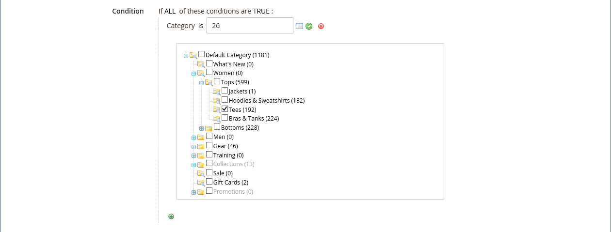

# [!DNL Page Builder] Partie 3 de la présentation : contenu du catalogue

Cet exercice montre à quel point il est facile d’ajouter une liste de produits à une page, de personnaliser les pages de produits et de créer un attribut personnalisé qui ajoute l’espace de travail [!DNL Page Builder] à un jeu d’attributs de produit.

{width="600" zoomable="yes"}

Cet exercice suppose que vous avez terminé [Partie 1 : Page simple](1-simple-page.md) et [Partie 2 : blocs](2-blocks.md), y compris les conditions préalables et les fichiers d’exemple téléchargés. Suivez les trois parties de cet exercice dans l’ordre.

## Partie 1 : Ajouter une liste de produits

[!DNL Page Builder] facilite l’ajout d’une liste de produits à l’étape. Dans cet exemple, la liste de produits est ajoutée directement à une page.

### Étape 1 : Ajout d’une liste de produits à l’étape

1. Sur la barre latérale _Admin_, accédez à **[!UICONTROL Content]** > _[!UICONTROL Elements]_>**[!UICONTROL Pages]**.

1. Recherchez la _page simple_ que vous avez créée lors du premier exercice et que vous avez modifiée dans le second, puis sélectionnez **[!UICONTROL Edit]** dans la colonne _[!UICONTROL Action]_.

1. Développez  de la section **[!UICONTROL Content]** et cliquez sur **[!UICONTROL Edit with Page Builder]** ou dans la zone d’aperçu du contenu.

1. Dans le panneau [!DNL Page Builder] sous _[!UICONTROL Layout]_, faites glisser un **[!UICONTROL Row]**&#x200B;jusqu’en haut de l’étape.

1. Dans le panneau [!DNL Page Builder], développez **[!UICONTROL Add Content]** et faites glisser un espace réservé **[!UICONTROL Products]** sur la nouvelle ligne.

   {width="600" zoomable="yes"}

### Étape 2 : Composer la condition

1. Passez la souris sur le conteneur de produits vide pour afficher la boîte à outils et sélectionnez l’icône _Paramètres_ ( {width="20"} ).

   {width="600" zoomable="yes"}

1. Pour **[!UICONTROL Select Products By]**, choisissez `Condition`.

1. Ajoutez une condition :

   - Cliquez sur l&#39;icône _Ajouter_ ().

   - Sous _[!UICONTROL Product Attribute]_, choisissez **[!UICONTROL Category]**.

     {width="600" zoomable="yes"}

   - Complétez la partie _[!UICONTROL Category is]..._ de la condition en cliquant sur l’icône Plus (...), puis sur l’icône _Sélecteur_ ().

     {width="600" zoomable="yes"}

   - Dans l’arborescence des catégories, accédez à la catégorie **Femmes > Principaux** et cochez la case **Tees** .

     {width="600" zoomable="yes"}

   - Cliquez sur l’icône Coche () .

     L’ID de catégorie correspondant apparaît dans le champ pour remplir la condition.

### Étape 3 : Paramètres

1. Saisissez le **[!UICONTROL Number of Products to Display]**.

   Par défaut, la liste affiche cinq produits.

1. Définissez les paramètres restants si nécessaire.

   Si nécessaire, utilisez les descriptions de champ à la fin de la page [Ajouter du contenu - Produits](products.md) à titre de référence.

1. Une fois l’opération terminée, cliquez sur **[!UICONTROL Save]** pour enregistrer les paramètres et revenir à l’espace de travail [!DNL Page Builder].

   {width="600" zoomable="yes"}

1. Dans le coin supérieur droit de l’étape, cliquez sur l’icône _Fermer le plein écran_ ( {width="20"} ).

   Cliquez sur cette icône pour revenir à la section _[!UICONTROL Content]_&#x200B;de la page dont l’aperçu est affiché.

1. Dans le coin supérieur droit, cliquez sur la flèche **[!UICONTROL Save]** et sélectionnez **[!UICONTROL Save & Close]**.

## Partie 2 : personnalisation de la page de produits

>[!NOTE]
>
>Un utilisateur administrateur doit disposer de [!UICONTROL Content] autorisations pour sa [portée de rôle](../systems/permissions-user-roles.md) pour afficher les boutons [!UICONTROL Edit with Page Builder] et pouvoir utiliser le générateur de pages.

Dans cette partie de l’exercice, vous découvrez à quel point il est facile de personnaliser une page de produit en plaçant une vidéo sous l’ensemble des onglets de la page de produit. Le processus de mise à jour du contenu [page de catégorie](../catalog/categories-content-settings.md) est essentiellement le même.

1. Sur la barre latérale _Admin_, accédez à **[!UICONTROL Catalog]** > **[!UICONTROL Products]**.

1. Recherchez un produit simple que vous pouvez utiliser pour cet exemple et ouvrez-le en mode d’édition.

1. Faites défiler l’écran vers le bas et développez la section  sur **[!UICONTROL Content]** .

1. En regard de _[!UICONTROL Description]_, cliquez sur **[!UICONTROL Edit with Page Builder]**.

   {width="600" zoomable="yes"}

   Si la description du produit a été précédemment saisie sans [!DNL Page Builder], la description actuelle s’affiche comme HTML dans un conteneur [Code HTML](html-code.md). Avec le thème Luma, la description du produit s’affiche dans l’onglet Détails .

1. Dans le panneau [!DNL Page Builder] situé sous _[!UICONTROL Layout]_, faites glisser un **[!UICONTROL Row]**&#x200B;jusqu’à l’étape, le plaçant sous le conteneur de code d’HTML.

   Recherchez la ligne guide rouge qui s’affiche lorsque la ligne est à la bonne position.

   {width="600" zoomable="yes"}

1. Dans le panneau [!DNL Page Builder], développez **[!UICONTROL Media]** et faites glisser un espace réservé **[!UICONTROL Video]** sur la nouvelle ligne.

   {width="600" zoomable="yes"}

1. Passez la souris sur le conteneur vidéo vide pour afficher la boîte à outils et sélectionnez l’icône _Paramètres_ ( {width="20"} ).

   {width="500" zoomable="yes"}

1. Saisissez le **[!UICONTROL Video URL]**.

   La vidéo peut être hébergée sur [YouTube][1] ou [Vimeo][2]. La vidéo de cet exemple se trouve sur YouTube à l’adresse URL suivante :

   `https://www.youtube.com/watch?v=ZpFrNyD4100`

   {width="500" zoomable="yes"}

1. Saisissez le **[!UICONTROL Maximum Width]** en pixels pour l’affichage de la vidéo.

   Si vous laissez cette option vide, la vidéo remplit l’espace disponible.

1. Cliquez sur **[!UICONTROL Save]** pour enregistrer les paramètres et revenir à l’espace de travail [!DNL Page Builder].

   {width="600" zoomable="yes"}

1. Dans le coin supérieur droit de l’étape, cliquez sur l’icône _Fermer le plein écran_ ( {width="20"} ).

   Cliquez sur cette icône pour revenir à la section _[!UICONTROL Content]_&#x200B;de la page dont l’aperçu est affiché.

1. Dans le coin supérieur droit, cliquez sur la flèche **[!UICONTROL Save]** et sélectionnez **[!UICONTROL Save & Close]**.

Dans le storefront, la vidéo apparaît sous l’ensemble d’onglets. Pour voir à quoi ressemble la page sur un appareil mobile, vous pouvez redimensionner la fenêtre.

{width="600" zoomable="yes"}

**Félicitations !** Vous avez terminé la deuxième partie du tutoriel Contenu du catalogue. Conservez le travail que vous avez créé afin que vous puissiez y faire référence ultérieurement.

## Partie 3 : Ajout d’attributs personnalisés

Utilisez l’attribut personnalisé [!DNL Page Builder] pour ajouter un espace de travail [!DNL Page Builder] entièrement fonctionnel à une page de produit, que vous pouvez utiliser pour créer du contenu engageant. Dans cette partie de l’exercice, vous apprenez à créer un attribut personnalisé à l’aide du type d’entrée [!DNL Page Builder] et à l’appliquer aux pages de produits de votre catalogue. Pour plus d’informations sur ces attributs, voir [Attributs de produit](../catalog/product-attributes.md).

### Étape 1 : créer un produit

Pour éviter toute modification de votre boutique en ligne, créez un produit à l’aide des propriétés décrites.

1. Sur la barre latérale _Admin_, accédez à **[!UICONTROL Catalog]** > **[!UICONTROL Products]**.

1. Dans le coin supérieur droit, cliquez sur **[!UICONTROL Add Product]**.

1. Créez le produit avec les propriétés suivantes :

   - &#x200B;

     [!UICONTROL Jeu d’attributs]: Default
   - [!UICONTROL Product Name] : Mon produit
   - &#x200B;

     [!UICONTROL SKU]: Tutorial
   - &#x200B;

     [!UICONTROL Price]: 75.00
   - &#x200B;

     [!UICONTROL Quantity]: 100
   - [!UICONTROL Stock Status] : En Stock
   - &#x200B;

     [!UICONTROL Weight]: 1
   - [!UICONTROL Categories] : Femmes > Trops > Tees

1. Dans le coin supérieur droit, cliquez sur la flèche **[!UICONTROL Save]** et sélectionnez **[!UICONTROL Save & Close]**.

### Étape 2 : Création d’attributs personnalisés

Au cours de cette étape, vous créez deux nouveaux attributs personnalisés pour montrer comment les types d’entrée [!DNL Page Builder] et l’éditeur de texte peuvent être utilisés.

1. Sur la barre latérale _Admin_, accédez à **[!UICONTROL Stores]** > _[!UICONTROL Attributes]_>**[!UICONTROL Product]**.

1. Dans le coin supérieur droit, cliquez sur **[!UICONTROL Add New Attribute]**.

1. Saisissez un **[!UICONTROL Default Label]** pour l’attribut .

   Pour cet exemple, utilisez `My Page Builder Attribute` pour le libellé.

1. Définissez **[!UICONTROL Catalog Input Type for Store Owner]** sur `Page Builder`.

   Lors de la création d’un attribut personnalisé, vous pouvez spécifier l’éditeur qui convient le mieux à l’application en tant que `Page Builder` ou la norme WYSIWYG `Text Editor`.

   ![[!DNL Page Builder] Type d’entrée](./assets/pb-attribute-page-builder.png){width="600" zoomable="yes"}

1. Développez la section  et définissez les paramètres suivants :**[!UICONTROL Advanced Attribute Properties]**

   - [!UICONTROL Attribute Code] : saisissez un code d’attribut en minuscules avec des tirets au lieu d’espaces. Pour cet exemple, utilisez `my_page_builder_attribute`.
   - [!UICONTROL Scope] : acceptez la valeur par défaut, `Store View`.
   - [!UICONTROL Default Value] : entrez une valeur par défaut pour l’attribut .
   - &#x200B;

     [!UICONTROL Unique Value]: `No`
   - &#x200B;

     [!UICONTROL Add to Column Options]: `No`
   - &#x200B;

     [!UICONTROL Use in Filter Options]: `Yes`

1. Dans le panneau _[!UICONTROL Attribute Information]_&#x200B;à gauche, sélectionnez **[!UICONTROL Storefront Properties]**&#x200B;et définissez les paramètres suivants :

   - &#x200B;

     [!UICONTROL Use for Promo Rule Conditions]: `Yes`
   - &#x200B;

     [!UICONTROL Visible on Catalog Pages on Storefront]: `Yes`
   - &#x200B;

     [!UICONTROL Used in Product Listing]: `Yes`

1. Une fois l’opération terminée, cliquez sur **[!UICONTROL Save Attribute]**.

1. Répétez les étapes précédentes pour créer un second attribut avec les mêmes propriétés de base, mais avec le type d’entrée Éditeur de texte comme suit :

   - [!UICONTROL Default Label] : attribut de l’éditeur de texte
   - [!UICONTROL Catalog Input Type for Store Owner] : Éditeur de texte
   - &#x200B;

     [!UICONTROL Attribute Code]: `my_text_editor_attribute`

### Étape 3 : mise à jour du jeu d’attributs de produit

1. Sur la barre latérale _Admin_, accédez à **[!UICONTROL Stores]** > _[!UICONTROL Attributes]_>**[!UICONTROL Attribute Set]**.

   Pour cet exemple, vous ajoutez temporairement les nouveaux attributs au jeu d’attributs `default`. À la fin de cet exercice, supprimez les attributs de l’ensemble d’attributs afin de ne pas affecter votre catalogue.

   >[!NOTE]
   >
   >Si vous ne souhaitez pas modifier votre magasin en direct, vous pouvez suivre sans mettre à jour le jeu d’attributs.

1. Recherchez l’attribut _[!UICONTROL Default]_&#x200B;défini dans la liste et double-cliquez dessus pour l’ouvrir en mode d’édition.

1. Dans la liste _Attributs non attribués_, recherchez les nouveaux attributs que vous avez créés et faites glisser chacun d’eux vers la colonne _[!UICONTROL Groups]_, sous **[!UICONTROL Content]**.

   L’emplacement de l’attribut dans la colonne [!UICONTROL Groups] détermine l’emplacement où il apparaît sur la page.

   {width="600" zoomable="yes"}

1. Cliquez sur **[!UICONTROL Save]** pour revenir à la liste des jeux d’attributs.

1. Lorsque vous y êtes invité, cliquez sur le lien **[!UICONTROL Cache Management]** situé en haut de la page et actualisez le cache non valide.

### Étape 4 : Mettre à jour le produit

1. Sur la barre latérale _Admin_, accédez à **[!UICONTROL Catalog]** > **[!UICONTROL Products]**.

1. Dans la grille Produits, recherchez _Mon produit_ et ouvrez-le en mode d’édition.

1. Faites défiler l’écran vers le bas et développez la section  sur **[!UICONTROL Content]** .

   En haut de la section , il existe deux attributs standard pour le contenu du produit :

   - _Description courte_, qui utilise le WYSIWYG [editor](../content-design/editor.md) standard.
   - _Description_, qui affiche l’aperçu [!DNL Page Builder].

   {width="600" zoomable="yes"}

   Lorsque vous faites défiler l’écran jusqu’à la moitié inférieure de la section, il y a les deux attributs que vous avez créés et attribués :

   - _My [!DNL Page Builder] Attribute_, qui affiche l’aperçu [!DNL Page Builder].
   - _My Text Editor Attribute_, qui utilise l’éditeur WYSIWYG standard.

   {width="600" zoomable="yes"}

1. Dans l’éditeur **My Text Editor Attribute** , saisissez `Text Editor Attribute placeholder text`.

   - Dans le coin supérieur droit, cliquez sur la flèche **[!UICONTROL Save]** et sélectionnez **[!UICONTROL Save & Close]**.

1. Pour **My Page Builder Attribute**, cliquez sur **[!UICONTROL Edit with Page Builder]** et ajoutez le texte de description :

   - Dans le panneau [!DNL Page Builder], développez **[!UICONTROL Elements]** et faites glisser un **[!UICONTROL Text object]** sur la scène.

   - Saisissez `Page Builder attribute placeholder text`.

   - Dans le coin supérieur droit de l’étape, cliquez sur l’icône _Fermer le plein écran_ ( {width="20"} ).

     {width="600" zoomable="yes"}

1. Faites défiler l’écran jusqu’à **[!UICONTROL Description]**, cliquez sur **[!UICONTROL Edit with Page Builder]** et ajoutez le texte de votre choix en utilisant la même méthode que l’étape précédente.

1. Dans le coin supérieur droit de la page du produit, cliquez sur la flèche **[!UICONTROL Save]** et choisissez **[!UICONTROL Save & Close]**.

1. Si vous y êtes invité, cliquez sur le lien **[!UICONTROL Cache Management]** dans le message en haut de la page et actualisez le cache non valide.

### Etape 5 : Visualiser le résultat

1. Accédez à votre page d’exemple de produit dans le storefront.

   Dans cet exemple, le produit se trouve dans le volet de navigation supérieur de Women > Tops > Tees.

1. Faites défiler l’écran jusqu’aux informations _My Page Builder Attribute_ (Mon attribut de créateur de pages).

   La position des attributs sur la page du produit est déterminée par le thème. Dans le thème Luma, les nouveaux attributs sont situés juste après la description du produit.

   ![[!DNL Page Builder] et attributs de l’éditeur de texte dans le storefront](./assets/pb-storefront-product-attribute.png){width="600" zoomable="yes"}

Vous avez terminé l’exercice [!DNL Page Builder] de contenu du catalogue. Conservez le travail que vous avez créé afin que vous puissiez y faire référence ultérieurement.

[1]: https://www.youtube.com/
[2]: https://vimeo.com/
