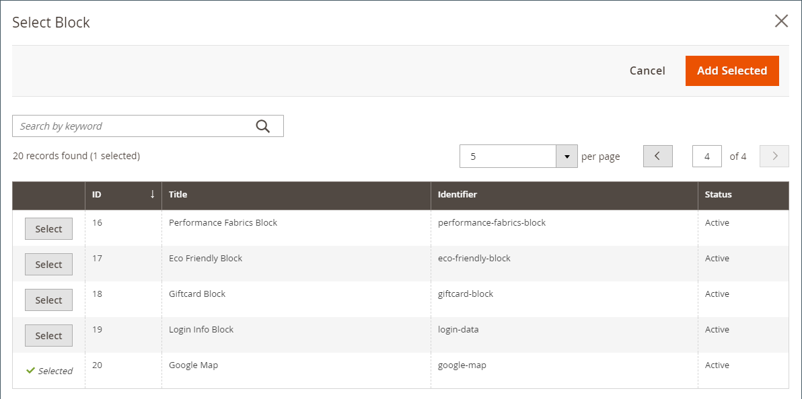
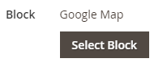

# Ajouter du contenu - Bloquer

Utilisez le type de contenu _Bloc_ pour ajouter un [bloc](../content-design/blocks.md) actif existant à l’[[!DNL Page Builder] étape](workspace.md#stage). Dans l’exemple suivant, la première colonne contient le bloc avec un menu latéral pour la page. La deuxième colonne contient une image.

{width="600" zoomable="yes"}

{{$include /help/_includes/page-builder-save-timeout.md}}

## Boîte à outils Bloc

| Outil | Icon | Description |
| --------- | -------- | ------------- |
| Déplacer |  | Déplace le conteneur de blocs et son contenu vers un autre emplacement sur la scène. |
| Paramètres |  | Ouvre la page Modifier le bloc , qui vous permet de choisir le bloc et de modifier les propriétés du conteneur. |
| Masquer |  | Masque le conteneur du bloc actif et son contenu. |
| Afficher |  | Affiche le conteneur du bloc masqué et son contenu. |
| Dupliquer |  | Effectue une copie du conteneur de blocs et de son contenu. |
| Supprimer |  | Supprime le conteneur de blocs et son contenu de l’étape. |

{style="table-layout:auto"}

{{$include /help/_includes/page-builder-hidden-element-note.md}}

## Ajouter un bloc existant

1. Accédez à l’espace de travail [!DNL Page Builder] sur la page, le bloc, le bloc dynamique, le produit ou la catégorie cible.

1. Dans le panneau [!DNL Page Builder], développez **[!UICONTROL Add Content]** et faites glisser un espace réservé **[!UICONTROL Block]** vers la scène.

   {width="600" zoomable="yes"}

1. Pointez sur le conteneur de blocs vide pour afficher la boîte à outils et choisissez l’icône _Paramètres_ ( {width="25"} ).

1. Cliquez sur **[!UICONTROL Select Block]**.

   {width="200"}

1. Dans la ligne du bloc que vous souhaitez ajouter, cliquez sur **[!UICONTROL Select]** dans la dernière colonne.

   {width="600" zoomable="yes"}

   Le nom du bloc sélectionné s’affiche sur la page.

   {width="200"}

1. Renseignez les paramètres restants selon vos besoins à l’aide de la description des champs située à la fin de cette page à titre de référence.

1. Une fois l’opération terminée, cliquez sur **[!UICONTROL Save]** pour appliquer les paramètres et revenir à l’espace de travail [!DNL Page Builder].

### Paramètres avancés

1. Pour contrôler le positionnement du bloc dans le conteneur parent, choisissez une **[!UICONTROL Alignment]** :

   | Option | Description |
   | ------ | ----------- |
   | `Default` | Applique le paramètre d’alignement par défaut spécifié dans la feuille de style du thème actif. |
   | `Left` | Aligne la liste le long de la bordure gauche du conteneur parent, en tenant compte de la marge intérieure spécifiée. |
   | `Center` | Aligne la liste au centre du conteneur parent, en tenant compte de la marge intérieure spécifiée. |
   | `Right` | Aligne le bloc le long de la bordure droite du conteneur parent, en tenant compte de la marge intérieure spécifiée. |

   {style="table-layout:auto"}

1. Définissez un style de **[!UICONTROL Border]** appliqué aux quatre côtés du conteneur de blocs :

   | Option | Description |
   | ------ | ----------- |
   | `Default` | Applique le style de bordure par défaut spécifié par la feuille de style associée. |
   | `None` | Ne fournit aucune indication visible des bordures du conteneur. |
   | `Dotted` | La bordure du conteneur s’affiche sous la forme d’une ligne pointillée. |
   | `Dashed` | La bordure du conteneur s’affiche sous la forme d’une ligne en tirets. |
   | `Solid` | La bordure du conteneur s’affiche sous la forme d’une ligne continue. |
   | `Double` | La bordure du conteneur s’affiche sous la forme d’une ligne double. |
   | `Groove` | La bordure du conteneur s’affiche sous la forme d’une ligne rainurée. |
   | `Ridge` | La bordure du conteneur s’affiche sous la forme d’une ligne crantée. |
   | `Inset` | La bordure du conteneur s’affiche sous la forme d’une ligne insérée. |
   | `Outset` | La bordure du conteneur s’affiche sous la forme d’une ligne de départ. |

   {style="table-layout:auto"}

1. Si vous définissez un style de bordure autre que `None`, renseignez les options d’affichage des bordures :

   | Option | Description |
   | ------ |------------ |
   | [!UICONTROL Border Color] | Spécifiez la couleur en choisissant une nuance, en cliquant sur le sélecteur de couleurs ou en saisissant un nom de couleur valide ou une valeur hexadécimale équivalente. |
   | [!UICONTROL Border Width] | Saisissez le nombre de pixels pour la largeur de la ligne de bordure. |
   | [!UICONTROL Border Radius] | Saisissez le nombre de pixels pour définir la taille du rayon utilisé pour arrondir chaque coin de la bordure. |

   {style="table-layout:auto"}

1. (Facultatif) Spécifiez les noms des **[!UICONTROL CSS classes]** de la feuille de style actuelle à appliquer au conteneur.

   Séparez plusieurs noms de classe par un espace.

1. Saisissez les valeurs, en pixels, du **[!UICONTROL Margins and Padding]** pour déterminer les marges extérieures et la marge intérieure du conteneur du bloc.

   Saisissez les valeurs correspondantes dans le diagramme.

   | Zone conteneur | Description |
   | -------------- | ----------- |
   | [!UICONTROL Margins] | Quantité d’espace vide appliqué au bord extérieur de tous les côtés du conteneur. Options : `Top` / `Right` / `Bottom` / `Left` |
   | [!UICONTROL Padding] | Quantité d’espace vide appliqué au bord intérieur de tous les côtés du conteneur. Options : `Top` / `Right` / `Bottom` / `Left` |

   {style="table-layout:auto"}

## Modifier les paramètres du bloc

1. Pointez sur le conteneur de blocs et sélectionnez l’icône _Paramètres_ ( {width="25"} ) dans la boîte à outils.

   {width="600" zoomable="yes"}

1. Pour choisir un autre bloc, cliquez sur **[!UICONTROL Select Block]**.

   - Dans la liste des blocs actifs, cliquez **[!UICONTROL Select]** le bloc que vous souhaitez ajouter.
   - Cliquez sur **[!UICONTROL Add Selected]**.

1. Mettez à jour les paramètres restants si nécessaire, en utilisant la description des champs à la fin de cette page pour référence.

1. Une fois l’opération terminée, cliquez sur **[!UICONTROL Save]** pour appliquer les paramètres et revenir à l’espace de travail [!DNL Page Builder].

## Dupliquer un bloc

1. Pointez sur le conteneur de blocs pour afficher la palette et choisissez l’icône _Dupliquer_ ().

   Le duplicata apparaît juste en dessous de l’original.

1. Pour déplacer le nouveau bloc vers un nouvel emplacement, passez le curseur sur le conteneur, puis cliquez sur _Déplacer_ () dans la palette.

1. Sélectionnez le bloc et faites-le glisser jusqu’à ce que la ligne directrice rouge s’affiche à la nouvelle position.

   Les bordures supérieure et inférieure de chaque conteneur apparaissent sous la forme de lignes en tirets lorsque le bloc est déplacé.

## Supprimer un bloc de l’étape

1. Pointez sur le conteneur de blocs pour afficher la boîte à outils et choisissez l’icône _Supprimer_ ().

1. Lorsque vous êtes invité à confirmer, cliquez sur **[!UICONTROL OK]**.

<!-- Last updated from includes: 2023-09-11 14:30:19 -->
