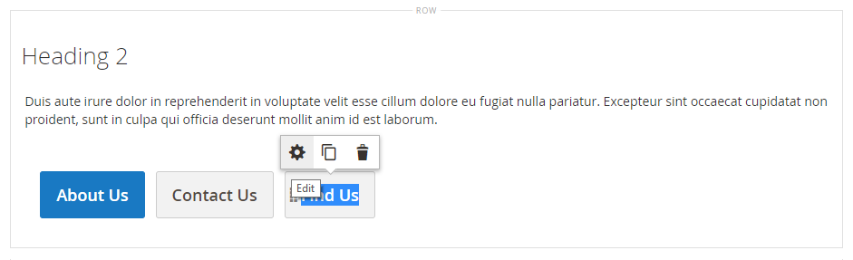

# Éléments - Boutons

Utilisez le type de contenu _Boutons_ pour ajouter un bouton individuel ou un ensemble de boutons dans la [[!DNL Page Builder] étape](workspace.md#stage). Vous pouvez organiser les boutons horizontalement ou verticalement et les ajouter directement aux lignes, colonnes, onglets et bannières de la scène.

{width="600" zoomable="yes"}

{{$include /help/_includes/page-builder-save-timeout.md}}

## Boîte à outils

Lorsque vous utilisez le type de contenu Boutons , vous ajoutez et modifiez des boutons individuels ainsi que le conteneur de boutons qui contient un ou plusieurs boutons. Chaque comporte sa propre boîte à outils que vous utilisez pour concevoir des boutons sur la scène [!DNL Page Builder].

### Boîte à outils de boutons individuels

{width="500" zoomable="yes"}

| Outil | Icon | Description |
| --------- | -------- | -------------- |
| Paramètres | {width="25"} | Ouvre la page Bouton Modifier, qui permet de modifier les propriétés du bouton. |
| Dupliquer | {width="25"} | Effectue une copie du bouton. |
| Supprimer | {width="25"} | Supprime le bouton de l’étape. |

{style="table-layout:auto"}

### Boîte à outils du conteneur de boutons

{width="500" zoomable="yes"}

| Outil | Icon | Description |
| --------- | ----------------- | ----------- |
| Déplacer | {width="25"} | Déplace le conteneur de boutons vers un autre emplacement valide sur la page. |
| Ajouter | {width="25"} | Ajoute un bouton au conteneur. |
| (libellé) | Bouton | Identifie le conteneur actif comme un élément de bouton. |
| Paramètres | {width="25"} | Ouvre la page Boutons de modification , qui permet de modifier les propriétés du conteneur. |
| Masquer | {width="25"} | Masque le conteneur de boutons. |
| Afficher | {width="25"} | Affiche le conteneur de boutons masqué. |
| Dupliquer | {width="25"} | Crée une copie du conteneur de boutons. |
| Supprimer | {width="25"} | Supprime le conteneur de boutons et son contenu de l’étape. |

{style="table-layout:auto"}

{{$include /help/_includes/page-builder-hidden-element-note.md}}

## Ajouter un bouton individuel

1. Dans le panneau [!DNL Page Builder], développez **[!UICONTROL Elements]** et faites glisser un espace réservé **[!UICONTROL Buttons]** vers une ligne, une colonne ou un ensemble d’onglets sur la scène.

   {width="500" zoomable="yes"}

1. Pointez sur le bouton pour afficher la boîte à outils et choisissez l’icône _Paramètres_ ().

1. Saisissez le **[!UICONTROL Button Text]** à afficher sur le bouton.

   {width="600" zoomable="yes"}

1. Définissez **[!UICONTROL Button Type]** sur l’une des options suivantes :

   | Type | Description |
   | ------ | ----------- |
   | `Primary` | Applique le style du bouton principal à partir de la feuille de style actuelle. |
   | `Secondary` | Applique le style du bouton secondaire de la feuille de style active, le cas échéant. |
   | `Link` | Crée un lien hypertexte plutôt qu’un bouton. |

   {style="table-layout:auto"}

   {width="500" zoomable="yes"}

1. Définissez le **[!UICONTROL Button Link]** à l’aide de l’un des types suivants :

   - **[!UICONTROL URL]** - Saisissez l’URL de destination du lien.

     L’URL peut être soit un lien relatif vers un produit ou une page de votre boutique, soit une URL complète.

     Exemple d’URL relative - `../luma-analog-watch.html`

     Exemple d’URL complète - `http://mystore.com/luma-analog-watch.html`

     Si le lien mène à un autre site web, vous pouvez conserver la page active ouverte dans votre boutique en ouvrant le lien dans un nouvel onglet du navigateur.

     Pour empêcher le visiteur de quitter votre boutique, cochez la case **[!UICONTROL Open in new tab]** .

   - **[!UICONTROL Product]** - Saisissez un nom de produit (partiel ou complet) ou un SKU, puis choisissez le nom du produit dans la liste.

     >[!NOTE]
     >
     >Les produits sont affichés dans la liste en fonction des paramètres _Afficher les produits en rupture de stock_. Pour les commerçants Multi Source utilisant [Inventory management](../inventory-management/introduction.md), la liste de produits est limitée par la source affectée au site web par défaut uniquement.

     {width="600" zoomable="yes"}

   - **[!UICONTROL Category]** - Saisissez un nom de catégorie (partiel ou complet) ou cliquez dans le champ vide pour afficher l’arborescence des catégories. Choisissez ensuite le nom de la catégorie dans l’arborescence.

     {width="600" zoomable="yes"}

   - **[!UICONTROL Page]** - Saisissez le nom d’une page CMS (partielle ou complète) ou cliquez dans le champ vide pour afficher la liste complète. Choisissez ensuite le nom de la page dans la liste des résultats de la recherche.

     {width="600" zoomable="yes"}

1. Renseignez les [paramètres avancés][advanced-settings] selon vos besoins.

1. Une fois l’opération terminée, cliquez sur **[!UICONTROL Save]** dans le coin supérieur droit pour appliquer les paramètres et revenir à l’espace de travail [!DNL Page Builder].

## Ajouter un ensemble de boutons

Les sections suivantes décrivent une série d’étapes pour commencer avec un bouton individuel et créer un ensemble de trois boutons dans un conteneur de boutons. Si vous ne disposez pas encore d’un bouton individuel, suivez les instructions précédentes pour ajouter un bouton individuel à l’étape.

### Étape 1 : créer le deuxième bouton

1. Pointez sur le conteneur de boutons pour afficher la palette et choisissez l’icône _Ajouter_ ( {width="20"} ).

   {width="500" zoomable="yes"}

1. Saisissez le texte qui doit apparaître sur le deuxième bouton.

1. Cliquez sur le nouveau bouton pour afficher sa boîte à outils et choisissez l’icône _Paramètres_ ( {width="20"} ).

   {width="500" zoomable="yes"}

1. Définissez **[!UICONTROL Button Type]** sur `Secondary`.

1. Configurez le **[!UICONTROL Button Link]** selon vos besoins.

   Dans l’exemple suivant, le lien est une URL relative qui mène à la page [Nous contacter](../getting-started/store-details.md#contact-us-form).

   {width="600" zoomable="yes"}

1. Renseignez les [paramètres avancés][advanced-settings] selon vos besoins.

1. Une fois l’opération terminée, cliquez sur **[!UICONTROL Save]** pour appliquer les paramètres et revenir à l’espace de travail [!DNL Page Builder].

### Étape 2 : créer le troisième bouton

1. Cliquez à nouveau sur le deuxième bouton de l’étape et sélectionnez l’icône _Dupliquer_ ( {width="20"} ).

   {width="500" zoomable="yes"}

1. Saisissez le texte qui doit apparaître sur le troisième bouton.

1. Cliquez sur le troisième bouton pour afficher la palette et choisissez l&#39;icône _Paramètres_ ( {width="20"} ).

   {width="500" zoomable="yes"}

1. Mettez à jour le **[!UICONTROL Button Link]** selon les besoins.

1. Dans le coin supérieur droit, cliquez sur **[!UICONTROL Save]** pour appliquer les paramètres et revenir à l’espace de travail [!DNL Page Builder].

### Étape 3 : mettre à jour le conteneur de boutons

1. Pointez sur le conteneur de boutons pour afficher la boîte à outils et choisissez l’icône _Paramètres_ ( {width="20"} ).

   {width="500" zoomable="yes"}

1. Sous _[!UICONTROL Appearance]_, choisissez **[!UICONTROL Stacked]**.

1. Définissez **[!UICONTROL All Buttons are same size]** sur `Yes`.

   {width="300"}

1. Mettez à jour les paramètres restants si nécessaire, à l’aide des descriptions de [Modifier les paramètres d’un conteneur de boutons][button-container].

1. Une fois l’opération terminée, cliquez sur **[!UICONTROL Save]** pour appliquer les paramètres et revenir à l’espace de travail [!DNL Page Builder].

   L’ensemble complet de boutons empilés apparaît sur l’étape, avec un bouton principal et deux boutons secondaires.

   {width="500" zoomable="yes"}

## Déplacer un bouton

1. Cliquez sur le bouton à déplacer.

1. Sélectionnez l’icône Déplacer ( {width="20"} ) qui s’affiche juste avant le texte du bouton et faites-la glisser vers une nouvelle position pour le bouton dans le conteneur du bouton.

   {width="500" zoomable="yes"}

## Modifier les paramètres d’un bouton

1. Cliquez sur le bouton de l’étape pour afficher la palette et choisissez l’icône _Paramètres_ ( {width="20"} ).

   {width="500" zoomable="yes"}

1. Mettez à jour les paramètres standard si nécessaire.

   - **[!UICONTROL Button Text]** - Saisissez le texte à afficher sur le bouton (qui peut également être mis à jour directement depuis l&#39;étape).

   - **[!UICONTROL Button Type]** - Détermine le format du bouton.

     | Type | Description |
     | ------ | ----------- |
     | `Primary` | Applique le style du bouton principal à partir de la feuille de style actuelle. |
     | `Secondary` | Applique le style du bouton secondaire de la feuille de style en cours, le cas échéant. |
     | `Link` | Crée un lien hypertexte plutôt qu’un bouton. |

     {style="table-layout:auto"}

   - **[!UICONTROL Button Link]** - Détermine la page de destination diffusée lorsque l’utilisateur clique sur le bouton.

     | Option | Description |
     | ------ | ----------- |
     | `URL` | Utilise une URL relative ou complète pour identifier la page de destination. |
     | `Product` | Identifie la page de destination en fonction du nom du produit ou du SKU. Le nom du produit peut être recherché en fonction d’un nom partiel ou complet. Le produit est ensuite sélectionné dans la liste des résultats de la recherche. |
     | `Category` | Identifie la page de destination en tant que catégorie ou sous-catégorie spécifique dans l’arborescence des catégories. |
     | `Page` | Identifie la page de destination en tant que page CMS spécifique. |

     {style="table-layout:auto"}

1. Renseignez les [paramètres avancés][advanced-settings] selon vos besoins.

1. Pour enregistrer les paramètres et revenir à l’espace de travail [!DNL Page Builder], cliquez sur **[!UICONTROL Save]** dans le coin supérieur droit.

## Modification des paramètres d’un conteneur de boutons

1. Pointez sur le conteneur de boutons pour afficher la boîte à outils et choisissez l’icône _Paramètres_ ( {width="20"} ).

1. Mettez à jour les paramètres **[!UICONTROL Appearance]** selon vos besoins.

   - Utilisez les options de disposition pour afficher les boutons horizontalement ou verticalement dans le conteneur :

     | Option | Description |
     | ------ | ----------- |
     | `Inline` | Dispose les boutons horizontalement. |
     | `Stacked` | Dispose les boutons verticalement. |

     {style="table-layout:auto"}

   - Définissez l’option **[!UICONTROL All buttons are same size]** en fonction de vos préférences.

     Lorsque ce paramètre est défini sur `Yes`, tous les boutons du conteneur ont une taille cohérente en fonction de la longueur du texte du bouton le plus long.

1. Renseignez les [Paramètres avancés][advanced-settings] selon vos besoins.

1. Une fois l’opération terminée, cliquez sur **[!UICONTROL Save]** pour appliquer les paramètres et revenir à l’espace de travail [!DNL Page Builder].

## Modifier les paramètres avancés

Vous pouvez modifier les paramètres de _[!UICONTROL Advanced]_de chaque bouton et du conteneur de boutons.

1. Pour contrôler le positionnement dans le conteneur parent, choisissez l’**[!UICONTROL Alignment]** :

   | Option | Description |
   | ------ | ----------- |
   | `Default` | Applique le paramètre d’alignement par défaut spécifié dans la feuille de style du thème actif. |
   | `Left` | Aligne le contenu le long de la bordure gauche du conteneur parent, en tenant compte de la marge intérieure spécifiée. |
   | `Center` | Aligne le contenu au centre du conteneur parent, en tenant compte de la marge intérieure spécifiée. |
   | `Right` | Aligne le contenu le long de la bordure droite du conteneur parent, en tenant compte de la marge intérieure spécifiée. |

   {style="table-layout:auto"}

1. Définissez le style de **[!UICONTROL Border]** appliqué aux quatre côtés du ou des conteneurs de boutons :

   | Option | Description |
   | ------ | ----------- |
   | `Default` | Applique le style de bordure par défaut spécifié par la feuille de style associée. |
   | `None` | Ne fournit aucune indication visible des bordures du conteneur. |
   | `Dotted` | La bordure du conteneur s’affiche sous la forme d’une ligne pointillée. |
   | `Dashed` | La bordure du conteneur s’affiche sous la forme d’une ligne en tirets. |
   | `Solid` | La bordure du conteneur s’affiche sous la forme d’une ligne continue. |
   | `Double` | La bordure du conteneur s’affiche sous la forme d’une ligne double. |
   | `Groove` | La bordure du conteneur s’affiche sous la forme d’une ligne rainurée. |
   | `Ridge` | La bordure du conteneur s’affiche sous la forme d’une ligne crantée. |
   | `Inset` | La bordure du conteneur s’affiche sous la forme d’une ligne insérée. |
   | `Outset` | La bordure du conteneur s’affiche sous la forme d’une ligne de départ. |

   {style="table-layout:auto"}

1. Si vous définissez un style de bordure autre que `None`, renseignez les options d’affichage des bordures :

   | Option | Description |
   | ------ |------------ |
   | [!UICONTROL Border Color] | Spécifiez la couleur en choisissant une nuance, en cliquant sur le sélecteur de couleurs ou en saisissant un nom de couleur valide ou une valeur hexadécimale équivalente. |
   | [!UICONTROL Border Width] | Saisissez le nombre de pixels pour la largeur de la ligne de bordure. |
   | [!UICONTROL Border Radius] | Saisissez le nombre de pixels pour définir la taille du rayon utilisé pour arrondir chaque coin de la bordure. |

   {style="table-layout:auto"}

1. (Facultatif) Spécifiez les noms des **[!UICONTROL CSS classes]** de la feuille de style actuelle à appliquer au ou aux conteneurs de boutons.

   Séparez plusieurs noms de classe par un espace.

1. Saisissez les valeurs, en pixels, du **[!UICONTROL Margins and Padding]** pour déterminer les marges extérieures et la marge intérieure du ou des conteneurs de boutons.

   Saisissez les valeurs correspondantes dans le diagramme.

   | Zone conteneur | Description |
   | -------------- | ----------- |
   | [!UICONTROL Margins] | Quantité d’espace vide appliqué au bord extérieur de tous les côtés du conteneur. Options : `Top` / `Right` / `Bottom` / `Left` |
   | [!UICONTROL Padding] | Quantité d’espace vide appliqué au bord intérieur de tous les côtés du conteneur. Options : `Top` / `Right` / `Bottom` / `Left` |

   {style="table-layout:auto"}

[advanced-settings]: #change-advanced-settings
[button-container]: #change-settings-for-a-button-container

<!-- Last updated from includes: 2023-09-11 14:30:19 -->
