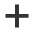

# Éléments - Boutons

Utilisez la variable _Boutons_ type de contenu pour ajouter un bouton individuel ou un ensemble de boutons dans la variable [[!DNL Page Builder] étape](workspace.md#stage). Vous pouvez disposer les boutons horizontalement ou verticalement, puis les ajouter directement aux rangées, colonnes, onglets et bannières sur la scène.

{width="600" zoomable="yes"}

{{$include /help/_includes/page-builder-save-timeout.md}}

## Toolbox

Lorsque vous utilisez le type de contenu Boutons , vous ajoutez et modifiez des boutons individuels et le conteneur de boutons qui contient un ou plusieurs boutons. Chacun dispose de sa propre boîte à outils que vous utilisez pour concevoir des boutons sur le [!DNL Page Builder] scène.

### Barre d’outils à boutons individuelle

{width="500" zoomable="yes"}

| Outil | Icône | Description |
| --------- | -------- | -------------- |
| Paramètres | {width="25"} | Ouvre la page Bouton Modifier dans laquelle vous pouvez modifier les propriétés du bouton. |
| Dupliquer | {width="25"} | Effectue une copie du bouton. |
| Supprimer | {width="25"} | Supprime le bouton de la scène. |

{style="table-layout:auto"}

### Boîte à outils du conteneur de boutons

{width="500" zoomable="yes"}

| Outil | Icône | Description |
| --------- | ----------------- | ----------- |
| Déplacer | {width="25"} | Déplace le conteneur de boutons vers un autre emplacement valide de la page. |
| Ajouter | {width="25"} | Ajoute un bouton au conteneur. |
| (label) | Bouton | Identifie le conteneur actuel en tant qu’élément de bouton. |
| Paramètres | {width="25"} | Ouvre la page Boutons de modification, dans laquelle vous pouvez modifier les propriétés du conteneur. |
| Masquer | {width="25"} | Masque le conteneur de boutons. |
| Afficher | {width="25"} | Affiche le conteneur de boutons masqués. |
| Dupliquer | {width="25"} | Effectue une copie du conteneur de boutons. |
| Supprimer | {width="25"} | Supprime le conteneur de boutons et son contenu de la scène. |

{style="table-layout:auto"}

{{$include /help/_includes/page-builder-hidden-element-note.md}}

## Ajouter un bouton individuel

1. Dans le [!DNL Page Builder] panneau, développer **[!UICONTROL Elements]** et faites glisser un **[!UICONTROL Buttons]** d’un espace réservé à une ligne, une colonne ou un ensemble d’onglets sur l’étape.

   {width="500" zoomable="yes"}

1. Pointez sur le bouton pour afficher la boîte à outils et sélectionnez l’option _Paramètres_ ().

1. Saisissez le **[!UICONTROL Button Text]** à afficher sur le bouton.

   {width="600" zoomable="yes"}

1. Définir **[!UICONTROL Button Type]** à l’une des options suivantes :

   | Type | Description |
   | ------ | ----------- |
   | `Primary` | Applique le style de bouton principal à partir de la feuille de style active. |
   | `Secondary` | Applique le style de bouton secondaire à partir de la feuille de style active, le cas échéant. |
   | `Link` | Crée un lien hypertexte plutôt qu’un bouton. |

   {style="table-layout:auto"}

   {width="500" zoomable="yes"}

1. Définissez la variable **[!UICONTROL Button Link]** en utilisant l’un des types suivants :

   - **[!UICONTROL URL]** - Entrez l’URL de destination du lien.

     L’URL peut être soit un lien relatif vers un produit ou une page de votre magasin, soit une URL complète.

     Exemple d’URL relative - `../luma-analog-watch.html`

     Exemple d’URL complète - `http://mystore.com/luma-analog-watch.html`

     Si le lien accède à un autre site web, vous pouvez conserver la page active ouverte sur votre boutique en ouvrant le lien dans un nouvel onglet du navigateur.

     Pour empêcher le visiteur de quitter votre boutique, sélectionnez la variable **[!UICONTROL Open in new tab]** .

   - **[!UICONTROL Product]** - Saisissez un nom de produit (partiel ou complet) ou un SKU, puis sélectionnez le nom du produit dans la liste.

     >[!NOTE]
     >
     >Les produits sont affichés dans la liste en fonction de la variable _Afficher les produits en rupture de stock_ paramètres. Pour les marchands multisource utilisant [Inventory management](../inventory-management/introduction.md), la liste de produits est limitée par la source affectée au site web par défaut uniquement.

     {width="600" zoomable="yes"}

   - **[!UICONTROL Category]** - Saisissez un nom de catégorie (partiel ou complet) ou cliquez dans le champ vierge pour afficher l’arborescence des catégories. Sélectionnez ensuite le nom de la catégorie dans l&#39;arborescence.

     {width="600" zoomable="yes"}

   - **[!UICONTROL Page]** - Saisissez le nom d’une page CMS (partielle ou complète) ou cliquez dans le champ vierge pour afficher la liste complète. Sélectionnez ensuite le nom de la page dans la liste des résultats de recherche.

     {width="600" zoomable="yes"}

1. Procédez comme suit : [paramètres avancés][advanced-settings] selon les besoins.

1. Lorsque vous avez terminé, cliquez sur **[!UICONTROL Save]** dans le coin supérieur droit pour appliquer les paramètres et revenir au [!DNL Page Builder] workspace.

## Ajouter un ensemble de boutons

Les sections suivantes décrivent une série d’étapes permettant de commencer par un bouton individuel et de créer un ensemble de trois boutons au sein d’un conteneur de boutons. Si vous ne disposez pas déjà d’un bouton individuel, suivez les instructions précédentes pour ajouter un bouton individuel à la scène.

### Etape 1 : créer le second bouton

1. Passez la souris sur le conteneur de boutons pour afficher la boîte à outils et sélectionnez l’option _Ajouter_ ( {width="20"} ).

   {width="500" zoomable="yes"}

1. Saisissez le texte à afficher sur le deuxième bouton.

1. Cliquez sur le nouveau bouton pour afficher la boîte à outils et choisissez la _Paramètres_ ( {width="20"} ).

   {width="500" zoomable="yes"}

1. Définir **[!UICONTROL Button Type]** to `Secondary`.

1. Configurez la variable **[!UICONTROL Button Link]** selon les besoins.

   Dans l’exemple suivant, le lien est une URL relative qui va à la variable [Nous contacter](../getting-started/store-details.md#contact-us-form) page.

   {width="600" zoomable="yes"}

1. Procédez comme suit : [paramètres avancés][advanced-settings] selon les besoins.

1. Lorsque vous avez terminé, cliquez sur **[!UICONTROL Save]** pour appliquer les paramètres et revenir au [!DNL Page Builder] workspace.

### Etape 2 : créer le troisième bouton

1. Cliquez à nouveau sur le second bouton sur la scène et choisissez le _Dupliquer_ ( {width="20"} ).

   {width="500" zoomable="yes"}

1. Saisissez le texte à afficher sur le troisième bouton.

1. Cliquez sur le troisième bouton pour afficher la boîte à outils et choisissez le _Paramètres_ ( {width="20"} ).

   {width="500" zoomable="yes"}

1. Mettez à jour le **[!UICONTROL Button Link]** selon les besoins.

1. Dans le coin supérieur droit, cliquez sur **[!UICONTROL Save]** pour appliquer les paramètres et revenir au [!DNL Page Builder] workspace.

### Etape 3 : mettre à jour le conteneur de boutons

1. Passez la souris sur le conteneur de boutons pour afficher la boîte à outils et sélectionnez l’option _Paramètres_ ( {width="20"} ).

   {width="500" zoomable="yes"}

1. Sous _[!UICONTROL Appearance]_, choisissez **[!UICONTROL Stacked]**.

1. Définir **[!UICONTROL All Buttons are same size]** to `Yes`.

   {width="300"}

1. Mettez à jour les paramètres restants si nécessaire, à l’aide des descriptions de la section [Modification des paramètres d’un conteneur de boutons][button-container].

1. Lorsque vous avez terminé, cliquez sur **[!UICONTROL Save]** pour appliquer les paramètres et revenir au [!DNL Page Builder] workspace.

   L’ensemble de boutons empilés complet apparaît sur la scène, avec un bouton principal et deux boutons secondaires.

   {width="500" zoomable="yes"}

## Déplacer un bouton

1. Cliquez sur le bouton à déplacer.

1. Sélectionnez et faites glisser Déplacer ( {width="20"} ), qui s’affiche juste avant le texte du bouton, à un nouvel emplacement du bouton dans le conteneur de boutons.

   {width="500" zoomable="yes"}

## Modification des paramètres d’un bouton

1. Cliquez sur le bouton situé sur la scène pour afficher la boîte à outils et choisissez la _Paramètres_ ( {width="20"} ).

   {width="500" zoomable="yes"}

1. Mettez à jour les paramètres standard si nécessaire.

   - **[!UICONTROL Button Text]** - Saisissez le texte qui apparaîtra sur le bouton (peut également être mis à jour directement à partir de la scène).

   - **[!UICONTROL Button Type]** - Détermine le format du bouton.

     | Type | Description |
     | ------ | ----------- |
     | `Primary` | Applique le style de bouton principal à partir de la feuille de style active. |
     | `Secondary` | Applique le style de bouton secondaire à partir de la feuille de style active, le cas échéant. |
     | `Link` | Crée un lien hypertexte plutôt qu’un bouton. |

     {style="table-layout:auto"}

   - **[!UICONTROL Button Link]** - Détermine la page de destination diffusée lorsque l’utilisateur clique sur le bouton.

     | Option | Description |
     | ------ | ----------- |
     | `URL` | Utilise une URL relative ou complète pour identifier la page de destination. |
     | `Product` | Identifie la page de destination en fonction du nom du produit ou du SKU. Vous pouvez rechercher le nom du produit en fonction d’un nom partiel ou complet. Le produit est ensuite sélectionné dans la liste des résultats de recherche. |
     | `Category` | Identifie la page de destination en tant que catégorie ou sous-catégorie spécifique dans l’arborescence de catégories. |
     | `Page` | Identifie la page de destination en tant que page CMS spécifique. |

     {style="table-layout:auto"}

1. Procédez comme suit : [paramètres avancés][advanced-settings] selon les besoins.

1. Pour enregistrer les paramètres et revenir au [!DNL Page Builder] espace de travail, cliquez sur **[!UICONTROL Save]** dans le coin supérieur droit.

## Modification des paramètres d’un conteneur de boutons

1. Passez la souris sur le conteneur de boutons pour afficher la boîte à outils et sélectionnez l’option _Paramètres_ ( {width="20"} ).

1. Mettez à jour le **[!UICONTROL Appearance]** selon les besoins.

   - Utilisez les options de disposition pour afficher les boutons horizontalement ou verticalement dans le conteneur :

     | Option | Description |
     | ------ | ----------- |
     | `Inline` | Dispose les boutons horizontalement. |
     | `Stacked` | Dispose les boutons verticalement. |

     {style="table-layout:auto"}

   - Définissez la variable **[!UICONTROL All buttons are same size]** selon vos préférences.

     Lorsque la variable est définie sur `Yes`, la taille de tous les boutons du conteneur est cohérente, en fonction de la longueur du texte du bouton le plus long.

1. Procédez comme suit : [Paramètres avancés][advanced-settings] selon les besoins.

1. Lorsque vous avez terminé, cliquez sur **[!UICONTROL Save]** pour appliquer les paramètres et revenir au [!DNL Page Builder] workspace.

## Modification des paramètres avancés

Vous pouvez modifier le _[!UICONTROL Advanced]_paramètres pour des boutons individuels et pour le conteneur de boutons.

1. Pour contrôler le positionnement dans le conteneur parent, sélectionnez la variable **[!UICONTROL Alignment]**:

   | Option | Description |
   | ------ | ----------- |
   | `Default` | Applique le paramètre d’alignement par défaut spécifié dans la feuille de style du thème actif. |
   | `Left` | Aligne le contenu le long de la bordure gauche du conteneur parent, en tenant compte de toute marge intérieure spécifiée. |
   | `Center` | Aligne le contenu au centre du conteneur parent, en tenant compte de toute marge intérieure spécifiée. |
   | `Right` | Aligne le contenu le long de la bordure droite du conteneur parent, en tenant compte de toute marge intérieure spécifiée. |

   {style="table-layout:auto"}

1. Définissez la variable **[!UICONTROL Border]** style appliqué aux quatre côtés du conteneur de boutons ou de boutons :

   | Option | Description |
   | ------ | ----------- |
   | `Default` | Applique le style de bordure par défaut spécifié par la feuille de style associée. |
   | `None` | Ne fournit aucune indication visible des bordures du conteneur. |
   | `Dotted` | La bordure du conteneur s’affiche sous la forme d’une ligne pointillée. |
   | `Dashed` | La bordure du conteneur s’affiche sous la forme d’une ligne en pointillés. |
   | `Solid` | La bordure du conteneur s’affiche sous la forme d’une ligne pleine. |
   | `Double` | La bordure du conteneur s’affiche sous la forme d’une ligne double. |
   | `Groove` | La bordure du conteneur s’affiche sous forme de ligne droite. |
   | `Ridge` | La bordure du conteneur s’affiche sous la forme d’une ligne à droite. |
   | `Inset` | La bordure du conteneur s’affiche sous la forme d’une ligne d’insertion. |
   | `Outset` | La bordure du conteneur apparaît comme une ligne de départ. |

   {style="table-layout:auto"}

1. Si vous définissez un style de bordure autre que `None`, renseignez les options d’affichage des bordures :

   | Option | Description |
   | ------ |------------ |
   | [!UICONTROL Border Color] | Définissez la couleur en choisissant un échantillon, en cliquant sur le sélecteur de couleurs ou en saisissant un nom de couleur valide ou une valeur hexadécimale équivalente. |
   | [!UICONTROL Border Width] | Saisissez le nombre de pixels pour la largeur de la ligne de bordure. |
   | [!UICONTROL Border Radius] | Saisissez le nombre de pixels pour définir la taille du rayon utilisé pour arrondir chaque coin de la bordure. |

   {style="table-layout:auto"}

1. (Facultatif) Indiquez les noms des **[!UICONTROL CSS classes]** de la feuille de style active à appliquer au conteneur de boutons ou de boutons.

   Séparez plusieurs noms de classe par un espace.

1. Saisissez des valeurs, en pixels, pour la variable **[!UICONTROL Margins and Padding]** pour déterminer les marges extérieures et la marge intérieure du conteneur de boutons ou de boutons.

   Saisissez les valeurs correspondantes dans le diagramme.

   | Zone de conteneur | Description |
   | -------------- | ----------- |
   | [!UICONTROL Margins] | Espace vide appliqué au bord extérieur de tous les côtés du conteneur. Options : `Top` / `Right` / `Bottom` / `Left` |
   | [!UICONTROL Padding] | Espace blanc appliqué au bord intérieur de tous les côtés du conteneur. Options : `Top` / `Right` / `Bottom` / `Left` |

   {style="table-layout:auto"}

[advanced-settings]: #change-advanced-settings
[button-container]: #change-settings-for-a-button-container
