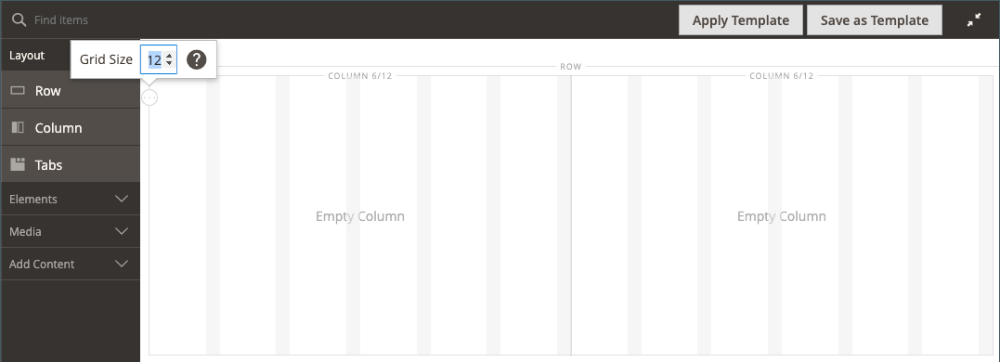

# Disposition - Colonne

Utilisez la variable _Colonne_ type de contenu pour diviser une page en plusieurs colonnes dans la variable [[!DNL Page Builder] étape](workspace.md#stage). Lorsque vous ajoutez une colonne à une ligne ou à un onglet ou directement à la scène, le groupe de colonnes est initialement divisé en deux colonnes de largeur égale. Vous pouvez ajouter ou supprimer des colonnes, si nécessaire. Vous pouvez redimensionner une colonne en faisant glisser la bordure entre deux colonnes. La largeur de la colonne suivante est ajustée pour remplir l’espace disponible dans la ligne, l’onglet ou l’étape. Une seule colonne étend la largeur complète de la scène ou de son conteneur.

{width="600" zoomable="yes"}

{{$include /help/_includes/page-builder-save-timeout.md}}

## Mises à jour de la version 2.4.5

Les fonctionnalités du créateur de pages sont mises à jour dans la version 2.4.5 afin que les utilisateurs puissent désormais utiliser _[!DNL Columns]_en tant que conteneur parent pour des colonnes individuelles. Ce nouveau conteneur prend également en charge les propriétés en arrière-plan et élimine la nécessité d’encapsuler des colonnes dans une ligne. Cela réduit les balises inutiles et permet un contrôle plus précis de l’affichage et de l’expérience du storefront.

Vous pouvez modifier la mise en page du [!DNL Columns] en faisant glisser une colonne au-dessus ou en dessous d’autres colonnes du groupe et en les empilant. Cela ouvre une nouvelle variété de combinaisons de mise en page possibles qui peuvent être réalisées sans avoir à être personnalisées par les développeurs.

Regardez cette vidéo pour une démonstration de la façon dont le [!DNL Columns] peut être utilisé pour affiner les mises en page :

>[!VIDEO](https://video.tv.adobe.com/v/345828?quality=12)

## Barre d’outils Colonnes

Chaque colonne comporte une boîte à outils d’options qui s’affiche lorsque vous placez le pointeur de la souris sur le conteneur.

| Outil | Icône | Description |
|--- |--- |--- |
| Déplacer | {width="25"} | Déplace la colonne et son contenu vers une autre position par rapport aux autres colonnes. |
| (label) | Colonne | Identifie le conteneur actif en tant que colonne. Passez la souris sur le conteneur de colonnes pour afficher la boîte à outils. |
| Paramètres | {width="25"} | Ouvre la page Modifier la colonne, dans laquelle vous pouvez modifier les propriétés du conteneur. |
| Dupliquer | {width="25"} | Effectue une copie de la colonne active. |
| Supprimer | {width="25"} | Supprime la colonne active et son contenu. |

{style="table-layout:auto"}

## Grille de colonnes

La variable [grid](workspace.md) s’assure que le contenu est aligné de manière cohérente dans une colonne et permet le rendu correct de la page sur les ordinateurs de bureau et les appareils mobiles. Pour plus d’informations, voir [Outils de contenu avancé](setup.md) de la [!DNL Page Builder] configuration.

{width="500" zoomable="yes"}

Dans l&#39;exemple à deux colonnes suivant, les nombres entre parenthèses (6/12) dans la bordure supérieure de chaque conteneur de colonnes indiquent le nombre de divisions de grille dans chaque colonne et le nombre total de divisions. Dans ce cas, la colonne correspond à la largeur de six unités de grille sur un total de 12.

{width="600" zoomable="yes"}

## Ajouter une colonne

1. Dans le [!DNL Page Builder] panneau sous _[!UICONTROL Layout]_, faites glisser un **[!UICONTROL Column]**sur la scène.

   {width="600" zoomable="yes"}

   Le groupe de colonnes est maintenant divisé en deux colonnes de largeur égale. Chaque colonne est un conteneur distinct pour le contenu et possède son propre ensemble d’options de boîte à outils.

   {width="600" zoomable="yes"}

1. Dans le coin supérieur gauche du groupe de colonnes, cliquez sur le bouton _Grille_ outil () et ajustez la taille de la grille selon les besoins.

   Le positionnement du contenu sur la grille permet d’aligner le contenu de manière cohérente et d’afficher correctement la page sur les ordinateurs de bureau et les appareils mobiles. Pour plus d’informations, voir [Outils de contenu avancé](../configuration-reference/general/content-management.md) de la [!DNL Page Builder] configuration.

   {width="600" zoomable="yes"}

## Redimensionner une colonne

1. Pointez sur la bordure entre deux colonnes.

   La bordure est mise en surbrillance et la boîte à outils de la colonne sélectionnée s’affiche.

   {width="600" zoomable="yes"}

1. Maintenez le bouton de la souris enfoncé pour afficher la grille et faites glisser la bordure vers un nouvel emplacement sur la grille.

   La largeur des deux colonnes s’ajuste pour refléter la modification. La nouvelle largeur de chaque colonne s’affiche après le libellé, par exemple : `4/12` (quatre sur 12) et `8/12` (huit sur 12).

   {width="600" zoomable="yes"}

## Supprimer une colonne

1. Passez la souris sur la colonne à supprimer pour afficher la boîte à outils et sélectionnez l’option _Supprimer_ ( {width="20"} ).

   {width="600" zoomable="yes"}

1. Si la colonne contient du contenu, cliquez sur **[!UICONTROL OK]** pour confirmer.

   Pour accélérer le processus à l’avenir, vous pouvez ignorer l’étape de confirmation en sélectionnant le **[!UICONTROL Do not show this again]** .

   Le groupe de colonnes comporte désormais une seule colonne (12/12) et une seule grille. La grille n’étant disponible que pour les colonnes, vous pouvez utiliser cette technique pour afficher la grille.

   {width="600" zoomable="yes"}

1. Si vous souhaitez que le groupe de colonnes étende la colonne restante à la largeur complète de la ligne ou de l’étape :

   - Passez la souris sur la colonne pour afficher la boîte à outils et sélectionnez l’option _Paramètres_ ( {width="20"} ).

   - Faites défiler l’écran vers le bas jusqu’à _[!UICONTROL Advanced]_et définissez les quatre **[!UICONTROL Padding]**valeurs à `0`.

     {width="600" zoomable="yes"}

   - Dans le coin supérieur droit, cliquez sur **[!UICONTROL Save]** pour fermer la _[!UICONTROL Edit Column]_page.

1. Cliquez sur le bouton _Fermer le plein écran_ ( {width="20"} ) dans le coin supérieur droit de l’espace de travail, puis cliquez sur **[!UICONTROL Save]** dans le coin supérieur droit.

## Modification des paramètres de colonne

1. Passez la souris sur la colonne pour afficher la boîte à outils et sélectionnez l’option _Paramètres_ ( {width="20"} ).

   {width="600" zoomable="yes"}

1. Modifiez la variable **[!UICONTROL Appearance]** selon les besoins.

   - Choisissez le paramètre d&#39;alignement qui détermine la position de la colonne par rapport à son conteneur.

     | Option | Description |
     | ------ | ----------- |
     | `Full Height` | La colonne étend la hauteur complète de son conteneur. |
     | `Top Aligned` | La colonne est alignée en haut de son conteneur. |
     | `Centered` | Colonne au centre de son conteneur. |
     | `Bottom Aligned` | La colonne est alignée au bas de son conteneur. |

     {style="table-layout:auto"}

   - Si nécessaire, saisissez la variable **[!UICONTROL Minimum Height]** pour la colonne . Par exemple, vous pouvez définir la hauteur minimale pour qu’elle corresponde à la hauteur d’une image d’arrière-plan.

   - Si vous définissez la hauteur minimale, définissez la variable **[!UICONTROL Vertical Alignment]**  pour contrôler la position des conteneurs de contenu ajoutés à la colonne (`Top`, `Center`, ou `Bottom`).

1. Modifiez l’arrière-plan du contenu de la colonne.

   - **[!UICONTROL Background Color]** - Définissez la couleur en choisissant un échantillon, en cliquant sur le sélecteur de couleurs ou en saisissant un nom de couleur valide ou une valeur hexadécimale équivalente. Ce paramètre détermine la couleur de fond de la colonne.

   - **[!UICONTROL Background Image]** - Si nécessaire, utilisez les outils fournis pour choisir une image d’arrière-plan à appliquer à la colonne :

     | Outil | Description |
     | ------ | ----------- |
     | [!UICONTROL Upload] | Télécharge un fichier image de l’ordinateur local vers la galerie, puis l’applique comme image d’arrière-plan pour la colonne. |
     | [!UICONTROL Select from Gallery] | Vous invite à choisir une image existante de la galerie comme image d’arrière-plan pour la colonne. |
     | {width="25"} | Permet de faire glisser l’image sur la mosaïque de l’appareil photo ou de naviguer jusqu’à l’image dans votre système de fichiers local. |

     {style="table-layout:auto"}

   - **[!UICONTROL Background Mobile Image]** - Si nécessaire, utilisez les mêmes outils pour choisir une image d’arrière-plan différente à utiliser pour l’affichage sur les appareils mobiles.

   - **[!UICONTROL Background Size]** - Modifiez ce paramètre pour déterminer la mise à l’échelle de l’image d’arrière-plan par rapport à la largeur de la colonne :

     | Option | Description |
     | ------ | ----------- |
     | `Cover` | L’image d’arrière-plan couvre toute la largeur de la colonne. |
     | `Contain` | L’image d’arrière-plan est limitée à la largeur de la zone de contenu. |
     | `Auto` | Applique la taille d’arrière-plan par défaut indiquée dans la feuille de style du thème actif. |

     {style="table-layout:auto"}

   - **[!UICONTROL Background Position]** - Modifiez ce paramètre pour déterminer le point d’ancrage de l’image par rapport à la colonne. Options : `Top Left`, `Top Center`, `Top Right`, `Center Left`, `Center`, `Center Right`, `Bottom Left`, `Bottom Center`, ou `Bottom Right`

   - **[!UICONTROL Background Attachment]** - Modifiez ce paramètre pour déterminer le déplacement de l’image d’arrière-plan par rapport à la page de défilement :

     | Option | Description |
     | ------ | ----------- |
     | `Scroll` | L’image d’arrière-plan est synchronisée pour se déplacer vers le bas au fur et à mesure que la page fait défiler. |
     | `Fixed` | (Non disponible pour les appareils mobiles) L’image d’arrière-plan ne se déplace pas lorsque le conteneur fait défiler l’image et est fixe à la position d’arrière-plan spécifiée. |

     {style="table-layout:auto"}

   - **[!UICONTROL Background Repeat]** - Si vous souhaitez répéter l’image d’arrière-plan pour remplir l’espace, modifiez ce paramètre. `Yes`.

1. Mettez à jour le _[!UICONTROL Advanced]_selon les besoins.

   - Pour contrôler le positionnement horizontal des conteneurs de contenu qui sont ajoutés à la colonne, choisissez une **[!UICONTROL Alignment]**:

     | Option | Description |
     | ------ | ----------- |
     | `Default` | Applique le paramètre d’alignement par défaut spécifié dans la feuille de style du thème actif. |
     | `Left` | Aligne les conteneurs de contenu le long de la bordure gauche du conteneur de colonnes, en tenant compte de toute marge intérieure spécifiée. |
     | `Center` | Aligne le conteneur de contenu au centre du conteneur de colonnes, en tenant compte de toute marge intérieure spécifiée. |
     | `Right` | Aligne le conteneur de contenu le long de la bordure droite du conteneur de colonnes, en tenant compte de toute marge intérieure spécifiée. |

     {style="table-layout:auto"}

   - Définissez la variable **[!UICONTROL Border]** style, qui s’applique aux quatre côtés du conteneur de colonnes :

     | Option | Description |
     | ------ | ----------- |
     | `Default` | Applique le style de bordure par défaut spécifié par la feuille de style associée. |
     | `None` | Ne fournit aucune indication visible des bordures du conteneur. |
     | `Dotted` | La bordure du conteneur s’affiche sous la forme d’une ligne pointillée. |
     | `Dashed` | La bordure du conteneur s’affiche sous la forme d’une ligne en pointillés. |
     | `Solid` | La bordure du conteneur s’affiche sous la forme d’une ligne pleine. |
     | `Double` | La bordure du conteneur s’affiche sous la forme d’une ligne double. |
     | `Groove` | La bordure du conteneur s’affiche sous forme de ligne droite. |
     | `Ridge` | La bordure du conteneur s’affiche sous la forme d’une ligne à droite. |
     | `Inset` | La bordure du conteneur s’affiche sous la forme d’une ligne d’insertion. |
     | `Outset` | La bordure du conteneur apparaît comme une ligne de départ. |

     {style="table-layout:auto"}

   - Si vous définissez un style de bordure autre que `None`, renseignez les options d’affichage des bordures :

     | Option | Description |
     | ------ |------------ |
     | [!UICONTROL Border Color] | Définissez la couleur en choisissant un échantillon, en cliquant sur le sélecteur de couleurs ou en saisissant un nom de couleur valide ou une valeur hexadécimale équivalente. |
     | [!UICONTROL Border Width] | Saisissez le nombre de pixels pour la largeur de la ligne de bordure. |
     | [!UICONTROL Border Radius] | Saisissez le nombre de pixels pour définir la taille du rayon utilisé pour arrondir chaque coin de la bordure. |

     {style="table-layout:auto"}

   - (Facultatif) Indiquez les noms des **[!UICONTROL CSS classes]** de la feuille de style actuelle à appliquer au conteneur de colonnes.

     Séparez plusieurs noms de classe par un espace.

   - Saisissez des valeurs, en pixels, pour la variable **[!UICONTROL Margins and Padding]** pour spécifier les marges extérieures et la marge intérieure de la colonne.

     Saisissez chaque valeur correspondante dans le diagramme de conteneur de colonnes.

     | Zone de conteneur | Description |
     | -------------- | ----------- |
     | [!UICONTROL Margins] | Espace vide appliqué au bord extérieur de tous les côtés du conteneur. Options : `Top` / `Right` / `Bottom` / `Left` |
     | [!UICONTROL Padding] | Espace blanc appliqué au bord intérieur de tous les côtés du conteneur. Options : `Top` / `Right` / `Bottom` / `Left` |

     {style="table-layout:auto"}

1. Lorsque vous avez terminé, cliquez sur **[!UICONTROL Save]** pour appliquer les paramètres et revenir au [!DNL Page Builder] workspace.
