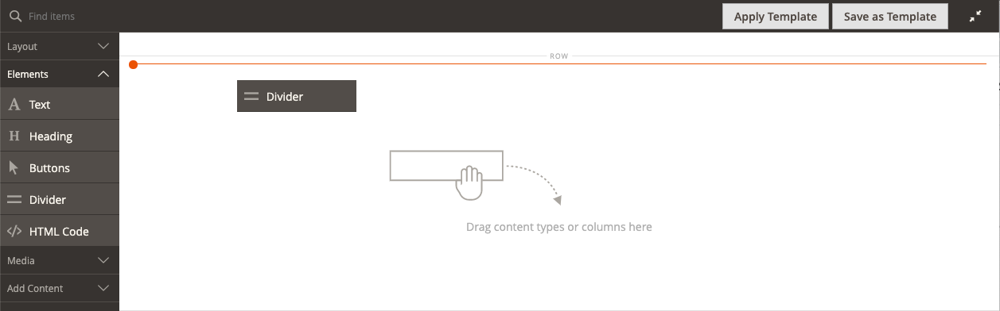

# Éléments - Diviseur

Utilisez le type de contenu _Diviseur_ pour ajouter une règle comme saut visuel entre les sections de contenu dans l’ [[!DNL Page Builder] étape](workspace.md#stage). Vous pouvez spécifier la couleur, l’épaisseur et la largeur de la ligne du séparateur. Vous pouvez également contrôler l’alignement, définir les marges, la marge intérieure et le format de la bordure du conteneur. Par défaut, le séparateur est une règle libre qui étend la largeur totale du conteneur, avec une marge intérieure suffisante.

{width="500" zoomable="yes"}

Bien que la plupart des conteneurs de séparateurs soient invisibles, l’exemple suivant affiche le conteneur avec une bordure en tirets rouges afin que vous puissiez voir la relation entre le séparateur, la marge intérieure et le conteneur. Vous pouvez ajuster la marge intérieure en haut et en bas du séparateur pour contrôler l’espacement entre les éléments.

{width="500" zoomable="yes"}

{{$include /help/_includes/page-builder-save-timeout.md}}

## Boîte à outils du séparateur

| Outil | Icône | Description |
| ---- | --------------------| ------------|
| Déplacer | {width="25"} | Déplace le conteneur du séparateur vers un autre emplacement valide sur la page. |
| (label) | DIVIDER | Identifie le conteneur actuel en tant qu’élément de séparateur. |
| Paramètres | {width="25"} | Ouvre la page Modifier le séparateur dans laquelle vous pouvez modifier les propriétés du séparateur et de son conteneur. |
| Masquer | {width="25"} | Masque le conteneur du séparateur. |
| Afficher | {width="25"} | Affiche le conteneur de séparateurs masqué. |
| Dupliquer | {width="25"} | Effectue une copie du conteneur du séparateur. |
| Supprimer | {width="25"} | Supprime le conteneur du séparateur et son contenu de la scène. |

{style="table-layout:auto"}

{{$include /help/_includes/page-builder-hidden-element-note.md}}

## Ajout d’un séparateur

1. Dans le panneau [!DNL Page Builder], développez **[!UICONTROL Elements]** et faites glisser un espace réservé **[!UICONTROL Divider]** sur une ligne, une colonne ou un ensemble d’onglets sur la scène.

   Utilisez la ligne directrice rouge à titre de référence lorsque vous positionnez le séparateur avant ou après un autre conteneur de contenu sur l’étape.

   {width="600" zoomable="yes"}

   Dans l’exemple suivant, le séparateur marque le début d’une nouvelle section de texte.

   {width="500" zoomable="yes"}

1. Pour spécifier les paramètres du nouveau séparateur, procédez comme suit.

## Modification des paramètres du séparateur

1. Pointez sur le conteneur du séparateur pour afficher la boîte à outils et sélectionnez l’icône _Paramètres_ ( {width="20"} ).

   {width="500" zoomable="yes"}

1. Modifiez le séparateur **[!UICONTROL Line Color]** à l’aide de l’une des méthodes suivantes :

   - Saisissez un [nom de couleur HTML][1] valide. Par exemple, `Teal`.
   - Saisissez la valeur de couleur hexadécimale. Par exemple, `#008080`.

   Une fois l’opération terminée, cliquez sur **[!UICONTROL Apply]**.

   {width="600" zoomable="yes"}

1. Saisissez le **[!UICONTROL Line Thickness]** en pixels.

1. Pour indiquer l’unité de mesure, saisissez la valeur **[!UICONTROL Line Width]** suivie de `px` ou `%`.

   {width="600" zoomable="yes"}

1. Mettez à jour les paramètres _[!UICONTROL Advanced]_&#x200B;si nécessaire.

   - Pour contrôler le positionnement du séparateur dans le conteneur parent, choisissez la propriété **[!UICONTROL Alignment]** :

     | Option | Description |
     | ------ | ----------- |
     | `Default` | Applique le paramètre d’alignement par défaut spécifié dans la feuille de style du thème actif. |
     | `Left` | Aligne la liste le long de la bordure gauche du conteneur parent, en tenant compte de toute marge intérieure spécifiée. |
     | `Center` | Aligne la liste au centre du conteneur parent, en tenant compte de toute marge intérieure spécifiée. |
     | `Right` | Aligne le bloc le long de la bordure droite du conteneur parent, en tenant compte de toute marge intérieure spécifiée. |

     {style="table-layout:auto"}

     Dans l’exemple suivant, les options sont définies pour utiliser un alignement central pour le séparateur.

     {width="600" zoomable="yes"}

   - Définissez le style **[!UICONTROL Border]** appliqué aux quatre côtés du conteneur du séparateur :

     | Option | Description |
     | ------ | ----------- |
     | `Default` | Applique le style de bordure par défaut spécifié par la feuille de style associée. |
     | `None` | Ne fournit aucune indication visible des bordures du conteneur. |
     | `Dotted` | La bordure du conteneur s’affiche sous la forme d’une ligne pointillée. |
     | `Dashed` | La bordure du conteneur s’affiche sous la forme d’une ligne en pointillés. |
     | `Solid` | La bordure du conteneur s’affiche sous la forme d’une ligne pleine. |
     | `Double` | La bordure du conteneur s’affiche sous la forme d’une ligne double. |
     | `Groove` | La bordure du conteneur s’affiche sous forme de ligne droite. |
     | `Ridge` | La bordure du conteneur s’affiche sous la forme d’une ligne à droite. |
     | `Inset` | La bordure du conteneur s’affiche sous la forme d’une ligne d’insertion. |
     | `Outset` | La bordure du conteneur apparaît comme une ligne de départ. |

     {style="table-layout:auto"}

   - Si vous définissez un style de bordure autre que `None`, renseignez les options d’affichage de la bordure :

     | Option | Description |
     | ------ |------------ |
     | [!UICONTROL Border Color] | Définissez la couleur en choisissant un échantillon, en cliquant sur le sélecteur de couleurs ou en saisissant un nom de couleur valide ou une valeur hexadécimale équivalente. |
     | [!UICONTROL Border Width] | Saisissez le nombre de pixels pour la largeur de la ligne de bordure. |
     | [!UICONTROL Border Radius] | Saisissez le nombre de pixels pour définir la taille du rayon utilisé pour arrondir chaque coin de la bordure. |

     {style="table-layout:auto"}

   - (Facultatif) Indiquez les noms de **[!UICONTROL CSS classes]** dans la feuille de style actuelle à appliquer au conteneur.

     Séparez plusieurs noms de classe par un espace.

   - Saisissez des valeurs, en pixels, pour le **[!UICONTROL Margins and Padding]** afin de déterminer les marges extérieures et la marge intérieure du conteneur du séparateur.

     Saisissez les valeurs correspondantes dans le diagramme.

     | Zone de conteneur | Description |
     | -------------- | ----------- |
     | [!UICONTROL Margins] | Espace vide appliqué au bord extérieur de tous les côtés du conteneur. Options : `Top` / `Right` / `Bottom` / `Left` |
     | [!UICONTROL Padding] | Espace blanc appliqué au bord intérieur de tous les côtés du conteneur. Options : `Top` / `Right` / `Bottom` / `Left` |

     {style="table-layout:auto"}

1. Une fois l’opération terminée, cliquez sur **[!UICONTROL Save]** pour appliquer les paramètres et revenir à l’espace de travail [!DNL Page Builder].

   {width="500" zoomable="yes"}

## Dupliquer un séparateur

Pour un séparateur formaté avec des paramètres spécifiques, il est plus efficace de créer un doublon plutôt que de recommencer avec un nouvel espace réservé.

1. Pointez sur le conteneur du séparateur pour afficher la boîte à outils et sélectionnez l’icône _Dupliquer_ ( {width="20"} ).

   Le conteneur de séparateurs en double apparaît juste en dessous de l’original.

   {width="500" zoomable="yes"}

1. Pointez sur le nouveau conteneur de séparateurs pour afficher la boîte à outils et sélectionnez l’icône _Déplacer_ ( {width="20"} ).

   {width="500" zoomable="yes"}

1. Sélectionnez le séparateur et faites-le glisser jusqu’à ce que la ligne directrice rouge marque la nouvelle position.

   Les bordures supérieure et inférieure de chaque conteneur apparaissent sous forme de lignes tirets lorsque le séparateur est déplacé.

   {width="500" zoomable="yes"}

[1]: https://en.wikipedia.org/wiki/Web_colors
