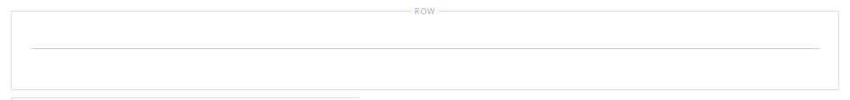

# Éléments - Diviseur

Utilisez le type de contenu _Diviseur_ pour ajouter une règle comme saut visuel entre les sections de contenu de la [[!DNL Page Builder] étape](workspace.md#stage). Vous pouvez spécifier la couleur, l’épaisseur et la largeur de la ligne de séparation. Vous pouvez également contrôler l’alignement, définir les marges intérieures et le format de la bordure du conteneur. Par défaut, la ligne de séparation est une règle de lisière qui étend toute la largeur du conteneur, avec la possibilité d’une marge intérieure.

{width="500" zoomable="yes"}

Bien que la plupart des conteneurs de séparateur soient invisibles, l’exemple suivant montre comment afficher le conteneur avec une bordure en tirets rouges afin que vous puissiez voir la relation entre le séparateur, la marge intérieure et le conteneur. Vous pouvez ajuster la marge intérieure en haut et en bas du séparateur pour contrôler l’espacement entre les éléments.

{width="500" zoomable="yes"}

{{$include /help/_includes/page-builder-save-timeout.md}}

## Boîte à outils du séparateur

| Outil | Icon | Description |
| ---- | --------------------| ------------|
| Déplacer | {width="25"} | Déplace le conteneur du séparateur vers un autre emplacement valide sur la page. |
| (libellé) | SÉPARATEUR | Identifie le conteneur courant comme un élément diviseur. |
| Paramètres | {width="25"} | Ouvre la page Modifier le séparateur, qui permet de modifier les propriétés du séparateur et de son conteneur. |
| Masquer | {width="25"} | Masque le conteneur du séparateur. |
| Afficher | {width="25"} | Affiche le conteneur de séparateur masqué. |
| Dupliquer | {width="25"} | Effectue une copie du conteneur du séparateur. |
| Supprimer | {width="25"} | Supprime le conteneur du séparateur et son contenu de l’étape. |

{style="table-layout:auto"}

{{$include /help/_includes/page-builder-hidden-element-note.md}}

## Ajouter un séparateur

1. Dans le panneau [!DNL Page Builder], développez **[!UICONTROL Elements]** et faites glisser un espace réservé **[!UICONTROL Divider]** vers une ligne, une colonne ou un ensemble d’onglets sur la scène.

   Utilisez la ligne directrice rouge comme référence lorsque vous positionnez le séparateur avant ou après un autre conteneur de contenu sur la scène.

   {width="600" zoomable="yes"}

   Dans l’exemple suivant, le séparateur marque le début d’une nouvelle section de texte.

   {width="500" zoomable="yes"}

1. Pour spécifier les paramètres du nouveau diviseur, procédez comme suit.

## Modifier les paramètres du séparateur

1. Pointez sur le conteneur de séparateur pour afficher la boîte à outils et choisissez l’icône _Paramètres_ ( {width="20"} ).

   {width="500" zoomable="yes"}

1. Modifiez le **[!UICONTROL Line Color]** de division à l’aide de l’une des méthodes suivantes :

   - Saisissez un [nom de couleur HTML valide](https://en.wikipedia.org/wiki/Web_colors). Par exemple, `Teal`.
   - Saisissez la valeur de couleur hexadécimale. Par exemple, `#008080`.

   Cliquez ensuite sur **[!UICONTROL Apply]**.

   {width="600" zoomable="yes"}

1. Saisissez le **[!UICONTROL Line Thickness]** en pixels.

1. Pour indiquer l’unité de mesure, saisissez la **[!UICONTROL Line Width]** suivie de `px` ou de `%`.

   {width="600" zoomable="yes"}

1. Mettez à jour les paramètres _[!UICONTROL Advanced]_&#x200B;selon vos besoins.

   - Pour contrôler le positionnement du séparateur dans le conteneur parent, choisissez l’**[!UICONTROL Alignment]** :

     | Option | Description |
     | ------ | ----------- |
     | `Default` | Applique le paramètre d’alignement par défaut spécifié dans la feuille de style du thème actif. |
     | `Left` | Aligne la liste le long de la bordure gauche du conteneur parent, en tenant compte de la marge intérieure spécifiée. |
     | `Center` | Aligne la liste au centre du conteneur parent, en tenant compte de la marge intérieure spécifiée. |
     | `Right` | Aligne le bloc le long de la bordure droite du conteneur parent, en tenant compte de la marge intérieure spécifiée. |

     {style="table-layout:auto"}

     Dans l’exemple suivant, les options sont définies pour utiliser un alignement centré pour le séparateur.

     {width="600" zoomable="yes"}

   - Définissez le style de **[!UICONTROL Border]** appliqué aux quatre côtés du conteneur du séparateur :

     | Option | Description |
     | ------ | ----------- |
     | `Default` | Applique le style de bordure par défaut spécifié par la feuille de style associée. |
     | `None` | Ne fournit aucune indication visible des bordures du conteneur. |
     | `Dotted` | La bordure du conteneur s’affiche sous la forme d’une ligne pointillée. |
     | `Dashed` | La bordure du conteneur s’affiche sous la forme d’une ligne en tirets. |
     | `Solid` | La bordure du conteneur s’affiche sous la forme d’une ligne continue. |
     | `Double` | La bordure du conteneur s’affiche sous la forme d’une ligne double. |
     | `Groove` | La bordure du conteneur s’affiche sous la forme d’une ligne rainurée. |
     | `Ridge` | La bordure du conteneur s’affiche sous la forme d’une ligne crantée. |
     | `Inset` | La bordure du conteneur s’affiche sous la forme d’une ligne insérée. |
     | `Outset` | La bordure du conteneur s’affiche sous la forme d’une ligne de départ. |

     {style="table-layout:auto"}

   - Si vous définissez un style de bordure autre que `None`, renseignez les options d’affichage des bordures :

     | Option | Description |
     | ------ |------------ |
     | [!UICONTROL Border Color] | Spécifiez la couleur en choisissant une nuance, en cliquant sur le sélecteur de couleurs ou en saisissant un nom de couleur valide ou une valeur hexadécimale équivalente. |
     | [!UICONTROL Border Width] | Saisissez le nombre de pixels pour la largeur de la ligne de bordure. |
     | [!UICONTROL Border Radius] | Saisissez le nombre de pixels pour définir la taille du rayon utilisé pour arrondir chaque coin de la bordure. |

     {style="table-layout:auto"}

   - (Facultatif) Spécifiez les noms des **[!UICONTROL CSS classes]** de la feuille de style actuelle à appliquer au conteneur.

     Séparez plusieurs noms de classe par un espace.

   - Saisissez les valeurs, en pixels, du **[!UICONTROL Margins and Padding]** pour déterminer les marges extérieures et la marge intérieure du conteneur du séparateur.

     Saisissez les valeurs correspondantes dans le diagramme.

     | Zone conteneur | Description |
     | -------------- | ----------- |
     | [!UICONTROL Margins] | Quantité d’espace vide appliqué au bord extérieur de tous les côtés du conteneur. Options : `Top` / `Right` / `Bottom` / `Left` |
     | [!UICONTROL Padding] | Quantité d’espace vide appliqué au bord intérieur de tous les côtés du conteneur. Options : `Top` / `Right` / `Bottom` / `Left` |

     {style="table-layout:auto"}

1. Une fois l’opération terminée, cliquez sur **[!UICONTROL Save]** pour appliquer les paramètres et revenir à l’espace de travail [!DNL Page Builder].

   {width="500" zoomable="yes"}

## Dupliquer un séparateur

Pour un séparateur formaté avec des paramètres spécifiques, il est plus efficace de faire un doublon, plutôt que de recommencer avec un nouvel espace réservé.

1. Pointez sur le conteneur de séparateur pour afficher la palette et choisissez l’icône _Dupliquer_ ( {width="20"} ).

   Le conteneur du séparateur en double s’affiche juste en dessous de l’original.

   {width="500" zoomable="yes"}

1. Pointez sur le nouveau conteneur de séparateur pour afficher la boîte à outils et choisissez l’icône _Déplacer_ ( {width="20"} ).

   {width="500" zoomable="yes"}

1. Sélectionnez et faites glisser le séparateur jusqu&#39;à ce que la ligne directrice rouge marque la nouvelle position.

   Les bordures supérieure et inférieure de chaque conteneur apparaissent sous forme de lignes en tirets lorsque le séparateur est déplacé.

   {width="500" zoomable="yes"}

<!-- Last updated from includes: 2023-09-11 14:30:19 -->
