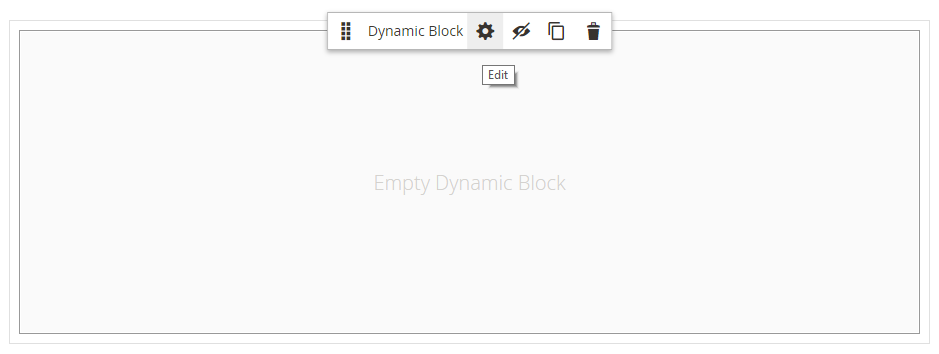

# Ajouter du contenu - Bloc dynamique

Utilisez le type de contenu Bloc dynamique pour ajouter un [bloc dynamique](../content-design/dynamic-blocks.md) existant à la [[!DNL Page Builder] étape](workspace.md#stage).

{width="700" zoomable="yes"}

{{$include /help/_includes/page-builder-save-timeout.md}}

## Boîte à outils Bloc dynamique

| Outil | Icon | Description |
| --------- | ------------- | ----------------- |
| Déplacer | {width="25"} | Déplace le conteneur de blocs et son contenu vers un autre emplacement sur la scène. |
| Paramètres | {width="25"} | Ouvre la page _Modifier le bloc_, dans laquelle vous pouvez choisir le bloc et modifier les propriétés du conteneur. |
| Masquer | {width="25"} | Masque le conteneur du bloc actif et son contenu. |
| Afficher | {width="25"} | Affiche le conteneur du bloc masqué et son contenu. |
| Dupliquer | {width="25"} | Effectue une copie du conteneur de blocs et de son contenu. |
| Supprimer | {width="25"} | Supprime le conteneur de blocs et son contenu de l’étape. |

{style="table-layout:auto"}

{{$include /help/_includes/page-builder-hidden-element-note.md}}

## Ajouter un bloc dynamique existant à l’étape

1. Accédez à l’espace de travail [!DNL Page Builder] sur la page, le bloc, le produit ou la catégorie cible.

1. Dans le panneau [!DNL Page Builder], développez **[!UICONTROL Add Content]** et faites glisser un espace réservé **[!UICONTROL Dynamic Block]** vers la scène.

   {width="600" zoomable="yes"}

1. Pointez sur le conteneur de blocs dynamiques vide pour afficher la boîte à outils et choisissez l’icône _Paramètres_ ( {width="20"} ).

   {width="600" zoomable="yes"}

1. Sur la page _Modifier le bloc dynamique_, cliquez sur **[!UICONTROL Select Dynamic Block]** et utilisez la liste pour sélectionner le bloc.

   {width="600" zoomable="yes"}

   Dans la liste, recherchez le bloc dynamique à insérer, puis cliquez sur **[!UICONTROL Select]**. Cliquez ensuite sur **[!UICONTROL Add Selected]**.

   {width="600" zoomable="yes"}

   Un résumé des informations sur les blocs dynamiques s’affiche ci-dessous.

   {width="600" zoomable="yes"}

1. Définissez **[!UICONTROL Template]** sur l’une des options suivantes :

   | Option | Description |
   | ------ | ----------- |
   | `Dynamic Block Block Template` | Ajoute un bloc autonome. |
   | `Dynamic Block Inline Template` | Insère le contenu du bloc dans le texte. |

   {style="table-layout:auto"}

   {width="200"}

1. Renseignez les paramètres avancés selon vos besoins.

1. Une fois l’opération terminée, cliquez sur **[!UICONTROL Save]** pour appliquer les paramètres et revenir à l’espace de travail [!DNL Page Builder].

### Paramètres avancés

1. Pour contrôler le positionnement du bloc dynamique dans le conteneur parent, choisissez une **[!UICONTROL Alignment]** :

   | Option | Description |
   | ------ | ----------- |
   | `Default` | Applique le paramètre d’alignement par défaut spécifié dans la feuille de style du thème actif. |
   | `Left` | Aligne la liste le long de la bordure gauche du conteneur parent, en tenant compte de la marge intérieure spécifiée. |
   | `Center` | Aligne la liste au centre du conteneur parent, en tenant compte de la marge intérieure spécifiée. |
   | `Right` | Aligne le bloc le long de la bordure droite du conteneur parent, en tenant compte de la marge intérieure spécifiée. |

   {style="table-layout:auto"}

1. Définissez le style de **[!UICONTROL Border]** appliqué aux quatre côtés du conteneur de bloc dynamique :

   | Option | Description |
   | ------ | ----------- |
   | `Default` | Applique le style de bordure par défaut spécifié par la feuille de style associée. |
   | `None` | Ne fournit aucune indication visible des bordures du conteneur. |
   | `Dotted` | La bordure du conteneur s’affiche sous la forme d’une ligne pointillée. |
   | `Dashed` | La bordure du conteneur s’affiche sous la forme d’une ligne en tirets. |
   | `Solid` | La bordure du conteneur s’affiche sous la forme d’une ligne continue. |
   | `Double` | La bordure du conteneur s’affiche sous la forme d’une ligne double. |
   | `Groove` | La bordure du conteneur s’affiche sous la forme d’une ligne rainurée. |
   | `Ridge` | La bordure du conteneur s’affiche sous la forme d’une ligne crantée. |
   | `Inset` | La bordure du conteneur s’affiche sous la forme d’une ligne insérée. |
   | `Outset` | La bordure du conteneur s’affiche sous la forme d’une ligne de départ. |

   {style="table-layout:auto"}

1. Si vous définissez un style de bordure autre que `None`, renseignez les options d’affichage des bordures :

   | Option | Description |
   | ------ |------------ |
   | [!UICONTROL Border Color] | Spécifiez la couleur en choisissant une nuance, en cliquant sur le sélecteur de couleurs ou en saisissant un nom de couleur valide ou une valeur hexadécimale équivalente. |
   | [!UICONTROL Border Width] | Saisissez le nombre de pixels pour la largeur de la ligne de bordure. |
   | [!UICONTROL Border Radius] | Saisissez le nombre de pixels pour définir la taille du rayon utilisé pour arrondir chaque coin de la bordure. |

   {style="table-layout:auto"}

1. (Facultatif) Spécifiez les noms des **[!UICONTROL CSS classes]** de la feuille de style actuelle à appliquer au conteneur.

   Séparez plusieurs noms de classe par un espace.

1. Saisissez les valeurs, en pixels, du **[!UICONTROL Margins and Padding]** pour déterminer les marges extérieures et la marge intérieure du conteneur de bloc dynamique.

   Saisissez les valeurs correspondantes dans le diagramme.

   | Zone conteneur | Description |
   | -------------- | ----------- |
   | [!UICONTROL Margins] | Quantité d’espace vide appliqué au bord extérieur de tous les côtés du conteneur. Options : `Top` / `Right` / `Bottom` / `Left` |
   | [!UICONTROL Padding] | Quantité d’espace vide appliqué au bord intérieur de tous les côtés du conteneur. Options : `Top` / `Right` / `Bottom` / `Left` |

   {style="table-layout:auto"}

## Modifier les paramètres du conteneur de blocs dynamiques

1. Pointez sur le conteneur de blocs dynamiques pour afficher la boîte à outils et choisissez l’icône _Paramètres_ ( {width="20"} ).

   {width="500" zoomable="yes"}

1. Si nécessaire, modifiez le bloc dynamique :

   - Cliquez sur **[!UICONTROL Select Dynamic Block]**.

     {width="20"}

   - Dans la liste des blocs dynamiques actifs, cliquez sur **[!UICONTROL Select]** pour le bloc que vous souhaitez ajouter.

1. Mettez à jour les paramètres restants si nécessaire.

1. Une fois l’opération terminée, cliquez sur **[!UICONTROL Save]** pour appliquer les paramètres et revenir à l’espace de travail [!DNL Page Builder].

## Dupliquer un bloc dynamique

1. Pointez sur le conteneur de blocs dynamiques pour afficher la palette et choisissez l’icône _Dupliquer_ ( {width="20"} ).

   Le duplicata apparaît juste en dessous de l’original.

   {width="500" zoomable="yes"}

1. Pour déplacer le nouveau bloc dynamique à un autre emplacement, passez la souris sur son conteneur, puis choisissez _Déplacer_ ( {width="20"} ) dans la palette.

1. Sélectionnez le bloc dynamique et faites-le glisser jusqu’à ce que la ligne directrice rouge s’affiche à la nouvelle position.

   Les bordures supérieure et inférieure de chaque conteneur apparaissent sous la forme de lignes en tirets lorsque le bloc dynamique est déplacé.

## Supprimer un bloc dynamique de la scène

1. Pointez sur le conteneur de blocs dynamiques pour afficher la boîte à outils et choisissez l’icône _Supprimer_ ( {width="20"} ).

1. Lorsque vous êtes invité à confirmer, cliquez sur **[!UICONTROL OK]**.

<!-- Last updated from includes: 2023-09-11 14:30:19 -->
