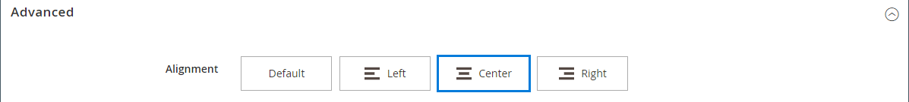

# Éléments - Code de HTML

Utilisez la variable _Code HTML_ type de contenu permettant d’ajouter des fragments de code de HTML, CSS et JavaScript dans la variable [[!DNL Page Builder] étape](workspace.md#stage). Par exemple, vous pouvez ajouter un HTML personnalisé, déclarer une classe CSS qui peut être appliquée à un élément de la page. Vous pouvez également ajouter un fragment de code pour un logo, un bouton ou une bannière que vous avez reçu d’un fournisseur tiers.

## Boîte à outils Code HTML

{width="500" zoomable="yes"}

| Outil | Icône | Description |
| --------- | ---------- | ----------------- |
| Déplacer | {width="25"} | Déplace le conteneur Code HTML vers un autre emplacement valide de la page. |
| Paramètres | {width="25"} | Ouvre la page Modifier le code du HTML dans laquelle vous pouvez modifier les propriétés du conteneur. |
| Masquer | {width="25"} | Masque le conteneur Code HTML. |
| Afficher | {width="25"} | Affiche le conteneur Code de HTML masqué. |
| Dupliquer | {width="25"} | Effectue une copie du conteneur Code HTML. |
| Supprimer | {width="25"} | Supprime le conteneur Code HTML et son contenu de l’étape. |

{{$include /help/_includes/page-builder-hidden-element-note.md}}

## Ajouter un code HTML

L’exemple suivant montre comment incorporer des [Police Google][1] code et déclarer des classes d’en-tête personnalisées qui remplacent la feuille de style actuelle.

### Étape 1 : Sélection d’une police Google

1. Visitez le [Polices Google][1] et sélectionnez la famille de polices à utiliser.

1. Copiez le code généré qui doit être incorporé dans le `<head>` de la page et collez-la temporairement dans un éditeur de texte.

   - Incorporer le code de police
   - Règle CSS

1. Ajoutez la règle font-family à chaque classe d’en-tête, en encadrant les classes d’en-tête dans une `<style>` balise .

   Ce code est collé dans [!DNL Page Builder].

   ```html
   <style>
      h1 {color: teal; font-family: 'Khand', sans-serif; }
      h2 {color: teal; font-family: 'Khand', sans-serif; }
      h3 {color: teal; font-family: 'Khand', sans-serif; }
   </style>
   ```

### Étape 2 : Ajout du code à la page

1. Dans le _Administration_ barre latérale de votre magasin, accédez à **[!UICONTROL Content]** > _[!UICONTROL Elements]_>**[!UICONTROL Pages]**.

1. Recherchez la page dans laquelle la police doit être disponible et ouvrez-la en mode d’édition.

1. Faites défiler l’écran vers le bas et développez **[!UICONTROL Content]** .

1. Dans le [!DNL Page Builder] panneau, développer **[!UICONTROL Elements]** et faites glisser un **[!UICONTROL HTML Code]** d’un espace réservé à une ligne, une colonne ou un ensemble d’onglets sur l’étape.

   Utilisez la ligne guide rouge pour positionner le séparateur avant ou après un autre conteneur de contenu dans la ligne, la colonne ou le jeu de tabulations.

   {width="600" zoomable="yes"}

1. Passez la souris sur le conteneur HTML pour afficher la boîte à outils et sélectionnez l’option _Paramètres_ ( {width="20"} ), icône .

1. Dans la zone de texte, collez le code incorporé des polices Google et les déclarations de style que vous avez préparées.

   Pour faciliter la lecture, vous pouvez saisir quelques espaces pour mettre le code en retrait.

   {width="500" zoomable="yes"}

1. Mettez à jour les paramètres restants si nécessaire (voir [Modification des paramètres du code de HTML](#html-settings) pour plus de détails).

1. Dans le coin supérieur droit, cliquez sur **[!UICONTROL Save]** pour appliquer les paramètres et revenir au [!DNL Page Builder] workspace.

   La nouvelle police s’affiche lorsque la page est affichée via un navigateur.

### Étape 3 : aperçu de la page

1. Dans le _[!UICONTROL Currently Active]_, définissez **[!UICONTROL Enable Page]**to `Yes`.

   {width="600" zoomable="yes"}

1. Dans le coin supérieur droit, cliquez sur le bouton **[!UICONTROL Save]** flèche et choisissez **[!UICONTROL Save & Close]**.

1. Recherchez la page dans la grille et sélectionnez **[!UICONTROL View]** dans le _[!UICONTROL Actions]_colonne .

   {width="700" zoomable="yes"}

## Modification des paramètres du code de HTML {#html-settings}

1. Passez la souris sur le conteneur HTML pour afficher la boîte à outils et sélectionnez l’option _Paramètres_ ( {width="20"} ).

1. Dans la zone de texte, modifiez le code selon vos besoins.

   Les codes HTML, CSS et JavaScript sont pris en charge. Fragments de code appartenant à la variable `<head>` de la page peut être saisie ici.

   L’éditeur fournit également des boutons pour insérer des éléments spéciaux dans le code :

   | Bouton | Description |
   | ------ | ----------- |
   | Insérer un widget... | Cliquez sur pour insérer un widget à la position du curseur dans la zone de texte HTML. |
   | Insérer une image... | Cliquez sur pour insérer une image téléchargée ou une image de la galerie à l’emplacement du curseur dans la zone de texte HTML. |
   | Insérer une variable... | Cliquez pour insérer une variable à la position du curseur dans la zone de texte HTML. |

1. Mettez à jour le _[!UICONTROL Advanced]_selon les besoins.

   - Pour contrôler le positionnement du code dans le conteneur parent, choisissez une **[!UICONTROL Alignment]**:

     | Option | Description |
     | ------ | ----------- |
     | `Default` | Applique le paramètre d’alignement par défaut spécifié dans la feuille de style du thème actif. |
     | `Left` | Aligne la liste le long de la bordure gauche du conteneur parent, en tenant compte de toute marge intérieure spécifiée. |
     | `Center` | Aligne la liste au centre du conteneur parent, en tenant compte de toute marge intérieure spécifiée. |
     | `Right` | Aligne le bloc le long de la bordure droite du conteneur parent, en tenant compte de toute marge intérieure spécifiée. |

     Dans l’exemple suivant, les options sont définies pour utiliser un alignement central pour le bloc de code rendu.

     {width="600" zoomable="yes"}

   - Définissez la variable **[!UICONTROL Border]** style appliqué aux quatre côtés du conteneur de code :

     | Option | Description |
     | ------ | ----------- |
     | `Default` | Applique le style de bordure par défaut spécifié par la feuille de style associée. |
     | `None` | Ne fournit aucune indication visible des bordures du conteneur. |
     | `Dotted` | La bordure du conteneur s’affiche sous la forme d’une ligne pointillée. |
     | `Dashed` | La bordure du conteneur s’affiche sous la forme d’une ligne en pointillés. |
     | `Solid` | La bordure du conteneur s’affiche sous la forme d’une ligne pleine. |
     | `Double` | La bordure du conteneur s’affiche sous la forme d’une ligne double. |
     | `Groove` | La bordure du conteneur s’affiche sous forme de ligne droite. |
     | `Ridge` | La bordure du conteneur s’affiche sous la forme d’une ligne à droite. |
     | `Inset` | La bordure du conteneur s’affiche sous la forme d’une ligne d’insertion. |
     | `Outset` | La bordure du conteneur apparaît comme une ligne de départ. |

   - Si vous définissez un style de bordure autre que `None`, renseignez les options d’affichage des bordures :

     | Option | Description |
     | ------ |------------ |
     | [!UICONTROL Border Color] | Définissez la couleur en choisissant un échantillon, en cliquant sur le sélecteur de couleurs ou en saisissant un nom de couleur valide ou une valeur hexadécimale équivalente. |
     | [!UICONTROL Border Width] | Saisissez le nombre de pixels pour la largeur de la ligne de bordure. |
     | [!UICONTROL Border Radius] | Saisissez le nombre de pixels pour définir la taille du rayon utilisé pour arrondir chaque coin de la bordure. |

     {style="table-layout:auto"}

   - (Facultatif) Indiquez les noms des **[!UICONTROL CSS classes]** de la feuille de style actuelle à appliquer au conteneur.

     Séparez plusieurs noms de classe par un espace.

   - Saisissez des valeurs, en pixels, pour la variable **[!UICONTROL Margins and Padding]** pour déterminer les marges extérieures et la marge intérieure du conteneur de code.

     Saisissez les valeurs correspondantes dans le diagramme.

     | Zone de conteneur | Description |
     | -------------- | ----------- |
     | [!UICONTROL Margins] | Espace vide appliqué au bord extérieur de tous les côtés du conteneur. Options : `Top` / `Right` / `Bottom` / `Left` |
     | [!UICONTROL Padding] | Espace blanc appliqué au bord intérieur de tous les côtés du conteneur. Options : `Top` / `Right` / `Bottom` / `Left` |

[1]: https://fonts.google.com/
