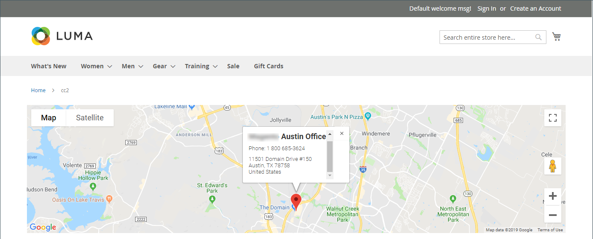
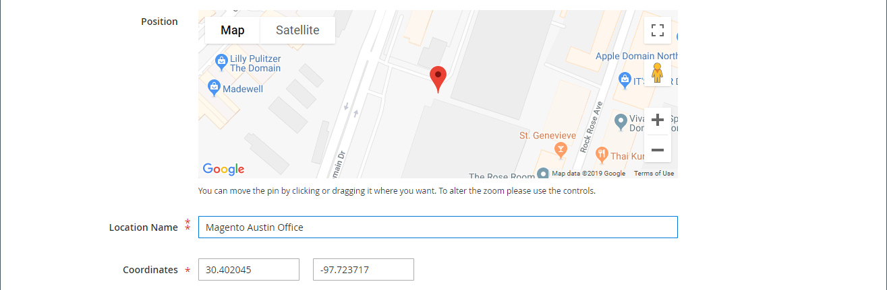

# Média - Carte

Utilisez le type de contenu _Map_ pour ajouter un mappage de [[!DNL Google Maps] Platform](https://cloud.google.com/maps-platform/) à [[!DNL Page Builder] stage](workspace.md#stage). Par exemple, vous pouvez ajouter une carte à un bloc, puis ajouter le bloc aux pages [À propos de nous](../content-design/pages.md#about-us) et [Nous contacter](../getting-started/store-details.md#contact-us-form).

Pour tirer le meilleur parti de [!DNL Google Maps] Platform, vous pouvez personnaliser la carte, mettre en évidence les emplacements de vos magasins et utiliser Google [Places](https://cloud.google.com/maps-platform/places/) pour ajouter des informations riches sur votre magasin à tous les [!DNL Google Maps].

## Avantages de l’incorporation d’une carte Google

1. Fournit aux acheteurs une gamme complète d&#39;informations sur votre entreprise (numéro de téléphone, site Web, commentaires, évaluation par étoiles, etc.) directement sur votre site.

1. Une carte Google met généralement en évidence les attractions, parcs, restaurants, etc. à proximité. Ces renseignements aident vos clients à déterminer leur emplacement physique et à planifier leur voyage.

1. Permet aux clients de trouver facilement l&#39;adresse de votre magasin physique sans avoir à ouvrir une nouvelle fenêtre de navigateur et quitter votre site.

1. Si vous disposez d’une chaîne de magasins physiques, l’ajout d’une carte Google sur votre site contribue à accroître la notoriété et la crédibilité de votre marque sous la forme d’éléments mis en surbrillance.

{width="700" zoomable="yes"}

{{$include /help/_includes/page-builder-save-timeout.md}}

## Boîte à outils Carte

La boîte à outils de mappage s’affiche lorsque vous placez le pointeur de la souris sur le conteneur de mappage.

| Outil | Icon | Description |
|--- |--- |--- |
| Déplacer | {width="25"} | Déplace la carte vers un autre emplacement de la scène. |
| (libellé) | [!UICONTROL Map] | Identifie le conteneur de contenu actuel en tant que mappage. Pointez sur le conteneur de carte pour afficher la boîte à outils. |
| Paramètres | {width="25"} | Ouvre la page Modifier la carte, qui permet de modifier les propriétés de la carte et du conteneur. |
| Masquer | {width="25"} | Masque la carte actuelle. |
| Afficher | {width="25"} | Affiche la carte masquée. |
| Dupliquer | {width="25"} | Fait une copie de la carte. |
| Supprimer | {width="25"} | Supprime le mappage de l’étape. |

{style="table-layout:auto"}

{{$include /help/_includes/page-builder-hidden-element-note.md}}

## Configuration de [!DNL Google Maps] pour votre administrateur

Avant d’ajouter un mappage, vous devez d’abord ouvrir un [compte](https://cloud.google.com/maps-platform/user-guide/) pour bénéficier d’une version d’essai gratuite de [!DNL Google Maps] Platform. L&#39;essai gratuit dure 12 mois et comprend un crédit de 300 $. Si vous utilisez votre crédit, Google ne facture pas votre compte sans votre autorisation.

### Étape 1 : obtenir votre clé API [!DNL Google Maps]

Selon que vous disposez déjà d’une clé [!DNL Google Maps], utilisez l’une des procédures suivantes pour obtenir la clé API requise pour la configuration. Pour configurer une clé de [!DNL Google Maps], vous devez être un administrateur de site autorisé à activer la facturation pour votre compte. Si vous n’êtes pas prêt à configurer un compte [!DNL Google Maps] Platform, vous pouvez ignorer cette étape et utiliser la carte d’espace réservé pour l’instant.

1. Accédez à la console [Google Cloud Platform](https://cloud.google.com/console/google/maps-apis/overview).

1. Cliquez sur la liste déroulante du projet et sélectionnez ou créez le projet pour lequel vous souhaitez ajouter une clé API.

1. Pour configurer vos informations d’identification d’API, suivez les [instructions](https://developers.google.com/maps/documentation/javascript/get-api-key) dans la documentation [!DNL Google Maps].

1. Copiez votre clé API dans le presse-papiers.

### Étape 2 : configuration des [!DNL Google Maps] dans [!DNL Commerce]

1. Dans la barre latérale _Admin_, accédez à **[!UICONTROL Stores]** > _[!UICONTROL Settings]_>**[!UICONTROL Configuration]**.

1. Dans le panneau de gauche sous _[!UICONTROL General]_, choisissez **[!UICONTROL Content Management]**.

1. Développez  **[!UICONTROL Advanced Content Tools]**.

   {width="600" zoomable="yes"}

   Pour plus d’informations sur les options de configuration des outils avancés de gestion de contenu, consultez le [&#x200B; Guide de référence de configuration &#x200B;](../configuration-reference/general/content-management.md).

1. Par **[!UICONTROL Google Maps API Key]**, collez la clé que vous avez copiée à l’étape 1.

1. Cliquez sur **[!UICONTROL Test Key]**.

   En cas de problème avec votre clé, revenez sur le site [!DNL Google Maps] Platform pour résoudre le problème. Réessayez ensuite.

1. Une fois votre clé vérifiée, cliquez sur **[!UICONTROL Save Config]**.

## Ajouter un mappage à l’étape

1. Ouvrez la page, le bloc ou le bloc dynamique dans l’espace de travail [!DNL Page Builder].

1. Dans le panneau [!DNL Page Builder], développez **[!UICONTROL Media]** et faites glisser un espace réservé **[!UICONTROL Map]** vers la scène.

   {width="600" zoomable="yes"}

   Si [!DNL Google Maps] Platform est configuré pour votre boutique, un mappage s’affiche pour l’emplacement de votre boutique.

   ![[!DNL Google Maps]](./assets/pb-tutorial2-google-map.png){width="600" zoomable="yes"}

   Si [!DNL Google Maps] Platform n’est pas encore configuré pour votre magasin, un mappage d’espace réservé s’affiche à la place.

   ![[!DNL Google Maps] un espace réservé](./assets/pb-tutorial2-media-map-not-configured.png){width="600" zoomable="yes"}

## Ajouter un emplacement de carte personnalisé

1. Pointez sur le conteneur de mappage pour afficher la boîte à outils et choisissez l’icône _Paramètres_ ( {width="20"} ).

1. Dans l’angle supérieur droit de la page _[!UICONTROL Edit Map]_, cliquez sur **[!UICONTROL Add Location]**.

1. Saisissez le **[!UICONTROL Location Name]** que vous souhaitez associer à l’épingle sur la carte.

1. Collectez les coordonnées d’emplacement à utiliser pour l’emplacement personnalisé.

   Vous pouvez également faire glisser l’épingle dans la carte affichée dans la zone **[!UICONTROL Position]**.

   Si nécessaire, accédez à [[!DNL Google Maps]](https://www.google.com/maps) dans une nouvelle fenêtre de navigateur et utilisez l’une des méthodes suivantes pour obtenir les coordonnées :

   {width="600" zoomable="yes"}

   **Méthode 1 :** Copier à partir de l’URL

   - Dans le coin supérieur gauche, saisissez l’adresse dans la zone de **[!UICONTROL Search]**, puis cliquez sur l’icône _Rechercher_ ( {width="20"} ).

   - Copiez les coordonnées dans l’URL et collez-les dans un bloc-notes.

   **Méthode 2:** Copier à partir de « Qu’y a-t-il ici ? »

   - Cliquez avec le bouton droit sur l&#39;épingle rouge qui marque l&#39;emplacement sur la carte et choisissez **[!UICONTROL What's here?]** dans le menu.

   - Dans le libellé affiché, copiez le texte, y compris les coordonnées, et collez-le dans un bloc-notes.

1. Saisissez les nombres, sans la virgule, dans chacune des zones de **[!UICONTROL Coordinates]**.

   Vous pouvez également entrer autant d&#39;informations restantes que vous souhaitez être disponibles sur la carte.

1. Renseignez toutes les autres informations que vous souhaitez associer à l&#39;emplacement de la carte :

   | Option | Description |
   | ------ | ----------- |
   | [!UICONTROL Phone Number] | Numéro de téléphone de l’emplacement. |
   | [!UICONTROL Street Address] | Adresse postale de l’emplacement. |
   | [!UICONTROL City] | La ville du lieu. |
   | [!UICONTROL Region/State] | Région ou état de l’emplacement. |
   | [!UICONTROL Zip/Postal Code] | Code postal de l’emplacement. |
   | [!UICONTROL Country] | Pays du lieu. |
   | [!UICONTROL Comment] | Tout commentaire que vous souhaitez inclure. |

   {style="table-layout:auto"}

1. Cliquez ensuite sur **[!UICONTROL Save]**.

   Le nouvel emplacement apparaît dans la carte et dans la grille d&#39;emplacement de la carte de la page _[!UICONTROL Edit Map]_.

   ![[!DNL Page Builder] - mappe la grille d’emplacement](./assets/pb-media-maps-settings-add-location-grid.png){width="600" zoomable="yes"}

## Donner un style à la carte {#styling}

Utilisez l’assistant de style [!DNL Google Maps] Platform pour appliquer l’un des six thèmes prédéfinis ou pour créer un thème personnalisé. Vous pouvez générer un fichier JSON avec les propriétés de style de mappage ou un lien vers le mappage stylisé.

### Modifier le style de mappage

1. Dans la barre latérale _Admin_, accédez à **[!UICONTROL Stores]** > _[!UICONTROL Settings]_>**[!UICONTROL Configuration]**.

1. Dans le panneau de gauche sous _[!UICONTROL General]_, choisissez **[!UICONTROL Content Management]**.

1. Développez  **[!UICONTROL Advanced Content Tools]**.

1. Sous la zone de texte **[!UICONTROL Google Maps Style]**, cliquez sur [Créer un style de mappage](https://mapstyle.withgoogle.com/).

   Cette action ouvre l’[[!DNL Google Maps] assistant de style Platform](https://mapstyle.withgoogle.com/) dans un onglet distinct, dans lequel vous pouvez définir un style pour votre projet [!DNL Google Maps] Platform.

1. Cliquez sur **[!UICONTROL Create a Style]** et suivez les instructions fournies.

   Cliquez ensuite sur **[!UICONTROL Finish]**.

1. Exportez le style terminé sous forme de code JSON ou d’URL afin de l’ajouter à la configuration [!DNL Commerce].

   - **JSON** : sous la zone contenant le code JSON généré, cliquez sur **[!UICONTROL Copy JSON]**.

   - **[!UICONTROL URL]** : sous la zone contenant l’URL générée, cliquez sur **[!UICONTROL Copy URL]**.

1. Revenez à l’onglet du navigateur d’administration et collez le code ou l’URL généré dans la zone **Style de mappages Google**.

   Si vous utilisez une URL, remplacez l’espace réservé `YOUR_API_KEY` par votre clé API [!DNL Google Maps]. Cette URL renvoie à votre carte Google stylisée.

1. Dans le coin supérieur droit, cliquez sur **[!UICONTROL Save Config]**.

### Modifier les paramètres de la carte

1. Pointez sur le conteneur de carte pour afficher la boîte à outils et choisissez l’icône _Paramètres_ ( {width="20"} ).

1. Modifiez les paramètres de base selon les besoins :

   | Option | Description |
   | ------ | ----------- |
   | [!UICONTROL Height] | Indique la hauteur de la carte affichée en pixels. |
   | [!UICONTROL Show Controls] | Détermine si les contrôles Google Map standard s’affichent. |

   {style="table-layout:auto"}

1. Modifiez les paramètres _[!UICONTROL Advanced]_&#x200B;selon vos besoins :

   - Pour contrôler le positionnement horizontal du contenu de carte qui a été ajouté au conteneur, choisissez une **[!UICONTROL Alignment]** :

     | Option | Description |
     | ------ | ----------- |
     | `Default` | Applique le paramètre d’alignement par défaut spécifié dans la feuille de style du thème actif. |
     | `Left` | Aligne le contenu le long de la bordure gauche du conteneur de carte, en tenant compte de la marge intérieure spécifiée. |
     | `Center` | Aligne le contenu au centre du conteneur de carte, en tenant compte de la marge intérieure spécifiée. |
     | `Right` | Aligne le contenu le long de la bordure droite du conteneur de carte, en tenant compte de la marge intérieure spécifiée. |

     {style="table-layout:auto"}

   - Définissez le style de **[!UICONTROL Border]** appliqué aux quatre côtés du conteneur de carte :

     | Option | Description |
     | ------ | ----------- |
     | `Default` | Applique le style de bordure par défaut spécifié par la feuille de style associée. |
     | `None` | Ne fournit aucune indication visible des bordures du conteneur. |
     | `Dotted` | La bordure du conteneur s’affiche sous la forme d’une ligne pointillée. |
     | `Dashed` | La bordure du conteneur s’affiche sous la forme d’une ligne en tirets. |
     | `Solid` | La bordure du conteneur s’affiche sous la forme d’une ligne continue. |
     | `Double` | La bordure du conteneur s’affiche sous la forme d’une ligne double. |
     | `Groove` | La bordure du conteneur s’affiche sous la forme d’une ligne rainurée. |
     | `Ridge` | La bordure du conteneur s’affiche sous la forme d’une ligne crantée. |
     | `Inset` | La bordure du conteneur s’affiche sous la forme d’une ligne insérée. |
     | `Outset` | La bordure du conteneur s’affiche sous la forme d’une ligne de départ. |

     {style="table-layout:auto"}

   - Si vous définissez un style de bordure autre que `None`, renseignez les options d’affichage des bordures :

     {width="600" zoomable="yes"}

     | Option | Description |
     | ------ |------------ |
     | [!UICONTROL Border Color] | Spécifiez la couleur en choisissant une nuance, en cliquant sur le sélecteur de couleurs ou en saisissant un nom de couleur valide ou une valeur hexadécimale équivalente. |
     | [!UICONTROL Border Width] | Saisissez le nombre de pixels pour la largeur de la ligne de bordure. |
     | [!UICONTROL Border Radius] | Saisissez le nombre de pixels pour définir la taille du rayon utilisé pour arrondir chaque coin de la bordure. |

     {style="table-layout:auto"}

   - (Facultatif) Spécifiez les noms des **[!UICONTROL CSS classes]** de la feuille de style actuelle à appliquer au conteneur de mappage.

     Séparez plusieurs noms de classe par un espace.

   - Saisissez les valeurs, en pixels, du **[!UICONTROL Margins and Padding]** pour spécifier les marges extérieures et la marge intérieure du conteneur de carte.

     Saisissez chaque valeur correspondante dans le diagramme de conteneur de mappage.

     | Zone conteneur | Description |
     | -------------- | ----------- |
     | [!UICONTROL Margins] | Quantité d’espace vide appliqué au bord extérieur de tous les côtés du conteneur. |
     | [!UICONTROL Padding] | Quantité d’espace vide appliqué au bord intérieur de tous les côtés du conteneur. |

     {style="table-layout:auto"}

     >[!NOTE]
     >
     >La marge intérieure n’est pas disponible pour le type de contenu Mappage .

1. Une fois l’opération terminée, cliquez sur **[!UICONTROL Save]** pour appliquer les paramètres et revenir à l’espace de travail [!DNL Page Builder].

### Modifier la taille de la grille

La taille de la grille détermine la taille de la carte associée à une [colonne](column.md) à l’étape de [!DNL Page Builder]. Par défaut, la carte a une largeur de 12 colonnes et un maximum de 16 colonnes.

1. Dans la barre latérale _Admin_, accédez à **[!UICONTROL Stores]** > _[!UICONTROL Settings]_>**[!UICONTROL Configuration]**.

1. Dans le panneau de gauche sous _[!UICONTROL General]_, choisissez **[!UICONTROL Content Management]**.

1. Développez  **[!UICONTROL Advanced Content Tools]**.

1. Mettez à jour les options de la grille selon vos besoins :

   >[!NOTE]
   >
   >Si nécessaire, décochez la case **[!UICONTROL Use system value]** pour modifier ces paramètres.

   - Par **[!UICONTROL Default Column Grid Size]**, saisissez une nouvelle valeur pour la taille par défaut de la grille.

   - Par **[!UICONTROL Maximum Column Grid Size]**, saisissez une nouvelle valeur pour la taille de grille maximale par défaut.

   {width="600" zoomable="yes"}

1. Cliquez ensuite sur **[!UICONTROL Save Config]**.

<!-- Last updated from includes: 2023-09-11 14:30:19 -->
