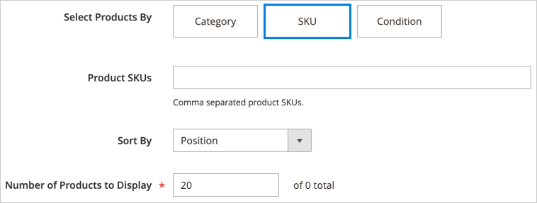
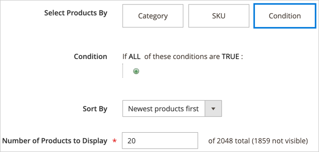

# Ajouter du contenu - Produits

Utilisez le type de contenu _Produits_ pour ajouter une liste de produits à l’étape [[!DNL Page Builder] étape](workspace.md#stage), à l’aide d’une disposition grille ou carrousel. Utilisez l’outil [Ajouter du contenu - Bloc](block.md) pour placer le bloc sur l’étape de [!DNL Page Builder], puis placez une liste de produits dans le bloc. Vous pouvez également ajouter la liste de produits directement dans une ligne sur une page.

## Instructions d’utilisation du carrousel de produit

Le carrousel de produits offre un moyen puissant et attrayant de présenter vos produits. Pour en tirer le meilleur parti, les recommandations suivantes sont recommandées :

- Ajoutez des carrousels de produit directement aux conteneurs de largeur de page tels que des lignes, des onglets ou des dispositions à une colonne. L’utilisation de mises en page de largeur de page garantit le meilleur affichage réactif de vos produits. [!DNL Page Builder] réduit le nombre de produits affichés en fonction de la largeur de la page, et non de la largeur du conteneur.

- N’ajoutez pas de carrousel de produit à une colonne étroite. Comme mentionné, [!DNL Page Builder] détermine par défaut le nombre de produits à afficher en fonction de la largeur de la page, et non de la largeur des colonnes.

- Si vous souhaitez que le carrousel de produits défile automatiquement en continu, définissez **[!UICONTROL Autoplay]** et **[!UICONTROL Infinite Loop]** sur `Yes`. Si la lecture automatique est définie sur `Yes` mais que la boucle infinie est définie sur `No`, le défilement automatique s’arrête à la fin de votre liste de produits.

- Définissez la **[!UICONTROL Carousel Mode]** sur `Continuous` pour mettre en surbrillance, centrer et faire défiler un produit à la fois dans le carrousel. Les autres produits sont visibles dans la liste, mais transparents pour mettre en évidence le produit centré.

  {width="600"}

- Pour afficher et faire défiler jusqu’à cinq produits à la fois dans le carrousel, gardez la **[!UICONTROL Carousel Mode]** définie sur `Default`.

  {width="600"}

Les instructions suivantes indiquent comment ajouter une liste Produits à un bloc. Vous pouvez ensuite utiliser un [widget](../content-design/widgets.md) pour placer le bloc à un emplacement spécifique sur n’importe quelle page de votre boutique.

{{$include /help/_includes/page-builder-save-timeout.md}}

## Boîte à outils Produits

| Outil | Icon | Description |
| --------- | ------------- | ----------------- |
| Déplacer | {width="25"} | Déplace le conteneur de produits et son contenu vers un autre emplacement sur la scène. |
| Paramètres | {width="25"} | Ouvre la page _Modifier les produits_, dans laquelle vous pouvez choisir la liste de produits et modifier les propriétés du conteneur. |
| Masquer | {width="25"} | Masque le conteneur de produits actuel et son contenu. |
| Afficher | {width="25"} | Affiche le conteneur de produits masqué et son contenu. |
| Dupliquer | {width="25"} | Effectue une copie du conteneur de produits et de son contenu. |
| Supprimer | {width="25"} | Supprime le conteneur de produits et son contenu de l’étape. |

{style="table-layout:auto"}

{{$include /help/_includes/page-builder-hidden-element-note.md}}

## Création d’un bloc de liste de produits

1. Dans la barre latérale _Admin_, accédez à **[!UICONTROL Content]** > _[!UICONTROL Elements]_>**[!UICONTROL Blocks]**.

1. Cliquez sur **[!UICONTROL Add New Block]**.

1. Saisissez les **[!UICONTROL Block Title]** et les **[!UICONTROL Identifier]**.

1. Choisissez le **[!UICONTROL Store View]** où le bloc doit être disponible.

1. Faites défiler vers le bas et cliquez sur **[!UICONTROL Edit with Page Builder]** ou dans la zone de prévisualisation du contenu pour ouvrir l’espace de travail [!DNL Page Builder].

1. Dans le panneau [!DNL Page Builder], développez **[!UICONTROL Add Content]** et faites glisser un espace réservé **[!UICONTROL Products]** vers la scène.

   {width="600" zoomable="yes"}

## Configuration du conteneur de la liste de produits

Pointez sur le conteneur _Products_ vide pour afficher la boîte à outils, puis cliquez sur l’icône _Settings_ ({width="20"} ).

{width="500" zoomable="yes"}

Renseignez les _Paramètres_ en vous reportant aux sections suivantes :

### Apparence

1. Pour déterminer l’affichage de la liste de produits sur la page, choisissez l’un des types d’apparence suivants :

   | Type | Description |
   | ---- | ----------- |
   | Grille de produits | Affiche les produits dans une grille qui affiche cinq produits par ligne (par défaut), avec autant de lignes que nécessaire pour afficher le nombre saisi dans le paramètre **[!UICONTROL Number of Products to Display]**. |
   | Carrousel de produit | Affiche les produits dans un carrousel (également appelé curseur). Le carrousel affiche jusqu’à cinq produits par diapositive.   **Alerte de réactivité** : lorsque vous sélectionnez cette apparence, il est préférable d’ajouter le type de contenu Produits directement à une disposition en ligne, en onglet ou sur une colonne où il est réactif, affichant moins de produits par côté sur des écrans plus petits. Si vous l’ajoutez à des types de contenu plus étroits que la largeur de la page (une colonne étroite, par exemple), le carrousel affiche plus de produits par diapositive que ne le permet le conteneur, quelle que soit la taille de l’écran. |

   {style="table-layout:auto"}

   {width="300"}

   Si vous choisissez le carrousel de produit, vous devez également configurer les [paramètres du carrousel](#carousel-settings).

1. Par **[!UICONTROL Select Products By]**, choisissez la méthode pour la sélection de produit :

   Vous pouvez sélectionner vos produits par catégorie, SKU ou condition. Ces options s’excluent mutuellement. Par exemple, vous ne pouvez pas sélectionner l’option Catégorie , utiliser le sélecteur de catégories, puis passer à l’option Condition pour ajouter des conditions. Vos produits sont sélectionnés uniquement en fonction de ce que vous avez défini pour _l_ une de ces trois options.

   - **[!UICONTROL Category]** - Sélectionnez cette option pour afficher les produits à l’aide d’une catégorie sélectionnée.

     {width="500"}

     Lorsqu’elle est sélectionnée, cette option fournit un sélecteur de **[!UICONTROL Category]**. Cliquez sur la flèche et effectuez une analyse en profondeur pour choisir la catégorie de produits à afficher. Par exemple, dans les données d’exemple [!DNL Commerce], l’exploration et la sélection du _Femmes > Tops > Tees_ affichent tous les produits de cette catégorie.

     {width="500"}

   - **[!UICONTROL SKU]** - Sélectionnez cette option pour afficher les produits à l’aide d’un ou de plusieurs SKU

     Lorsque cette option est sélectionnée, elle fournit une zone de texte **[!UICONTROL Product SKUs]** dans laquelle vous devez saisir une liste de SKU séparés par des virgules à afficher.

     {width="500"}

   - **[!UICONTROL Condition]** - Sélectionnez cette option pour afficher les produits selon une ou plusieurs conditions que vous définissez.

     Lorsque cette option est sélectionnée, des outils sont disponibles pour ajouter des conditions à votre sélection de produits. Par exemple, vous pouvez sélectionner uniquement les produits dont le genre est défini sur Unisexe.

     {width="500"}

     >[!NOTE]
     >
     >La sélection de l’option Catégorie ou SKU fournit l’option **[!UICONTROL Sort By]** de `Position`. Avec cette option de tri, les produits apparaissent dans l’ordre dans lequel ils apparaissent dans votre catalogue. 
     >
     >Pour l’option Catégorie , le tri par position affiche les produits dans l’ordre dans lequel ils apparaissent dans votre catalogue. Pour l’option SKU, le tri par position affiche les produits dans l’ordre dans lequel vous les saisissez dans la zone de texte **[!UICONTROL Product SKUs]**.

1. Par **[!UICONTROL Sort By]**, choisissez l’ordre de tri des produits de la liste :

   | Option | Description |
   | ------ | ----------- |
   | `Position` (pour les options Catégorie et SKU uniquement) | Lorsque vous sélectionnez l’option Catégorie , la Position affiche les produits dans le même ordre que leur position dans le catalogue. Lorsque vous sélectionnez l’option SKU, la fonction Position affiche les produits dans le même ordre que les SKU dans la zone de texte SKU du produit . |
   | `Newest products first` | Trie les produits en fonction de la date à laquelle ils ont été ajoutés au catalogue, en affichant d’abord les produits avec les dates d’entrée les plus récentes. |
   | `Oldest products first` | Trie les produits en fonction de la date à laquelle ils ont été ajoutés au catalogue, en affichant d’abord les produits avec les dates d’entrée les plus anciennes. |
   | `Name: A - Z` | Trie les produits par ordre alphabétique. |
   | `Name: Z - A` | Trie les produits dans l’ordre alphabétique inverse. |
   | `SKU: ascending` | Trie les produits par SKU dans l’ordre alphanumérique. |
   | `SKU: descending` | Trie les produits par SKU dans l’ordre alphanumérique inverse. |
   | `Stock: low stock first` | Trie les produits du stock disponible le plus bas au plus élevé. |
   | `Stock: high stock first` | Trie les produits du stock disponible le plus élevé au plus bas. |
   | `Price: high to low` | Trie les produits du prix le plus élevé au prix le plus bas. |
   | `Price: low to high` | Trie les produits du prix le plus bas au prix le plus élevé. |

   {style="table-layout:auto"}

   {width="300"}

1. Saisissez le **[!UICONTROL Number of Products to Display]** dans le carrousel ou la grille.

   Les valeurs peuvent être comprises entre `1` et `999`. La valeur par défaut est `5` pour une grille et `20` pour un carrousel.

   >[!NOTE]
   >
   >Certains produits des paramètres Catégorie, SKU ou Condition peuvent ne pas apparaître dans la grille ou le carrousel de vos produits. Par exemple, les produits désactivés, les produits marqués comme non visibles, les produits en rupture de stock et les produits affectés à un autre site web ne s’affichent pas.

   >[!IMPORTANT]
   >
   >Les prix des produits configurables, groupés et groupés (prix dynamique) ne sont pas définis dans l’administrateur. Par conséquent, ces produits ne sont pas affichés dans le **[!UICONTROL Preview]** si les produits sont filtrés par prix. Ces produits ne peuvent pas être commandés correctement dans le **[!UICONTROL Preview]** s&#39;ils sont commandés par le prix.

### Paramètres du carrousel

1. Pour déterminer l’affichage des produits dans le carrousel, choisissez l’**[!UICONTROL Carousel Mode]** :

   | Option | Description |
   | ------ | ----------- |
   | `Default` | Le carrousel affiche cinq produits par diapositive par défaut et réduit ce nombre de manière réactive, si nécessaire. |
   | `Continuous` | Par défaut, le carrousel affiche cinq produits par diapositive (avec la moitié d’un produit à droite et à gauche), mais centre et fait défiler un produit à la fois en une boucle infinie. Les produits situés à droite et à gauche du produit centré sont grisés afin que le produit central soit mis en surbrillance. |

   {style="table-layout:auto"}

   Si vous basculez entre ces deux modes, les autres paramètres du carrousel sont conservés, à l’exception du paramètre **[!UICONTROL Infinite Loop]**, qui est toujours défini sur `Yes` en mode continu et où le champ est désactivé.

   {width="600" zoomable="yes"}

1. Si nécessaire, définissez l’option **[!UICONTROL Autoplay]** sur `Yes`.

   Lorsque la lecture automatique est activée, le carrousel commence à défiler automatiquement au chargement de la page. Si vous laissez le paramètre par défaut (`No`), le client doit cliquer sur le volet de navigation des diapositives (points ou flèches) pour afficher chaque diapositive dans l’ordre.

   Si vous activez cette fonctionnalité, saisissez **[!UICONTROL Autoplay Speed]** pour spécifier le délai en millisecondes entre chaque diapositive. La valeur par défaut est `4000` (4 secondes).

1. Si nécessaire, définissez l’option **[!UICONTROL Infinite Loop]** sur `Yes`.

   Lorsque la boucle infinie est activée, le diaporama se relit indéfiniment lorsque la page est ouverte. Si vous laissez le paramètre par défaut (`No`), le diaporama n&#39;est lu qu&#39;une seule fois.

   >[!NOTE]
   >
   >Si vous définissez **[!UICONTROL Infinite Loop]** sur `No` et **[!UICONTROL Autoplay]** sur `Yes`, la lecture automatique s’arrête à la fin du nombre de produits à afficher.

1. Si nécessaire, définissez l’option **[!UICONTROL Show Arrows]** sur `Yes`.

   Lorsque cette option est activée, chaque diapositive comprend des flèches de navigation _suivante_ et _précédente_ sur les côtés gauche et droit. Si vous laissez le paramètre par défaut (`No`), les diapositives n’affichent pas de flèches de navigation.

1. Si nécessaire, définissez l’option **[!UICONTROL Show Dots]** sur `No`.

   Lorsque ce paramètre est défini sur la valeur par défaut (`Yes`), des points de navigation s’affichent au bas du curseur du carrousel. Si vous désactivez ce paramètre, le curseur du carrousel n’affiche pas les points de navigation.

### Avancé

1. Pour contrôler le positionnement de la liste Produits dans le conteneur parent, choisissez l’**[!UICONTROL Alignment]** :

   | Option | Description |
   | ------ | ----------- |
   | `Default` | Applique le paramètre d’alignement par défaut spécifié dans la feuille de style du thème actif. |
   | `Left` | Aligne la liste le long de la bordure gauche du conteneur parent, en tenant compte de la marge intérieure spécifiée. |
   | `Center` | Aligne la liste au centre du conteneur parent, en tenant compte de la marge intérieure spécifiée. |
   | `Right` | Aligne la liste le long de la bordure droite du conteneur parent, en tenant compte de la marge intérieure spécifiée. |

   {style="table-layout:auto"}

1. Définissez le style de **[!UICONTROL Border]** appliqué aux quatre côtés du conteneur de produits :

   | Option | Description |
   | ------ | ----------- |
   | `Default` | Applique le style de bordure par défaut spécifié par la feuille de style associée. |
   | `None` | Ne fournit aucune indication visible des bordures du conteneur. |
   | `Dotted` | La bordure du conteneur s’affiche sous la forme d’une ligne pointillée. |
   | `Dashed` | La bordure du conteneur s’affiche sous la forme d’une ligne en tirets. |
   | `Solid` | La bordure du conteneur s’affiche sous la forme d’une ligne continue. |
   | `Double` | La bordure du conteneur s’affiche sous la forme d’une ligne double. |
   | `Groove` | La bordure du conteneur s’affiche sous la forme d’une ligne rainurée. |
   | `Ridge` | La bordure du conteneur s’affiche sous la forme d’une ligne crantée. |
   | `Inset` | La bordure du conteneur s’affiche sous la forme d’une ligne insérée. |
   | `Outset` | La bordure du conteneur s’affiche sous la forme d’une ligne de départ. |

   {style="table-layout:auto"}

1. Si vous définissez un style de bordure autre que `None`, renseignez les options d’affichage des bordures :

   | Option | Description |
   | ------ |------------ |
   | [!UICONTROL Border Color] | Spécifiez la couleur en choisissant une nuance, en cliquant sur le sélecteur de couleurs ou en saisissant un nom de couleur valide ou une valeur hexadécimale équivalente. |
   | [!UICONTROL Border Width] | Saisissez le nombre de pixels pour la largeur de la ligne de bordure. |
   | [!UICONTROL Border Radius] | Saisissez le nombre de pixels pour définir la taille du rayon utilisé pour arrondir chaque coin de la bordure. |

   {style="table-layout:auto"}

1. (Facultatif) Spécifiez les noms des **[!UICONTROL CSS classes]** de la feuille de style actuelle à appliquer au conteneur.

   Séparez plusieurs noms de classe par un espace.

1. Saisissez les valeurs, en pixels, du **[!UICONTROL Margins and Padding]** pour déterminer les marges extérieures et la marge intérieure du conteneur de produits.

   Saisissez les valeurs correspondantes dans le diagramme.

   | Zone conteneur | Description |
   | -------------- | ----------- |
   | [!UICONTROL Margins] | Quantité d’espace vide appliqué au bord extérieur de tous les côtés du conteneur. Options : `Top` / `Right` / `Bottom` / `Left` |
   | [!UICONTROL Padding] | Quantité d’espace vide appliqué au bord intérieur de tous les côtés du conteneur. Options : `Top` / `Right` / `Bottom` / `Left` |

## Enregistrer et prévisualiser sur l’étape

Dans le coin supérieur droit, cliquez sur **[!UICONTROL Save]** pour appliquer les paramètres et revenir à l’espace de travail [!DNL Page Builder].

Si vous avez configuré un carrousel de produit, il doit ressembler à l’exemple suivant :

{width="600"}

Vous pouvez maintenant utiliser un [widget](../content-design/widgets.md) pour placer ce bloc où vous souhaitez qu’il apparaisse dans le magasin. Vous pouvez également utiliser [Ajouter du contenu - Bloc](block.md) pour ajouter le bloc à une page, un onglet ou un bloc existant.

<!-- Last updated from includes: 2023-09-11 14:30:19 -->
