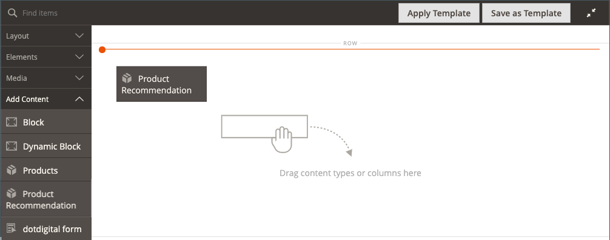

# Ajouter du contenu - Recommendations de produit

Utilisez la variable _Recommendations de produit_ type de contenu pour ajouter un type existant et actif [unité de recommandation](https://experienceleague.adobe.com/en/docs/commerce-merchant-services/product-recommendations/admin/create) à la fonction [[!DNL Page Builder] étape](workspace.md#stage) pour une page CMS, un bloc ou un bloc dynamique.

>[!NOTE]
>
>La variable [!DNL Page Builder] _Recommendations de produit_ Le type de contenu est pris en charge dans Adobe Commerce 2.4.4 et versions ultérieures et est disponible dans le [Mise à jour du métaphorage Recommendations du produit 3.0.x ou version ultérieure](https://commercemarketplace.adobe.com/magento-product-recommendations.html). Pour ajouter [!DNL Page Builder] prise en charge de Product Recommendations, [voir les informations d’installation](https://experienceleague.adobe.com/en/docs/commerce-merchant-services/product-recommendations/getting-started/install-configure). **Ce type de contenu n’est pas disponible pour Magento Open Source.**

{{$include /help/_includes/page-builder-save-timeout.md}}

## Boîte à outils Recommendations du produit

| Outil | Icône | Description |
| --- | --| --- |
| Déplacer | {width="25"} | Déplace le conteneur de recommandations de produits et son contenu vers un autre emplacement sur l’étape. |
| Paramètres | {width="25"} | Ouvre la page Modifier la recommandation du produit dans laquelle vous pouvez choisir l’unité de recommandation et modifier les propriétés du conteneur. |
| Masquer | {width="25"} | Masque le conteneur de recommandations de produits actuel et son contenu. |
| Afficher | {width="25"} | Affiche le conteneur de recommandations de produits masqué et son contenu. |
| Dupliquer | {width="25"} | Effectue une copie en double du conteneur de recommandations de produits et de son contenu. |
| Supprimer | {width="25"} | Supprime le conteneur de recommandations de produits et son contenu de l’étape. |

{style="table-layout:auto"}

{{$include /help/_includes/page-builder-hidden-element-note.md}}

## Ajouter une unité de recommandation existante

1. Assurez-vous que vous avez déjà [création d’une unité de recommandation](https://experienceleague.adobe.com/en/docs/commerce-merchant-services/product-recommendations/admin/create) pour le [!DNL Page Builder] type de page.

>[!NOTE]
>
>Vous pouvez créer des unités de recommandation pour le [!DNL Page Builder] type de page uniquement en mode magasin par défaut.

1. Ouvrez la page, le bloc ou le bloc dynamique en mode d’édition.

1. Développez l’objet _[!UICONTROL Content]_et cliquez sur **[!UICONTROL Edit with Page Builder]**ou dans la zone d’aperçu du contenu pour ouvrir la [!DNL Page Builder] workspace.

1. Dans le [!DNL Page Builder] panneau sous _[!UICONTROL Layout]_, faites glisser un **[!UICONTROL Row]**espace réservé sur la scène.

1. Dans le [!DNL Page Builder] panneau sous _[!UICONTROL Add Content]_, faites glisser un **[!UICONTROL Product Recommendation]**d’espace réservé à la ligne.

   {width="600" zoomable="yes"}

1. Effectuez l’une des opérations suivantes :

   - Cliquez sur **[!UICONTROL Edit Product Recommendation]**.
   - Pointez sur le conteneur vide pour afficher la boîte à outils, puis cliquez sur l’icône _Paramètres_ ().

   {width="600" zoomable="yes"}

1. Dans le _[!UICONTROL Selection]_, cliquez sur **[!UICONTROL Select]**.

1. Dans la liste des recommandations de produits actives, recherchez la ligne contenant l’unité de recommandation à ajouter, puis cliquez sur **[!UICONTROL Select]** dans la dernière colonne.

   {width="600" zoomable="yes"}

1. Dans le coin supérieur droit, cliquez sur **[!UICONTROL Add Selected]**.

   Le nom de la recommandation de produit sélectionnée s’affiche dans la _[!UICONTROL Selection]_de la_[!UICONTROL Edit Product Recommendation]_ page.

1. Apportez les modifications nécessaires au [Paramètres avancés](#advanced-settings).

   {width="600" zoomable="yes"}

1. Une fois l’opération terminée, procédez comme suit :

   - Si vous utilisez une fenêtre de navigateur entièrement optimisée, cliquez sur la _Fermer le plein écran_ () dans le coin supérieur droit de l’espace de travail.

   - Cliquez sur **[!UICONTROL Save]** pour appliquer les paramètres et revenir au [!DNL Page Builder] workspace.

   Lorsque vous revenez à l’étape, les images d’espace réservé du produit apparaissent dans le conteneur.

## Modification des paramètres des unités de recommandations

1. Passez la souris sur le conteneur d’unité de recommandation pour afficher la boîte à outils, puis cliquez sur l’icône _Paramètres_ ().

   {width="600" zoomable="yes"}

1. Apportez les modifications nécessaires au [Paramètres avancés](#advanced-settings).

1. Lorsque vous avez terminé, cliquez sur **[!UICONTROL Save]** pour appliquer les paramètres et revenir au [!DNL Page Builder] workspace.

## Dupliquer une unité de recommandation

1. Passez la souris sur le conteneur d’unité de recommandation pour afficher la boîte à outils, puis cliquez sur l’icône _Dupliquer_ () dans la boîte à outils.

   Le doublon apparaît juste en dessous de l’original.

1. Pour déplacer l’unité de recommandation dupliquée vers un nouvel emplacement, passez la souris sur le conteneur et cliquez sur l’icône _Déplacer_ () dans la boîte à outils.

1. Sélectionnez l’unité de recommandation et faites-la glisser jusqu’à ce que la ligne directrice rouge apparaisse à la nouvelle position.

   Les bordures supérieure et inférieure de chaque conteneur apparaissent sous forme de lignes tirets lorsque l’unité de recommandation est déplacée.

## Suppression d’une unité de recommandation de l’étape

1. Pointez sur le conteneur de l’unité de recommandation, puis cliquez sur le _Supprimer_ ( ) dans la boîte à outils.

1. Lorsque vous y êtes invité, cliquez sur **[!UICONTROL OK]**.

## Paramètres avancés

1. Pour contrôler le positionnement de l’unité Recommendations de produit dans le conteneur parent, sélectionnez la variable **[!UICONTROL Alignment]**:

   | Option | Description |
   | ------ | ----------- |
   | `Default` | Applique le paramètre d’alignement par défaut spécifié dans la feuille de style du thème actif. |
   | `Left` | Aligne l’unité le long de la bordure gauche du conteneur parent, en tenant compte de toute marge intérieure spécifiée. |
   | `Center` | Aligne l’unité au centre du conteneur parent, en tenant compte de toute marge intérieure spécifiée. |
   | `Right` | Aligne l’unité le long de la bordure droite du conteneur parent, en tenant compte de toute marge intérieure spécifiée. |

   {style="table-layout:auto"}

1. Définissez la variable **[!UICONTROL Border]** style appliqué aux quatre côtés de l’unité Recommendations de produit :

   | Option | Description |
   | ------ | ----------- |
   | `Default` | Applique le style de bordure par défaut spécifié par la feuille de style associée. |
   | `None` | Ne fournit aucune indication visible des bordures des unités. |
   | `Dotted` | La bordure unitaire s’affiche sous forme de ligne pointillée. |
   | `Dashed` | La bordure unitaire s’affiche sous forme de ligne en pointillés. |
   | `Solid` | La bordure unitaire s’affiche sous forme de ligne pleine. |
   | `Double` | La bordure unitaire s’affiche sous forme de ligne double. |
   | `Groove` | La bordure de l’unité apparaît sous la forme d’une ligne surélevée. |
   | `Ridge` | La bordure unitaire apparaît sous la forme d’une ligne à droite. |
   | `Inset` | La bordure unitaire s’affiche sous forme de ligne d’insertion. |
   | `Outset` | La bordure de l&#39;unité apparaît comme une ligne de départ. |

   {style="table-layout:auto"}

1. Si vous définissez un style de bordure autre que `None`, renseignez les options d’affichage des bordures :

   | Option | Description |
   | ------ |------------ |
   | [!UICONTROL Border Color] | Définissez la couleur en choisissant un échantillon, en cliquant sur le sélecteur de couleurs ou en saisissant un nom de couleur valide ou une valeur hexadécimale équivalente. |
   | [!UICONTROL Border Width] | Saisissez le nombre de pixels pour la largeur de la ligne de bordure. |
   | [!UICONTROL Border Radius] | Saisissez le nombre de pixels pour définir la taille du rayon utilisé pour arrondir chaque coin de la bordure. |

   {style="table-layout:auto"}

1. (Facultatif) Indiquez les noms des **[!UICONTROL CSS classes]** de la feuille de style actuelle à appliquer à l’unité.

   Séparez plusieurs noms de classe par un espace.

1. Saisissez des valeurs, en pixels, pour la variable **[!UICONTROL Margins and Padding]** pour déterminer les marges extérieures et la marge intérieure de l’unité.

   Saisissez les valeurs correspondantes dans le diagramme.

   | Zone de conteneur | Description |
   | ------ | ----------- |
   | [!UICONTROL Margins] | Quantité d’espace vierge appliquée au bord extérieur de tous les côtés de l’unité. Options : `Top` / `Right` / `Bottom` / `Left` |
   | [!UICONTROL Padding] | Quantité d’espace vierge appliquée au bord intérieur de tous les côtés de l’unité. Options : `Top` / `Right` / `Bottom` / `Left` |

   {style="table-layout:auto"}
