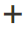
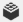

# Média - Curseur

Utilisez le type de contenu _Curseur_ pour ajouter un diaporama d’images à l’ [[!DNL Page Builder] étape](workspace.md#stage). Vous pouvez télécharger de nouvelles images ou sélectionner des images existantes dans la galerie ou le catalogue de produits. Un curseur peut être défini pour une lecture automatique ou être contrôlé manuellement à l’aide des boutons de navigation. Pour associer le curseur à une promotion spécifique, voir [Bloc dynamique](dynamic-block.md).

{width="700" zoomable="yes"}

{{$include /help/_includes/page-builder-save-timeout.md}}

## Toolbox

Lorsque vous utilisez le type de contenu Curseur , vous ajoutez et modifiez des diapositives individuelles et le conteneur de curseur qui contient une ou plusieurs diapositives. Chaque diapositive possède sa propre boîte à outils que vous utilisez pour concevoir des diapositives sur la scène [!DNL Page Builder].

## Barre d’outils de diapositives individuelle

{width="500" zoomable="yes"}

| Outil | Icône | Description |
|--- |--- |--- |
| Déplacer | {width="25"} | Déplace la diapositive vers une autre position sur le curseur. |
| (label) | Numéro de la diapositive | Identifie le numéro de la diapositive actuelle. |
| Paramètres | {width="25"} | Ouvre la page _[!UICONTROL Edit Slide]_où vous pouvez modifier les propriétés de la diapositive actuelle. |
| Dupliquer | {width="25"} | Effectue une copie de la diapositive actuelle. |
| Supprimer | {width="25"} | Supprime la diapositive actuelle du curseur. |

{style="table-layout:auto"}

## Boîte à outils du curseur

| Outil | Icône | Description |
|--- |--- |--- |
| Déplacer | {width="25"} | Déplace le curseur vers une autre position sur la scène. |
| (label) | [!UICONTROL Slider] | Identifie le conteneur de curseur. |
| Paramètres | {width="25"} | Ouvre la page _[!UICONTROL Edit Slider]_dans laquelle vous pouvez modifier les propriétés de la vidéo et du conteneur. |
| Masquer | {width="25"} | Masque le curseur actuel. |
| Afficher | {width="25"} | Affiche le curseur masqué. |
| Dupliquer | {width="25"} | Effectue une copie du curseur. |
| Supprimer | {width="25"} | Supprime le curseur de la scène. |

{style="table-layout:auto"}

{{$include /help/_includes/page-builder-hidden-element-note.md}}

## Ajouter une diapositive individuelle

1. Ouvrez la page, le bloc ou le bloc dynamique où vous souhaitez placer le curseur et développez la section **[!UICONTROL Content]**.

1. Dans le panneau [!DNL Page Builder], développez **[!UICONTROL Media]** et faites glisser un espace réservé **[!UICONTROL Slider]** sur une ligne, une colonne ou un onglet de la scène.

   Dans l’exemple suivant, la couleur d’arrière-plan de la ligne est jaune (`#fffd16`).

   {width="600" zoomable="yes"}

   Le conteneur de curseur s’affiche sur l’scène avec une seule diapositive vide.

1. Cliquez dans le conteneur de curseur pour afficher l’ [éditeur de texte](../content-design/editor.md) et saisissez le contenu de la première diapositive.

   Vous pouvez également inclure un contenu de bannière plus complexe à l’aide des paramètres [Content](#content) .

1. Cliquez sur le point de navigation au bas du curseur pour afficher la boîte à outils de la diapositive individuelle, puis sélectionnez l’icône _Paramètres_ ( {width="20"} ).

   Les curseurs ont deux boîtes à outils. Assurez-vous que vous utilisez la boîte à outils de la diapositive en bas.

1. Définissez les paramètres selon les besoins, en fonction des sections suivantes :

   - [[!UICONTROL Appearance]](#appearance)
   - [[!UICONTROL Background]](#background)
   - [[!UICONTROL Content]](#content)
   - [[!UICONTROL Search Engine Optimization]](#seo)
   - [[!UICONTROL Advanced]](#advanced)

1. Une fois l’opération terminée, cliquez sur **[!UICONTROL Save]** pour appliquer les paramètres et revenir à l’espace de travail [!DNL Page Builder].

## Ajouter d’autres diapositives

Les sections suivantes décrivent une série d’étapes pour commencer avec une diapositive individuelle et créer un curseur réactif qui présente des produits spécifiques et fournit des liens vers ces produits. Si vous ne disposez pas déjà d’une diapositive individuelle, suivez les instructions précédentes pour ajouter une diapositive individuelle à la scène.

Pour ajouter des diapositives, utilisez une ou plusieurs des méthodes suivantes :

### Méthode 1 : duplication d’une diapositive existante

Vous pouvez gagner du temps en dupliquant une diapositive qui a déjà été configurée avec les paramètres nécessaires.

1. Cliquez sur le point de navigation sous la diapositive pour afficher la boîte à outils et sélectionnez l’icône _Dupliquer_ ( {width="20"} ).

   {width="500" zoomable="yes"}

1. Cliquez sur le point de navigation de la nouvelle diapositive et pour afficher la boîte à outils, choisissez l’icône _Paramètres_ ( {width="20"} ).

1. Modifiez les paramètres selon les besoins, en fonction des sections suivantes :

   - [[!UICONTROL Appearance]](#appearance)
   - [[!UICONTROL Background]](#background)
   - [[!UICONTROL Content]](#content)
   - [[!UICONTROL Advanced]](#advanced)

1. Une fois l’opération terminée, cliquez sur **[!UICONTROL Save]** pour appliquer les paramètres et revenir à l’espace de travail [!DNL Page Builder].

### Méthode 2 : ajouter une nouvelle diapositive vierge

1. Pointez sur le conteneur de curseur en haut pour afficher la boîte à outils et sélectionnez l’icône _Ajouter_ ( {width="20"} ).

   {width="500" zoomable="yes"}

   Une nouvelle diapositive vierge avec son propre point de navigation et sa propre boîte à outils est ajoutée au curseur et s’affiche sur la scène.

   {width="500" zoomable="yes"}

1. Cliquez sur le point de navigation de la nouvelle diapositive et pour afficher la boîte à outils, choisissez l’icône _Paramètres_ ( {width="20"} ).

1. Modifiez les paramètres selon les besoins, en fonction des sections suivantes :

   - [[!UICONTROL Appearance]](#appearance)
   - [[!UICONTROL Background]](#background)
   - [[!UICONTROL Content]](#content)
   - [[!UICONTROL Advanced]](#advanced)

1. Une fois l’opération terminée, cliquez sur **[!UICONTROL Save]** dans le coin supérieur droit pour fermer la page _[!UICONTROL Edit Slide]_.

### Ajout d’un widget sur une diapositive

Vous pouvez ajouter n’importe quel [type de widgets](../content-design/widgets.md#widget-types) à votre diapositive dans une étape [!DNL Page Builder] en suivant les étapes suivantes :

1. [Créez le widget](../content-design/widget-create.md) que vous souhaitez afficher sur une diapositive.

1. Ouvrez la page, le bloc ou le bloc dynamique où vous souhaitez placer le curseur et développez la section **[!UICONTROL Content]**.

1. Dans le panneau [!DNL Page Builder], développez **[!UICONTROL Media]** et faites glisser un espace réservé **[!UICONTROL Slider]** sur une ligne, une colonne ou un onglet de la scène.

1. Cliquez dans le conteneur de curseur pour afficher la barre d’outils [de l’éditeur de texte](../content-design/editor.md) et cliquez sur l’icône _Insérer un widget_ ( {width="20"} ).

1. Sélectionnez le **[!UICONTROL Widget Type]** dont vous avez besoin.

1. Spécifiez les paramètres, qui sont différents selon le type de widget.

   {width="600" zoomable="yes"}

1. Une fois l’opération terminée, cliquez sur **[!UICONTROL Insert Widget]** dans le coin supérieur droit.

1. Modifiez les autres paramètres selon les besoins.

1. Une fois l’opération terminée, cliquez sur **[!UICONTROL Save]** dans le coin supérieur droit.

   {width="600" zoomable="yes"}

### Afficher chaque diapositive

Pour afficher chaque diapositive sur la scène, cliquez sur le point suivant sous la diapositive actuellement affichée.

{width="500" zoomable="yes"}

La diapositive de l’exemple précédent comporte une image d’arrière-plan, une image mobile transparente et une image intégrée qui a été ajoutée à partir de l’éditeur de texte. Cette technique fonctionne bien sur les appareils mobiles en désactivant l’image d’arrière-plan et en n’affichant que la plus petite image intégrée. La diapositive de produit de cet exemple comporte les paramètres supplémentaires suivants :

| Option | Exemple de paramètre |
|--- |--- |
| [!UICONTROL Appearance] | `Collage Right` |
| [!UICONTROL Background Color] | `#ffffff` (Blanc) |
| [!UICONTROL Background Image] | L’image sur cette diapositive a été enregistrée à partir de la page du produit et téléchargée dans la galerie. |
| [!UICONTROL Mobile Background Image] | L’image d’arrière-plan mobile est une image transparente d’un carré de 10 pixels. L’utilisation d’une image vierge pour mobile remplace efficacement l’image d’arrière-plan standard par une image invisible. |
| [!UICONTROL Background Size] | `Auto` |
| [!UICONTROL Message Text] | `Minerva LumaTech&trade; V-Tee` (Aligner au centre) avec l’image insérée mise à l’échelle à 40 % (Aligner au centre) |
| [!UICONTROL Link] | `Product` |
| [!UICONTROL Show Button] | `Always` |
| [!UICONTROL Button Text] | `Buy Now` |
| [!UICONTROL Show Overlay] | `Never Show` |
| [!UICONTROL Alignment] | `Center` (pour aligner le bouton) |
| [!UICONTROL Border] | `Solid` |
| [!UICONTROL Border Color] | `#000000` (Noir) |
| [!UICONTROL Border Width] | `1 px` |

{style="table-layout:auto"}

## Modification des paramètres de diapositives

1. Modifiez l’affichage du curseur sur la scène et affichez la diapositive que vous souhaitez modifier.

1. Dans la boîte à outils individuelle des diapositives, sélectionnez l’icône _Paramètres_ ( {width="20"} ) et renseignez les paramètres, selon les besoins, selon les sections suivantes.

1. Dans le coin supérieur droit, cliquez sur **[!UICONTROL Save]** pour appliquer les paramètres et revenir à l’espace de travail [!DNL Page Builder].

### [!UICONTROL Appearance]

1. Sélectionnez l’un des types de placement de diapositives suivants :

   | Type | Description |
   | ---- | ----------- |
   | `Poster` | Centre le contenu de la diapositive dans le conteneur de curseur. Le recouvrement, s’il est utilisé, étend la largeur totale du curseur. |
   | `Collage Left` | Place le contenu des diapositives dans une zone définie sur le côté gauche du conteneur de curseur. Le recouvrement, s’il est utilisé, ne couvre que la zone définie. |
   | `Collage Center` | Place le contenu des diapositives dans une zone définie centrée sur le conteneur de curseur. Le recouvrement, s’il est utilisé, ne couvre que la zone définie. |
   | `Collage Right` | Place le contenu des diapositives dans une zone définie sur le côté droit du conteneur de curseur. Le recouvrement, s’il est utilisé, ne couvre que la zone définie. |

   {style="table-layout:auto"}

   {width="600" zoomable="yes"}

1. Saisissez le **[!UICONTROL Slide Name]**.

   Lorsque vous travaillez en mode d’édition, le nom de la diapositive s’affiche sous forme d’info-bulle au-dessus du point de navigation. Le nom de la diapositive n’est pas visible à partir du storefront.

   {width="500" zoomable="yes"}

1. Saisissez le **[!UICONTROL Minimum Height]** de la diapositive.

   La hauteur minimale peut être un nombre avec n’importe quelle unité CSS valide (telle que `100px`, `50%`, `50em`, `100vh`) ou un calcul (telle que `100vh - 237px`).

   Par exemple, vous pouvez définir la hauteur minimale de la diapositive pour couvrir la hauteur totale de la page, puis utiliser des images et des vidéos d’arrière-plan pour des options de conception attrayantes.

   >[!NOTE]
   >
   >Lorsque la diapositive est définie sur la pleine hauteur de la page (100 vh), le curseur qui contient la diapositive étend également la pleine hauteur de la page pour s’adapter à la hauteur de la diapositive.

## [!UICONTROL Background]

Il existe de nombreuses options pour définir l’affichage en arrière-plan d’une diapositive. Vous pouvez appliquer une simple couleur ou une image d’arrière-plan et gérer des effets plus sophistiqués.

### [!UICONTROL Background Color]

Spécifiez la couleur d’arrière-plan en choisissant un échantillon, en cliquant sur le sélecteur de couleurs ou en saisissant un nom de couleur valide ou une valeur hexadécimale équivalente. Ce paramètre détermine la couleur d’arrière-plan de la ligne. Vous pouvez également régler l’opacité de la couleur.

{width="200"}

Vous pouvez définir la valeur de l’une des trois façons suivantes :

- Un nom de couleur prédéfini, tel que `White`
- La valeur de couleur hexadécimale de la couleur, par exemple `#ffffff`
- La valeur rgba de la couleur, avec le pourcentage d’opacité, comme `rgba(255, 255, 255, 0.75)`

Si vous souhaitez choisir une couleur, cliquez sur l’échantillon à gauche de la zone _Aucune couleur_.

{width="600" zoomable="yes"}

Si vous cliquez sur la zone de couleur pour ouvrir à nouveau le sélecteur de couleurs, la zone située sous le curseur affiche les valeurs actuelles rouge, vert, bleu et alpha (rgba). Le dernier chiffre indique le pourcentage d’opacité actuel sous forme décimale. Vous pouvez utiliser le curseur pour ajuster l’opacité ou saisir la valeur décimale souhaitée.

{width="600" zoomable="yes"}

>[!NOTE]
>
>[!DNL Page Builder] prend également en charge une couche de transparence, ou _couche alpha_, dans les images d’arrière-plan qui peuvent être utilisées pour créer des arrière-plans avec différents degrés d’opacité.

### [!UICONTROL Background Type]

Un type d’arrière-plan peut être une image ou une vidéo. [!DNL Page Builder] est défini par défaut sur `Image` et affiche divers paramètres d’image. Si vous sélectionnez `Video`, [!DNL Page Builder] permute les paramètres de l’image avec les paramètres vidéo. Les deux paramètres de type d’arrière-plan sont décrits dans les sections suivantes.

{width="400"}

### Paramètres de type d’image

Si vous définissez _[!UICONTROL Background Type]_sur `Image`, utilisez les paramètres suivants pour définir l’affichage de l’image d’arrière-plan.

{width="600" zoomable="yes"}

- **[!UICONTROL Background Image]** - Si nécessaire, utilisez les outils fournis pour choisir une image d’arrière-plan à appliquer à la bannière :

  | Outil | Description |
  | ---- | ----------- |
  | [!UICONTROL Upload] | Télécharge un fichier image de l’ordinateur local vers la galerie, puis l’applique comme image d’arrière-plan de la bannière. |
  | [!UICONTROL Select from Gallery] | Vous invite à choisir une image existante de la galerie comme image d’arrière-plan de la bannière. |
  | {width="25"} | Permet de faire glisser l’image sur la mosaïque de l’appareil photo ou de naviguer jusqu’à l’image dans votre système de fichiers local. |

  {style="table-layout:auto"}

- **[!UICONTROL Background Mobile Image]** - Si nécessaire, utilisez les mêmes outils pour choisir une image d’arrière-plan différente à utiliser pour l’affichage sur les appareils mobiles.

- **[!UICONTROL Background Size]** - Choisissez la mise à l’échelle de l’image d’arrière-plan par rapport à la largeur de la bannière :

  | Option | Description |
  | ------ | ----------- |
  | `Cover` | L’image d’arrière-plan couvre toute la largeur de la bannière. |
  | `Contain` | L’image d’arrière-plan est limitée à la largeur de la zone de contenu. |
  | `Auto` | Applique la taille de la feuille de style actuelle. |

  {style="table-layout:auto"}

  {width="400"}

- **[!UICONTROL Background Position]** - Choisissez la manière dont l’image d’arrière-plan est ancrée par rapport à la bannière :

  | Point d’ancrage | Position |
  | ------------ | -------- |
  | `Top` | Gauche/Centre/Droite |
  | `Center` | Gauche/Centre/Droite |
  | `Bottom` | Gauche/Centre/Droite |

  {style="table-layout:auto"}

  Le point d’ancrage est semblable à une épingle push qui attache l’image à la bannière à la position d’arrière-plan spécifiée.

- **[!UICONTROL Background Repeat]** - Si vous souhaitez répéter l’image d’arrière-plan pour remplir l’espace, modifiez ce paramètre `Yes`.

### Paramètres de type vidéo

Si vous définissez le _Type d’arrière-plan_ sur `Video`, utilisez les paramètres suivants pour définir l’affichage de l’image d’arrière-plan.

- **[!UICONTROL Video URL]** - Entrez une URL de vidéo valide. Les URL de vidéo valides peuvent être des liens vers :

   - Vidéos YouTube : `https://youtu.be/CoDhMRUUjeI`
   - Vidéos Vimeo : `https://vimeo.com/190156113`
   - Fichiers vidéo valides (`.mp4` recommandé) : `https://myvideos.com/spiral.mp4`

  {width="500"}

- **[!UICONTROL Overlay Color]** - Sélectionnez une couleur pour appliquer une teinte transparente à la vidéo.

- **[!UICONTROL Infinite Loop]** - Définissez cette variable sur `No` pour que la vidéo soit lue une fois et s’arrête. Lorsque cette option est définie sur `Yes` (valeur par défaut), la vidéo se répète en boucle infinie.

- **[!UICONTROL Lazy Load]** - Défini sur `No` pour que la vidéo se charge avec la page, même lorsqu’elle n’est pas visible. Lorsque cette option est définie sur `Yes` (par défaut), la vidéo se charge à partir de la source uniquement lorsqu’elle est visible à l’écran.

- **[!UICONTROL Play Only When Visible]** - Définissez cette variable sur `No` pour que la lecture de la vidéo démarre immédiatement après son chargement, qu’elle soit visible ou non. Lorsque cette option est définie sur `Yes` (valeur par défaut), la lecture de la vidéo démarre uniquement lorsqu’elle est visible.

- **[!UICONTROL Fallback Image]** - Si nécessaire, spécifiez une image à afficher à l’écran avant le chargement de la vidéo et si la vidéo ne se charge pas pour une raison quelconque.

## [!UICONTROL Content]

Vous pouvez modifier le contenu de la diapositive directement sur la scène ou lorsque vous modifiez les paramètres. Les paramètres fournissent des fonctions de contenu plus complexes, telles que des liens de diapositives, des boutons et des superpositions. La position du contenu reflète le paramètre d’emplacement [Apparence](#appearance).

### Contenu simple sur scène

1. Cliquez sur l’espace réservé ou le texte existant et saisissez le nouveau texte que vous souhaitez afficher sur la diapositive.

   La barre d’outils de l’éditeur s’affiche au-dessus de la zone de texte.

1. Utilisez la barre d’outils de l’éditeur pour saisir et mettre en forme du texte, ainsi que des éléments à insérer, tels que des liens, des images et des widgets.

   {width="500" zoomable="yes"}

### Contenu complexe dans les paramètres

1. Cliquez sur le point de navigation au bas du curseur pour afficher la boîte à outils de la diapositive individuelle, puis sélectionnez l’icône _Paramètres_ ( {width="20"} ).

1. Dans la section _[!UICONTROL Content]_, saisissez le **[!UICONTROL Message Text]**que vous souhaitez afficher avec la diapositive.

1. Faites défiler l’écran jusqu’à la section _[!UICONTROL Content]_et utilisez l’éditeur **[!UICONTROL Message Text]**pour saisir et mettre en forme le texte de bannière.

   Vous pouvez également insérer des éléments, tels que des liens de texte, des images et des widgets.

1. Mettez le texte en forme selon les besoins à l’aide de la barre d’outils de l’éditeur.

   La première diapositive de cet exemple comporte une image d’arrière-plan, mais aucun texte de message. Le texte `Buy 3 Get 1 Free` situé au-dessus du curseur se trouve dans un conteneur de texte (ajouté ultérieurement).

1. Si nécessaire, spécifiez un **[!UICONTROL Link]** pour la diapositive.

   Le lien est la page de destination qui s’affiche lorsque le client clique sur la zone de la diapositive. Vous pouvez utiliser l’un des trois types de liens suivants :

   - **[!UICONTROL URL]** - Liens vers une URL relative ou complète.

   - **[!UICONTROL Product]** - Identifie la page de destination en fonction du nom du produit ou du SKU. Recherchez le produit par nom en fonction d’un nom partiel ou complet. Sélectionnez le produit dans la liste des résultats de recherche.

     {width="600" zoomable="yes"}

   - **[!UICONTROL Category]** - Identifie la page de destination en tant que catégorie ou sous-catégorie spécifique dans l’arborescence des catégories. Recherchez la catégorie selon un nom partiel ou complet. Sélectionnez la catégorie dans la section développée de l&#39;arborescence affichée.

     {width="600" zoomable="yes"}

   - **[!UICONTROL Page]** - Identifie la page de destination en tant que page de contenu spécifique. Recherchez la page en fonction d’un nom partiel ou complet. Sélectionnez la page dans la liste des résultats de recherche.

     {width="600" zoomable="yes"}

   

   À compter de la version 2.4.1, [!DNL Page Builder] ne prend plus en charge la liaison de la diapositive et des liens dans le texte imbriqué en raison de problèmes d’affichage sur le storefront. Si vous utilisez un lien dans le _[!UICONTROL Message Text]_, vous ne pouvez pas configurer l’option _[!UICONTROL Link]_ . Si vous préférez utiliser un lien unique pour toute la diapositive, vous pouvez supprimer tous les liens du texte.

   {width="300"}
   

   Si vous souhaitez empêcher le visiteur de quitter votre boutique, cochez la case **[!UICONTROL Open in new tab]** . Lorsque la case à cocher est décochée, la destination liée s’ouvre dans le même onglet du navigateur, ce qui peut permettre de faire quitter votre boutique au visiteur.

1. Au besoin, ajoutez un bouton pour inviter les clients à suivre le lien.

   La position de la diapositive _Apparence_ place un lien ou un bouton unique sous le texte. Renseignez les propriétés du lien ou du bouton à ajouter.

   {width="600" zoomable="yes"}

   >[!NOTE]
   >
   >Vous pouvez également utiliser plusieurs boutons ou liens en ajoutant un [bloc](block.md) à la bannière. Pour éviter tout conflit, conservez tous les liens ou boutons dans le bloc séparé, sans ajouter directement de lien ou de bouton à la bannière.

   - Définissez **[!UICONTROL Show Button]** sur l’une des options suivantes :

     | Option | Description |
     | ------ | ----------- |
     | `Always` | Un bouton apparaît toujours sur la diapositive. |
     | `On Hover` | Un bouton s’affiche sur la diapositive uniquement lorsque vous survolez. |
     | `Never Show` | Un bouton n’apparaît jamais sur la diapositive. |

     {style="table-layout:auto"}

   - Saisissez le **[!UICONTROL Button Text]** à afficher sur le bouton.

   - Définissez **[!UICONTROL Button Type]** sur l’une des options suivantes :

     | Option | Description |
     | ------ | ----------- |
     | `Primary` | Applique le style de bouton principal à partir de la feuille de style active. |
     | `Secondary` | Applique le style de bouton secondaire à partir de la feuille de style active, le cas échéant. |
     | `Link` | Crée un lien hypertexte plutôt qu’un bouton. |

     {style="table-layout:auto"}

     Le style du bouton du thème actif détermine le format du bouton. En règle générale, un bouton principal a une couleur d’arrière-plan plus visible qu’un bouton secondaire.

1. Définissez **[!UICONTROL Show Overlay]** sur l’une des options suivantes :

   | Option | Description |
   | ------ | ----------- |
   | `Always` | La superposition est toujours visible. |
   | `On Hover` | La superposition s’affiche uniquement lorsque vous pointez dessus. |
   | `Never Show` | La superposition n’est pas visible. |

   {style="table-layout:auto"}

   Vous pouvez utiliser une superposition pour appliquer une couleur d’arrière-plan à la zone de contenu active définie par le paramètre Apparence . L’image d’arrière-plan de la diapositive reste visible pendant toute la largeur de la diapositive.

   {width="600" zoomable="yes"}

   Si vous choisissez d’afficher une superposition, définissez le **[!UICONTROL Overlay Color]** :

   - Cliquez sur l’échantillon _Aucune couleur_ et choisissez un échantillon.
   - Dans le champ **[!UICONTROL Color]**, saisissez un nom de couleur valide ou une valeur hexadécimale.

   {width="600" zoomable="yes"}

## [!UICONTROL Search Engine Optimization] {#seo}

Le texte de ces paramètres est visible par les moteurs de recherche et améliore la manière dont la page est indexée.

- Pour **[!UICONTROL Alternative Text]**, saisissez une description textuelle _alt_ pour les outils d’accessibilité numérique à afficher.

  L’utilisation de texte de remplacement est une bonne pratique en matière d’accessibilité. Elle est requise par la loi dans certains paramètres régionaux. En HTML, l’attribut `alt` est un sous-ensemble de la balise `image` : `<image title="tooltip" alt="description" src="image.jpg">`.

- Pour **[!UICONTROL Title Attribute]**, saisissez le texte à afficher sous forme d’info-bulle lorsque vous pointez dessus.

  Il est recommandé de choisir un titre descriptif et riche en mots-clés afin d’améliorer l’indexation de l’image par les moteurs de recherche. En HTML, l’attribut `title` est un sous-ensemble de la balise `image` : `<image title="tooltip" alt="description" src="image.jpg">`.

## [!UICONTROL Advanced]

1. Pour contrôler le positionnement horizontal du contenu ajouté à la diapositive, choisissez le **[!UICONTROL Alignment]** :

   | Option | Description |
   | ------ | ----------- |
   | `Default` | Applique le paramètre d’alignement par défaut spécifié dans la feuille de style du thème actif. |
   | `Left` | Aligne le contenu le long de la bordure gauche de la diapositive, en tenant compte de la marge intérieure qui est spécifiée. |
   | `Center` | Aligne le contenu au centre de la diapositive, en tenant compte de la marge intérieure qui est spécifiée. |
   | `Right` | Aligne le contenu le long de la bordure droite de la diapositive, en tenant compte de la marge intérieure qui est spécifiée. |

   {style="table-layout:auto"}

1. Définissez le style **[!UICONTROL Border]** appliqué aux quatre côtés de la diapositive :

   | Option | Description |
   | ------ | ----------- |
   | `Default` | Applique le style de bordure par défaut spécifié par la feuille de style associée. |
   | `None` | Ne fournit aucune indication visible des bordures de la diapositive. |
   | `Dotted` | La bordure du conteneur s’affiche sous la forme d’une ligne pointillée. |
   | `Dashed` | La bordure du conteneur s’affiche sous la forme d’une ligne en pointillés. |
   | `Solid` | La bordure du conteneur s’affiche sous la forme d’une ligne pleine. |
   | `Double` | La bordure du conteneur s’affiche sous la forme d’une ligne double. |
   | `Groove` | La bordure du conteneur s’affiche sous forme de ligne droite. |
   | `Ridge` | La bordure du conteneur s’affiche sous la forme d’une ligne à droite. |
   | `Inset` | La bordure du conteneur s’affiche sous la forme d’une ligne d’insertion. |
   | `Outset` | La bordure du conteneur apparaît comme une ligne de départ. |

   {style="table-layout:auto"}

1. Si vous définissez un style de bordure autre que `None`, renseignez les options d’affichage de la bordure :

   {width="600" zoomable="yes"}

   | Option | Description |
   | ------ |------------ |
   | [!UICONTROL Border Color] | Définissez la couleur en choisissant un échantillon, en cliquant sur le sélecteur de couleurs ou en saisissant un nom de couleur valide ou une valeur hexadécimale équivalente. |
   | [!UICONTROL Border Width] | Saisissez le nombre de pixels pour la largeur de la ligne de bordure. |
   | [!UICONTROL Border Radius] | Saisissez le nombre de pixels pour définir la taille du rayon utilisé pour arrondir chaque coin de la bordure. |

   {style="table-layout:auto"}

1. (Facultatif) Indiquez les noms de **[!UICONTROL CSS classes]** dans la feuille de style actuelle à appliquer à la diapositive.

   Séparez plusieurs noms de classe par un espace.

1. Saisissez des valeurs, en pixels, pour que **[!UICONTROL Margins and Padding]** précise les marges extérieures et la marge intérieure de la diapositive.

   Saisissez chaque valeur correspondante dans le diagramme de diapositives.

   | Zone de conteneur | Description |
   | -------------- | ----------- |
   | [!UICONTROL Margins] | Espace blanc appliqué au bord extérieur de tous les côtés de la diapositive. |
   | [!UICONTROL Padding] | Espace blanc appliqué au bord intérieur de tous les côtés de la diapositive. |

   {style="table-layout:auto"}

## Ajout d’un titre de curseur

Si vous souhaitez un titre au-dessus du curseur, ajoutez simplement un [Type de contenu texte] au-dessus du curseur. Mettez ensuite le texte en forme selon vos besoins.

1. Dans le panneau [!DNL Page Builder], développez **[!UICONTROL Elements]** et faites glisser un espace réservé **Texte** sur une ligne, une colonne ou un ensemble d’onglets sur la scène.

   Lorsque vous faites glisser le curseur, une ligne directrice rouge marque le point d’insertion au-dessus du curseur.

   {width="600" zoomable="yes"}

1. Utilisez l’éditeur pour mettre en forme le texte selon vos besoins.

   {width="500" zoomable="yes"}

## Modification des paramètres du curseur

1. Pointez sur le conteneur de curseur pour afficher la boîte à outils principale et sélectionnez l’icône _Paramètres_ ( {width="20"} ).

   {width="500" zoomable="yes"}

1. Saisissez le **[!UICONTROL Minimum Height]** de la diapositive.

   La hauteur minimale peut être un nombre avec n’importe quelle unité CSS valide (telle que `100px`, `50%`, `50em`, `100vh`) ou un calcul (telle que `100vh - 237px`).

   Vous pouvez, par exemple, définir la hauteur minimale d’un curseur pour étirer la hauteur totale de la page, ce qui vous donne des options attrayantes pour les images et vidéos d’arrière-plan de la page entière.

   {width="400"}

1. Si vous souhaitez que le curseur commence au chargement de la page, définissez **[!UICONTROL Autoplay]** sur `Yes` et **[!UICONTROL Autoplay Speed]** sur le nombre de millisecondes entre les diapositives.

   Par défaut, la vitesse est définie sur 4 000 ms, soit quatre secondes. Si vous définissez la lecture automatique sur `No`, la première diapositive s’affiche par défaut et le client doit cliquer sur la navigation dans la diapositive (points ou flèches) pour afficher la diapositive suivante en séquence.

   {width="600" zoomable="yes"}

1. Pour lisser la transition d&#39;une diapositive à la suivante, définissez **[!UICONTROL Fade]** sur `Yes`.

   Avec le fondu, les diapositives semblent rester en place, mais le contenu change en douceur d’une diapositive à l’autre. Sans fondu, vous voyez le mouvement horizontal d&#39;une diapositive à l&#39;autre.

   {width="600" zoomable="yes"}

1. Pour que le diaporama se répète indéfiniment pendant l’ouverture de la page, définissez **[!UICONTROL Infinite Loop]** sur `Yes`.

1. Pour choisir le type de commandes de navigation du curseur, procédez comme suit :

   - Pour inclure les flèches _Suivant_ et _Précédent_ sur les côtés gauche et droit de chaque diapositive, définissez **[!UICONTROL Show Arrows]** sur `Yes`.

   - Pour inclure un ensemble de points de navigation sous le curseur, définissez **[!UICONTROL Show Dots]** sur `Yes`.

   {width="600" zoomable="yes"}

1. Définissez les paramètres du curseur [Advanced](#slider-advanced) selon vos besoins.

1. Une fois l’opération terminée, cliquez sur **[!UICONTROL Save]** pour appliquer les paramètres et revenir à l’espace de travail [!DNL Page Builder].

### Avancé - curseur {#slider-advanced}

1. Pour contrôler le positionnement des diapositives dans le conteneur de curseur parent, choisissez le **[!UICONTROL Alignment]** :

   | Option | Description |
   | ------ | ----------- |
   | `Default` | Applique le paramètre d’alignement par défaut spécifié dans la feuille de style du thème actif. |
   | `Left` | Aligne les diapositives le long de la bordure gauche du conteneur du curseur, en tenant compte de toute marge intérieure spécifiée. |
   | `Center` | Aligne les diapositives au centre du conteneur du curseur, en tenant compte de toute marge intérieure spécifiée. |
   | `Right` | Aligne les diapositives le long de la bordure droite du conteneur du curseur, en tenant compte de toute marge intérieure spécifiée. |

   {style="table-layout:auto"}

1. Définissez le style **[!UICONTROL Border]** appliqué aux quatre côtés du conteneur de curseur :

   | Option | Description |
   | ------ | ----------- |
   | `Default` | Applique le style de bordure par défaut spécifié par la feuille de style associée. |
   | `None` | Ne fournit aucune indication visible des bordures du conteneur. |
   | `Dotted` | La bordure du conteneur s’affiche sous la forme d’une ligne pointillée. |
   | `Dashed` | La bordure du conteneur s’affiche sous la forme d’une ligne en pointillés. |
   | `Solid` | La bordure du conteneur s’affiche sous la forme d’une ligne pleine. |
   | `Double` | La bordure du conteneur s’affiche sous la forme d’une ligne double. |
   | `Groove` | La bordure du conteneur s’affiche sous forme de ligne droite. |
   | `Ridge` | La bordure du conteneur s’affiche sous la forme d’une ligne à droite. |
   | `Inset` | La bordure du conteneur s’affiche sous la forme d’une ligne d’insertion. |
   | `Outset` | La bordure du conteneur apparaît comme une ligne de départ. |

   {style="table-layout:auto"}

1. Si vous définissez un style de bordure autre que `None`, renseignez les options d’affichage de la bordure :

   | Option | Description |
   | ------ |------------ |
   | [!UICONTROL Border Color] | Définissez la couleur en choisissant un échantillon, en cliquant sur le sélecteur de couleurs ou en saisissant un nom de couleur valide ou une valeur hexadécimale équivalente. |
   | [!UICONTROL Border Width] | Saisissez le nombre de pixels pour la largeur de la ligne de bordure. |
   | [!UICONTROL Border Radius] | Saisissez le nombre de pixels pour définir la taille du rayon utilisé pour arrondir chaque coin de la bordure. |

   {style="table-layout:auto"}

1. (Facultatif) Indiquez les noms de **[!UICONTROL CSS classes]** dans la feuille de style actuelle à appliquer au conteneur de curseur.

   Séparez plusieurs noms de classe par un espace.

1. Saisissez des valeurs, en pixels, pour le **[!UICONTROL Margins and Padding]** afin de déterminer les marges extérieures et la marge intérieure du conteneur du curseur.

   Saisissez les valeurs correspondantes dans le diagramme.

   | Zone de conteneur | Description |
   | -------------- | ----------- |
   | [!UICONTROL Margins] | Espace vide appliqué au bord extérieur de tous les côtés du conteneur. |
   | [!UICONTROL Padding] | Espace blanc appliqué au bord intérieur de tous les côtés du conteneur. |

   {style="table-layout:auto"}

## Test du curseur

1. Ouvrez la page dans laquelle vous avez inclus le curseur, définissez **[!UICONTROL Enable Page]** sur `Yes`.

1. Dans le coin supérieur droit, cliquez sur la flèche **[!UICONTROL Save]** et sélectionnez **[!UICONTROL Save & Close]**.

1. Recherchez la page dans la grille _Pages_ et sélectionnez **[!UICONTROL View]** dans la colonne _[!UICONTROL Action]_.

   {width="600" zoomable="yes"}

   Lorsque vous prévisualisez le curseur, redimensionnez la fenêtre afin que vous puissiez voir comment elle s’affiche sur un périphérique mobile.

   {width="400" zoomable="yes"}
