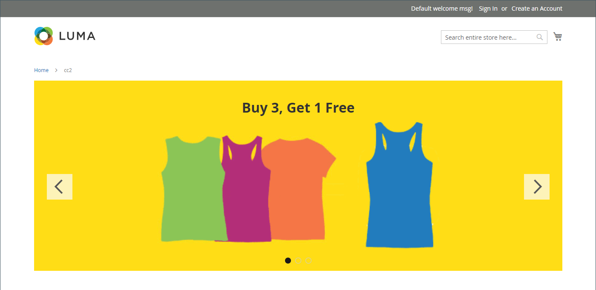
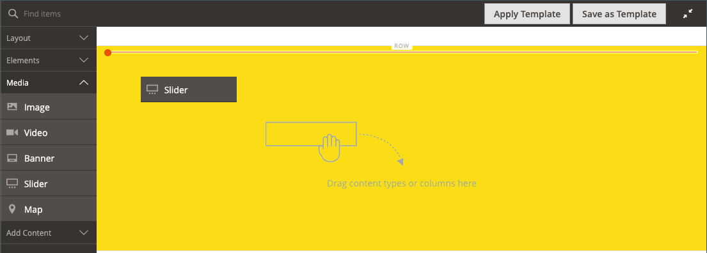
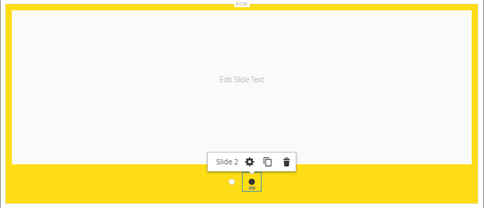
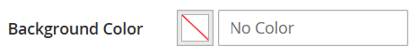

# Média - Curseur

Utilisez le type de contenu _Slider_ pour ajouter un diaporama d’images à la [[!DNL Page Builder] étape](workspace.md#stage). Vous pouvez charger de nouvelles images ou choisir des images existantes dans la galerie ou le catalogue de produits. Un curseur peut être défini pour être lu automatiquement ou être contrôlé manuellement à l’aide des boutons de navigation. Pour associer le curseur à une promotion spécifique, voir [Bloc dynamique](dynamic-block.md).

{width="700" zoomable="yes"}

{{$include /help/_includes/page-builder-save-timeout.md}}

## Boîte à outils

Lorsque vous utilisez le type de contenu Curseur, vous ajoutez et modifiez des diapositives individuelles et le conteneur de curseur qui contient une ou plusieurs diapositives. Chaque diapositive possède sa propre boîte à outils que vous utilisez pour concevoir des diapositives sur la scène [!DNL Page Builder].

## Boîte à outils de diapositives individuelles

{width="500" zoomable="yes"}

| Outil | Icon | Description |
|--- |--- |--- |
| Déplacer | {width="25"} | Déplace la diapositive vers une autre position sur le curseur. |
| (libellé) | Diapositive # | Indique le numéro de la diapositive en cours. |
| Paramètres | {width="25"} | Ouvre la page _[!UICONTROL Edit Slide]_, dans laquelle vous pouvez modifier les propriétés de la diapositive active. |
| Dupliquer | {width="25"} | Effectue une copie de la diapositive active. |
| Supprimer | {width="25"} | Supprime la diapositive active du curseur. |

{style="table-layout:auto"}

## Boîte à outils Curseur

| Outil | Icon | Description |
|--- |--- |--- |
| Déplacer | {width="25"} | Déplace le curseur vers une autre position sur la scène. |
| (libellé) | [!UICONTROL Slider] | Identifie le conteneur de curseur. |
| Paramètres | {width="25"} | Ouvre la page _[!UICONTROL Edit Slider]_, où vous pouvez modifier les propriétés de la vidéo et du conteneur. |
| Masquer | {width="25"} | Masque le curseur actif. |
| Afficher | {width="25"} | Affiche le curseur masqué. |
| Dupliquer | {width="25"} | Effectue une copie du curseur. |
| Supprimer | {width="25"} | Supprime le curseur de la scène. |

{style="table-layout:auto"}

{{$include /help/_includes/page-builder-hidden-element-note.md}}

## Ajouter une diapositive individuelle

1. Ouvrez la page, le bloc ou le bloc dynamique dans lequel vous souhaitez placer le curseur et développer la section **[!UICONTROL Content]**.

1. Dans le panneau [!DNL Page Builder], développez **[!UICONTROL Media]** et faites glisser un espace réservé **[!UICONTROL Slider]** vers une ligne, une colonne ou un onglet de la scène.

   Dans l’exemple suivant, la couleur d’arrière-plan de la ligne est jaune (`#fffd16`).

   {width="600" zoomable="yes"}

   Le conteneur de curseur s’affiche sur la scène avec une seule diapositive vide.

1. Cliquez dans le conteneur de curseurs pour afficher l’[éditeur de texte](../content-design/editor.md) et saisissez le contenu de la première diapositive.

   Vous pouvez également inclure du contenu de bannière plus complexe à l’aide des paramètres [Contenu](#content).

1. Cliquez sur le point de navigation en bas du curseur pour afficher la palette d’outils de la diapositive et sélectionnez l’icône _Paramètres_ ( {width="20"} ).

   Les curseurs comportent deux boîtes à outils. Assurez-vous d&#39;utiliser la boîte à outils de diapositives située dans la partie inférieure.

1. Renseignez les paramètres, selon vos besoins, en fonction des sections suivantes :

   - [[!UICONTROL Appearance]](#appearance)
   - [[!UICONTROL Background]](#background)
   - [[!UICONTROL Content]](#content)
   - [[!UICONTROL Search Engine Optimization]](#seo)
   - [[!UICONTROL Advanced]](#advanced)

1. Une fois l’opération terminée, cliquez sur **[!UICONTROL Save]** pour appliquer les paramètres et revenir à l’espace de travail [!DNL Page Builder].

## Ajouter des diapositives supplémentaires

Les sections suivantes décrivent une série d’étapes pour commencer avec une diapositive individuelle et créer un curseur réactif qui propose des fonctionnalités et des liens vers des produits spécifiques. Si vous ne disposez pas encore d&#39;une diapositive individuelle, suivez les instructions précédentes pour ajouter une diapositive individuelle à la scène.

Pour ajouter des diapositives, utilisez une ou plusieurs des méthodes suivantes :

### Méthode 1 : duplication d’une diapositive existante

Vous pouvez gagner du temps en dupliquant une diapositive déjà configurée avec les paramètres nécessaires.

1. Cliquez sur le point de navigation situé sous la diapositive pour afficher la palette et choisissez l’icône _Dupliquer_ ( {width="20"} ).

   {width="500" zoomable="yes"}

1. Cliquez sur le point de navigation de la nouvelle diapositive et pour afficher la palette d’outils, puis choisissez l’icône _Paramètres_ ( {width="20"} ).

1. Modifiez les paramètres selon vos besoins, conformément aux sections suivantes :

   - [[!UICONTROL Appearance]](#appearance)
   - [[!UICONTROL Background]](#background)
   - [[!UICONTROL Content]](#content)
   - [[!UICONTROL Advanced]](#advanced)

1. Une fois l’opération terminée, cliquez sur **[!UICONTROL Save]** pour appliquer les paramètres et revenir à l’espace de travail [!DNL Page Builder].

### Méthode 2 : ajouter une nouvelle diapositive vierge

1. Pointez sur le conteneur de curseur en haut pour afficher la boîte à outils et choisissez l’icône _Ajouter_ ( {width="20"} ).

   {width="500" zoomable="yes"}

   Une nouvelle diapositive vierge avec son propre point de navigation et sa propre boîte à outils est ajoutée au curseur et affichée sur la scène.

   {width="500" zoomable="yes"}

1. Cliquez sur le point de navigation de la nouvelle diapositive et pour afficher la palette d’outils, puis choisissez l’icône _Paramètres_ ( {width="20"} ).

1. Modifiez les paramètres selon vos besoins, conformément aux sections suivantes :

   - [[!UICONTROL Appearance]](#appearance)
   - [[!UICONTROL Background]](#background)
   - [[!UICONTROL Content]](#content)
   - [[!UICONTROL Advanced]](#advanced)

1. Une fois l’opération terminée, cliquez sur **[!UICONTROL Save]** dans le coin supérieur droit pour fermer la page _[!UICONTROL Edit Slide]_.

### Ajout d’un widget à une diapositive

Vous pouvez ajouter n’importe quel [type de widget](../content-design/widgets.md#widget-types) à votre diapositive au cours d’une étape [!DNL Page Builder] en procédant comme suit :

1. [Créez le widget](../content-design/widget-create.md) que vous souhaitez afficher sur une diapositive.

1. Ouvrez la page, le bloc ou le bloc dynamique dans lequel vous souhaitez placer le curseur et développer la section **[!UICONTROL Content]**.

1. Dans le panneau [!DNL Page Builder], développez **[!UICONTROL Media]** et faites glisser un espace réservé **[!UICONTROL Slider]** vers une ligne, une colonne ou un onglet de la scène.

1. Cliquez dans le conteneur de curseurs pour afficher la barre d’outils [éditeur de texte](../content-design/editor.md), puis cliquez sur l’icône _Insérer un widget_ ( {width="20"} ).

1. Sélectionnez les **[!UICONTROL Widget Type]** dont vous avez besoin.

1. Spécifiez les paramètres, qui sont différents selon le type de widget

   {width="600" zoomable="yes"}

1. Une fois l’opération terminée, cliquez sur **[!UICONTROL Insert Widget]** dans le coin supérieur droit.

1. Modifiez les autres paramètres selon vos besoins.

1. Une fois l’opération terminée, cliquez sur **[!UICONTROL Save]** dans le coin supérieur droit.

   {width="600" zoomable="yes"}

### Afficher chaque diapositive

Pour afficher chaque diapositive sur la scène, cliquez sur le point suivant en dessous de la diapositive actuellement affichée.

{width="500" zoomable="yes"}

La diapositive de l’exemple précédent comporte une image d’arrière-plan, une image mobile transparente et une image intégrée qui a été ajoutée à partir de l’éditeur de texte. Cette technique fonctionne bien sur les appareils mobiles en désactivant l’image d’arrière-plan et en affichant uniquement l’image intégrée plus petite. La diapositive de produit de cet exemple contient les paramètres supplémentaires suivants :

| Option | Exemple de paramètre |
|--- |--- |
| [!UICONTROL Appearance] | `Collage Right` |
| [!UICONTROL Background Color] | `#ffffff` (Blanc) |
| [!UICONTROL Background Image] | L’image de cette diapositive a été enregistrée à partir de la page produit et téléchargée dans la galerie. |
| [!UICONTROL Mobile Background Image] | L’image d’arrière-plan mobile est une image transparente de 10 pixels carrés. L’utilisation d’une image vierge pour les appareils mobiles remplace efficacement l’image d’arrière-plan standard par une image invisible. |
| [!UICONTROL Background Size] | `Auto` |
| [!UICONTROL Message Text] | `Minerva LumaTech&trade; V-Tee` (Aligner au centre) avec l’image insérée mise à l’échelle à 40 % (Aligner au centre) |
| [!UICONTROL Link] | `Product` |
| [!UICONTROL Show Button] | `Always` |
| [!UICONTROL Button Text] | `Buy Now` |
| [!UICONTROL Show Overlay] | `Never Show` |
| [!UICONTROL Alignment] | `Center` (pour aligner le bouton) |
| [!UICONTROL Border] | `Solid` |
| [!UICONTROL Border Color] | `#000000` (Noir) |
| [!UICONTROL Border Width] | `1 px` |

{style="table-layout:auto"}

## Modifier les paramètres de diapositives individuelles

1. Modifiez l’affichage du curseur sur la scène et affichez la diapositive à modifier.

1. Dans la boîte à outils de diapositive individuelle, choisissez l’icône _Paramètres_ ( {width="20"} ) et définissez les paramètres, si nécessaire, en fonction des sections suivantes.

1. Dans le coin supérieur droit, cliquez sur **[!UICONTROL Save]** pour appliquer les paramètres et revenir à l’espace de travail [!DNL Page Builder].

### [!UICONTROL Appearance]

1. Choisissez l&#39;un des types d&#39;emplacement de diapositives suivants :

   | Type | Description |
   | ---- | ----------- |
   | `Poster` | Centre le contenu de la diapositive dans le conteneur du curseur. Le recouvrement, s’il est utilisé, étend toute la largeur du curseur. |
   | `Collage Left` | Place le contenu de la diapositive dans une zone définie sur le côté gauche du conteneur de curseur. S’il est utilisé, le recouvrement ne couvre que la zone définie. |
   | `Collage Center` | Place le contenu de la diapositive dans une zone définie centrée sur le conteneur de curseur. S’il est utilisé, le recouvrement ne couvre que la zone définie. |
   | `Collage Right` | Place le contenu de la diapositive dans une zone définie sur le côté droit du conteneur de curseur. S’il est utilisé, le recouvrement ne couvre que la zone définie. |

   {style="table-layout:auto"}

   {width="600" zoomable="yes"}

1. Saisissez le **[!UICONTROL Slide Name]**.

   Lorsque vous travaillez en mode d’édition, le nom de la diapositive s’affiche sous la forme d’une info-bulle au-dessus du point de navigation. Le nom de la diapositive n’est pas visible depuis le storefront.

   {width="500" zoomable="yes"}

1. Saisissez le **[!UICONTROL Minimum Height]** de la diapositive.

   La hauteur minimale peut être un nombre avec une unité CSS valide (telle que `100px`, `50%`, `50em`, `100vh`) ou un calcul (tel que `100vh - 237px`).

   Par exemple, vous pouvez définir la hauteur minimale de la diapositive pour couvrir toute la hauteur de la page, puis utiliser des images et des vidéos d’arrière-plan pour obtenir des options de conception attrayantes.

   >[!NOTE]
   >
   >Lorsque la diapositive est définie sur la pleine hauteur de la page (100 vh), le curseur qui contient la diapositive étire également la pleine hauteur de la page pour s’adapter à la hauteur de la diapositive.

## [!UICONTROL Background]

Il existe de nombreuses options pour définir l’affichage en arrière-plan d’une diapositive. Vous pouvez appliquer une couleur ou une image d’arrière-plan simple et gérer des effets plus sophistiqués.

### [!UICONTROL Background Color]

Spécifiez la couleur d’arrière-plan en choisissant une nuance, en cliquant sur le sélecteur de couleurs ou en saisissant un nom de couleur valide ou une valeur hexadécimale équivalente. Ce paramètre détermine la couleur d’arrière-plan de la ligne. Vous pouvez également régler l’opacité de la couleur.

{width="200"}

Vous pouvez définir la valeur de l’une des trois façons suivantes :

- Un nom de couleur prédéfini, tel que `White`
- Valeur hexadécimale de la couleur, telle que `#ffffff`
- Valeur rgba de la couleur, avec le pourcentage d’opacité, tel que `rgba(255, 255, 255, 0.75)`

Pour sélectionner une couleur, cliquez sur l’échantillon à gauche de la zone _Aucune couleur_.

{width="600" zoomable="yes"}

Si vous cliquez sur la zone de couleur pour ouvrir à nouveau le sélecteur de couleurs, la zone située sous le curseur affiche les valeurs actuelles rouge, vert, bleu et alpha (rgba). Le dernier nombre indique le pourcentage d’opacité actuel sous la forme d’une décimale. Vous pouvez utiliser le curseur pour ajuster l’opacité ou saisir la valeur décimale souhaitée.

{width="600" zoomable="yes"}

>[!NOTE]
>
>[!DNL Page Builder] prend également en charge un calque de transparence, ou couche _alpha_, dans les images d’arrière-plan qui peuvent être utilisées pour créer des arrière-plans avec différents degrés d’opacité.

### [!UICONTROL Background Type]

Un type d’arrière-plan peut être une image ou une vidéo. [!DNL Page Builder] est défini par défaut sur `Image` et affiche divers paramètres d’image. Si vous sélectionnez `Video`, [!DNL Page Builder] permute les paramètres de l’image avec les paramètres vidéo. Les deux paramètres de type arrière-plan sont décrits dans les sections suivantes.

{width="400"}

### Paramètres de type d’image

Si vous définissez la _[!UICONTROL Background Type]_&#x200B;sur `Image`, utilisez les paramètres suivants pour définir l’affichage de l’image d’arrière-plan.

{width="600" zoomable="yes"}

- **[!UICONTROL Background Image]** - Si nécessaire, utilisez les outils fournis pour choisir une image d’arrière-plan à appliquer à la bannière :

  | Outil | Description |
  | ---- | ----------- |
  | [!UICONTROL Upload] | Télécharge un fichier image de votre ordinateur local dans la galerie, puis l’applique comme image d’arrière-plan pour la bannière. |
  | [!UICONTROL Select from Gallery] | Vous invite à choisir une image existante de la galerie comme image d’arrière-plan pour la bannière. |
  | {width="25"} | Vous permet de faire glisser l’image vers la mosaïque de la caméra ou d’accéder à l’image dans votre système de fichiers local. |

  {style="table-layout:auto"}

- **[!UICONTROL Background Mobile Image]** - Si nécessaire, utilisez les mêmes outils pour choisir une image d’arrière-plan différente à utiliser pour l’affichage sur les appareils mobiles.

- **[!UICONTROL Background Size]** - Choisissez la manière dont l’image d’arrière-plan est mise à l’échelle par rapport à la largeur de la bannière :

  | Option | Description |
  | ------ | ----------- |
  | `Cover` | L’image d’arrière-plan couvre toute la largeur de la bannière. |
  | `Contain` | L’image d’arrière-plan est limitée à la largeur de la zone de contenu. |
  | `Auto` | Applique la taille de la feuille de style active. |

  {style="table-layout:auto"}

  {width="400"}

- **[!UICONTROL Background Position]** - Choisissez la manière dont l’image d’arrière-plan est ancrée par rapport à la bannière :

  | Point d’ancrage | Position |
  | ------------ | -------- |
  | `Top` | Gauche / Centre / Droite |
  | `Center` | Gauche / Centre / Droite |
  | `Bottom` | Gauche / Centre / Droite |

  {style="table-layout:auto"}

  Le point d’ancrage est semblable à une goupille qui attache l’image à la bannière à la position d’arrière-plan spécifiée.

- **[!UICONTROL Background Repeat]** - Si vous souhaitez répéter l’image d’arrière-plan pour remplir l’espace, modifiez `Yes` ce paramètre.

### Paramètres de type vidéo

Si vous définissez le _Type d’arrière-plan_ sur `Video`, utilisez les paramètres suivants pour définir l’affichage de l’image d’arrière-plan.

- **[!UICONTROL Video URL]** - Saisissez une URL de vidéo valide. Les URL de vidéo valides peuvent être des liens vers :

   - Vidéos YouTube : `https://youtu.be/CoDhMRUUjeI`
   - Vidéos Vimeo : `https://vimeo.com/190156113`
   - Fichiers vidéo valides (`.mp4` recommandé) : `https://myvideos.com/spiral.mp4`

  {width="500"}

- **[!UICONTROL Overlay Color]** - Sélectionnez une couleur pour appliquer une teinte transparente à la vidéo.

- **[!UICONTROL Infinite Loop]** - Définissez sur `No` pour que la vidéo soit lue une fois et arrêtée. Lorsque cette option est définie sur `Yes` (par défaut), la vidéo se répète en boucle infinie.

- **[!UICONTROL Lazy Load]** - Définissez sur `No` pour que la vidéo se charge avec la page, même si elle n’est pas visible. Lorsque cette option est définie sur `Yes` (par défaut), la vidéo se charge à partir de la source uniquement lorsqu’elle est visible à l’écran.

- **[!UICONTROL Play Only When Visible]** - Définissez sur `No` pour que la vidéo commence à être lue immédiatement après son chargement, qu’elle soit visible ou non. Lorsque cette option est définie sur `Yes` (par défaut), la vidéo ne commence à être lue que lorsqu’elle est visible.

- **[!UICONTROL Fallback Image]** - Si nécessaire, spécifiez une image à afficher à l’écran avant le chargement de la vidéo et si la vidéo ne se charge pas pour une raison quelconque.

## [!UICONTROL Content]

Vous pouvez modifier le contenu de la diapositive directement sur la scène ou lorsque vous modifiez les paramètres. Les paramètres fournissent des fonctionnalités de contenu plus complexes, telles que des liens de diapositives, des boutons et des superpositions. La position du contenu reflète le paramètre d’emplacement [Apparence](#appearance).

### Contenu simple sur la scène

1. Cliquez sur l’espace réservé ou le texte existant, puis saisissez le nouveau texte à afficher sur la diapositive.

   La barre d’outils de l’éditeur apparaît au-dessus de la zone de texte.

1. Utilisez la barre d’outils de l’éditeur pour saisir et mettre en forme le texte, ainsi que pour insérer des éléments, tels que des liens, des images et des widgets.

   {width="500" zoomable="yes"}

### Contenu complexe dans les paramètres

1. Cliquez sur le point de navigation en bas du curseur pour afficher la palette d’outils de la diapositive et sélectionnez l’icône _Paramètres_ ( {width="20"} ).

1. Dans la section _[!UICONTROL Content]_, saisissez le **[!UICONTROL Message Text]**&#x200B;que vous souhaitez afficher avec la diapositive.

1. Faites défiler jusqu’à la section _[!UICONTROL Content]_&#x200B;et utilisez l’éditeur de **[!UICONTROL Message Text]**&#x200B;pour saisir et mettre en forme le texte de la bannière.

   Vous pouvez également insérer des éléments, tels que des liens de texte, des images et des widgets.

1. Mettez en forme le texte selon les besoins à l’aide de la barre d’outils de l’éditeur.

   La première diapositive de cet exemple comporte une image d’arrière-plan, mais pas de texte de message. Le texte `Buy 3 Get 1 Free` situé au-dessus du curseur se trouve dans un conteneur de texte (ajouté ultérieurement).

1. Si nécessaire, spécifiez un **[!UICONTROL Link]** pour la diapositive.

   Le lien est la page de destination qui s’affiche lorsque le client clique sur la zone de la diapositive. Vous pouvez utiliser l’un des trois types de liens suivants :

   - **[!UICONTROL URL]** - Liens vers une URL relative ou complète.

   - **[!UICONTROL Product]** : identifie la page de destination en fonction du nom du produit ou du SKU. Recherchez le produit par nom en fonction d’un nom partiel ou complet. Choisissez le produit dans la liste des résultats de la recherche.

     {width="600" zoomable="yes"}

   - **[!UICONTROL Category]** - Identifie la page de destination en tant que catégorie ou sous-catégorie spécifique dans l’arborescence des catégories. Recherchez la catégorie en fonction d’un nom partiel ou complet. Sélectionnez la catégorie dans la section développée de l’arborescence affichée.

     {width="600" zoomable="yes"}

   - **[!UICONTROL Page]** - Identifie la page de destination en tant que page de contenu spécifique. Recherchez la page en fonction d’un nom partiel ou complet. Sélectionnez la page dans la liste des résultats de la recherche.

     {width="600" zoomable="yes"}

   

   À compter de la version 2.4.1, [!DNL Page Builder] ne prend plus en charge la liaison de la diapositive et des liens dans le texte imbriqué en raison de problèmes d’affichage sur le storefront. Si vous utilisez un lien dans _[!UICONTROL Message Text]_, vous ne pouvez pas configurer l'option _[!UICONTROL Link]_. Si vous préférez utiliser un seul lien pour l’ensemble de la diapositive, vous pouvez supprimer tous les liens du texte.

   {width="300"}
   

   Si vous souhaitez empêcher le visiteur de quitter votre boutique, cochez la case **[!UICONTROL Open in new tab]** . Lorsque la case à cocher est désactivée, la destination liée s’ouvre dans le même onglet du navigateur, ce qui peut efficacement éloigner le visiteur de votre magasin.

1. Si nécessaire, ajoutez un bouton pour inviter les clients à suivre le lien.

   La position de la diapositive _apparence_ place un seul lien ou bouton sous le texte. Renseignez les propriétés du lien ou du bouton que vous souhaitez ajouter.

   {width="600" zoomable="yes"}

   >[!NOTE]
   >
   >Vous pouvez également utiliser plusieurs boutons ou liens en ajoutant un [bloc](block.md) à la bannière. Pour éviter tout conflit, conservez tous les liens ou boutons dans un bloc distinct et n’ajoutez pas de lien ou de bouton directement à la bannière.

   - Définissez **[!UICONTROL Show Button]** sur l’une des options suivantes :

     | Option | Description |
     | ------ | ----------- |
     | `Always` | Un bouton apparaît toujours sur la diapositive. |
     | `On Hover` | Un bouton s’affiche sur la diapositive uniquement lorsque vous survolez la page. |
     | `Never Show` | Un bouton n’apparaît jamais sur la diapositive. |

     {style="table-layout:auto"}

   - Saisissez le **[!UICONTROL Button Text]** à afficher sur le bouton.

   - Définissez **[!UICONTROL Button Type]** sur l’une des options suivantes :

     | Option | Description |
     | ------ | ----------- |
     | `Primary` | Applique le style du bouton principal à partir de la feuille de style actuelle. |
     | `Secondary` | Applique le style du bouton secondaire de la feuille de style en cours, le cas échéant. |
     | `Link` | Crée un lien hypertexte plutôt qu’un bouton. |

     {style="table-layout:auto"}

     Le style de bouton du thème actuel détermine le format du bouton. En règle générale, un bouton principal a une couleur d’arrière-plan plus proéminente qu’un bouton secondaire.

1. Définissez **[!UICONTROL Show Overlay]** sur l’une des options suivantes :

   | Option | Description |
   | ------ | ----------- |
   | `Always` | Le recouvrement est toujours visible. |
   | `On Hover` | Le recouvrement s’affiche uniquement lorsque vous survolez la zone. |
   | `Never Show` | Le recouvrement n’est pas visible. |

   {style="table-layout:auto"}

   Vous pouvez utiliser une superposition pour appliquer une couleur d’arrière-plan à la zone de contenu active définie par le paramètre Apparence. L’image d’arrière-plan de la diapositive reste visible sur toute la largeur de celle-ci.

   {width="600" zoomable="yes"}

   Si vous choisissez d’afficher une superposition, définissez le **[!UICONTROL Overlay Color]** :

   - Cliquez sur l’échantillon _Aucune couleur_ et choisissez-en un.
   - Dans le champ **[!UICONTROL Color]** , saisissez un nom de couleur valide ou une valeur hexadécimale.

   {width="600" zoomable="yes"}

## [!UICONTROL Search Engine Optimization] {#seo}

Le texte de ces paramètres est visible par les moteurs de recherche et améliore la façon dont la page est indexée.

- Par **[!UICONTROL Alternative Text]**, saisissez une description textuelle _alt_ pour les outils d’accessibilité numérique à afficher.

  L’utilisation de texte secondaire est une bonne pratique en matière d’accessibilité et est requise par la loi dans certains paramètres régionaux. Dans HTML, l’attribut `alt` est un sous-ensemble de la balise `image` : `<image title="tooltip" alt="description" src="image.jpg">`.

- Par **[!UICONTROL Title Attribute]**, saisissez le texte à afficher sous forme d’info-bulle lorsque vous pointez dessus.

  Il est recommandé de choisir un titre descriptif et riche en mots-clés pour améliorer la manière dont l’image est indexée par les moteurs de recherche. Dans HTML, l’attribut `title` est un sous-ensemble de la balise `image` : `<image title="tooltip" alt="description" src="image.jpg">`.

## [!UICONTROL Advanced]

1. Pour contrôler le positionnement horizontal du contenu ajouté à la diapositive, choisissez l’**[!UICONTROL Alignment]** :

   | Option | Description |
   | ------ | ----------- |
   | `Default` | Applique le paramètre d’alignement par défaut spécifié dans la feuille de style du thème actif. |
   | `Left` | Aligne le contenu le long de la bordure gauche de la diapositive en tenant compte de la marge intérieure spécifiée. |
   | `Center` | Aligne le contenu au centre de la diapositive en tenant compte de la marge intérieure spécifiée. |
   | `Right` | Aligne le contenu le long de la bordure droite de la diapositive en tenant compte de la marge intérieure spécifiée. |

   {style="table-layout:auto"}

1. Définissez le style de **[!UICONTROL Border]** appliqué aux quatre côtés de la diapositive :

   | Option | Description |
   | ------ | ----------- |
   | `Default` | Applique le style de bordure par défaut spécifié par la feuille de style associée. |
   | `None` | Ne fournit aucune indication visible des bordures des diapositives. |
   | `Dotted` | La bordure du conteneur s’affiche sous la forme d’une ligne pointillée. |
   | `Dashed` | La bordure du conteneur s’affiche sous la forme d’une ligne en tirets. |
   | `Solid` | La bordure du conteneur s’affiche sous la forme d’une ligne continue. |
   | `Double` | La bordure du conteneur s’affiche sous la forme d’une ligne double. |
   | `Groove` | La bordure du conteneur s’affiche sous la forme d’une ligne rainurée. |
   | `Ridge` | La bordure du conteneur s’affiche sous la forme d’une ligne crantée. |
   | `Inset` | La bordure du conteneur s’affiche sous la forme d’une ligne insérée. |
   | `Outset` | La bordure du conteneur s’affiche sous la forme d’une ligne de départ. |

   {style="table-layout:auto"}

1. Si vous définissez un style de bordure autre que `None`, renseignez les options d’affichage des bordures :

   {width="600" zoomable="yes"}

   | Option | Description |
   | ------ |------------ |
   | [!UICONTROL Border Color] | Spécifiez la couleur en choisissant une nuance, en cliquant sur le sélecteur de couleurs ou en saisissant un nom de couleur valide ou une valeur hexadécimale équivalente. |
   | [!UICONTROL Border Width] | Saisissez le nombre de pixels pour la largeur de la ligne de bordure. |
   | [!UICONTROL Border Radius] | Saisissez le nombre de pixels pour définir la taille du rayon utilisé pour arrondir chaque coin de la bordure. |

   {style="table-layout:auto"}

1. (Facultatif) Spécifiez les noms des **[!UICONTROL CSS classes]** de la feuille de style active à appliquer à la diapositive.

   Séparez plusieurs noms de classe par un espace.

1. Saisissez les valeurs, en pixels, du **[!UICONTROL Margins and Padding]** pour spécifier les marges extérieures et la marge intérieure de la diapositive.

   Saisissez chaque valeur correspondante dans le diagramme de diapositives.

   | Zone conteneur | Description |
   | -------------- | ----------- |
   | [!UICONTROL Margins] | Quantité d&#39;espace vierge appliquée au bord extérieur de tous les côtés de la diapositive. |
   | [!UICONTROL Padding] | Quantité d&#39;espace vierge appliquée au bord intérieur de tous les côtés de la diapositive. |

   {style="table-layout:auto"}

## Ajouter un titre de curseur

Si vous souhaitez placer un titre au-dessus du curseur, ajoutez simplement un [type de contenu Texte] au-dessus du curseur. Mettez ensuite le texte en forme selon vos besoins.

1. Dans le panneau [!DNL Page Builder], développez **[!UICONTROL Elements]** et faites glisser un espace réservé **Texte** vers une ligne, une colonne ou un ensemble d’onglets sur la scène.

   Au fur et à mesure que vous faites glisser le curseur, une ligne de repère rouge marque le point d&#39;insertion.

   {width="600" zoomable="yes"}

1. Utilisez l’éditeur pour mettre le texte en forme selon vos besoins.

   {width="500" zoomable="yes"}

## Modifier les paramètres du curseur

1. Pointez sur le conteneur de curseurs pour afficher la boîte à outils principale, puis sélectionnez l’icône _Paramètres_ ( {width="20"} ).

   {width="500" zoomable="yes"}

1. Saisissez le **[!UICONTROL Minimum Height]** de la diapositive.

   La hauteur minimale peut être un nombre avec une unité CSS valide (telle que `100px`, `50%`, `50em`, `100vh`) ou un calcul (tel que `100vh - 237px`).

   Par exemple, vous pouvez définir la hauteur minimale d’un curseur pour étirer toute la hauteur de la page, ce qui vous offre des options attrayantes pour les images et vidéos d’arrière-plan de toute la page.

   {width="400"}

1. Si vous souhaitez que le curseur commence au chargement de la page, définissez **[!UICONTROL Autoplay]** sur `Yes` et définissez **[!UICONTROL Autoplay Speed]** sur le nombre de millisecondes écoulées entre les diapositives.

   Par défaut, la vitesse est définie sur 4 000 ms, soit quatre secondes. Si vous définissez la lecture automatique sur `No`, la première diapositive s’affiche par défaut et le client doit cliquer sur le volet de navigation de la diapositive (points ou flèches) pour afficher la diapositive suivante dans l’ordre.

   {width="600" zoomable="yes"}

1. Pour lisser la transition d’une diapositive à la suivante, définissez **[!UICONTROL Fade]** sur `Yes`.

   Avec le fondu, les diapositives semblent rester en place, mais le contenu change en douceur de l&#39;une à l&#39;autre. Sans fondu, vous pouvez voir le mouvement horizontal d&#39;une diapositive à l&#39;autre.

   {width="600" zoomable="yes"}

1. Pour que le diaporama se répète indéfiniment lorsque la page est ouverte, **[!UICONTROL Infinite Loop]** sur `Yes`.

1. Pour choisir le type de commandes de navigation pour le curseur, procédez comme suit :

   - Pour inclure les flèches _Suivant_ et _Précédent_ sur les côtés gauche et droit de chaque diapositive, définissez **[!UICONTROL Show Arrows]** sur `Yes`.

   - Pour inclure un ensemble de points de navigation sous le curseur, définissez **[!UICONTROL Show Dots]** sur `Yes`.

   {width="600" zoomable="yes"}

1. Renseignez les paramètres du curseur [Avancé](#slider-advanced) selon vos besoins.

1. Une fois l’opération terminée, cliquez sur **[!UICONTROL Save]** pour appliquer les paramètres et revenir à l’espace de travail [!DNL Page Builder].

### Avancé - curseur {#slider-advanced}

1. Pour contrôler le positionnement des diapositives dans le conteneur de curseur parent, choisissez l’**[!UICONTROL Alignment]** :

   | Option | Description |
   | ------ | ----------- |
   | `Default` | Applique le paramètre d’alignement par défaut spécifié dans la feuille de style du thème actif. |
   | `Left` | Aligne les diapositives le long de la bordure gauche du conteneur de curseur, en tenant compte de la marge intérieure spécifiée. |
   | `Center` | Aligne les diapositives au centre du conteneur de curseur, en tenant compte de la marge intérieure spécifiée. |
   | `Right` | Aligne les diapositives le long de la bordure droite du conteneur de curseur, en tenant compte de la marge intérieure spécifiée. |

   {style="table-layout:auto"}

1. Définissez le style de **[!UICONTROL Border]** appliqué aux quatre côtés du conteneur de curseur :

   | Option | Description |
   | ------ | ----------- |
   | `Default` | Applique le style de bordure par défaut spécifié par la feuille de style associée. |
   | `None` | Ne fournit aucune indication visible des bordures du conteneur. |
   | `Dotted` | La bordure du conteneur s’affiche sous la forme d’une ligne pointillée. |
   | `Dashed` | La bordure du conteneur s’affiche sous la forme d’une ligne en tirets. |
   | `Solid` | La bordure du conteneur s’affiche sous la forme d’une ligne continue. |
   | `Double` | La bordure du conteneur s’affiche sous la forme d’une ligne double. |
   | `Groove` | La bordure du conteneur s’affiche sous la forme d’une ligne rainurée. |
   | `Ridge` | La bordure du conteneur s’affiche sous la forme d’une ligne crantée. |
   | `Inset` | La bordure du conteneur s’affiche sous la forme d’une ligne insérée. |
   | `Outset` | La bordure du conteneur s’affiche sous la forme d’une ligne de départ. |

   {style="table-layout:auto"}

1. Si vous définissez un style de bordure autre que `None`, renseignez les options d’affichage des bordures :

   | Option | Description |
   | ------ |------------ |
   | [!UICONTROL Border Color] | Spécifiez la couleur en choisissant une nuance, en cliquant sur le sélecteur de couleurs ou en saisissant un nom de couleur valide ou une valeur hexadécimale équivalente. |
   | [!UICONTROL Border Width] | Saisissez le nombre de pixels pour la largeur de la ligne de bordure. |
   | [!UICONTROL Border Radius] | Saisissez le nombre de pixels pour définir la taille du rayon utilisé pour arrondir chaque coin de la bordure. |

   {style="table-layout:auto"}

1. (Facultatif) Spécifiez les noms des **[!UICONTROL CSS classes]** de la feuille de style actuelle à appliquer au conteneur de curseur.

   Séparez plusieurs noms de classe par un espace.

1. Saisissez les valeurs, en pixels, du **[!UICONTROL Margins and Padding]** pour déterminer les marges extérieures et la marge intérieure du conteneur du curseur.

   Saisissez les valeurs correspondantes dans le diagramme.

   | Zone conteneur | Description |
   | -------------- | ----------- |
   | [!UICONTROL Margins] | Quantité d’espace vide appliqué au bord extérieur de tous les côtés du conteneur. |
   | [!UICONTROL Padding] | Quantité d’espace vide appliqué au bord intérieur de tous les côtés du conteneur. |

   {style="table-layout:auto"}

## Tester le curseur

1. Ouvrez la page sur laquelle vous avez inclus le curseur, puis définissez **[!UICONTROL Enable Page]** sur `Yes`.

1. Dans le coin supérieur droit, cliquez sur la flèche **[!UICONTROL Save]** et choisissez **[!UICONTROL Save & Close]**.

1. Recherchez la page dans la grille _Pages_ et sélectionnez **[!UICONTROL View]** dans la colonne _[!UICONTROL Action]_.

   {width="600" zoomable="yes"}

   Lorsque vous prévisualisez le curseur, redimensionnez la fenêtre pour voir son aspect sur un appareil mobile.

   {width="400" zoomable="yes"}

<!-- Last updated from includes: 2023-09-11 14:30:19 -->
