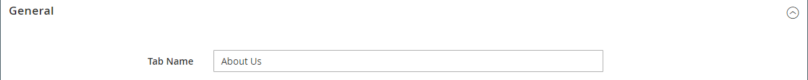
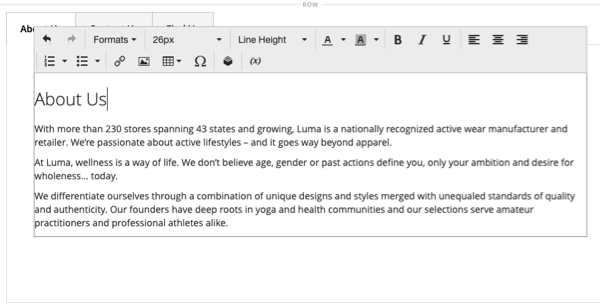

# Disposition - Onglets

Utilisez le type de contenu _Onglets_ pour ajouter un ensemble d’onglets dans l’ [[!DNL Page Builder] étape](workspace.md#stage). Lorsque vous faites glisser l’espace réservé Onglets du panneau vers la scène, un seul onglet par défaut s’affiche initialement. Vous pouvez ajouter d’autres onglets pour créer un ensemble complet. La largeur de l’ensemble de tabulations est déterminée par la largeur de son conteneur parent et par les paramètres de remplissage.

{width="500" zoomable="yes"}

{{$include /help/_includes/page-builder-save-timeout.md}}

## Toolbox

Lorsque vous travaillez avec le type de contenu _Onglets_, vous ajoutez et modifiez des onglets individuels et le conteneur d’onglets qui contient un ou plusieurs onglets. Chaque onglet possède sa propre boîte à outils que vous utilisez pour concevoir des onglets sur l’étape [!DNL Page Builder].

### Boîte à outils à onglets individuelle

{width="500" zoomable="yes"}

| Outil | Icône | Description |
|--- |--- |--- |
| Déplacer | {width="25"} | Ce contrôle en regard du libellé de l’onglet permet de déplacer l’onglet individuel vers un autre emplacement du jeu d’onglets. |
| Paramètres | {width="25"} | Ouvre la page Modifier les onglets, dans laquelle vous pouvez modifier les propriétés de chaque onglet. |
| Dupliquer | {width="25"} | Effectue une copie de l’onglet. |
| Supprimer | {width="25"} | Supprime l’onglet du jeu d’onglets. |

{style="table-layout:auto"}

### Boîte à outils du conteneur d’onglets

{width="500" zoomable="yes"}

| Outil | Icône | Description |
|--- |--- |--- |
| Déplacer | {width="25"} | Déplace l’ensemble d’onglets vers une autre position sur la grille dans le conteneur parent. |
| Ajouter | {width="25"} | Ajoute un onglet au jeu de tabulations. |
| (label) | [!UICONTROL Tabs] | Identifie le conteneur actuel en tant que jeu d’onglets. Passez la souris sur la bordure supérieure du conteneur pour afficher la boîte à outils. |
| Paramètres | {width="25"} | Ouvre la page Modifier l’onglet dans laquelle vous pouvez modifier les propriétés du conteneur. |
| Masquer | {width="25"} | Masque le conteneur d’onglets. |
| Afficher | {width="25"} | Affiche le conteneur d’onglets masqué. |
| Dupliquer | {width="25"} | Effectue une copie de l’onglet actif. |
| Supprimer | {width="25"} | Supprime le jeu d’onglets actif de la scène. |

{style="table-layout:auto"}

{{$include /help/_includes/page-builder-hidden-element-note.md}}

## Ajouter un onglet individuel

1. Dans le panneau [!DNL Page Builder] sous _[!UICONTROL Layout]_, faites glisser l’espace réservé&#x200B;**[!UICONTROL Tabs]**&#x200B;directement sur l’étape ou sur une ligne ou une colonne sur l’étape.

   {width="600" zoomable="yes"}

1. Cliquez sur le libellé **[!UICONTROL Tab 1]** pour afficher la boîte à outils à onglets individuelle et sélectionnez l’icône _Paramètres_ ( {width="20"} ).

1. Saisissez le **[!UICONTROL Tab Name]** que vous souhaitez utiliser comme libellé.

   {width="600" zoomable="yes"}

1. Si nécessaire, saisissez le **[!UICONTROL Minimum Height]** de l’onglet .

   Cette valeur peut être un nombre avec n’importe quelle unité CSS valide (telle que `100px`, `50%`, `50em`, `100vh`) ou un calcul (telle que `100vh - 237px`).

1. Choisissez un paramètre **[!UICONTROL Vertical Alignment]** pour aligner les conteneurs de contenu ajoutés à l’onglet (Haut, Centre ou Bas).

1. Si nécessaire, définissez les autres options à l’aide des sections suivantes :

   - [[!UICONTROL Background]][background]
   - [[!UICONTROL Advanced]][advanced]

1. Dans le coin supérieur droit, cliquez sur **[!UICONTROL Save]** pour appliquer les paramètres et revenir à l’espace de travail [!DNL Page Builder].

## Ajouter un ensemble d’onglets

Les étapes suivantes commencent par un onglet individuel et créent un ensemble de trois onglets dans un conteneur d’onglets. Si vous ne disposez pas d’un onglet individuel, suivez les instructions précédentes pour ajouter un seul onglet à l’étape.

1. Passez la souris sur le conteneur d’onglets pour afficher la boîte à outils et sélectionnez l’icône _Ajouter_ ( {width="20"} ).

1. Cliquez dans le libellé **[!UICONTROL Tab 2]** pour afficher le curseur et saisissez votre propre libellé pour l’onglet.

1. Cliquez à nouveau sur le deuxième onglet de l’étape et sélectionnez l’icône _Dupliquer_ ( {width="20"} ).

1. Cliquez sur le libellé YourName **[!UICONTROL Copy]** pour afficher le curseur et saisir votre propre libellé pour le troisième onglet.

{width="600" zoomable="yes"}

## Déplacer un onglet dans la visionneuse

1. Cliquez sur l’onglet que vous souhaitez déplacer.

1. Sélectionnez l’icône _Déplacer_ ( {width="20"} ), qui s’affiche juste avant le texte de l’étiquette de l’onglet, et faites-la glisser vers un nouvel emplacement dans l’ensemble d’onglets.

## Ajouter du contenu à un onglet

Vous pouvez n’importe quel type de contenu à un onglet comme vous pouvez à une ligne. Pour ajouter un type de contenu de texte, procédez comme suit.

1. Cliquez sur l’onglet dans lequel vous souhaitez ajouter le contenu.

1. Dans le panneau [!DNL Page Builder], développez **[!UICONTROL Elements]** et faites glisser un espace réservé **Texte** vers l’onglet.

1. Entrez ou collez du texte dans l’éditeur et utilisez la barre d’outils de l’éditeur pour le mettre en forme selon vos besoins.

   Voir [Eléments - Texte](text.md) pour plus d’informations sur l’utilisation du type de contenu textuel.

   {width="500" zoomable="yes"}

1. Dans le coin supérieur droit, cliquez sur **[!UICONTROL Save]**.

## Modification des paramètres des onglets individuels

1. Passez la souris sur un onglet pour afficher la boîte à outils et sélectionnez l’icône _Paramètres_ ( {width="20"} ).

1. Si nécessaire, modifiez l’un des paramètres de base de l’onglet :

   - **[!UICONTROL Tab Name]** - Entrez le texte révisé du libellé de l’onglet. Vous pouvez également modifier le libellé directement sur la scène.

   - **[!UICONTROL Minimum Height]** - Saisissez comme pixels si vous souhaitez remplacer la hauteur automatique. Par exemple, vous pouvez définir la hauteur minimale pour qu’elle corresponde à la hauteur d’une image d’arrière-plan afin de vous assurer que l’image complète est visible.

   - **[!UICONTROL Vertical Alignment]** - Sélectionnez la position verticale des conteneurs de contenu qui sont ajoutés à l’onglet.

1. Modifiez les autres paramètres selon les besoins à l’aide des sections suivantes pour plus de détails.

1. Une fois l’opération terminée, cliquez sur **[!UICONTROL Save]** pour appliquer les paramètres et revenir à l’espace de travail [!DNL Page Builder].

### Contexte

- **[!UICONTROL Background Color]** - Définissez la couleur d’arrière-plan en choisissant un échantillon, en cliquant sur le sélecteur de couleurs ou en saisissant un nom de couleur valide ou une valeur hexadécimale équivalente. Ce paramètre détermine la couleur d’arrière-plan de la ligne. Vous pouvez également régler l’opacité de la couleur.

  {width="200"}

  Vous pouvez saisir une valeur de trois manières différentes :

   - Un nom de couleur prédéfini, tel que `White`

   - La valeur de couleur hexadécimale de la couleur, par exemple `#ffffff`

   - La valeur rgba de la couleur, avec le pourcentage d’opacité, comme `rgba(255, 255, 255, 0.75)`

  Si vous souhaitez choisir une couleur, cliquez sur l’échantillon à gauche de la zone _Aucune couleur_.

  {width="600" zoomable="yes"}

  Si vous cliquez sur la zone de couleur pour ouvrir à nouveau le sélecteur de couleurs, la zone située sous le curseur affiche les valeurs actuelles rouge, vert, bleu et alpha (rgba). Le dernier chiffre indique le pourcentage d’opacité actuel sous forme décimale. Vous pouvez utiliser le curseur pour ajuster l’opacité ou saisir la valeur décimale souhaitée.

  {width="600" zoomable="yes"}

  >[!NOTE]
  >
  >[!DNL Page Builder] prend également en charge une couche de transparence, ou _couche alpha_, dans les images d’arrière-plan qui peuvent être utilisées pour créer des arrière-plans avec différents degrés d’opacité.

- **[!UICONTROL Background Image]** - Si nécessaire, utilisez les outils fournis pour choisir une image d’arrière-plan à appliquer à l’onglet :

  | Outil | Description |
  |--- |--- |
  | [!UICONTROL Upload] | Télécharge un fichier image de l’ordinateur local vers la galerie, puis l’applique comme image d’arrière-plan de l’onglet. |
  | [!UICONTROL Select from Gallery] | Vous invite à choisir une image existante de la galerie comme image d’arrière-plan de l’onglet. |
  | {width="25"} | Permet de faire glisser l’image sur la mosaïque de l’appareil photo ou de naviguer jusqu’à l’image dans votre système de fichiers local. |

  {style="table-layout:auto"}

- **[!UICONTROL Background Mobile Image]** - Si nécessaire, utilisez les mêmes outils pour choisir une image d’arrière-plan différente à utiliser pour l’affichage sur les appareils mobiles.

- **[!UICONTROL Background Size]** - Choisissez la mise à l’échelle de l’image d’arrière-plan par rapport à la largeur de l’onglet :

  | Option | Description |
  |--- |--- |
  | `Cover` | L’image d’arrière-plan couvre toute la largeur de l’onglet. |
  | `Contain` | L’image d’arrière-plan est limitée à la largeur de la zone de tabulation. |
  | `Auto` | Applique la taille de la feuille de style actuelle. |

  {style="table-layout:auto"}

- **[!UICONTROL Background Position]** - Choisissez la manière dont l’image d’arrière-plan est ancrée par rapport à l’onglet : `Top Left` / `Top Center` / `Top Right` / `Center Left` / `Center` / `Center Right` / `Bottom Left` / `Bottom Center` / `Bottom Right`

- **[!UICONTROL Background Attachment]** - Sélectionnez le type de pièce jointe pour déterminer le déplacement de l’image d’arrière-plan par rapport à la page de défilement :

  | Option | Description |
  | --- | --- |
  | `Scroll` | L’image d’arrière-plan jointe est synchronisée pour se déplacer vers le bas au fur et à mesure que la page fait défiler. |
  | `Fixed` | (Non disponible pour les appareils mobiles) L’image d’arrière-plan ne se déplace pas lorsque le conteneur fait défiler l’image et est fixe à la position d’arrière-plan spécifiée. |

  {style="table-layout:auto"}

- **[!UICONTROL Background Repeat]** - Défini sur `Yes` pour répéter l’image d’arrière-plan afin de remplir l’espace disponible dans l’onglet.

### Avancé

- Pour contrôler l’alignement horizontal des conteneurs de contenu qui sont ajoutés à l’onglet, choisissez un **[!UICONTROL Alignment]** .

  | Option | Description |
  | --- | --- |
  | `Default` | Applique le paramètre d’alignement par défaut spécifié dans la feuille de style du thème actif. |
  | `Left` | Aligne les conteneurs de contenu le long de la bordure gauche de l’onglet, en tenant compte de toute marge intérieure spécifiée. |
  | `Center` | Aligne le conteneur de contenu au centre de l’onglet, en tenant compte de toute marge intérieure spécifiée. |
  | `Right` | Aligne le conteneur de contenu le long de la bordure droite de l’onglet, en tenant compte de toute marge intérieure spécifiée. |

  {style="table-layout:auto"}

- Définissez le style **[!UICONTROL Border]** appliqué aux quatre côtés du conteneur d’onglets :

  | Option | Description |
  | --- | --- |
  | `Default` | Applique le style de bordure par défaut spécifié par la feuille de style associée. |
  | `None` | Ne fournit aucune indication visible des bordures du conteneur. |
  | `Dotted` | La bordure du conteneur s’affiche sous la forme d’une ligne pointillée. |
  | `Dashed` | La bordure du conteneur s’affiche sous la forme d’une ligne en pointillés. |
  | `Solid` | La bordure du conteneur s’affiche sous la forme d’une ligne pleine. |
  | `Double` | La bordure du conteneur s’affiche sous la forme d’une ligne double. |
  | `Groove` | La bordure du conteneur s’affiche sous forme de ligne droite. |
  | `Ridge` | La bordure du conteneur s’affiche sous la forme d’une ligne à droite. |
  | `Inset` | La bordure du conteneur s’affiche sous la forme d’une ligne d’insertion. |
  | `Outset` | La bordure du conteneur apparaît comme une ligne de départ. |

  {style="table-layout:auto"}

- Si vous définissez un style de bordure autre que `None`, renseignez les options d’affichage de la bordure :

  {width="600" zoomable="yes"}

  | Option | Description |
  | ------ |------------ |
  | [!UICONTROL Border Color] | Définissez la couleur en choisissant un échantillon, en cliquant sur le sélecteur de couleurs ou en saisissant un nom de couleur valide ou une valeur hexadécimale équivalente. |
  | [!UICONTROL Border Width] | Saisissez le nombre de pixels pour la largeur de la ligne de bordure. |
  | [!UICONTROL Border Radius] | Saisissez le nombre de pixels pour définir la taille du rayon utilisé pour arrondir chaque coin de la bordure. |

  {style="table-layout:auto"}

  La ligne de l’exemple suivant a un rayon de bordure de 15.

  {width="500"}

- (Facultatif) Indiquez les noms de **[!UICONTROL CSS classes]** dans la feuille de style actuelle à appliquer au conteneur de colonnes.

  Séparez plusieurs noms de classe par un espace.

- Saisissez des valeurs, en pixels, pour que **[!UICONTROL Margins and Padding]** spécifient les marges extérieures et la marge intérieure de la colonne.

  Saisissez chaque valeur correspondante dans le diagramme de conteneur d’onglets.

  | Zone de conteneur | Description |
  | -------------- | ---------- |
  | [!UICONTROL Margins] | Espace vide appliqué au bord extérieur de tous les côtés du conteneur. Options : `Top` / `Right` / `Bottom` / `Left` |
  | [!UICONTROL Padding] | Espace blanc appliqué au bord intérieur de tous les côtés du conteneur. Options : `Top` / `Right` / `Bottom` / `Left` |

  {style="table-layout:auto"}

## Modification des paramètres du jeu de onglets

1. Passez la souris sur la bordure supérieure du conteneur d’ensemble d’onglets pour afficher la boîte à outils et sélectionnez l’icône _Paramètres_ ( {width="20"} ).

1. Si nécessaire, modifiez le **[!UICONTROL Default Active Tab]**.

   Sélectionnez l’onglet de l’ensemble que vous souhaitez activer au chargement de la page.

1. Saisissez le **[!UICONTROL Minimum Height]**, en pixels, si vous souhaitez remplacer la hauteur automatique pour le jeu de tabulations.

1. Pour positionner les onglets de navigation le long de la partie supérieure de l’ensemble d’onglets, choisissez **[!UICONTROL Tab Navigation Alignment]** (`Left`, `Center` ou `Right`).

   {width="500" zoomable="yes"}

1. Définissez les Options avancées du jeu d’onglets :

   - Pour contrôler le positionnement de l’ensemble d’onglets dans le conteneur parent, choisissez un **[!UICONTROL Alignment]** :

     | Option | Description |
     | ------ | ---------- |
     | `Default` | Applique le paramètre d’alignement par défaut spécifié dans la feuille de style du thème actif. |
     | `Left` | Aligne le jeu d’onglets le long de la bordure gauche du conteneur parent, en tenant compte de toute marge intérieure spécifiée. |
     | `Center` | Aligne le jeu de tabulations au centre du conteneur parent, en tenant compte de toute marge intérieure spécifiée. |
     | `Right` | Aligne le jeu d’onglets le long de la bordure droite du conteneur parent, en tenant compte de toute marge intérieure spécifiée. |

     {style="table-layout:auto"}

   - Définissez le style **[!UICONTROL Border]** appliqué aux quatre côtés du conteneur d’onglets :

     | Option | Description |
     | ------ | ---------- |
     | `Default` | Applique le style de bordure par défaut spécifié par la feuille de style associée. |
     | `None` | Ne fournit aucune indication visible des bordures du conteneur. |
     | `Dotted` | La bordure du conteneur s’affiche sous la forme d’une ligne pointillée. |
     | `Dashed` | La bordure du conteneur s’affiche sous la forme d’une ligne en pointillés. |
     | `Solid` | La bordure du conteneur s’affiche sous la forme d’une ligne pleine. |
     | `Double` | La bordure du conteneur s’affiche sous la forme d’une ligne double. |
     | `Groove` | La bordure du conteneur s’affiche sous forme de ligne droite. |
     | `Ridge` | La bordure du conteneur s’affiche sous la forme d’une ligne à droite. |
     | `Inset` | La bordure du conteneur s’affiche sous la forme d’une ligne d’insertion. |
     | `Outset` | La bordure du conteneur apparaît comme une ligne de départ. |

     {style="table-layout:auto"}

   - Si vous définissez un style de bordure autre que `None`, renseignez les options d’affichage de la bordure :

     | Option | Description |
     | ------ |------------ |
     | [!UICONTROL Border Color] | Définissez la couleur en choisissant un échantillon, en cliquant sur le sélecteur de couleurs ou en saisissant un nom de couleur valide ou une valeur hexadécimale équivalente. |
     | [!UICONTROL Border Width] | Saisissez le nombre de pixels pour la largeur de la ligne de bordure. |
     | [!UICONTROL Border Radius] | Saisissez le nombre de pixels pour définir la taille du rayon utilisé pour arrondir chaque coin de la bordure. |

     {style="table-layout:auto"}

   - (Facultatif) Indiquez les noms de **[!UICONTROL CSS classes]** de la feuille de style actuelle à appliquer au conteneur d’onglets.

     Séparez plusieurs noms de classe par un espace.

   - Saisissez des valeurs, en pixels, pour le **[!UICONTROL Margins and Padding]** afin de déterminer les marges extérieures et la marge intérieure du conteneur d’onglets.

     Saisissez les valeurs correspondantes dans le diagramme de conteneur des onglets.

     | Zone de conteneur | Description |
     | -------------- | ---------- |
     | [!UICONTROL Margins] | Espace vide appliqué au bord extérieur de tous les côtés du conteneur. Options : `Top` / `Right` / `Bottom` / `Left` |
     | [!UICONTROL Padding] | Espace blanc appliqué au bord intérieur de tous les côtés du conteneur. Options : `Top` / `Right` / `Bottom` / `Left` |

     {style="table-layout:auto"}

1. Une fois l’opération terminée, cliquez sur **[!UICONTROL Save]** pour appliquer les paramètres et revenir à l’espace de travail [!DNL Page Builder].

[background]: #background
[advanced]: #advanced
