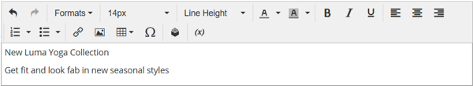

# Éléments - Texte

Utilisez le type de contenu _Texte_ pour ajouter un conteneur de texte avec un éditeur WYSIWYG (« What You See Is What You Get ») dans l’[[!DNL Page Builder] étape](workspace.md#stage). En outre, vous pouvez ajouter au texte des liens, des images, des [variables](../systems/variables-predefined.md) et des widgets à partir de la barre d’outils de l’éditeur.

{width="700"}

{{$include /help/_includes/page-builder-save-timeout.md}}

## Outils de l’éditeur de texte

Vous pouvez accéder à l’éditeur de texte directement depuis l’étape ou à partir d’une page de paramètres. Les modifications apportées directement à l’étape sont enregistrées automatiquement. Pour plus d’informations, voir [ Utilisation de l’éditeur ](../content-design/editor.md).

{width="600"}

## Boîte à outils Conteneur de texte

{width="600"}

| Outil | Icon | Description |
| --------- | --------------------- | -------------- |
| Déplacer | {width="25"} | Déplace le conteneur de texte vers un autre emplacement valide de la page. |
| (libellé) | TEXTE | Identifie le conteneur courant comme un élément texte. |
| Paramètres | {width="25"} | Ouvre les propriétés du conteneur de texte en mode d’édition. |
| Masquer | {width="25"} | Masque le conteneur de texte. |
| Afficher | {width="25"} | Affiche le conteneur de texte masqué. |
| Dupliquer | {width="25"} | Crée une copie du conteneur de texte. |
| Supprimer | {width="25"} | Supprime le conteneur de texte et son contenu de l’étape. |

{style="table-layout:auto"}

{{$include /help/_includes/page-builder-hidden-element-note.md}}

## Ajouter du texte

1. Dans le panneau [!DNL Page Builder], développez **[!UICONTROL Elements]** et faites glisser un espace réservé **[!UICONTROL Text]** vers une ligne, une colonne ou un ensemble d’onglets sur la scène.

   {width="600" zoomable="yes"}

1. Utilisez l’éditeur pour saisir et mettre en forme le texte, si nécessaire.

   Pour plus d’informations, voir [ Utilisation de l’éditeur ](../content-design/editor.md).

   {width="600"}

## Créer un lien

Le bouton Insérer un lien dans l’éditeur facilite l’ajout d’un lien hypertexte à une image dans la galerie. Cependant, elle peut également être utilisée pour créer un lien intégré dans le texte, si vous disposez de l’URL à l’avance. Contrairement au bouton Widget, le bouton Insérer/Modifier le lien n’est pas intégré aux pages, produits ou catégories de la boutique.

Pour créer un lien vers un numéro de téléphone ou un e-mail, voir [Ajout de variables personnalisées](../systems/variables-custom.md).

1. Dans le storefront, accédez à la page qui doit être la destination cible du lien et copiez les informations du lien.

   Vous pouvez utiliser l’URL complète ou une URL relative qui omet la référence à votre domaine de boutique.

   URL complète - `https://mystore.com/women/tops-women/tees-women.html`

   URL relative - `../women/tops-women/tees-women.html`

1. Sélectionnez le texte dans l’espace de l’éditeur et cliquez sur _Insérer/modifier le lien_ ( {width="20"} ) dans la barre d’outils de l’éditeur.

   {width="500" zoomable="yes"}

1. Par **[!UICONTROL URL]**, saisissez le lien relatif que vous avez préparé.

1. Définissez **[!UICONTROL Target]** sur `None`.

   Ce paramètre ouvre la page dans la même fenêtre du navigateur, plutôt que d’ouvrir un nouvel onglet.

1. Par **[!UICONTROL Title]**, saisissez `Shop Tees`.

   L’attribut de lien `Title` est utilisé par certains navigateurs comme une info-bulle.

1. Pour enregistrer le lien et revenir à l’espace de travail [!DNL Page Builder], cliquez sur **[!UICONTROL OK]**.

   {width="500" zoomable="yes"}

## Insérer une image

1. Placez le curseur dans le texte à l&#39;endroit où vous souhaitez insérer l&#39;image.

1. Cliquez sur _Insérer/modifier l’image_ ( {width="20"} ) dans la barre d’outils de l’éditeur.

1. Par **[!UICONTROL Source]**, cliquez sur l’icône de recherche pour utiliser l’espace de stockage multimédia afin de localiser et de sélectionner une image.

1. Par **[!UICONTROL Image Description]**, saisissez un texte descriptif pour l’image.

   Ce texte renseigne l’attribut de lien `alt` pour l’image et est utilisé par certains navigateurs pour l’accessibilité.

1. Saisissez la largeur et la hauteur **[!UICONTROL Dimensions]**, en pixels, pour le rendu de l’image sur la page.

   Gardez la case à cocher **[!UICONTROL Constrain proportions]** sélectionnée pour conserver automatiquement les proportions de l’image.

1. Pour insérer l’image, puis revenir à l’espace de travail [!DNL Page Builder], cliquez sur **[!UICONTROL OK]**.

## Modifier les paramètres de texte

1. Pointez sur le conteneur de texte pour afficher la boîte à outils et sélectionnez l’icône _Paramètres_ ( {width="20"} ).

   >[!NOTE]
   >
   >Étant donné que le conteneur de texte est étroitement imbriqué dans un autre conteneur, assurez-vous que vous disposez de la boîte à outils appropriée.

1. Mettez à jour le contenu selon les besoins.

1. Mettez à jour les paramètres _[!UICONTROL Advanced]_&#x200B;selon vos besoins.

   - Pour contrôler le positionnement du texte dans le conteneur parent, choisissez une **[!UICONTROL Alignment]** :

     | Option | Description |
     | ------ |------------ |
     | `Default` | Applique le paramètre d’alignement par défaut spécifié dans la feuille de style du thème actif. |
     | `Left` | Aligne la liste le long de la bordure gauche du conteneur parent, en tenant compte de la marge intérieure spécifiée. |
     | `Center` | Aligne la liste au centre du conteneur parent, en tenant compte de la marge intérieure spécifiée. |
     | `Right` | Aligne le bloc le long de la bordure droite du conteneur parent, en tenant compte de la marge intérieure spécifiée. |

     {style="table-layout:auto"}

   - Définissez le style de **[!UICONTROL Border]** appliqué aux quatre côtés du conteneur de texte :

     | Option | Description |
     | ------ |------------ |
     | `Default` | Applique le style de bordure par défaut spécifié par la feuille de style associée. |
     | `None` | Ne fournit aucune indication visible des bordures du conteneur. |
     | `Dotted` | La bordure du conteneur s’affiche sous la forme d’une ligne pointillée. |
     | `Dashed` | La bordure du conteneur s’affiche sous la forme d’une ligne en tirets. |
     | `Solid` | La bordure du conteneur s’affiche sous la forme d’une ligne continue. |
     | `Double` | La bordure du conteneur s’affiche sous la forme d’une ligne double. |
     | `Groove` | La bordure du conteneur s’affiche sous la forme d’une ligne rainurée. |
     | `Ridge` | La bordure du conteneur s’affiche sous la forme d’une ligne crantée. |
     | `Inset` | La bordure du conteneur s’affiche sous la forme d’une ligne insérée. |
     | `Outset` | La bordure du conteneur s’affiche sous la forme d’une ligne de départ. |

     {style="table-layout:auto"}

   - Si vous définissez un style de bordure autre que `None`, renseignez les options d’affichage des bordures :

     | Option | Description |
     | ------ |------------ |
     | [!UICONTROL Border Color] | Spécifiez la couleur en choisissant une nuance, en cliquant sur le sélecteur de couleurs ou en saisissant un nom de couleur valide ou une valeur hexadécimale équivalente. |
     | [!UICONTROL Border Width] | Saisissez le nombre de pixels pour la largeur de la ligne de bordure. |
     | [!UICONTROL Border Radius] | Saisissez le nombre de pixels pour définir la taille du rayon utilisé pour arrondir chaque coin de la bordure. |

     {style="table-layout:auto"}

   - (Facultatif) Spécifiez les noms des **[!UICONTROL CSS classes]** de la feuille de style actuelle à appliquer au conteneur.

     Séparez plusieurs noms de classe par un espace.

   - Saisissez les valeurs, en pixels, des **[!UICONTROL Margins and Padding]** pour déterminer les marges extérieures et la marge intérieure du conteneur de texte.

     Saisissez les valeurs correspondantes dans le diagramme.

     | Zone conteneur | Description |
     | -------------- |------------ |
     | [!UICONTROL Margins] | Quantité d’espace vide appliqué au bord extérieur de tous les côtés du conteneur. Options : `Top` / `Right` / `Bottom` / `Left` |
     | [!UICONTROL Padding] | Quantité d’espace vide appliqué au bord intérieur de tous les côtés du conteneur. Options : `Top` / `Right` / `Bottom` / `Left` |

     {style="table-layout:auto"}

1. Une fois l’opération terminée, cliquez sur **[!UICONTROL Save]** pour appliquer les paramètres et revenir à l’espace de travail [!DNL Page Builder].

<!-- Last updated from includes: 2023-09-11 14:30:19 -->
