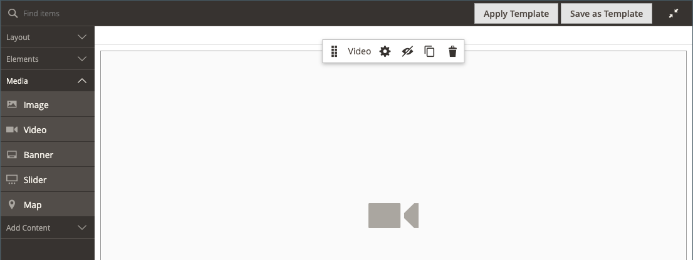
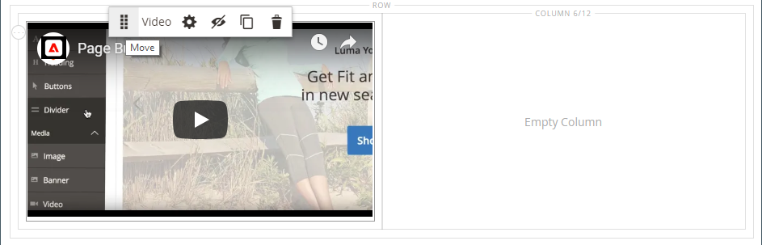
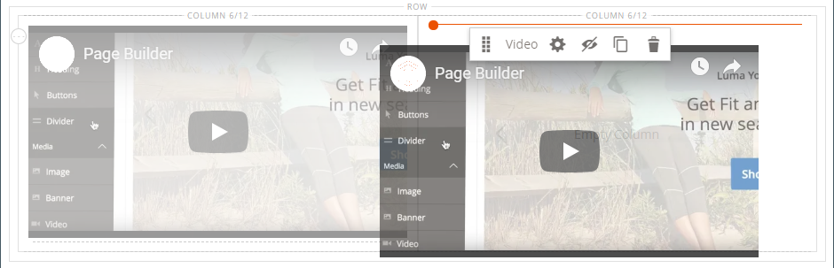

# Média - Vidéo

Utilisez le type de contenu _Vidéo_ pour ajouter une vidéo hébergée sur [YouTube](https://www.youtube.com/) ou [Vimeo](https://vimeo.com/) à [[!DNL Page Builder] stage](workspace.md#stage). Il est facile d’incorporer des vidéos dans une page ou un bloc, ou dans des descriptions de produits et de catégories.

{width="700" zoomable="yes"}

{{$include /help/_includes/page-builder-save-timeout.md}}

## Boîte à outils vidéo

{width="600" zoomable="yes"}

| Outil | Icon | Description |
|--- |--- |--- |
| Déplacer | {width="25"} | Déplace la vidéo vers un autre emplacement sur la scène. |
| (libellé) | [!UICONTROL Video] | Identifie le conteneur de contenu actuel en tant que vidéo. Pointez sur le conteneur d’image pour afficher la boîte à outils. |
| Paramètres | {width="25"} | Ouvre la page _[!UICONTROL Edit Video]_, où vous pouvez modifier les propriétés de la vidéo et du conteneur. |
| Masquer | {width="25"} | Masque la vidéo active. |
| Afficher | {width="25"} | Affiche la vidéo masquée. |
| Dupliquer | {width="25"} | Effectue une copie de la vidéo. |
| Supprimer | {width="25"} | Supprime la vidéo de l’étape. |

{style="table-layout:auto"}

{{$include /help/_includes/page-builder-hidden-element-note.md}}

## Ajout d’une vidéo

1. Avant de commencer, accédez à la vidéo  ou [Vimeo](https://vimeo.com/) que vous souhaitez incorporer, puis copiez le lien.

   Vous pouvez également copier un lien direct vers un fichier vidéo valide. Consultez la section [Paramètres vidéo de base](#basic-video-settings) pour obtenir des liens valides.

1. Dans l’Administration des [!DNL Commerce], revenez à l’espace de travail [!DNL Page Builder] où vous souhaitez ajouter la vidéo.

1. Dans le panneau [!DNL Page Builder], développez **[!UICONTROL Media]** et faites glisser un espace réservé **[!UICONTROL Video]** vers la scène.

   {width="600" zoomable="yes"}

1. Pointez sur le conteneur vidéo pour afficher la boîte à outils et sélectionnez l’icône _Paramètres_ ( {width="20"} ).

1. Par **[!UICONTROL Video URL]**, collez l’URL de la vidéo que vous avez copiée.

   L’URL de la vidéo [!DNL Page Builder] utilisée dans cet exemple est : `https://www.youtube.com/watch?v=Y0KNS7C5dZA`.

1. Pour limiter la **[!UICONTROL Maximum Width]** de la vidéo, saisissez la largeur maximale en pixels.

   Si elle est vide, la vidéo est aussi large que le permet le conteneur, ce qui permet d’ajouter des marges et une marge intérieure.

1. Dans le coin supérieur droit, cliquez sur **[!UICONTROL Save]** pour appliquer les paramètres et revenir à l’espace de travail [!DNL Page Builder].

## Modifier les paramètres vidéo

1. Pointez sur le conteneur vidéo pour afficher la boîte à outils et sélectionnez l’icône _Paramètres_ ( {width="20"} ).

1. Modifiez les paramètres en fonction des sections suivantes :

   - [De base](#basic-video-settings)
   - [Advanced](#advanced)

1. Dans le coin supérieur droit, cliquez sur **[!UICONTROL Save]** pour appliquer les paramètres et revenir à l’espace de travail [!DNL Page Builder].

### Paramètres vidéo de base

1. Pour modifier la vidéo actuelle, mettez à jour la **[!UICONTROL Video URL]**.

   Saisissez une URL de vidéo valide. Les URL de vidéo valides peuvent être des liens vers :

   - Vidéos YouTube : `https://youtu.be/CoDhMRUUjeI`
   - Vidéos Vimeo : `https://vimeo.com/190156113`
   - Fichiers vidéo valides (`.mp4` recommandé) : `https://myvideos.com/spiral.mp4`

1. Pour modifier la largeur autorisée pour la vidéo dans le storefront, saisissez la nouvelle **[!UICONTROL Maximum Width]** en pixels.

   Si elle est vide, la vidéo étend toute la largeur du conteneur, avec moins de marges et de marge intérieure.

1. Pour démarrer automatiquement la vidéo après le chargement de la page, définissez **[!UICONTROL Autoplay]** sur `Yes`.

   Si la lecture automatique est définie sur `Yes`, la vidéo est mise en sourdine lors de la lecture, conformément à la politique. Cependant, même avec ce paramètre, les appareils mobiles ne peuvent pas lire automatiquement vos vidéos. Pour plus d’informations sur ces politiques, consultez les ressources de développement suivantes :

   - [Politique de lecture automatique de Vimeo](https://vimeo.zendesk.com/hc/en-us/articles/115004485728-Autoplaying-and-looping-embedded-videos)
   - [Politique de lecture automatique à partir de Google (Chrome/YouTube)](https://developer.chrome.com/blog/autoplay/)
   - [Politique de lecture automatique pour les vidéos locales](https://developer.mozilla.org/en-US/docs/Web/Media/Autoplay_guide)

   Si la lecture automatique est définie sur `No`, la vidéo est lue à la demande de l’utilisateur uniquement.

### [!UICONTROL Advanced]

1. Pour contrôler le positionnement horizontal de la vidéo dans le conteneur, choisissez une **[!UICONTROL Alignment]** :

   | Option | Description |
   | ------ | ----------- |
   | `Default` | Applique le paramètre d’alignement par défaut spécifié dans la feuille de style du thème actif. |
   | `Left` | Aligne le contenu le long de la bordure gauche du conteneur vidéo, en tenant compte de la marge intérieure spécifiée. |
   | `Center` | Aligne le contenu au centre du conteneur vidéo, en tenant compte de la marge intérieure spécifiée. |
   | `Right` | Aligne le contenu le long de la bordure droite du conteneur vidéo, en tenant compte de la marge intérieure spécifiée. |

   {style="table-layout:auto"}

- Définissez le style de **[!UICONTROL Border]** appliqué aux quatre côtés du conteneur vidéo :

  | Option | Description |
  | ------ | ----------- |
  | `Default` | Applique le style de bordure par défaut spécifié par la feuille de style associée. |
  | `None` | Ne fournit aucune indication visible des bordures du conteneur. |
  | `Dotted` | La bordure du conteneur s’affiche sous la forme d’une ligne pointillée. |
  | `Dashed` | La bordure du conteneur s’affiche sous la forme d’une ligne en tirets. |
  | `Solid` | La bordure du conteneur s’affiche sous la forme d’une ligne continue. |
  | `Double` | La bordure du conteneur s’affiche sous la forme d’une ligne double. |
  | `Groove` | La bordure du conteneur s’affiche sous la forme d’une ligne rainurée. |
  | `Ridge` | La bordure du conteneur s’affiche sous la forme d’une ligne crantée. |
  | `Inset` | La bordure du conteneur s’affiche sous la forme d’une ligne insérée. |
  | `Outset` | La bordure du conteneur s’affiche sous la forme d’une ligne de départ. |

  {style="table-layout:auto"}

- Si vous définissez un style de bordure autre que `None`, renseignez les options d’affichage des bordures :

  {width="600" zoomable="yes"}

  | Option | Description |
  | ------ |------------ |
  | [!UICONTROL Border Color] | Spécifiez la couleur en choisissant une nuance, en cliquant sur le sélecteur de couleurs ou en saisissant un nom de couleur valide ou une valeur hexadécimale équivalente. |
  | [!UICONTROL Border Width] | Saisissez le nombre de pixels pour la largeur de la ligne de bordure. |
  | [!UICONTROL Border Radius] | Saisissez le nombre de pixels pour définir la taille du rayon utilisé pour arrondir chaque coin de la bordure. |

  {style="table-layout:auto"}

- (Facultatif) Spécifiez les noms des **[!UICONTROL CSS classes]** de la feuille de style actuelle à appliquer au conteneur vidéo.

  Séparez plusieurs noms de classe par un espace.

- Saisissez les valeurs, en pixels, du **[!UICONTROL Margins and Padding]** pour spécifier les marges extérieures et la marge intérieure du conteneur vidéo.

  Saisissez chaque valeur correspondante dans le diagramme de conteneur vidéo.

  | Zone conteneur | Description |
  | -------------- | ----------- |
  | [!UICONTROL Margins] | Quantité d’espace vide appliqué au bord extérieur de tous les côtés du conteneur. |
  | [!UICONTROL Padding] | Quantité d’espace vide appliqué au bord intérieur de tous les côtés du conteneur. |

  {style="table-layout:auto"}

## Déplacer une vidéo

1. Pointez sur le conteneur vidéo pour afficher la boîte à outils et sélectionnez l’icône _Déplacer_ ( {width="20"} ).

   {width="500" zoomable="yes"}

1. Sélectionnez la vidéo et faites-la glisser vers sa nouvelle position, juste en dessous de la consigne rouge.

   {width="500" zoomable="yes"}

## Suppression d’une vidéo de l’étape

1. Pointez sur le conteneur vidéo pour afficher la boîte à outils et sélectionnez l’icône _Supprimer_ ().

1. Lorsque vous êtes invité à confirmer, cliquez sur **[!UICONTROL OK]**.

<!-- Last updated from includes: 2023-09-11 14:30:19 -->
